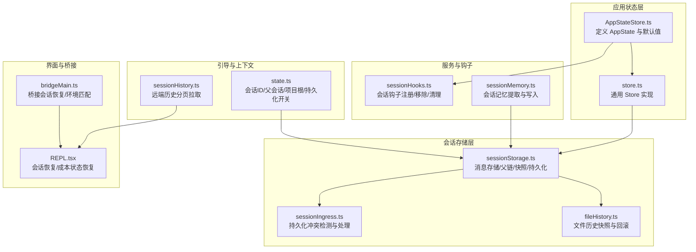
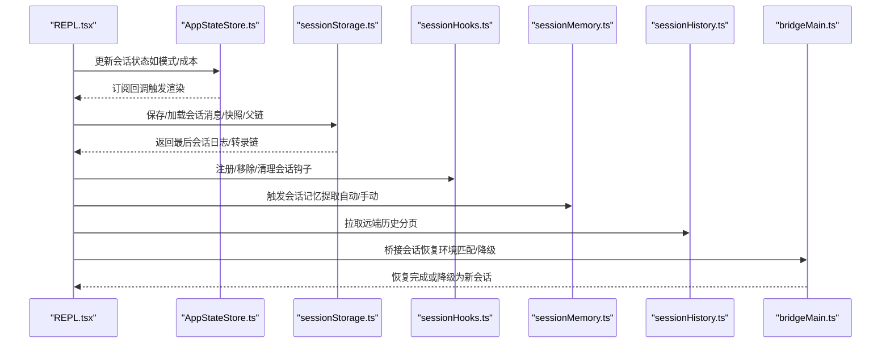
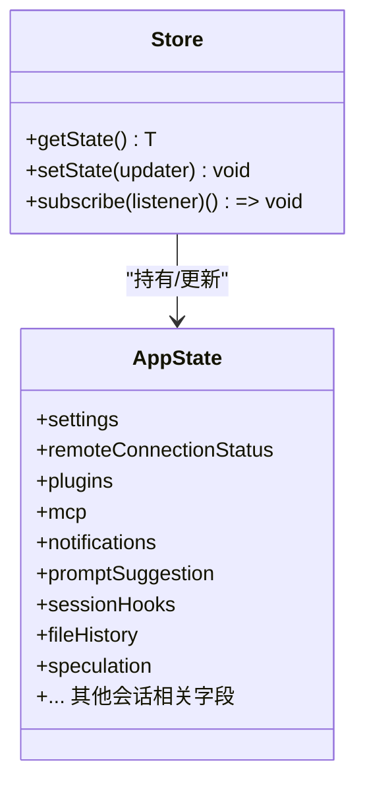
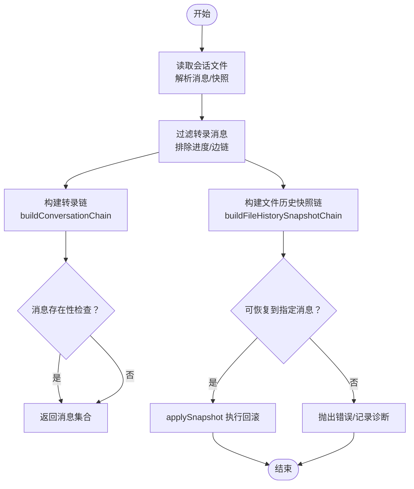
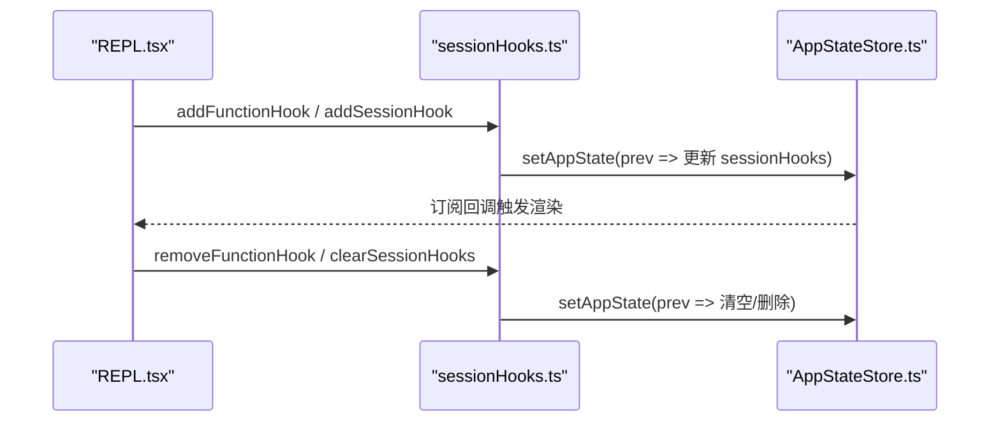
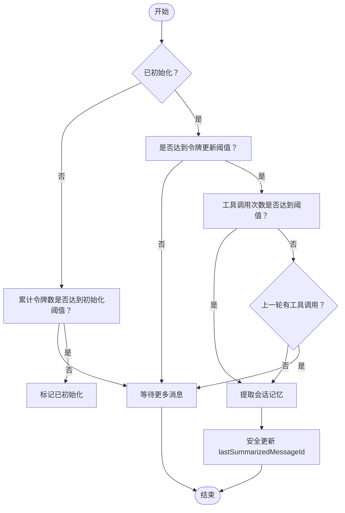
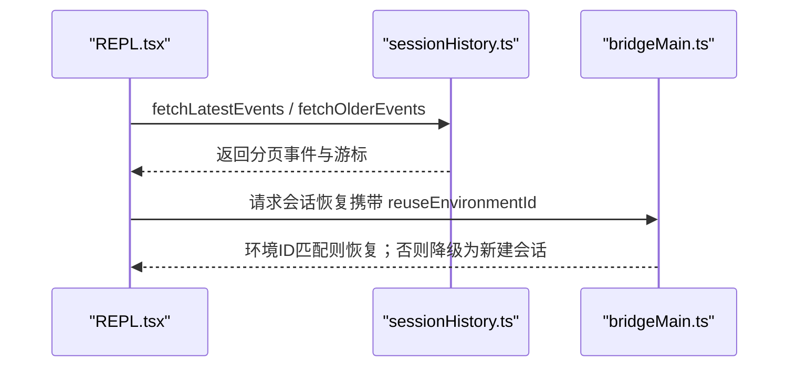
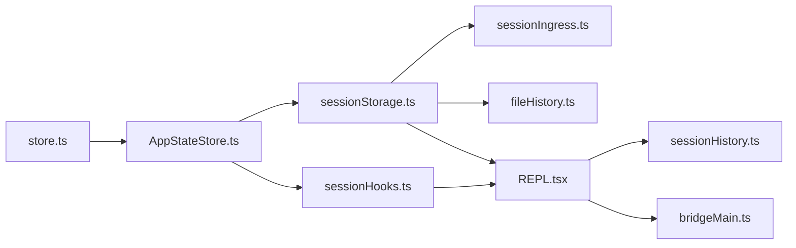

# 会话状态管理

<cite>
**本文引用的文件**
- [AppStateStore.ts](file://src/state/AppStateStore.ts)
- [store.ts](file://src/state/store.ts)
- [sessionStorage.ts](file://src/utils/sessionStorage.ts)
- [sessionHooks.ts](file://src/utils/hooks/sessionHooks.ts)
- [sessionMemory.ts](file://src/services/SessionMemory/sessionMemory.ts)
- [sessionHistory.ts](file://src/assistant/sessionHistory.ts)
- [state.ts](file://src/bootstrap/state.ts)
- [sessionIngress.ts](file://src/services/api/sessionIngress.ts)
- [fileHistory.ts](file://src/utils/fileHistory.ts)
- [REPL.tsx](file://src/screens/REPL.tsx)
- [bridgeMain.ts](file://src/bridge/bridgeMain.ts)
</cite>

## 目录
1. [简介](#简介)
2. [项目结构](#项目结构)
3. [核心组件](#核心组件)
4. [架构总览](#架构总览)
5. [详细组件分析](#详细组件分析)
6. [依赖关系分析](#依赖关系分析)
7. [性能考量](#性能考量)
8. [故障排查指南](#故障排查指南)
9. [结论](#结论)
10. [附录：代码示例路径](#附录代码示例路径)

## 简介
本技术文档围绕“会话状态管理”展开，系统性阐述会话生命周期（初始化、更新、清理）、消息存储与持久化、状态恢复、会话元数据与标识符、以及状态变更监听、快照与回滚等能力。文档以代码级事实为基础，结合可视化图示，帮助开发者与使用者理解并正确使用会话状态管理的各项机制。

## 项目结构
会话状态管理涉及多个层次：
- 应用状态层：集中定义 AppState 及其默认值，提供全局 Store 订阅与变更通知。
- 会话存储层：负责消息序列化、父链构建、快照链、文件历史回滚、持久化冲突处理等。
- 钩子与内存服务：在采样后阶段插入会话钩子与会话记忆提取。
- 历史与桥接：远端历史拉取、桥接会话恢复与环境切换。
- 引导与标识：会话 ID 生成、父会话追踪、项目根目录与工作树隔离。

图表来源
- [AppStateStore.ts:1-570](file://src/state/AppStateStore.ts#L1-L570)
- [store.ts:1-35](file://src/state/store.ts#L1-L35)
- [sessionStorage.ts:1-200](file://src/utils/sessionStorage.ts#L1-L200)
- [sessionIngress.ts:127-142](file://src/services/api/sessionIngress.ts#L127-L142)
- [fileHistory.ts:366-515](file://src/utils/fileHistory.ts#L366-L515)
- [sessionHooks.ts:1-448](file://src/utils/hooks/sessionHooks.ts#L1-L448)
- [sessionMemory.ts:1-496](file://src/services/SessionMemory/sessionMemory.ts#L1-L496)
- [state.ts:1-800](file://src/bootstrap/state.ts#L1-L800)
- [sessionHistory.ts:1-88](file://src/assistant/sessionHistory.ts#L1-L88)
- [REPL.tsx:1516-1549](file://src/screens/REPL.tsx#L1516-L1549)
- [bridgeMain.ts:2469-2492](file://src/bridge/bridgeMain.ts#L2469-L2492)

章节来源
- [AppStateStore.ts:1-570](file://src/state/AppStateStore.ts#L1-L570)
- [store.ts:1-35](file://src/state/store.ts#L1-L35)
- [sessionStorage.ts:1-200](file://src/utils/sessionStorage.ts#L1-L200)
- [state.ts:1-800](file://src/bootstrap/state.ts#L1-L800)

## 核心组件
- 应用状态与订阅器
  - AppState 定义了会话相关的全局状态字段（如远程连接、插件、权限、提示建议、推测态、会话钩子等），并通过 Store 提供统一的状态读取、更新与订阅。
  - Store 的 setState 在状态变化时触发 onChange 回调并广播给所有订阅者，确保 UI 与服务层能及时感知状态变更。
- 会话存储与消息链
  - 消息类型与链参与判定、进度消息过滤、父链重建、快照链构建、文件历史快照链、消息存在性检查、最后会话日志读取等。
  - 持久化冲突处理：当服务端返回 UUID 不一致或 409 冲突时，采用“采用服务器 UUID 并重试”的策略，避免并发修改导致的数据不一致。
- 会话钩子
  - 支持命令型与函数型钩子，按事件与匹配器进行注册；支持按事件查询、按 ID 移除函数钩子、清理会话内全部钩子。
- 会话记忆
  - 基于阈值（令牌数、工具调用次数）自动提取会话记忆，并通过子代理安全地写入记忆文件；支持手动触发与安全更新 lastSummarizedMessageId。
- 远端历史与桥接恢复
  - 远端历史分页拉取；桥接恢复时对环境 ID 不匹配进行降级处理，保证恢复流程稳健。
- 引导与标识
  - 会话 ID 生成与再生、父会话追踪、项目根目录与工作树隔离、会话持久化开关、计划模式 slug 缓存等。

章节来源
- [AppStateStore.ts:89-452](file://src/state/AppStateStore.ts#L89-L452)
- [store.ts:4-34](file://src/state/store.ts#L4-L34)
- [sessionStorage.ts:139-196](file://src/utils/sessionStorage.ts#L139-L196)
- [sessionIngress.ts:127-142](file://src/services/api/sessionIngress.ts#L127-L142)
- [sessionHooks.ts:68-216](file://src/utils/hooks/sessionHooks.ts#L68-L216)
- [sessionMemory.ts:134-181](file://src/services/SessionMemory/sessionMemory.ts#L134-L181)
- [sessionHistory.ts:30-87](file://src/assistant/sessionHistory.ts#L30-L87)
- [bridgeMain.ts:2469-2492](file://src/bridge/bridgeMain.ts#L2469-L2492)
- [state.ts:431-479](file://src/bootstrap/state.ts#L431-L479)

## 架构总览
下图展示了从 REPL 触发到会话恢复、再到远端历史与桥接恢复的关键交互：

图表来源
- [REPL.tsx:1516-1549](file://src/screens/REPL.tsx#L1516-L1549)
- [AppStateStore.ts:1-570](file://src/state/AppStateStore.ts#L1-L570)
- [sessionStorage.ts:3870-3905](file://src/utils/sessionStorage.ts#L3870-L3905)
- [sessionHooks.ts:68-216](file://src/utils/hooks/sessionHooks.ts#L68-L216)
- [sessionMemory.ts:272-350](file://src/services/SessionMemory/sessionMemory.ts#L272-L350)
- [sessionHistory.ts:30-87](file://src/assistant/sessionHistory.ts#L30-L87)
- [bridgeMain.ts:2469-2492](file://src/bridge/bridgeMain.ts#L2469-L2492)

## 详细组件分析

### 组件一：应用状态与订阅器（AppState/Store）
- 设计要点
  - AppState 使用深度不可变结构，确保状态变更可追踪且易于调试。
  - Store 提供 getState、setState、subscribe 三件套，setState 中的相等性判断避免无意义的通知风暴。
  - onChange 回调用于跨模块联动（如日志、指标、UI）。
- 关键字段
  - 远程桥接状态、插件与 MCP 状态、通知队列、提示建议、会话钩子 Map、文件历史状态、推测态等。
- 生命周期
  - 初始化：getDefaultAppState 构建初始状态。
  - 更新：通过 setAppState(prev => updater(prev)) 执行不可变更新。
  - 清理：clearSessionHooks 清空会话钩子，避免内存泄漏。

图表来源
- [store.ts:4-34](file://src/state/store.ts#L4-L34)
- [AppStateStore.ts:89-452](file://src/state/AppStateStore.ts#L89-L452)

章节来源
- [store.ts:4-34](file://src/state/store.ts#L4-L34)
- [AppStateStore.ts:89-452](file://src/state/AppStateStore.ts#L89-L452)

### 组件二：消息存储与父链/快照/持久化
- 消息类型与链参与
  - isTranscriptMessage 与 isChainParticipant 严格区分转录消息与进度消息，避免进度消息进入父链。
- 父链与快照
  - buildConversationChain 基于最新非边链消息构建转录链；buildFileHistorySnapshotChain 将文件历史快照映射为有序链。
- 快照与回滚
  - fileHistoryCanRestore 判断是否可恢复；applySnapshot 执行回滚；dry-run 路径仅判断是否有变更。
- 持久化冲突
  - sessionIngress 对 409/UUID 不一致进行“采用服务器 UUID 并重试”，避免并发写入破坏一致性。
- 性能优化
  - getSessionMessages 使用 memoize 缓存消息集合，减少重复磁盘读取；clearSessionMessagesCache 在压缩后清理缓存。

图表来源
- [sessionStorage.ts:2246-2272](file://src/utils/sessionStorage.ts#L2246-L2272)
- [sessionStorage.ts:3843-3857](file://src/utils/sessionStorage.ts#L3843-L3857)
- [fileHistory.ts:366-396](file://src/utils/fileHistory.ts#L366-L396)
- [fileHistory.ts:399-407](file://src/utils/fileHistory.ts#L399-L407)
- [sessionIngress.ts:127-142](file://src/services/api/sessionIngress.ts#L127-L142)

章节来源
- [sessionStorage.ts:139-196](file://src/utils/sessionStorage.ts#L139-L196)
- [sessionStorage.ts:2246-2272](file://src/utils/sessionStorage.ts#L2246-L2272)
- [sessionStorage.ts:3843-3857](file://src/utils/sessionStorage.ts#L3843-L3857)
- [fileHistory.ts:366-515](file://src/utils/fileHistory.ts#L366-L515)
- [sessionIngress.ts:127-142](file://src/services/api/sessionIngress.ts#L127-L142)

### 组件三：会话钩子（监听与清理）
- 功能
  - 支持命令型与函数型钩子，按事件与匹配器注册；支持按事件查询、按 ID 移除函数钩子、清理会话内全部钩子。
  - 使用 Map 存储，避免对象复制带来的性能问题；日志记录便于调试。
- 使用场景
  - 在 REPL.tsx 中延迟注入钩子消息，确保模型在首次请求前看到钩子上下文。

图表来源
- [sessionHooks.ts:68-216](file://src/utils/hooks/sessionHooks.ts#L68-L216)
- [sessionHooks.ts:437-447](file://src/utils/hooks/sessionHooks.ts#L437-L447)
- [REPL.tsx:1516-1549](file://src/screens/REPL.tsx#L1516-L1549)

章节来源
- [sessionHooks.ts:1-448](file://src/utils/hooks/sessionHooks.ts#L1-L448)
- [REPL.tsx:1516-1549](file://src/screens/REPL.tsx#L1516-L1549)

### 组件四：会话记忆（自动/手动提取）
- 触发条件
  - 初始化阈值（令牌数）与工具调用次数阈值；若上一轮无工具调用则可在自然断点提取。
- 安全更新
  - 仅在最后一轮无工具调用时更新 lastSummarizedMessageId，避免孤儿 tool_results。
- 手动触发
  - /summary 命令可绕过阈值直接提取。

图表来源
- [sessionMemory.ts:134-181](file://src/services/SessionMemory/sessionMemory.ts#L134-L181)
- [sessionMemory.ts:272-350](file://src/services/SessionMemory/sessionMemory.ts#L272-L350)
- [sessionMemory.ts:488-495](file://src/services/SessionMemory/sessionMemory.ts#L488-L495)

章节来源
- [sessionMemory.ts:1-496](file://src/services/SessionMemory/sessionMemory.ts#L1-L496)

### 组件五：远端历史与桥接恢复
- 远端历史
  - 分页获取最新/更旧事件，带超时与失败兜底，返回 oldest cursor 与 has_more 标记。
- 桥接恢复
  - 若请求的环境 ID 与返回不一致，则记录警告并降级为新建会话，避免绑定到已过期环境。

图表来源
- [sessionHistory.ts:30-87](file://src/assistant/sessionHistory.ts#L30-L87)
- [bridgeMain.ts:2469-2492](file://src/bridge/bridgeMain.ts#L2469-L2492)

章节来源
- [sessionHistory.ts:1-88](file://src/assistant/sessionHistory.ts#L1-L88)
- [bridgeMain.ts:2469-2492](file://src/bridge/bridgeMain.ts#L2469-L2492)

### 组件六：会话元数据与标识符
- 会话 ID 生成与再生
  - 通过随机 UUID 生成；再生时可选择将当前会话设为父会话，并清理计划 slug 缓存。
- 父会话追踪
  - parentSessionId 记录会话血缘（如 plan mode -> implementation）。
- 项目根与工作树
  - projectRoot 保持稳定，避免中途进入 worktree 导致历史/技能漂移；sessionProjectDir 支持跨项目恢复。
- 持久化开关
  - sessionPersistenceDisabled 控制是否禁用磁盘持久化。

章节来源
- [state.ts:431-479](file://src/bootstrap/state.ts#L431-L479)
- [state.ts:511-525](file://src/bootstrap/state.ts#L511-L525)
- [state.ts:539-541](file://src/bootstrap/state.ts#L539-L541)
- [state.ts:364-365](file://src/bootstrap/state.ts#L364-L365)

## 依赖关系分析
- 组件耦合
  - AppStateStore 与 Store 高内聚，状态变更路径清晰。
  - sessionStorage 与 sessionIngress 协同处理持久化冲突，确保一致性。
  - sessionHooks 与 REPL 通过 setAppState 解耦，钩子生命周期与会话强绑定。
  - sessionMemory 与工具链集成，提取与写入分离，降低耦合。
- 外部依赖
  - 远端历史依赖 OAuth 与 API 基础设施；桥接恢复依赖环境 ID 匹配。
- 循环依赖规避
  - 通过模块导入顺序与懒加载（如 getDefaultAppState 中的 teammate 工具）避免循环。

图表来源
- [store.ts:1-35](file://src/state/store.ts#L1-L35)
- [AppStateStore.ts:1-570](file://src/state/AppStateStore.ts#L1-L570)
- [sessionStorage.ts:1-200](file://src/utils/sessionStorage.ts#L1-200)
- [sessionIngress.ts:127-142](file://src/services/api/sessionIngress.ts#L127-L142)
- [fileHistory.ts:366-515](file://src/utils/fileHistory.ts#L366-L515)
- [sessionHooks.ts:1-448](file://src/utils/hooks/sessionHooks.ts#L1-L448)
- [sessionHistory.ts:1-88](file://src/assistant/sessionHistory.ts#L1-L88)
- [bridgeMain.ts:2469-2492](file://src/bridge/bridgeMain.ts#L2469-L2492)
- [REPL.tsx:1516-1549](file://src/screens/REPL.tsx#L1516-L1549)

章节来源
- [store.ts:1-35](file://src/state/store.ts#L1-L35)
- [AppStateStore.ts:1-570](file://src/state/AppStateStore.ts#L1-L570)
- [sessionStorage.ts:1-200](file://src/utils/sessionStorage.ts#L1-L200)
- [sessionIngress.ts:127-142](file://src/services/api/sessionIngress.ts#L127-L142)
- [fileHistory.ts:366-515](file://src/utils/fileHistory.ts#L366-L515)
- [sessionHooks.ts:1-448](file://src/utils/hooks/sessionHooks.ts#L1-L448)
- [sessionHistory.ts:1-88](file://src/assistant/sessionHistory.ts#L1-L88)
- [bridgeMain.ts:2469-2492](file://src/bridge/bridgeMain.ts#L2469-L2492)
- [REPL.tsx:1516-1549](file://src/screens/REPL.tsx#L1516-L1549)

## 性能考量
- 缓存与去重
  - getSessionMessages 使用 memoize 缓存消息集合，避免重复读取；clearSessionMessagesCache 在压缩后清理缓存。
- 低开销遍历
  - findLatestMessage 以单次遍历 O(n) 找到满足谓词的最新消息，避免排序与额外分配。
- 进度消息短路
  - isEphemeralToolProgress 与 isChainParticipant 减少无效消息参与父链与持久化。
- 并发与订阅
  - Map 存储会话钩子避免对象复制；Object.is 判断阻止不必要的订阅通知。

章节来源
- [sessionStorage.ts:2047-2061](file://src/utils/sessionStorage.ts#L2047-L2061)
- [sessionStorage.ts:3843-3857](file://src/utils/sessionStorage.ts#L3843-L3857)
- [sessionHooks.ts:48-62](file://src/utils/hooks/sessionHooks.ts#L48-L62)
- [store.ts:20-27](file://src/state/store.ts#L20-L27)

## 故障排查指南
- 持久化冲突
  - 现象：服务端返回 409 或 UUID 不一致。
  - 处理：采用 sessionIngress 的“采用服务器 UUID 并重试”策略；记录诊断事件。
- 文件历史回滚失败
  - 现象：rewind 到目标消息失败或未找到快照。
  - 处理：记录错误与事件，检查 fileHistoryEnabled 与快照列表；dry-run 路径可用于快速判断是否存在变更。
- 桥接恢复降级
  - 现象：请求的环境 ID 与返回不一致。
  - 处理：记录警告并降级为新建会话，避免绑定到已过期环境。
- 钩子未生效
  - 现象：钩子未被触发或清理后仍残留。
  - 处理：确认 add/remove/clearSessionHooks 调用；检查事件与匹配器；查看日志输出。

章节来源
- [sessionIngress.ts:127-142](file://src/services/api/sessionIngress.ts#L127-L142)
- [fileHistory.ts:366-396](file://src/utils/fileHistory.ts#L366-L396)
- [bridgeMain.ts:2469-2492](file://src/bridge/bridgeMain.ts#L2469-L2492)
- [sessionHooks.ts:437-447](file://src/utils/hooks/sessionHooks.ts#L437-L447)

## 结论
该会话状态管理体系以 AppState/Store 为核心，结合 sessionStorage 的消息链与快照机制、sessionHooks 的事件驱动、sessionMemory 的自动摘要、以及远端历史与桥接恢复的外部协同，形成了完整的生命周期闭环。通过缓存、短路与去重等优化手段，系统在复杂场景下仍能保持高可用与高性能。

## 附录：代码示例路径
以下为常见操作的代码示例路径（请在对应文件中查看具体实现）：
- 创建会话状态
  - [getDefaultAppState:456-569](file://src/state/AppStateStore.ts#L456-L569)
  - [getSessionId / regenerateSessionId:431-450](file://src/bootstrap/state.ts#L431-L450)
- 更新会话状态
  - [setAppState 使用示例（REPL.tsx）:1538-1541](file://src/screens/REPL.tsx#L1538-L1541)
  - [Store.setState 实现:20-27](file://src/state/store.ts#L20-L27)
- 注册/移除/清理会话钩子
  - [addFunctionHook / addSessionHook:93-115](file://src/utils/hooks/sessionHooks.ts#L93-L115)
  - [removeFunctionHook / removeSessionHook:120-268](file://src/utils/hooks/sessionHooks.ts#L120-L268)
  - [clearSessionHooks:437-447](file://src/utils/hooks/sessionHooks.ts#L437-L447)
- 会话记忆提取
  - [shouldExtractMemory:134-181](file://src/services/SessionMemory/sessionMemory.ts#L134-L181)
  - [manuallyExtractSessionMemory:387-453](file://src/services/SessionMemory/sessionMemory.ts#L387-L453)
- 消息存储与快照
  - [isTranscriptMessage / isChainParticipant:139-156](file://src/utils/sessionStorage.ts#L139-L156)
  - [buildConversationChain / buildFileHistorySnapshotChain:2246-2272](file://src/utils/sessionStorage.ts#L2246-L2272)
  - [getLastSessionLog:3870-3905](file://src/utils/sessionStorage.ts#L3870-L3905)
- 持久化冲突处理
  - [sessionIngress 冲突处理:127-142](file://src/services/api/sessionIngress.ts#L127-L142)
- 文件历史回滚
  - [fileHistoryCanRestore / applySnapshot:399-407](file://src/utils/fileHistory.ts#L399-L407)
  - [fileHistoryHasAnyChanges:494-507](file://src/utils/fileHistory.ts#L494-L507)
- 远端历史与桥接恢复
  - [fetchLatestEvents / fetchOlderEvents:73-87](file://src/assistant/sessionHistory.ts#L73-L87)
  - [桥接恢复降级逻辑:2469-2492](file://src/bridge/bridgeMain.ts#L2469-L2492)