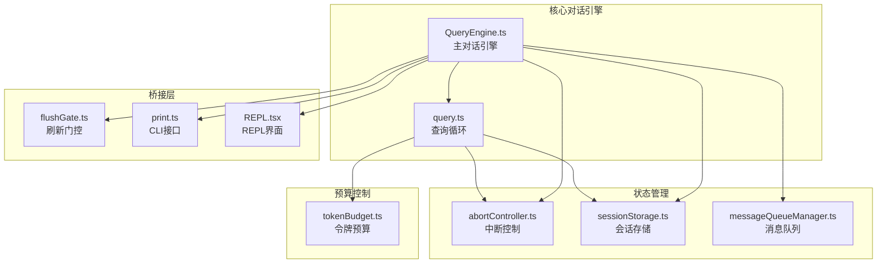
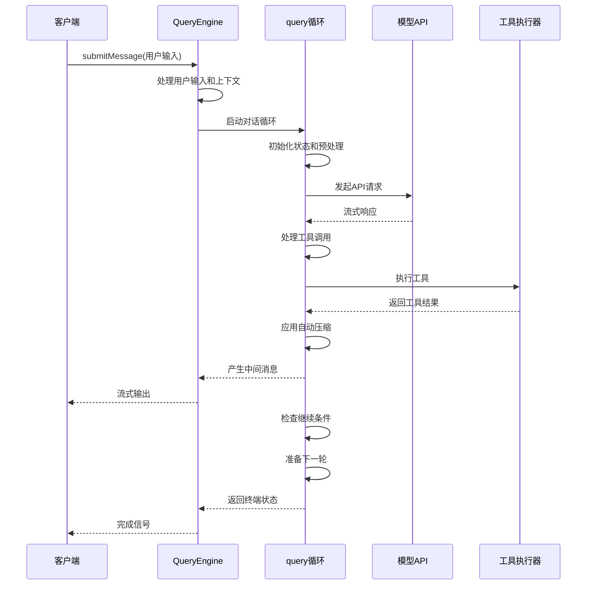
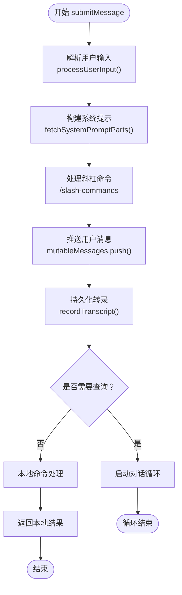
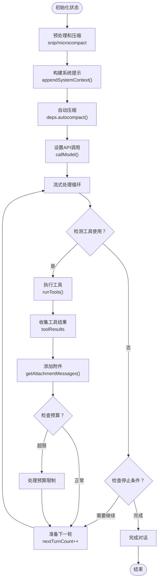
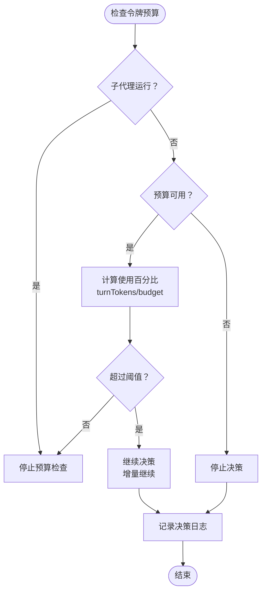
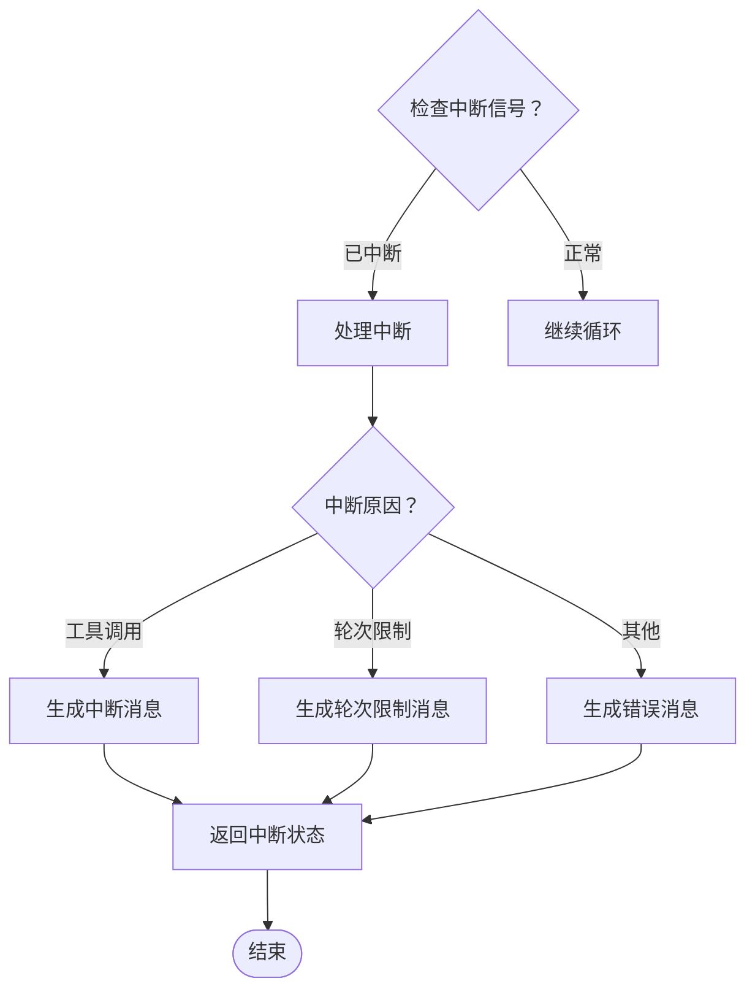
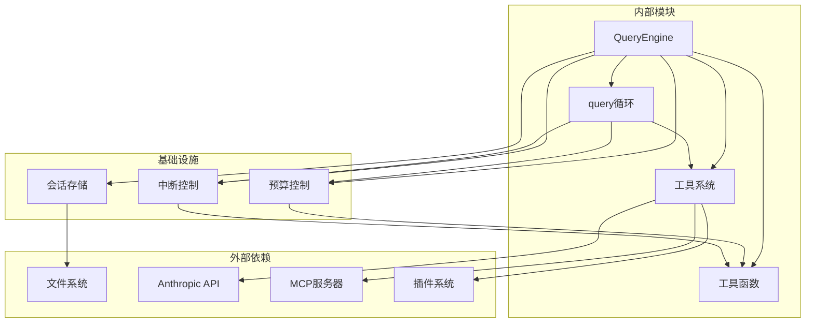

# 对话循环机制

<cite>
**本文档引用的文件**
- [src/QueryEngine.ts](file://src/QueryEngine.ts)
- [src/query.ts](file://src/query.ts)
- [learn/phase-2-conversation-loop.md](file://learn/phase-2-conversation-loop.md)
- [src/query/tokenBudget.ts](file://src/query/tokenBudget.ts)
- [src/utils/abortController.ts](file://src/utils/abortController.ts)
- [src/utils/sessionStorage.ts](file://src/utils/sessionStorage.ts)
- [src/utils/messageQueueManager.ts](file://src/utils/messageQueueManager.ts)
- [src/bridge/flushGate.ts](file://src/bridge/flushGate.ts)
- [src/cli/print.ts](file://src/cli/print.ts)
- [src/screens/REPL.tsx](file://src/screens/REPL.tsx)
</cite>

## 目录
1. [简介](#简介)
2. [项目结构](#项目结构)
3. [核心组件](#核心组件)
4. [架构概览](#架构概览)
5. [详细组件分析](#详细组件分析)
6. [依赖关系分析](#依赖关系分析)
7. [性能考虑](#性能考虑)
8. [故障排除指南](#故障排除指南)
9. [结论](#结论)
10. [附录](#附录)

## 简介

对话循环机制是 Claude Code 的核心架构组件，负责管理从用户输入到模型响应的完整对话流程。本文档深入解析 QueryEngine.submitMessage 方法的异步生成器实现，详细说明消息提交流程、对话状态管理、循环控制逻辑以及相关的预算控制和中断处理机制。

该机制采用异步生成器模式，支持流式响应处理、工具调用执行、状态持久化和资源清理，为 SDK 和 REPL 提供统一的对话处理能力。

## 项目结构

对话循环机制涉及以下关键文件和模块：



**图表来源**
- [src/QueryEngine.ts:186-1202](file://src/QueryEngine.ts#L186-L1202)
- [src/query.ts:241-1733](file://src/query.ts#L241-L1733)

**章节来源**
- [learn/phase-2-conversation-loop.md:1-411](file://learn/phase-2-conversation-loop.md#L1-L411)

## 核心组件

### QueryEngine 类

QueryEngine 是对话循环的核心控制器，负责管理整个对话生命周期的状态和流程控制。

**主要职责：**
- 用户输入处理和消息构建
- 会话状态持久化
- 预算和限制控制
- 中断和错误处理
- 资源清理和释放

**关键特性：**
- 异步生成器实现，支持流式响应
- 状态持久化到会话存储
- 多种预算控制机制
- 完善的错误处理和恢复

**章节来源**
- [src/QueryEngine.ts:186-210](file://src/QueryEngine.ts#L186-L210)
- [src/QueryEngine.ts:211-1202](file://src/QueryEngine.ts#L211-L1202)

### query 函数

query 函数是对话循环的主入口，实现了完整的 while(true) 循环逻辑。

**核心功能：**
- 自动压缩和上下文折叠
- 流式模型调用
- 工具执行和结果收集
- 错误恢复和继续逻辑
- 预算检查和限制

**章节来源**
- [src/query.ts:219-239](file://src/query.ts#L219-L239)
- [src/query.ts:241-500](file://src/query.ts#L241-L500)

## 架构概览

对话循环机制采用分层架构设计，确保了高内聚低耦合的代码组织：



**图表来源**
- [src/QueryEngine.ts:679-893](file://src/QueryEngine.ts#L679-L893)
- [src/query.ts:659-790](file://src/query.ts#L659-L790)

## 详细组件分析

### QueryEngine.submitMessage 实现

submitMessage 方法是对话循环的核心实现，采用异步生成器模式提供流式响应处理。

#### 输入处理阶段



**图表来源**
- [src/QueryEngine.ts:413-466](file://src/QueryEngine.ts#L413-L466)
- [src/QueryEngine.ts:559-643](file://src/QueryEngine.ts#L559-L643)

#### 对话循环阶段

对话循环的核心逻辑在 query 函数中实现，采用 while(true) 循环模式：



**图表来源**
- [src/query.ts:241-500](file://src/query.ts#L241-L500)
- [src/query.ts:1707-1731](file://src/query.ts#L1707-L1731)

#### 状态管理机制

QueryEngine 维护了多个关键状态变量：

**消息状态管理：**
- `mutableMessages`: 可变消息数组，包含当前对话的所有消息
- `messages`: 循环中使用的消息副本
- `turnCount`: 当前轮次数，用于最大轮次限制

**预算状态管理：**
- `totalUsage`: 累计使用量，包含输入、输出和缓存使用
- `currentMessageUsage`: 当前消息的使用量
- `permissionDenials`: 权限拒绝记录

**章节来源**
- [src/QueryEngine.ts:661-678](file://src/QueryEngine.ts#L661-L678)
- [src/QueryEngine.ts:187-209](file://src/QueryEngine.ts#L187-L209)

### 预算控制系统

对话循环实现了多层次的预算控制机制：

#### 令牌预算控制



**图表来源**
- [src/query/tokenBudget.ts:45-57](file://src/query/tokenBudget.ts#L45-L57)
- [src/query.ts:1311-1358](file://src/query.ts#L1311-L1358)

#### 最大轮次限制

QueryEngine 实现了严格的轮次限制控制：

**轮次检查流程：**
1. 检查 `maxTurns` 配置
2. 计算下一轮的 `turnCount`
3. 如果超过限制，注入 `max_turns_reached` 附件
4. 返回 `{ reason: 'max_turns' }` 终止循环

**章节来源**
- [src/query.ts:1707-1715](file://src/query.ts#L1707-L1715)
- [src/QueryEngine.ts:860-893](file://src/QueryEngine.ts#L860-L893)

### 中断处理机制

系统提供了完善的中断处理机制，支持多种中断场景：

#### 中断类型

**用户主动中断：**
- Ctrl+C 触发的工具调用中断
- 通过 `abortController.signal.aborted` 检测

**系统自动中断：**
- 超过最大轮次限制
- 预算耗尽
- API 错误恢复失败

#### 中断处理流程



**图表来源**
- [src/query.ts:1487-1519](file://src/query.ts#L1487-L1519)
- [src/utils/abortController.ts:16-99](file://src/utils/abortController.ts#L16-L99)

**章节来源**
- [src/query.ts:1002-1054](file://src/query.ts#L1002-L1054)
- [src/QueryEngine.ts:1002-1054](file://src/QueryEngine.ts#L1002-L1054)

### 消息队列管理

系统实现了复杂的消息队列管理系统，支持命令队列的高效处理：

#### 命令队列操作

**队列操作类型：**
- `dequeueAllMatching`: 匹配删除所有命令
- `remove`: 按引用移除特定命令
- `getCommandsByMaxPriority`: 获取最高优先级命令

**队列状态管理：**
- 使用 `commandQueue` 数组维护命令序列
- 通过 `notifySubscribers()` 通知订阅者
- 支持命令生命周期管理

**章节来源**
- [src/utils/messageQueueManager.ts:240-292](file://src/utils/messageQueueManager.ts#L240-L292)

### 状态持久化策略

对话循环实现了多层状态持久化机制：

#### 会话存储

**持久化触发时机：**
- 用户消息提交后立即持久化
- 紧凑边界消息产生时持久化
- 工具结果生成时持久化

**持久化策略：**
- `recordTranscript()`: 记录完整对话历史
- `flushSessionStorage()`: 强制刷新存储
- `doesMessageExistInSession()`: 检查消息存在性

#### 存储优化

**写入优化：**
- 火炬写入模式，避免阻塞主循环
- 批量写入减少磁盘 I/O
- 异步写入提高响应性

**章节来源**
- [src/utils/sessionStorage.ts:3839-3868](file://src/utils/sessionStorage.ts#L3839-L3868)
- [src/QueryEngine.ts:722-737](file://src/QueryEngine.ts#L722-L737)

### 资源清理策略

系统实现了全面的资源清理机制：

#### 内存管理

**垃圾回收优化：**
- 紧凑边界后及时释放内存
- 工具结果去重处理
- 附件消息的生命周期管理

#### 中断清理

**中断后的资源释放：**
- 清理工具执行器状态
- 释放内存预取资源
- 关闭流式连接

**章节来源**
- [src/query.ts:914-917](file://src/query.ts#L914-L917)
- [src/query.ts:1487-1501](file://src/query.ts#L1487-L1501)

## 依赖关系分析

对话循环机制的依赖关系呈现清晰的层次结构：



**图表来源**
- [src/QueryEngine.ts:1-111](file://src/QueryEngine.ts#L1-L111)
- [src/query.ts:1-122](file://src/query.ts#L1-L122)

**章节来源**
- [src/QueryEngine.ts:132-175](file://src/QueryEngine.ts#L132-L175)
- [src/query.ts:181-199](file://src/query.ts#L181-L199)

## 性能考虑

对话循环机制在设计时充分考虑了性能优化：

### 流式处理优化

**流式响应处理：**
- 使用异步生成器实现真正的流式处理
- 零拷贝消息传递减少内存分配
- 分块处理避免大对象一次性加载

### 缓存策略

**多级缓存：**
- 插件缓存仅加载必要资源
- 文件状态缓存避免重复读取
- 内存预取减少等待时间

### 并发控制

**并发安全：**
- 使用 AbortController 管理并发操作
- 队列化命令处理避免竞态条件
- 状态隔离确保线程安全

## 故障排除指南

### 常见问题诊断

**对话循环卡死：**
1. 检查工具执行器状态
2. 验证中断信号是否正确传播
3. 确认预算检查逻辑

**内存泄漏排查：**
1. 检查紧凑边界消息处理
2. 验证工具结果去重机制
3. 确认附件生命周期管理

**性能问题诊断：**
1. 分析流式处理延迟
2. 检查磁盘 I/O 操作
3. 监控内存使用情况

### 调试技巧

**启用调试模式：**
- 设置 `verbose` 参数获取详细日志
- 使用 `headlessProfilerCheckpoint` 追踪性能瓶颈
- 启用 `CLAUDE_CODE_DEBUG` 环境变量

**监控指标：**
- `totalUsage`: 总体使用量统计
- `turnCount`: 轮次计数
- `budgetTracker`: 预算使用情况

**章节来源**
- [src/QueryEngine.ts:287-304](file://src/QueryEngine.ts#L287-L304)
- [src/query.ts:337-344](file://src/query.ts#L337-L344)

## 结论

对话循环机制通过精心设计的架构和实现，为 Claude Code 提供了强大而灵活的对话处理能力。其核心优势包括：

**架构优势：**
- 清晰的分层设计便于维护和扩展
- 异步生成器模式提供优秀的性能表现
- 完善的状态管理和持久化机制

**功能特性：**
- 支持复杂的工具调用和流式响应
- 多层次的预算控制和限制机制
- 健壮的错误处理和恢复能力

**扩展性：**
- 模块化设计支持功能插件化
- 配置驱动的参数化设计
- 跨平台兼容的抽象层

该机制为 SDK 和 REPL 提供了一致的对话体验，同时保持了高度的灵活性和可扩展性。

## 附录

### 使用示例

#### 基本调用模式

```typescript
// 基本对话调用
const engine = new QueryEngine(config);
for await (const message of engine.submitMessage("你好")) {
  console.log(message);
}
```

#### 轮次控制配置

```typescript
const config = {
  maxTurns: 10,
  maxBudgetUsd: 1.0,
  taskBudget: { total: 50000 }
};
```

#### 错误处理模式

```typescript
try {
  for await (const message of engine.submitMessage(prompt)) {
    if (message.type === 'result') {
      // 处理最终结果
    }
  }
} catch (error) {
  // 处理异常情况
}
```

### 配置选项参考

**核心配置参数：**
- `maxTurns`: 最大对话轮次
- `maxBudgetUsd`: 预算上限（美元）
- `taskBudget`: 任务预算配置
- `includePartialMessages`: 是否包含部分消息
- `replayUserMessages`: 是否重放用户消息

**章节来源**
- [src/QueryEngine.ts:132-175](file://src/QueryEngine.ts#L132-L175)
- [src/cli/print.ts:1259-1320](file://src/cli/print.ts#L1259-L1320)