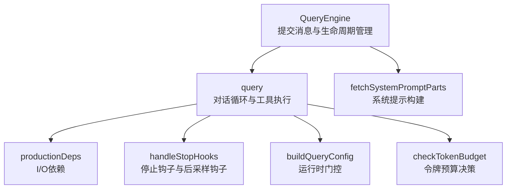
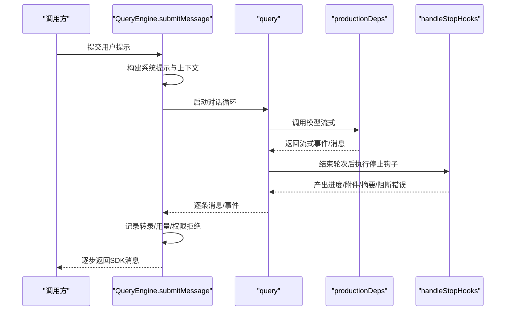
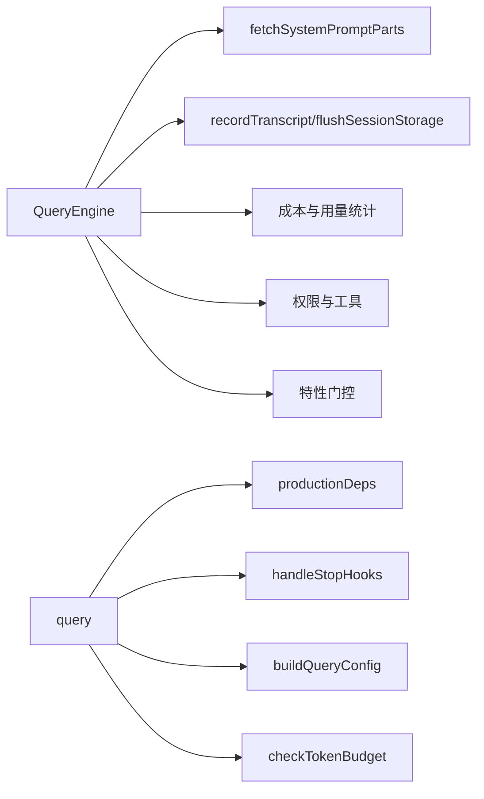

# 查询引擎

<cite>
**本文引用的文件**
- [src/QueryEngine.ts](file://src/QueryEngine.ts)
- [src/query.ts](file://src/query.ts)
- [src/query/config.ts](file://src/query/config.ts)
- [src/query/deps.ts](file://src/query/deps.ts)
- [src/query/stopHooks.ts](file://src/query/stopHooks.ts)
- [src/query/tokenBudget.ts](file://src/query/tokenBudget.ts)
- [src/utils/queryContext.ts](file://src/utils/queryContext.ts)
- [src/utils/systemPromptType.ts](file://src/utils/systemPromptType.ts)
</cite>

## 目录
1. [简介](#简介)
2. [项目结构](#项目结构)
3. [核心组件](#核心组件)
4. [架构总览](#架构总览)
5. [详细组件分析](#详细组件分析)
6. [依赖关系分析](#依赖关系分析)
7. [性能考量](#性能考量)
8. [故障排查指南](#故障排查指南)
9. [结论](#结论)
10. [附录：使用示例与最佳实践](#附录使用示例与最佳实践)

## 简介
本文件面向“查询引擎”的技术文档，聚焦于 QueryEngine 类的设计与实现，涵盖以下主题：
- 对话循环机制与异步生成器模式：如何通过 submitMessage 与 query 协作，驱动一轮或多轮对话。
- 消息处理流程：从用户输入到系统提示构建、工具执行、流式响应、结果归并与收尾。
- 查询生命周期管理：消息状态持久化、会话状态维护、资源清理策略（中止控制、快照、转录写入）。
- 流式 API 集成：Claude API 调用、响应流处理、错误恢复策略（含回退模型、流式回退、紧凑化与恢复）。
- 系统提示构建：工具注入、上下文构建、权限模式集成、记忆机制注入。
- 特性门控系统：条件编译与运行时门控在查询引擎中的应用。
- 使用示例：基础调用、高级配置、错误处理模式。

## 项目结构
查询引擎位于 src/QueryEngine.ts，其核心逻辑围绕 submitMessage 异步生成器展开；实际的模型调用与工具执行由 src/query.ts 提供的 query 函数完成。两者通过可插拔依赖（deps）与配置（config）解耦，便于测试与扩展。

图示来源
- [src/QueryEngine.ts](file://src/QueryEngine.ts)
- [src/query.ts](file://src/query.ts)
- [src/query/config.ts](file://src/query/config.ts)
- [src/query/deps.ts](file://src/query/deps.ts)
- [src/query/stopHooks.ts](file://src/query/stopHooks.ts)
- [src/query/tokenBudget.ts](file://src/query/tokenBudget.ts)
- [src/utils/queryContext.ts](file://src/utils/queryContext.ts)

章节来源
- [src/QueryEngine.ts](file://src/QueryEngine.ts)
- [src/query.ts](file://src/query.ts)
- [src/query/config.ts](file://src/query/config.ts)
- [src/query/deps.ts](file://src/query/deps.ts)
- [src/query/stopHooks.ts](file://src/query/stopHooks.ts)
- [src/query/tokenBudget.ts](file://src/query/tokenBudget.ts)
- [src/utils/queryContext.ts](file://src/utils/queryContext.ts)

## 核心组件
- QueryEngine：封装一次或多次对话的生命周期，负责消息存储、权限记录、用量统计、会话持久化、中止控制与结果聚合。
- query：实现对话循环，负责上下文压缩、模型调用、工具执行、流式事件处理、停止钩子与后采样钩子、预算与恢复策略。
- 配置与门控：buildQueryConfig 提供运行时门控（如流式工具执行、摘要输出、快速模式等），避免在测试中引入重型依赖。
- 依赖注入：productionDeps 将模型调用、微紧凑、自动紧凑等 I/O 抽象化，便于测试替换。
- 停止钩子：handleStopHooks 在每轮结束时执行，产出进度、附件、阻断错误与摘要消息。
- 令牌预算：checkTokenBudget 决策是否继续或停止，避免无意义的长输出。

章节来源
- [src/QueryEngine.ts](file://src/QueryEngine.ts)
- [src/query.ts](file://src/query.ts)
- [src/query/config.ts](file://src/query/config.ts)
- [src/query/deps.ts](file://src/query/deps.ts)
- [src/query/stopHooks.ts](file://src/query/stopHooks.ts)
- [src/query/tokenBudget.ts](file://src/query/tokenBudget.ts)

## 架构总览
下图展示了 QueryEngine 与 query 的交互关系，以及关键的门控与依赖注入点。

图示来源
- [src/QueryEngine.ts](file://src/QueryEngine.ts)
- [src/query.ts](file://src/query.ts)
- [src/query/deps.ts](file://src/query/deps.ts)
- [src/query/stopHooks.ts](file://src/query/stopHooks.ts)

## 详细组件分析

### QueryEngine：对话循环与生命周期
- 异步生成器模式：submitMessage 返回 AsyncGenerator<SDKMessage, void, unknown>，按消息/事件逐步产出，支持中断与增量消费。
- 生命周期管理：
  - 消息状态持久化：在进入 query 前与过程中，对用户消息进行转录记录；在紧凑边界、进度、附件等节点进行内联记录，确保崩溃重启后可恢复。
  - 会话状态维护：通过 setAppState/getAppState 更新文件历史、归属信息、权限模式等；支持快照与清理。
  - 资源清理策略：AbortController 支持中断；在关键节点（最大轮次、预算超支、结构化输出重试上限）主动终止并产出结果消息。
- 系统提示构建：通过 fetchSystemPromptParts 获取默认系统提示、用户上下文与系统上下文，再结合自定义提示、记忆机制提示与附加提示组装最终系统提示。
- 流式 API 集成：在流式事件中累积用量、捕获 stop_reason、按需产出 partial 事件；在 message_stop 时合并到总用量。
- 错误恢复策略：当检测到最大轮次、预算超支、结构化输出重试上限、API 错误（含可重试分类）时，产出对应结果消息并终止。
- 特性门控：通过 feature('...') 条件导入协调员上下文、紧凑化模块、技能预取等，保证死代码消除与功能开关一致性。

章节来源
- [src/QueryEngine.ts](file://src/QueryEngine.ts)

### query：对话循环与工具执行
- 循环状态：State 携带 messages、toolUseContext、自动紧凑跟踪、最大输出令牌恢复计数、挂起的工具使用摘要、停止钩子活动标记、轮次计数与过渡原因等。
- 上下文压缩：
  - 历史紧凑（可选）：在每次迭代前尝试 snipCompactIfNeeded，产出紧凑边界消息并更新消息集。
  - 微紧凑：对当前消息集执行微紧凑，必要时延迟缓存编辑边界消息至 API 响应之后。
  - 上下文折叠（可选）：在自动紧凑之前应用折叠，使紧凑更高效。
  - 自动紧凑：根据阈值触发自动紧凑，产出摘要消息并重置紧凑跟踪。
- 模型调用：prependUserContext + 系统提示拼接后调用 callModel，支持流式回退（流式失败时丢弃孤儿消息并重建执行器）、任务预算（task_budget）与快速模式等。
- 工具执行：根据工具选择策略与权限上下文执行工具，支持流式工具执行（可选）。
- 停止钩子与后采样钩子：在助手消息结束后执行，产出进度、附件、摘要与阻断错误；支持 TeammateIdle、TaskCompleted 等场景。
- 预算与恢复：检查令牌预算，避免无意义的长输出；对可恢复错误（如输出令牌不足、提示过长）延迟产出，等待恢复路径（折叠/反应式紧凑/截断重试）。

章节来源
- [src/query.ts](file://src/query.ts)
- [src/query/stopHooks.ts](file://src/query/stopHooks.ts)
- [src/query/tokenBudget.ts](file://src/query/tokenBudget.ts)
- [src/query/deps.ts](file://src/query/deps.ts)

### 系统提示构建与上下文
- fetchSystemPromptParts：并行获取默认系统提示、用户上下文与系统上下文；若提供自定义系统提示，则跳过默认构建。
- asSystemPrompt：将字符串数组转换为受品牌约束的 SystemPrompt，避免误用。
- 记忆机制注入：当存在自定义记忆路径覆盖且提供了自定义系统提示时，注入记忆机制提示，帮助模型正确使用写/编辑工具与记忆文件名。

章节来源
- [src/utils/queryContext.ts](file://src/utils/queryContext.ts)
- [src/utils/systemPromptType.ts](file://src/utils/systemPromptType.ts)
- [src/QueryEngine.ts](file://src/QueryEngine.ts)

### 特性门控系统
- 条件编译：通过 feature('...') 在构建期剔除未启用的功能模块（如协调员模式、历史紧凑、技能搜索、上下文折叠、反应式紧凑等）。
- 运行时门控：buildQueryConfig 提供 gates 字段，包含流式工具执行、摘要输出、快速模式等运行时开关，避免在测试中加载重型模块。
- 作用域隔离：特性门控仅在 guarded blocks 中生效，确保外部构建不包含被排除的字符串与逻辑。

章节来源
- [src/QueryEngine.ts](file://src/QueryEngine.ts)
- [src/query.ts](file://src/query.ts)
- [src/query/config.ts](file://src/query/config.ts)

### 流式 API 集成与错误恢复
- 流式事件处理：在 message_start 时初始化当前消息用量，在 message_delta 时增量更新并在 message_stop 时合并到总用量；支持按需产出 partial 事件。
- 回退模型与流式回退：当流式调用失败时，丢弃孤儿消息并重建工具执行器，随后进行回退尝试。
- 可恢复错误延迟：对“提示过长”、“输出令牌不足”等可恢复错误延迟产出，等待恢复路径（折叠/反应式紧凑/截断重试）成功后再继续。
- 紧凑化与恢复：在自动紧凑前后分别进行上下文折叠与微紧凑，减少上下文长度并提升稳定性。

章节来源
- [src/QueryEngine.ts](file://src/QueryEngine.ts)
- [src/query.ts](file://src/query.ts)

### 查询生命周期管理
- 消息状态持久化：在进入 query 前记录用户消息；在紧凑边界、进度、附件等节点内联记录；在结果前刷新缓冲，确保崩溃重启后可恢复。
- 会话状态维护：通过 setAppState 更新文件历史、归属信息、权限模式等；支持快照与清理。
- 资源清理策略：AbortController 支持中断；在最大轮次、预算超支、结构化输出重试上限等节点主动终止并产出结果消息。

章节来源
- [src/QueryEngine.ts](file://src/QueryEngine.ts)

## 依赖关系分析
- QueryEngine 依赖：
  - 系统提示构建：fetchSystemPromptParts
  - 会话与转录：recordTranscript、flushSessionStorage
  - 成本与用量：accumulateUsage、updateUsage、getModelUsage、getTotalCost、getTotalAPIDuration
  - 权限与工具：canUseTool 包装以记录权限拒绝
  - 特性门控：feature('...') 条件导入
- query 依赖：
  - 依赖注入：productionDeps（模型调用、微紧凑、自动紧凑、UUID）
  - 停止钩子：handleStopHooks
  - 预算：checkTokenBudget
  - 配置：buildQueryConfig

图示来源
- [src/QueryEngine.ts](file://src/QueryEngine.ts)
- [src/query.ts](file://src/query.ts)
- [src/query/config.ts](file://src/query/config.ts)
- [src/query/deps.ts](file://src/query/deps.ts)
- [src/query/stopHooks.ts](file://src/query/stopHooks.ts)
- [src/query/tokenBudget.ts](file://src/query/tokenBudget.ts)
- [src/utils/queryContext.ts](file://src/utils/queryContext.ts)

章节来源
- [src/QueryEngine.ts](file://src/QueryEngine.ts)
- [src/query.ts](file://src/query.ts)
- [src/query/config.ts](file://src/query/config.ts)
- [src/query/deps.ts](file://src/query/deps.ts)
- [src/query/stopHooks.ts](file://src/query/stopHooks.ts)
- [src/query/tokenBudget.ts](file://src/query/tokenBudget.ts)
- [src/utils/queryContext.ts](file://src/utils/queryContext.ts)

## 性能考量
- 死代码消除：通过 feature('...') 在构建期剔除未启用功能，降低包体与初始化开销。
- 流式写入：在非助手消息时采用 fire-and-forget 的转录写入，避免阻塞流式响应；助手消息采用惰性写入队列。
- 令牌预算：checkTokenBudget 在接近预算阈值时提前停止，避免无意义的长输出与高成本。
- 缓存安全参数：在 REPL 主线程与 SDK 场景保存缓存安全参数，提升侧问与恢复的命中率。
- 快速模式：通过运行时门控开启快速模式，减少不必要的网络与计算开销。

## 故障排查指南
- 最大轮次限制：当达到最大轮次时，产出 error_max_turns 结果并终止。
- 预算超支：当 USD 预算超支时，产出 error_max_budget_usd 结果并终止。
- 结构化输出重试上限：当结构化输出工具调用超过重试上限时，产出 error_max_structured_output_retries 结果并终止。
- API 错误与可重试分类：在系统消息中产出 api_retry，包含尝试次数、最大重试与延迟；错误类型经 categorizeRetryableAPIError 分类。
- 执行期间错误诊断：当结果不满足成功条件时，产出 error_during_execution，携带诊断信息（结果类型、最后内容类型、stop_reason）与内存错误水印后的错误列表。

章节来源
- [src/QueryEngine.ts](file://src/QueryEngine.ts)

## 结论
QueryEngine 与 query 共同构成了一个健壮、可扩展、可观测的查询引擎。通过异步生成器模式与特性门控，系统在保证功能灵活性的同时实现了良好的性能与可维护性。生命周期管理、流式 API 集成与错误恢复策略共同确保了在复杂场景下的稳定性与可用性。

## 附录：使用示例与最佳实践
以下示例展示 QueryEngine 的典型用法，涵盖基础调用、高级配置与错误处理模式。请参考相应文件路径定位具体实现细节。

- 基础调用（一次性问答）
  - 使用 ask 包装器创建 QueryEngine 并提交单次提示，返回异步生成器逐步产出消息与结果。
  - 示例路径：[src/QueryEngine.ts](file://src/QueryEngine.ts)
- 高级配置（系统提示、预算、模型、思维模式、插件与技能）
  - 通过 customSystemPrompt、appendSystemPrompt、maxBudgetUsd、userSpecifiedModel、thinkingConfig、agents 等参数定制行为。
  - 示例路径：[src/QueryEngine.ts](file://src/QueryEngine.ts)
- 流式 API 集成（流式事件、用量统计、中止控制）
  - 在流式事件中累积用量、捕获 stop_reason；通过 AbortController 实现中断。
  - 示例路径：[src/QueryEngine.ts](file://src/QueryEngine.ts)
- 错误处理模式（最大轮次、预算超支、结构化输出重试、API 错误）
  - 在 QueryEngine 中针对不同阈值与错误类型产出对应结果消息并终止。
  - 示例路径：[src/QueryEngine.ts](file://src/QueryEngine.ts)
- 停止钩子与后采样钩子（进度、附件、摘要、阻断错误）
  - 在 query 结束后执行，产出多种消息类型并可阻止继续。
  - 示例路径：[src/query.ts](file://src/query.ts)、[src/query/stopHooks.ts](file://src/query/stopHooks.ts)
- 令牌预算与恢复（预算决策、可恢复错误延迟）
  - 通过 checkTokenBudget 决策是否继续；对可恢复错误延迟产出等待恢复。
  - 示例路径：[src/query/tokenBudget.ts](file://src/query/tokenBudget.ts)、[src/query.ts](file://src/query.ts)