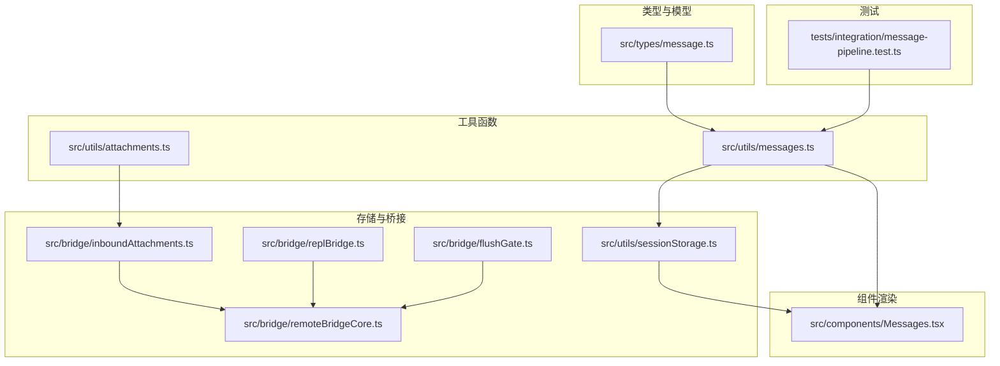
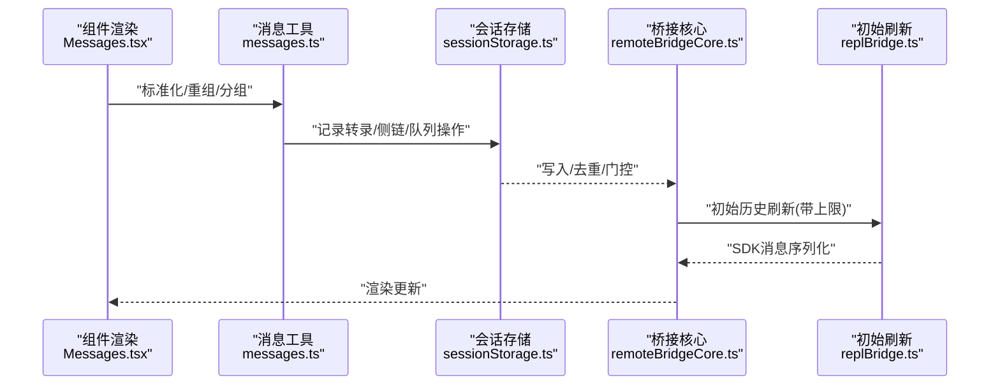
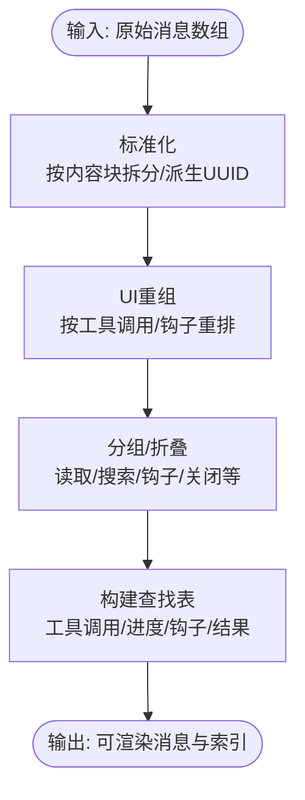
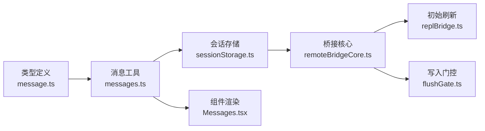

# 消息处理流程

<cite>
**本文引用的文件**
- [src/types/message.ts](file://src/types/message.ts)
- [src/utils/messages.ts](file://src/utils/messages.ts)
- [src/utils/sessionStorage.ts](file://src/utils/sessionStorage.ts)
- [src/bridge/remoteBridgeCore.ts](file://src/bridge/remoteBridgeCore.ts)
- [src/bridge/replBridge.ts](file://src/bridge/replBridge.ts)
- [src/bridge/flushGate.ts](file://src/bridge/flushGate.ts)
- [src/bridge/inboundAttachments.ts](file://src/bridge/inboundAttachments.ts)
- [src/utils/attachments.ts](file://src/utils/attachments.ts)
- [src/tools/SendMessageTool/SendMessageTool.ts](file://src/tools/SendMessageTool/SendMessageTool.ts)
- [src/components/Messages.tsx](file://src/components/Messages.tsx)
- [tests/integration/message-pipeline.test.ts](file://tests/integration/message-pipeline.test.ts)
</cite>

## 目录
1. [简介](#简介)
2. [项目结构](#项目结构)
3. [核心组件](#核心组件)
4. [架构总览](#架构总览)
5. [详细组件分析](#详细组件分析)
6. [依赖关系分析](#依赖关系分析)
7. [性能考量](#性能考量)
8. [故障排查指南](#故障排查指南)
9. [结论](#结论)
10. [附录：代码示例路径](#附录代码示例路径)

## 简介
本文件系统性梳理消息在系统中的生命周期与处理机制，覆盖从“创建、验证、转换、标准化、过滤、去重、持久化、状态跟踪、历史管理、回放、附件处理、元数据管理、序列化”等全流程。文档同时对不同消息类型的处理逻辑进行分层说明（用户消息、助手消息、系统消息、工具结果消息），并给出关键流程的可视化图示与可操作的调试建议。

## 项目结构
围绕消息处理的关键模块分布如下：
- 类型与模型：定义消息类型、内容块、系统消息子类型等
- 工具函数：消息创建、标准化、UI重组、查找与统计、附件解析等
- 存储与桥接：会话存储、桥接传输、初始历史刷新、写入门控与去重
- 组件渲染：消息列表渲染、折叠与分组、简要模式、截断策略
- 测试用例：消息管道的标签提取与标准化行为验证

图表来源
- [src/types/message.ts:19-168](file://src/types/message.ts#L19-L168)
- [src/utils/messages.ts:1-800](file://src/utils/messages.ts#L1-L800)
- [src/utils/sessionStorage.ts:1-200](file://src/utils/sessionStorage.ts#L1-L200)
- [src/bridge/remoteBridgeCore.ts:258-280](file://src/bridge/remoteBridgeCore.ts#L258-L280)
- [src/bridge/replBridge.ts:1248-1274](file://src/bridge/replBridge.ts#L1248-L1274)
- [src/bridge/flushGate.ts:1-50](file://src/bridge/flushGate.ts#L1-L50)
- [src/bridge/inboundAttachments.ts:115-134](file://src/bridge/inboundAttachments.ts#L115-L134)
- [src/utils/attachments.ts:990-1004](file://src/utils/attachments.ts#L990-L1004)
- [src/components/Messages.tsx:1-800](file://src/components/Messages.tsx#L1-L800)
- [tests/integration/message-pipeline.test.ts:36-65](file://tests/integration/message-pipeline.test.ts#L36-L65)

章节来源
- [src/types/message.ts:19-168](file://src/types/message.ts#L19-L168)
- [src/utils/messages.ts:1-800](file://src/utils/messages.ts#L1-L800)
- [src/utils/sessionStorage.ts:1-200](file://src/utils/sessionStorage.ts#L1-L200)
- [src/bridge/remoteBridgeCore.ts:258-280](file://src/bridge/remoteBridgeCore.ts#L258-L280)
- [src/bridge/replBridge.ts:1248-1274](file://src/bridge/replBridge.ts#L1248-L1274)
- [src/bridge/flushGate.ts:1-50](file://src/bridge/flushGate.ts#L1-L50)
- [src/bridge/inboundAttachments.ts:115-134](file://src/bridge/inboundAttachments.ts#L115-L134)
- [src/utils/attachments.ts:990-1004](file://src/utils/attachments.ts#L990-L1004)
- [src/components/Messages.tsx:1-800](file://src/components/Messages.tsx#L1-L800)
- [tests/integration/message-pipeline.test.ts:36-65](file://tests/integration/message-pipeline.test.ts#L36-L65)

## 核心组件
- 消息类型与内容模型：统一的消息结构、内容块类型、系统消息子类型、可渲染消息集合等
- 消息创建与标准化：创建用户/助手/系统/进度/附件消息；按内容块拆分与派生UUID
- 消息UI重组与分组：按工具调用与钩子事件重组消息顺序，构建查找表以支持高效渲染
- 会话存储与持久化：记录转录、侧链记录、队列操作、移除消息、远程事件写入
- 桥接与初始刷新：桥接端去重、初始历史刷新上限、写入门控
- 附件处理：入站附件解析、路径校验、并行处理
- 组件渲染：消息列表折叠/分组/截断、简要模式、虚拟滚动

章节来源
- [src/types/message.ts:19-168](file://src/types/message.ts#L19-L168)
- [src/utils/messages.ts:461-825](file://src/utils/messages.ts#L461-L825)
- [src/utils/messages.ts:858-1031](file://src/utils/messages.ts#L858-L1031)
- [src/utils/messages.ts:1178-1356](file://src/utils/messages.ts#L1178-L1356)
- [src/utils/sessionStorage.ts:1410-1475](file://src/utils/sessionStorage.ts#L1410-L1475)
- [src/bridge/remoteBridgeCore.ts:258-280](file://src/bridge/remoteBridgeCore.ts#L258-L280)
- [src/bridge/replBridge.ts:1248-1274](file://src/bridge/replBridge.ts#L1248-L1274)
- [src/bridge/flushGate.ts:1-50](file://src/bridge/flushGate.ts#L1-L50)
- [src/bridge/inboundAttachments.ts:115-134](file://src/bridge/inboundAttachments.ts#L115-L134)
- [src/utils/attachments.ts:990-1004](file://src/utils/attachments.ts#L990-L1004)
- [src/components/Messages.tsx:568-668](file://src/components/Messages.tsx#L568-L668)

## 架构总览
消息处理贯穿“类型定义—工具函数—存储/桥接—组件渲染”的全链路。标准化与UI重组发生在内存态；持久化与桥接负责跨进程/跨会话一致性；组件负责最终呈现与交互。

图表来源
- [src/components/Messages.tsx:568-668](file://src/components/Messages.tsx#L568-L668)
- [src/utils/messages.ts:732-825](file://src/utils/messages.ts#L732-L825)
- [src/utils/sessionStorage.ts:1410-1475](file://src/utils/sessionStorage.ts#L1410-L1475)
- [src/bridge/remoteBridgeCore.ts:258-280](file://src/bridge/remoteBridgeCore.ts#L258-L280)
- [src/bridge/replBridge.ts:1248-1274](file://src/bridge/replBridge.ts#L1248-L1274)

## 详细组件分析

### 消息类型与标准化
- 类型体系：统一的Message基类与子类型（用户、助手、系统、附件、进度、分组工具使用、折叠读取搜索等）；系统消息进一步细分为多种子类型
- 标准化流程：将多内容块消息拆分为单内容块消息，必要时派生新的稳定UUID，确保后续链式关系与去重正确
- UI重组：按工具调用与钩子事件重新排列消息顺序，保证“工具调用—前置钩子—结果—后置钩子”的语义顺序
- 查找表构建：一次性扫描消息，建立工具调用ID、进度消息、钩子计数、结果映射等索引，避免重复计算

图表来源
- [src/utils/messages.ts:732-825](file://src/utils/messages.ts#L732-L825)
- [src/utils/messages.ts:858-1031](file://src/utils/messages.ts#L858-L1031)
- [src/utils/messages.ts:1178-1356](file://src/utils/messages.ts#L1178-L1356)

章节来源
- [src/types/message.ts:19-168](file://src/types/message.ts#L19-L168)
- [src/utils/messages.ts:732-825](file://src/utils/messages.ts#L732-L825)
- [src/utils/messages.ts:858-1031](file://src/utils/messages.ts#L858-L1031)
- [src/utils/messages.ts:1178-1356](file://src/utils/messages.ts#L1178-L1356)

### 消息创建与转换
- 创建用户消息：支持文本或内容块数组，自动填充时间戳、UUID、可见性标记、来源工具等
- 创建助手消息：支持文本或内容块数组，内置默认用量结构
- 创建系统消息：支持信息性系统消息与多种子类型
- 创建进度消息：用于工具执行进度，携带父级工具调用ID
- 工具结果与工具调用消息：用于工具调用与结果的配对与提示
- 内容转换：将字符串内容包装为内容块，或将复杂对象序列化为字符串以便传输

章节来源
- [src/utils/messages.ts:461-524](file://src/utils/messages.ts#L461-L524)
- [src/utils/messages.ts:412-459](file://src/utils/messages.ts#L412-L459)
- [src/utils/messages.ts:4377-4394](file://src/utils/messages.ts#L4377-L4394)
- [src/utils/messages.ts:604-621](file://src/utils/messages.ts#L604-L621)
- [src/utils/messages.ts:4348-4365](file://src/utils/messages.ts#L4348-L4365)
- [src/utils/messages.ts:4367-4375](file://src/utils/messages.ts#L4367-L4375)

### 消息过滤、去重与状态跟踪
- 过滤规则：空消息、进度消息、UI仅显示消息、系统指标类消息等的过滤策略
- 去重策略：桥接端通过“最近已发UUID环形缓冲区+初始消息UUID集合”实现回放/重发去重；FlushGate在初始刷新期间阻塞新消息写入，保证顺序
- 状态跟踪：查找表中维护“进行中/已解决/错误”的工具调用集合，支持UI即时反馈
- 最新消息查找：O(n)单次扫描找到满足条件的最新消息，避免排序开销

章节来源
- [src/utils/messages.ts:690-721](file://src/utils/messages.ts#L690-L721)
- [src/bridge/remoteBridgeCore.ts:258-280](file://src/bridge/remoteBridgeCore.ts#L258-L280)
- [src/bridge/flushGate.ts:1-50](file://src/bridge/flushGate.ts#L1-L50)
- [src/utils/messages.ts:1178-1356](file://src/utils/messages.ts#L1178-L1356)
- [src/utils/sessionStorage.ts:2047-2062](file://src/utils/sessionStorage.ts#L2047-L2062)

### 消息历史管理与回放
- 初始历史刷新上限：限制首次刷新的历史条目数量，降低持久化压力与Firestore压力
- 刷新门控：在历史POST进行期间，新消息进入队列等待，确保“历史…实时”顺序
- 历史截断：UI层面可对长历史进行截断显示，结合虚拟滚动提升性能
- 回放与恢复：通过清理后的消息序列与父UUID链重建消息树，支持恢复与侧链记录

章节来源
- [src/bridge/replBridge.ts:1248-1274](file://src/bridge/replBridge.ts#L1248-L1274)
- [src/bridge/flushGate.ts:1-50](file://src/bridge/flushGate.ts#L1-L50)
- [src/components/Messages.tsx:323-393](file://src/components/Messages.tsx#L323-L393)
- [src/utils/sessionStorage.ts:1410-1475](file://src/utils/sessionStorage.ts#L1410-L1475)

### 附件处理与元数据管理
- 入站附件解析：将入站附件解析为本地路径引用，支持批量并行处理
- 附件校验：检查路径存在性、权限与文件类型
- 附件聚合：在消息中注入附件引用，便于后续渲染与处理

章节来源
- [src/bridge/inboundAttachments.ts:115-134](file://src/bridge/inboundAttachments.ts#L115-L134)
- [src/utils/attachments.ts:990-1004](file://src/utils/attachments.ts#L990-L1004)
- [src/tools/SendMessageTool/SendMessageTool.ts:604-643](file://src/tools/SendMessageTool/SendMessageTool.ts#L604-L643)

### 消息序列化与持久化
- 序列化策略：内容块为字符串时优先使用原始字符串以节省token；对象/数组采用结构化序列化
- 持久化入口：记录转录、侧链、队列操作、文件历史快照、归属快照、内容替换等
- 写入门控与去重：FlushGate与桥接去重缓冲共同保证写入顺序与幂等
- 移除与墓碑：支持按UUID移除消息，用于流式失败时的墓碑处理

章节来源
- [src/utils/messages.ts:4348-4358](file://src/utils/messages.ts#L4348-L4358)
- [src/utils/sessionStorage.ts:1410-1475](file://src/utils/sessionStorage.ts#L1410-L1475)
- [src/utils/sessionStorage.ts:841-861](file://src/utils/sessionStorage.ts#L841-L861)
- [src/utils/sessionStorage.ts:1473-1475](file://src/utils/sessionStorage.ts#L1473-L1475)

### 不同类型消息的处理逻辑
- 用户消息：支持中断/取消/拒绝等合成消息，支持命令输入面包屑
- 助手消息：支持文本/工具调用/思考块/结果块等，支持API错误消息
- 系统消息：包含信息性、本地命令、API指标、内存节省、权限重试、计划任务触发等多种子类型
- 工具结果消息：与工具调用配对，支持错误标记与结果截断提示

章节来源
- [src/utils/messages.ts:546-602](file://src/utils/messages.ts#L546-L602)
- [src/utils/messages.ts:332-354](file://src/utils/messages.ts#L332-L354)
- [src/types/message.ts:92-106](file://src/types/message.ts#L92-L106)
- [src/utils/messages.ts:1558-1599](file://src/utils/messages.ts#L1558-L1599)

## 依赖关系分析
- 类型依赖：所有消息处理均基于统一的Message类型与内容块类型
- 工具函数依赖：标准化、重组、查找表构建依赖于消息工具函数
- 存储依赖：会话存储依赖消息工具的清理与序列化能力
- 桥接依赖：桥接核心依赖FlushGate与去重缓冲，依赖replBridge的初始刷新策略
- 组件依赖：Messages组件依赖消息工具的标准化、重组与查找表构建

图表来源
- [src/types/message.ts:19-168](file://src/types/message.ts#L19-L168)
- [src/utils/messages.ts:1-800](file://src/utils/messages.ts#L1-L800)
- [src/utils/sessionStorage.ts:1-200](file://src/utils/sessionStorage.ts#L1-L200)
- [src/bridge/remoteBridgeCore.ts:258-280](file://src/bridge/remoteBridgeCore.ts#L258-L280)
- [src/bridge/replBridge.ts:1248-1274](file://src/bridge/replBridge.ts#L1248-L1274)
- [src/bridge/flushGate.ts:1-50](file://src/bridge/flushGate.ts#L1-L50)
- [src/components/Messages.tsx:1-800](file://src/components/Messages.tsx#L1-L800)

## 性能考量
- 标准化与重组：O(n)线性扫描，避免排序与多次遍历
- 查找表构建：一次性扫描构建多类索引，避免每帧重复计算
- 截断与虚拟滚动：在长历史场景下显著降低内存占用与渲染成本
- 并行处理：附件解析与写入队列采用并行策略
- 去重与门控：减少重复写入与乱序写入带来的额外成本

## 故障排查指南
- 标签提取与标准化测试：验证标签提取与标准化行为
- 桥接去重异常：检查最近已发UUID缓冲是否溢出、初始消息UUID集合是否正确初始化
- 初始刷新过慢：调整历史刷新上限参数，确认SDK消息序列化与传输链路
- UI渲染卡顿：启用虚拟滚动，检查截断策略与分组折叠逻辑
- 附件解析失败：核对路径存在性、权限与文件类型校验

章节来源
- [tests/integration/message-pipeline.test.ts:36-65](file://tests/integration/message-pipeline.test.ts#L36-L65)
- [src/bridge/remoteBridgeCore.ts:258-280](file://src/bridge/remoteBridgeCore.ts#L258-L280)
- [src/bridge/replBridge.ts:1248-1274](file://src/bridge/replBridge.ts#L1248-L1274)
- [src/components/Messages.tsx:323-393](file://src/components/Messages.tsx#L323-L393)
- [src/bridge/inboundAttachments.ts:115-134](file://src/bridge/inboundAttachments.ts#L115-L134)

## 结论
该消息处理体系以“类型统一—工具函数—存储/桥接—组件渲染”为主线，通过标准化、重组与查找表构建实现高性能渲染；通过FlushGate与桥接去重保障顺序与幂等；通过初始刷新上限与虚拟滚动优化长历史场景；通过附件解析与序列化完善消息生态。整体设计兼顾可扩展性与性能，适合大规模对话与工具协作场景。

## 附录：代码示例路径
以下为常见场景的代码示例路径（请在对应文件中查看具体实现）：
- 创建用户消息
  - [src/utils/messages.ts:461-524](file://src/utils/messages.ts#L461-L524)
- 创建助手消息
  - [src/utils/messages.ts:412-459](file://src/utils/messages.ts#L412-L459)
- 创建系统消息
  - [src/utils/messages.ts:4377-4394](file://src/utils/messages.ts#L4377-L4394)
- 创建进度消息
  - [src/utils/messages.ts:604-621](file://src/utils/messages.ts#L604-L621)
- 工具结果与工具调用消息
  - [src/utils/messages.ts:4348-4375](file://src/utils/messages.ts#L4348-L4375)
- 标准化消息
  - [src/utils/messages.ts:732-825](file://src/utils/messages.ts#L732-L825)
- UI重组消息
  - [src/utils/messages.ts:858-1031](file://src/utils/messages.ts#L858-L1031)
- 构建消息查找表
  - [src/utils/messages.ts:1178-1356](file://src/utils/messages.ts#L1178-L1356)
- 记录转录/侧链/队列操作
  - [src/utils/sessionStorage.ts:1410-1475](file://src/utils/sessionStorage.ts#L1410-L1475)
- 初始历史刷新与上限控制
  - [src/bridge/replBridge.ts:1248-1274](file://src/bridge/replBridge.ts#L1248-L1274)
- 写入门控与去重
  - [src/bridge/flushGate.ts:1-50](file://src/bridge/flushGate.ts#L1-L50)
  - [src/bridge/remoteBridgeCore.ts:258-280](file://src/bridge/remoteBridgeCore.ts#L258-L280)
- 入站附件解析
  - [src/bridge/inboundAttachments.ts:115-134](file://src/bridge/inboundAttachments.ts#L115-L134)
- 附件路径校验
  - [src/utils/attachments.ts:990-1004](file://src/utils/attachments.ts#L990-L1004)
- 发送跨会话消息的输入验证
  - [src/tools/SendMessageTool/SendMessageTool.ts:604-643](file://src/tools/SendMessageTool/SendMessageTool.ts#L604-L643)
- 消息管道测试（标签提取与标准化）
  - [tests/integration/message-pipeline.test.ts:36-65](file://tests/integration/message-pipeline.test.ts#L36-L65)