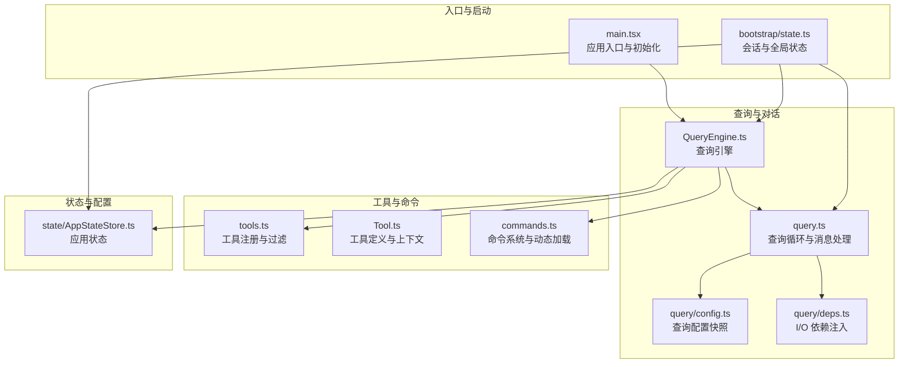
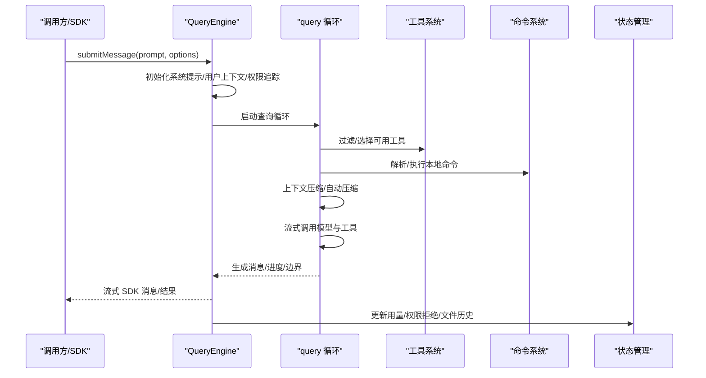
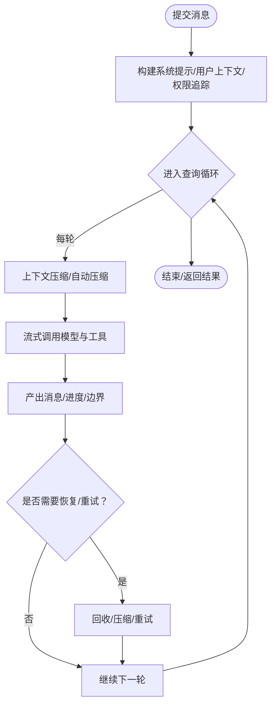
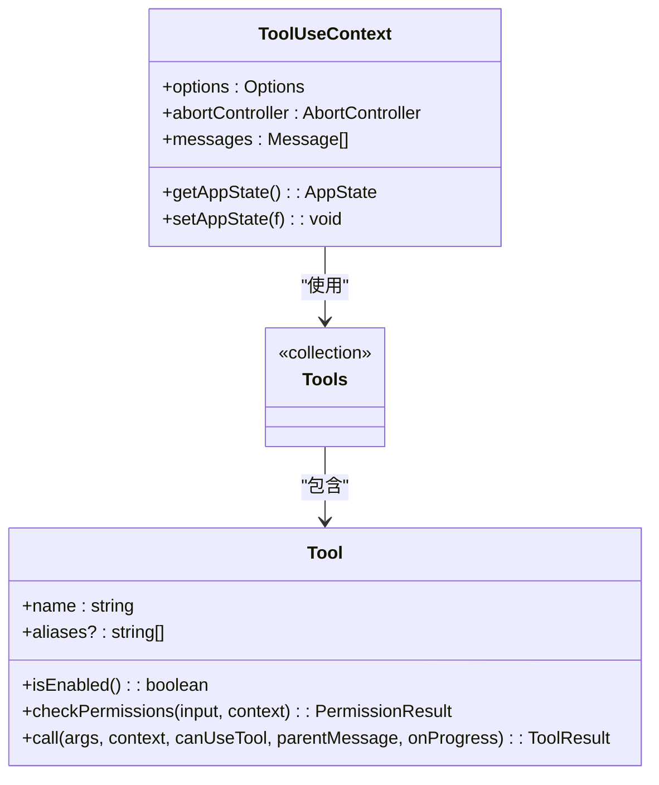
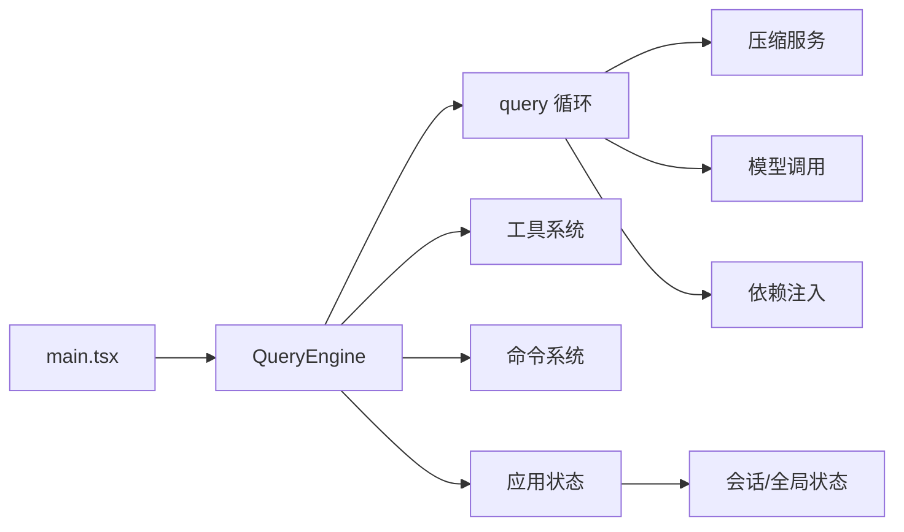

# 核心架构

<cite>
**本文档引用的文件**
- [src/QueryEngine.ts](file://src/QueryEngine.ts)
- [src/query.ts](file://src/query.ts)
- [src/tools.ts](file://src/tools.ts)
- [src/commands.ts](file://src/commands.ts)
- [src/main.tsx](file://src/main.tsx)
- [src/state/AppStateStore.ts](file://src/state/AppStateStore.ts)
- [src/Tool.ts](file://src/Tool.ts)
- [src/bootstrap/state.ts](file://src/bootstrap/state.ts)
- [src/query/config.ts](file://src/query/config.ts)
- [src/query/deps.ts](file://src/query/deps.ts)
</cite>

## 目录
1. [引言](#引言)
2. [项目结构](#项目结构)
3. [核心组件](#核心组件)
4. [架构总览](#架构总览)
5. [详细组件分析](#详细组件分析)
6. [依赖分析](#依赖分析)
7. [性能考虑](#性能考虑)
8. [故障排查指南](#故障排查指南)
9. [结论](#结论)

## 引言
本文件面向 Claude Code Best 的核心架构，聚焦以下目标：
- 整体系统设计：模块化结构、组件交互模式与数据流
- 查询引擎（QueryEngine）设计理念与实现细节：对话循环机制、流式 API 集成、错误恢复策略
- 工具系统架构：工具注册机制、执行流程与权限控制
- 命令系统组织与扩展机制
- 状态管理：应用状态、会话状态与全局配置
- 特性门控系统：工作原理与编译时优化策略
- 系统边界与组件关系图，帮助开发者理解模块间依赖与交互

## 项目结构
项目采用“功能域 + 层次化”的混合组织方式：
- 入口与启动：入口点、初始化、设置加载与延迟预取
- 查询与对话：QueryEngine、query 循环、消息构建与压缩
- 工具与命令：工具注册、权限控制、命令发现与动态加载
- 状态与配置：应用状态、会话状态、全局配置与特性门控
- 扩展与插件：插件系统、MCP 工具与技能目录



**图表来源**
- [src/main.tsx:1-800](file://src/main.tsx#L1-L800)
- [src/QueryEngine.ts:1-800](file://src/QueryEngine.ts#L1-L800)
- [src/query.ts:1-800](file://src/query.ts#L1-L800)
- [src/query/config.ts:1-47](file://src/query/config.ts#L1-L47)
- [src/query/deps.ts:1-41](file://src/query/deps.ts#L1-L41)
- [src/tools.ts:1-388](file://src/tools.ts#L1-L388)
- [src/commands.ts:1-757](file://src/commands.ts#L1-L757)
- [src/state/AppStateStore.ts:1-570](file://src/state/AppStateStore.ts#L1-L570)
- [src/bootstrap/state.ts:1-800](file://src/bootstrap/state.ts#L1-L800)

**章节来源**
- [src/main.tsx:1-800](file://src/main.tsx#L1-L800)
- [src/bootstrap/state.ts:1-800](file://src/bootstrap/state.ts#L1-L800)

## 核心组件
- 查询引擎（QueryEngine）
  - 职责：封装一次对话的完整生命周期，维护会话状态，协调工具与命令，驱动查询循环，处理流式输出与错误恢复
  - 关键能力：对话循环、流式 API 集成、权限追踪、内存压缩与历史截断、费用与用量统计
- 查询循环（query）
  - 职责：基于消息与系统提示，按回合推进对话；在每轮中进行上下文压缩、自动压缩、工具调用与结果回填
  - 关键能力：令牌预算、自动/微压缩、流式工具执行、错误抑制与恢复、任务预算支持
- 工具系统（Tools）
  - 职责：集中注册内置工具，按权限规则过滤，合并 MCP 工具，提供统一工具池
  - 关键能力：工具启用/禁用、并发安全、只读/破坏性标记、输入校验与权限检查
- 命令系统（Commands）
  - 职责：动态加载技能、插件命令与工作流命令，按可用性与启用状态筛选，提供远程/桥接安全命令集合
  - 关键能力：动态技能发现、命令缓存、远程模式过滤、桥接安全命令白名单
- 应用状态（AppState）
  - 职责：承载 UI、权限、MCP、插件、任务、通知等全量运行时状态
  - 关键能力：深度不可变包装、任务状态、文件历史、归属信息、提示建议与推测状态
- 会话与全局状态（bootstrap/state）
  - 职责：会话级计数器、成本与时长统计、令牌预算、钩子与指标、会话切换与持久化开关
  - 关键能力：会话 ID、父会话 ID、令牌预算快照、慢操作记录、SDK Beta 头部与特性门控

**章节来源**
- [src/QueryEngine.ts:186-800](file://src/QueryEngine.ts#L186-L800)
- [src/query.ts:219-800](file://src/query.ts#L219-L800)
- [src/tools.ts:191-388](file://src/tools.ts#L191-L388)
- [src/commands.ts:258-757](file://src/commands.ts#L258-L757)
- [src/state/AppStateStore.ts:89-570](file://src/state/AppStateStore.ts#L89-L570)
- [src/bootstrap/state.ts:45-800](file://src/bootstrap/state.ts#L45-L800)

## 架构总览
系统围绕“查询引擎”为中心，通过“工具系统”和“命令系统”提供能力扩展，由“状态管理”与“特性门控”保障运行时行为可控与可观察。



**图表来源**
- [src/QueryEngine.ts:211-800](file://src/QueryEngine.ts#L211-L800)
- [src/query.ts:241-800](file://src/query.ts#L241-L800)
- [src/tools.ts:269-388](file://src/tools.ts#L269-L388)
- [src/commands.ts:478-757](file://src/commands.ts#L478-L757)
- [src/state/AppStateStore.ts:89-570](file://src/state/AppStateStore.ts#L89-L570)

## 详细组件分析

### 查询引擎（QueryEngine）
- 设计理念
  - 将 ask() 中的核心逻辑抽取为独立类，支持 SDK/无头路径与未来 REPL 路径复用
  - 会话内状态持久化：消息、文件缓存、用量等跨回合保持
  - 权限追踪：对被拒绝的工具调用进行记录，便于 SDK 报告
- 对话循环机制
  - 用户输入经“用户输入处理”后进入消息数组
  - 系统提示与用户上下文组合，触发查询循环
  - 每轮生成消息、进度与压缩边界，支持历史截断与紧凑边界
- 流式 API 集成
  - 通过 deps.callModel 支持流式响应，逐步产出内容块
  - 在工具调用期间，支持“流式工具执行”门控
- 错误恢复策略
  - 最大输出令牌错误与提示过长错误采用“保留但不立即上报”，等待恢复路径（如上下文回收或自动压缩）后再决定是否上报
  - 提供孤儿消息墓碑（tombstone）清理，避免无效签名导致的 API 错误
  - 支持“流式回退”场景下的消息重建与结果清理



**图表来源**
- [src/QueryEngine.ts:211-800](file://src/QueryEngine.ts#L211-L800)
- [src/query.ts:241-800](file://src/query.ts#L241-L800)

**章节来源**
- [src/QueryEngine.ts:186-800](file://src/QueryEngine.ts#L186-L800)
- [src/query.ts:219-800](file://src/query.ts#L219-L800)

### 查询循环（query）
- 配置快照与依赖注入
  - QueryConfig 快照运行时门控（非特性门控），保证纯函数式步骤可测试
  - QueryDeps 将 I/O 依赖注入，便于测试替身
- 回合状态与预算
  - State 结构保存跨迭代状态（消息、自动压缩跟踪、令牌预算、停止钩子等）
  - 令牌预算与任务预算支持在多轮中持续跟踪与恢复
- 压缩与恢复
  - 微压缩与自动压缩按需触发，支持“缓存编辑”与“上下文回收”协同
  - 提示过长与最大输出令牌错误采用“保留-等待恢复”策略
- 工具执行
  - 支持“流式工具执行”门控，按块回填工具输入，确保 SDK 流水线一致性

**章节来源**
- [src/query/config.ts:29-47](file://src/query/config.ts#L29-L47)
- [src/query/deps.ts:33-41](file://src/query/deps.ts#L33-L41)
- [src/query.ts:204-800](file://src/query.ts#L204-L800)

### 工具系统（Tools）
- 注册与过滤
  - getAllBaseTools 统一收集内置工具，结合环境变量与特性门控进行条件注册
  - getTools 按权限规则过滤，隐藏 REPL 专用工具，支持简单模式与协调员模式
  - assembleToolPool 合并内置与 MCP 工具，去重并保持提示缓存稳定性
- 执行流程
  - 工具调用前先进行输入校验与权限检查，再进入工具执行
  - 支持并发安全判定、透明包装器、进度渲染与结果消息渲染
- 权限控制
  - ToolPermissionContext 统一管理权限模式、附加工作目录、允许/禁止/询问规则
  - canUseTool 包装器记录权限拒绝，用于 SDK 报告



**图表来源**
- [src/Tool.ts:362-793](file://src/Tool.ts#L362-L793)
- [src/tools.ts:269-388](file://src/tools.ts#L269-L388)

**章节来源**
- [src/tools.ts:191-388](file://src/tools.ts#L191-L388)
- [src/Tool.ts:158-793](file://src/Tool.ts#L158-L793)

### 命令系统（Commands）
- 动态加载与缓存
  - getCommands 汇聚技能、插件、工作流与内置命令，按可用性与启用状态筛选
  - 使用 memoize 缓存以降低磁盘 I/O 与动态导入开销
- 安全与远程模式
  - REMOTE_SAFE_COMMANDS 与 BRIDGE_SAFE_COMMANDS 白名单，限制远程/桥接场景中的命令范围
  - filterCommandsForRemoteMode 在渲染 REPL 前预过滤，避免竞态
- 技能与工作流
  - getSkillToolCommands 与 getSlashCommandToolSkills 提供模型可调用的技能列表
  - WORKFLOW_SCRIPTS 特性下动态创建工作流命令

**章节来源**
- [src/commands.ts:258-757](file://src/commands.ts#L258-L757)

### 状态管理
- 应用状态（AppState）
  - 包含设置、权限上下文、MCP/插件/任务/通知/提示建议/推测状态等
  - 使用 DeepImmutable 包裹，确保状态更新通过统一接口进行
- 会话与全局状态（bootstrap/state）
  - 记录会话 ID、成本与时长、令牌预算、钩子与指标、慢操作与 SDK Beta 头部
  - 提供会话切换、计划摘要缓存、缓存编辑头部锁存等机制

```mermaid
erDiagram
APPSTATE {
json settings
string statusLineText
map agentNameRegistry
object toolPermissionContext
array plugins.enabled
array plugins.disabled
map mcp.clients
map tasks
object notifications
object promptSuggestion
object speculation
}
BOOTSTATE {
string sessionId
number totalCostUSD
number totalAPIDuration
map modelUsage
array sessionCronTasks
boolean sessionPersistenceDisabled
array allowedChannels
}
APPSTATE ||--|| BOOTSTATE : "共享会话标识与统计"
```

**图表来源**
- [src/state/AppStateStore.ts:89-570](file://src/state/AppStateStore.ts#L89-L570)
- [src/bootstrap/state.ts:45-800](file://src/bootstrap/state.ts#L45-L800)

**章节来源**
- [src/state/AppStateStore.ts:89-570](file://src/state/AppStateStore.ts#L89-L570)
- [src/bootstrap/state.ts:45-800](file://src/bootstrap/state.ts#L45-L800)

### 特性门控系统
- 运行时门控（QueryConfig.gates）
  - 通过 Statsig 门控与环境变量控制流式工具执行、工具使用汇总、ANT 专属能力与快速模式
- 编译时门控（feature('FLAG')）
  - 仅在 if/三元表达式中生效，用于死代码消除与按需加载（如协调员模式、历史截断、上下文回收等）
- 门控与配置分离
  - QueryConfig 快照运行时门控，排除特性门控，确保纯函数式步骤可测试且不受 tree-shaking 影响

**章节来源**
- [src/query/config.ts:29-47](file://src/query/config.ts#L29-L47)
- [src/QueryEngine.ts:112-130](file://src/QueryEngine.ts#L112-L130)
- [src/query.ts:15-21](file://src/query.ts#L15-L21)

## 依赖分析
- 模块耦合
  - QueryEngine 依赖工具系统、命令系统、状态管理与特性门控
  - query 循环依赖压缩服务、模型调用与依赖注入
  - main.tsx 作为入口，负责初始化与延迟预取，连接所有子系统
- 外部依赖与集成点
  - MCP 工具与资源：通过 AppState.mcp 与命令系统整合
  - 插件系统：通过 AppState.plugins 与 commands 系统整合
  - 会话存储与转录：通过 bootstrap/state 与工具/命令协作



**图表来源**
- [src/main.tsx:1-800](file://src/main.tsx#L1-L800)
- [src/QueryEngine.ts:1-800](file://src/QueryEngine.ts#L1-L800)
- [src/query.ts:1-800](file://src/query.ts#L1-L800)
- [src/query/deps.ts:1-41](file://src/query/deps.ts#L1-L41)
- [src/state/AppStateStore.ts:1-570](file://src/state/AppStateStore.ts#L1-L570)
- [src/bootstrap/state.ts:1-800](file://src/bootstrap/state.ts#L1-L800)

**章节来源**
- [src/main.tsx:1-800](file://src/main.tsx#L1-L800)
- [src/QueryEngine.ts:1-800](file://src/QueryEngine.ts#L1-L800)
- [src/query.ts:1-800](file://src/query.ts#L1-L800)

## 性能考虑
- 启动与延迟预取
  - main.tsx 在首次渲染后异步执行预取，避免阻塞首帧
  - 无头/脚本模式跳过预取，减少不必要的开销
- 查询循环优化
  - 令牌预算与任务预算在循环内持续跟踪，避免超限请求
  - 自动/微压缩与上下文回收降低上下文长度，提升吞吐
- 工具执行优化
  - 流式工具执行与输入回填减少重复序列化与传输
  - 并发安全工具避免串行化瓶颈
- 死代码消除
  - 特性门控在 if/三元中使用，确保未启用功能完全移除

[本节为通用指导，无需特定文件引用]

## 故障排查指南
- 常见问题定位
  - 提示过长/最大输出令牌：查看是否触发“保留-等待恢复”策略，确认自动压缩或上下文回收是否生效
  - 权限拒绝：检查 QueryEngine 的权限拒绝记录与工具权限上下文
  - 流式回退：确认孤儿消息墓碑是否正确清理，避免无效签名导致的 API 错误
- 日志与诊断
  - 通过 bootstrap/state 的慢操作记录与错误日志定位性能与异常
  - 使用会话 ID 与查询链 ID 追踪事件关联

**章节来源**
- [src/QueryEngine.ts:400-411](file://src/QueryEngine.ts#L400-L411)
- [src/query.ts:790-800](file://src/query.ts#L790-L800)
- [src/bootstrap/state.ts:124-126](file://src/bootstrap/state.ts#L124-L126)

## 结论
本架构以 QueryEngine 为核心，通过工具系统与命令系统提供强大的扩展能力，借助状态管理与特性门控实现可控、可观测与高性能的对话式 AI 体验。查询循环在压缩、预算与流式执行方面进行了系统性优化，并提供了完善的错误恢复与权限控制机制。通过编译时与运行时门控的分离，既保证了功能灵活性，也确保了构建产物的体积与性能最优。