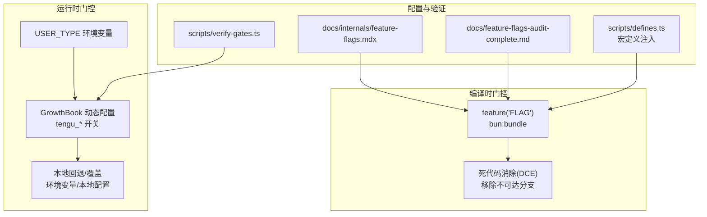
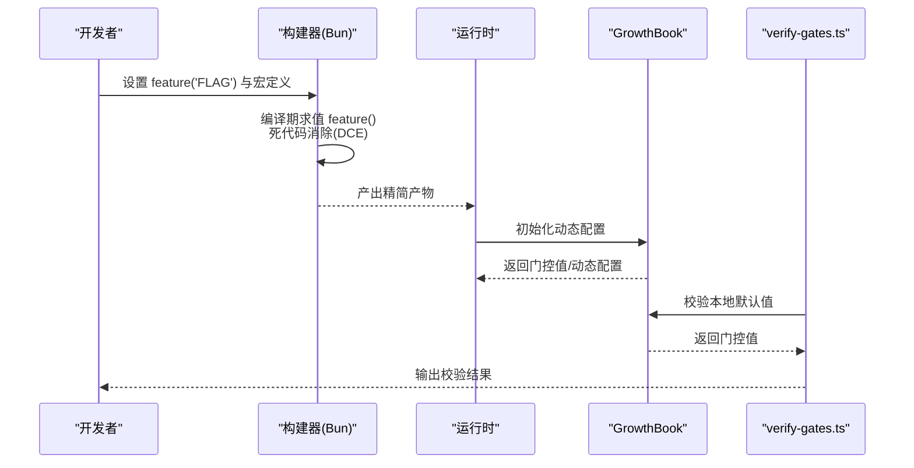
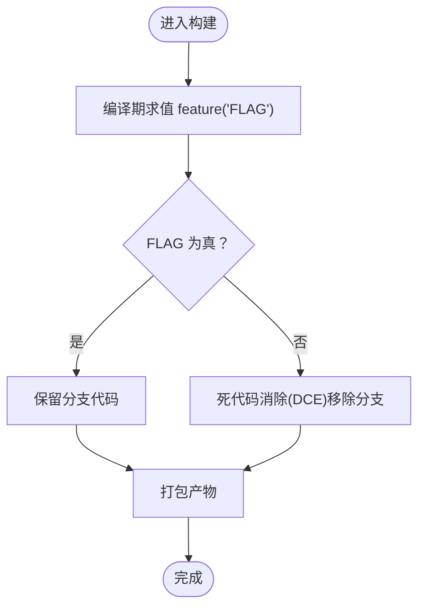
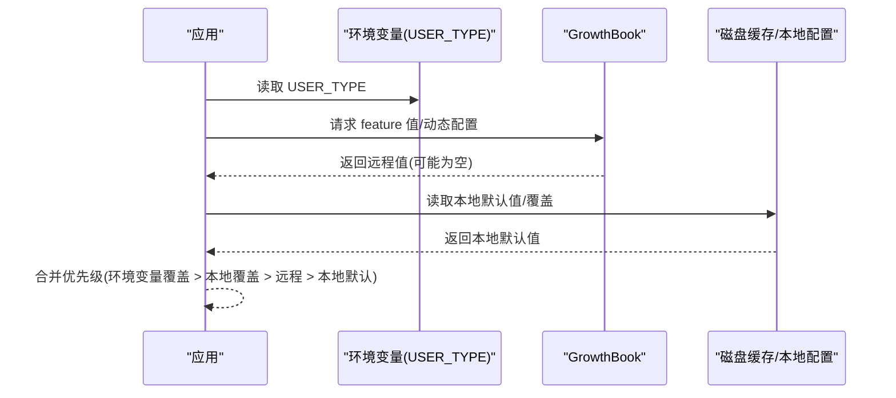
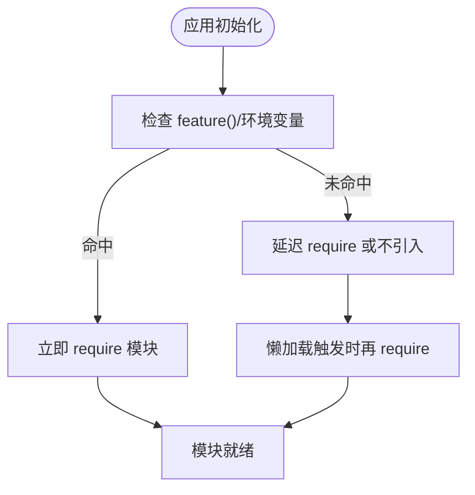
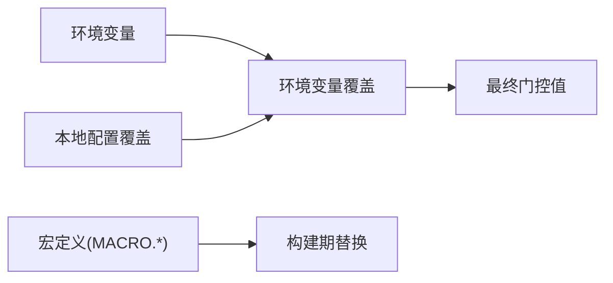
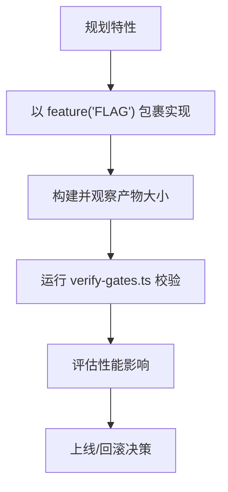
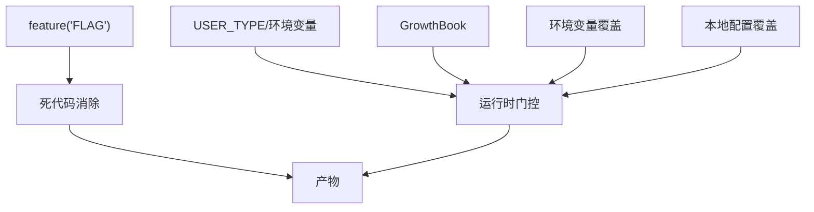

# 特性门控系统

<cite>
**本文引用的文件**
- [scripts/verify-gates.ts](file://scripts/verify-gates.ts)
- [src/assistant/gate.ts](file://src/assistant/gate.ts)
- [src/utils/computerUse/gates.ts](file://src/utils/computerUse/gates.ts)
- [docs/internals/feature-flags.mdx](file://docs/internals/feature-flags.mdx)
- [docs/feature-flags-audit-complete.md](file://docs/feature-flags-audit-complete.md)
- [docs/features/feature-flags-audit-complete.md](file://docs/features/feature-flags-audit-complete.md)
- [src/tools.ts](file://src/tools.ts)
- [src/services/analytics/growthbook.ts](file://src/services/analytics/growthbook.ts)
- [scripts/defines.ts](file://scripts/defines.ts)
- [CLAUDE.md](file://CLAUDE.md)
- [learn/LEARN.md](file://learn/LEARN.md)
</cite>

## 目录
1. [引言](#引言)
2. [项目结构](#项目结构)
3. [核心组件](#核心组件)
4. [架构总览](#架构总览)
5. [详细组件分析](#详细组件分析)
6. [依赖关系分析](#依赖关系分析)
7. [性能考量](#性能考量)
8. [故障排查指南](#故障排查指南)
9. [结论](#结论)
10. [附录](#附录)

## 引言
本文件系统性阐述 Claude Code 的特性门控体系，覆盖编译时条件编译、运行时功能切换与死代码消除（DCE）、远程开关与本地回退、模块加载中的条件导入与懒加载策略、以及构建期优化（Tree Shaking、代码分割与宏定义注入）。文档同时总结特性标志设计模式（布尔、枚举、复合）、配置管理（环境变量、配置文件、运行时参数）与开发指南（新增特性流程、测试策略、性能影响评估），帮助开发者在保证安全与可控的前提下快速迭代新功能。

## 项目结构
特性门控涉及三个层面：
- 编译时门控：通过 Bun 的 bun:bundle 提供的 feature() 在构建期决定代码是否进入产物，并由 DCE 移除不可达分支。
- 运行时门控：通过 USER_TYPE 环境变量与 GrowthBook 动态配置/远程开关，在不重启服务的情况下动态调整功能可用性。
- 配置与验证：通过脚本与文档对门控进行审计与验证，确保默认行为与预期一致。

图表来源
- [docs/internals/feature-flags.mdx](file://docs/internals/feature-flags.mdx)
- [scripts/verify-gates.ts](file://scripts/verify-gates.ts)
- [src/services/analytics/growthbook.ts](file://src/services/analytics/growthbook.ts)
- [scripts/defines.ts](file://scripts/defines.ts)

章节来源
- [docs/internals/feature-flags.mdx](file://docs/internals/feature-flags.mdx)
- [docs/feature-flags-audit-complete.md](file://docs/feature-flags-audit-complete.md)
- [docs/features/feature-flags-audit-complete.md](file://docs/features/feature-flags-audit-complete.md)

## 核心组件
- 编译时门控与死代码消除
  - 使用 Bun 的 feature() 作为编译时常量，构建期求值，DCE 移除 false 分支对应的代码。
  - 参考路径：[docs/internals/feature-flags.mdx](file://docs/internals/feature-flags.mdx)、[src/tools.ts](file://src/tools.ts)、[learn/LEARN.md](file://learn/LEARN.md)。
- 运行时门控与远程开关
  - GrowthBook 提供动态配置与远程开关，支持环境变量覆盖与本地配置覆盖。
  - 参考路径：[src/services/analytics/growthbook.ts](file://src/services/analytics/growthbook.ts)、[scripts/verify-gates.ts](file://scripts/verify-gates.ts)。
- 配置与验证
  - verify-gates.ts 对 GrowthBook 门控进行本地校验；defines.ts 注入宏定义；CLAUDE.md 提供开发注意事项。
  - 参考路径：[scripts/verify-gates.ts](file://scripts/verify-gates.ts)、[scripts/defines.ts](file://scripts/defines.ts)、[CLAUDE.md](file://CLAUDE.md)。

章节来源
- [src/tools.ts](file://src/tools.ts)
- [src/services/analytics/growthbook.ts](file://src/services/analytics/growthbook.ts)
- [scripts/verify-gates.ts](file://scripts/verify-gates.ts)
- [scripts/defines.ts](file://scripts/defines.ts)
- [CLAUDE.md](file://CLAUDE.md)
- [learn/LEARN.md](file://learn/LEARN.md)

## 架构总览
特性门控采用“编译时门控 + 运行时门控 + 配置验证”的三层架构，确保功能在不同阶段可控、可观测、可回退。

图表来源
- [docs/internals/feature-flags.mdx](file://docs/internals/feature-flags.mdx)
- [src/services/analytics/growthbook.ts](file://src/services/analytics/growthbook.ts)
- [scripts/verify-gates.ts](file://scripts/verify-gates.ts)

## 详细组件分析

### 组件A：编译时门控与死代码消除
- 设计要点
  - feature('FLAG') 作为编译时常量，构建期决定分支是否保留；false 分支被 DCE 彻底移除，不参与运行时开销。
  - 反编译版本中 feature() 回退为恒定 false，便于静态分析但不改变运行时行为。
- 典型模式
  - 条件加载工具：仅在 feature 为真时 require 对应模块，否则返回 null。
  - 条件注册命令：根据 feature 决定是否注册命令。
  - 条件启用 API 特性：根据 feature 决定请求头或行为。
- 关键实现参考
  - 条件导入与工具聚合：[src/tools.ts](file://src/tools.ts)
  - 文档说明与模式示例：[docs/internals/feature-flags.mdx](file://docs/internals/feature-flags.mdx)
  - 反编译注释与忽略规则：[learn/LEARN.md](file://learn/LEARN.md)

图表来源
- [docs/internals/feature-flags.mdx](file://docs/internals/feature-flags.mdx)
- [src/tools.ts](file://src/tools.ts)

章节来源
- [docs/internals/feature-flags.mdx](file://docs/internals/feature-flags.mdx)
- [src/tools.ts](file://src/tools.ts)
- [learn/LEARN.md](file://learn/LEARN.md)

### 组件B：运行时门控与远程开关
- 设计要点
  - USER_TYPE 环境变量用于区分用户类型，影响某些功能的可用性。
  - GrowthBook 提供动态配置与远程开关（tengu_* 前缀），支持环境变量覆盖与本地配置覆盖。
  - 本地回退：当 GrowthBook 未初始化或网络异常时，返回本地默认值。
- 关键实现参考
  - 动态配置与覆盖逻辑：[src/services/analytics/growthbook.ts](file://src/services/analytics/growthbook.ts)
  - 门控校验脚本：[scripts/verify-gates.ts](file://scripts/verify-gates.ts)
  - 计算机使用子门控示例：[src/utils/computerUse/gates.ts](file://src/utils/computerUse/gates.ts)

图表来源
- [src/services/analytics/growthbook.ts](file://src/services/analytics/growthbook.ts)
- [scripts/verify-gates.ts](file://scripts/verify-gates.ts)
- [src/utils/computerUse/gates.ts](file://src/utils/computerUse/gates.ts)

章节来源
- [src/services/analytics/growthbook.ts](file://src/services/analytics/growthbook.ts)
- [scripts/verify-gates.ts](file://scripts/verify-gates.ts)
- [src/utils/computerUse/gates.ts](file://src/utils/computerUse/gates.ts)

### 组件C：模块加载中的条件导入、懒加载与模块分割
- 条件导入
  - 通过 feature() 或环境变量在模块顶部进行条件 require，未命中的分支被 DCE 移除。
- 懒加载
  - 将大型模块延迟 require，避免启动时阻塞；例如工具池中对部分工具采用惰性加载。
- 模块分割
  - 通过 feature() 将大功能拆分为独立模块，按需打包，减少首屏体积。
- 关键实现参考
  - 工具聚合与条件导入：[src/tools.ts](file://src/tools.ts)
  - 计算机使用子门控与冻结坐标模式：[src/utils/computerUse/gates.ts](file://src/utils/computerUse/gates.ts)

图表来源
- [src/tools.ts](file://src/tools.ts)
- [src/utils/computerUse/gates.ts](file://src/utils/computerUse/gates.ts)

章节来源
- [src/tools.ts](file://src/tools.ts)
- [src/utils/computerUse/gates.ts](file://src/utils/computerUse/gates.ts)

### 组件D：配置管理（环境变量、配置文件、运行时参数）
- 环境变量
  - USER_TYPE：区分用户类型，影响功能可用性。
  - CLAUDE_INTERNAL_FC_OVERRIDES：GrowthBook 环境变量覆盖，绕过远程评估与磁盘缓存。
  - 其他开关：如 CLAUDE_CODE_DISABLE_LOCAL_GATES、ALLOW_ANT_COMPUTER_USE_MCP 等。
- 配置文件
  - 本地配置覆盖（Ant 专属）：通过 /config Gates 页面设置，运行时生效。
- 宏定义注入
  - 通过 scripts/defines.ts 注入版本、构建时间等常量，统一在构建期替换。
- 关键实现参考
  - 环境变量覆盖与本地覆盖：[src/services/analytics/growthbook.ts](file://src/services/analytics/growthbook.ts)
  - 宏定义注入：[scripts/defines.ts](file://scripts/defines.ts)
  - 开发注意事项：[CLAUDE.md](file://CLAUDE.md)

图表来源
- [src/services/analytics/growthbook.ts](file://src/services/analytics/growthbook.ts)
- [scripts/defines.ts](file://scripts/defines.ts)
- [CLAUDE.md](file://CLAUDE.md)

章节来源
- [src/services/analytics/growthbook.ts](file://src/services/analytics/growthbook.ts)
- [scripts/defines.ts](file://scripts/defines.ts)
- [CLAUDE.md](file://CLAUDE.md)

### 组件E：开发指南（新增特性流程、测试策略、性能影响评估）
- 新特性添加流程
  - 在源码中以 feature('FLAG') 包裹功能实现，确保未启用时不进入产物。
  - 在构建配置中将 FLAG 设为 true 以启用。
  - 通过 verify-gates.ts 校验本地默认值与 compileFlag 的一致性。
- 测试策略
  - 使用 verify-gates.ts 对 GrowthBook 门控进行本地回归测试。
  - 对关键路径进行集成测试，确保 feature 为 false 时不会产生副作用。
- 性能影响评估
  - 通过 DCE 移除未启用分支，降低包体与冷启动时间。
  - 对大型模块采用懒加载，避免首屏阻塞。
- 关键实现参考
  - 门控审计与验证：[scripts/verify-gates.ts](file://scripts/verify-gates.ts)
  - 特性标志审计文档：[docs/feature-flags-audit-complete.md](file://docs/feature-flags-audit-complete.md)、[docs/features/feature-flags-audit-complete.md](file://docs/features/feature-flags-audit-complete.md)

图表来源
- [scripts/verify-gates.ts](file://scripts/verify-gates.ts)
- [docs/feature-flags-audit-complete.md](file://docs/feature-flags-audit-complete.md)
- [docs/features/feature-flags-audit-complete.md](file://docs/features/feature-flags-audit-complete.md)

章节来源
- [scripts/verify-gates.ts](file://scripts/verify-gates.ts)
- [docs/feature-flags-audit-complete.md](file://docs/feature-flags-audit-complete.md)
- [docs/features/feature-flags-audit-complete.md](file://docs/features/feature-flags-audit-complete.md)

## 依赖关系分析
- 组件耦合
  - 编译时门控与运行时门控相互独立：前者决定产物是否包含某功能，后者决定运行时是否启用。
  - GrowthBook 与环境变量/本地配置形成优先级链路，确保可控回退。
- 外部依赖
  - Bun 的 bun:bundle 提供 feature() 与 DCE。
  - GrowthBook 提供远程评估与动态配置。
- 潜在风险
  - feature() 与环境变量混用时的优先级与一致性需明确。
  - 远程开关失效时的本地回退策略必须稳定。

图表来源
- [docs/internals/feature-flags.mdx](file://docs/internals/feature-flags.mdx)
- [src/services/analytics/growthbook.ts](file://src/services/analytics/growthbook.ts)
- [src/tools.ts](file://src/tools.ts)

章节来源
- [docs/internals/feature-flags.mdx](file://docs/internals/feature-flags.mdx)
- [src/services/analytics/growthbook.ts](file://src/services/analytics/growthbook.ts)
- [src/tools.ts](file://src/tools.ts)

## 性能考量
- 死代码消除（DCE）
  - 通过 feature() 在构建期移除未启用分支，显著减少包体与启动时间。
- Tree Shaking
  - 配合 ES Module 与无副作用导出，进一步提升摇树效果。
- 代码分割
  - 将大型功能模块按 feature() 分割，按需加载，降低首屏负担。
- 懒加载
  - 对高成本模块采用惰性加载，避免阻塞主线程。
- 宏定义注入
  - 通过 scripts/defines.ts 注入版本与构建信息，减少运行时计算。

章节来源
- [docs/internals/feature-flags.mdx](file://docs/internals/feature-flags.mdx)
- [scripts/defines.ts](file://scripts/defines.ts)
- [src/tools.ts](file://src/tools.ts)

## 故障排查指南
- GrowthBook 门控校验失败
  - 使用 scripts/verify-gates.ts 校验本地默认值与期望值是否一致。
  - 若 CLAUDE_CODE_DISABLE_LOCAL_GATES=1，所有门控将返回默认值，需检查构建配置。
- 环境变量覆盖无效
  - 确认 CLAUDE_INTERNAL_FC_OVERRIDES 格式正确且 USER_TYPE 为 ant。
  - 检查本地配置覆盖是否生效（/config Gates 页面）。
- feature() 不生效
  - 确认未在运行时重定义 feature()，Bun 的 bun:bundle 是内置模块。
  - 反编译版本中 feature() 回退为恒定 false，不影响构建期门控。
- 用户类型差异
  - USER_TYPE 不同可能导致功能可用性差异，需在对应分支中验证。

章节来源
- [scripts/verify-gates.ts](file://scripts/verify-gates.ts)
- [src/services/analytics/growthbook.ts](file://src/services/analytics/growthbook.ts)
- [CLAUDE.md](file://CLAUDE.md)
- [learn/LEARN.md](file://learn/LEARN.md)

## 结论
特性门控系统通过“编译时门控 + 运行时门控 + 配置验证”实现了功能的可控发布与快速回滚。编译期的 feature() 与 DCE 确保产物精简，运行期的 GrowthBook 与环境变量提供灵活的远程控制，配合脚本与文档的审计与验证，形成闭环。建议在新增特性时遵循“先门控、后实现、再验证”的流程，持续关注性能与稳定性。

## 附录
- 特性标志设计模式
  - 布尔标志：最常见，用于开关单一功能。
  - 枚举标志：用于多状态选择（如坐标模式）。
  - 复合标志：多个布尔标志组合，用于复杂场景（如 KAIROS 系列）。
- 相关文档与脚本
  - 特性门控文档：[docs/internals/feature-flags.mdx](file://docs/internals/feature-flags.mdx)
  - 特性标志审计报告：[docs/feature-flags-audit-complete.md](file://docs/feature-flags-audit-complete.md)、[docs/features/feature-flags-audit-complete.md](file://docs/features/feature-flags-audit-complete.md)
  - 门控校验脚本：[scripts/verify-gates.ts](file://scripts/verify-gates.ts)
  - 宏定义注入：[scripts/defines.ts](file://scripts/defines.ts)
  - 开发注意事项：[CLAUDE.md](file://CLAUDE.md)