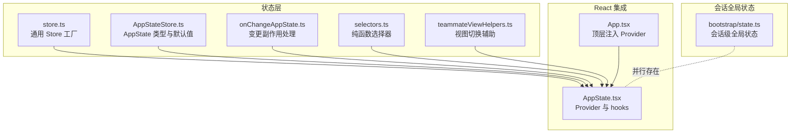
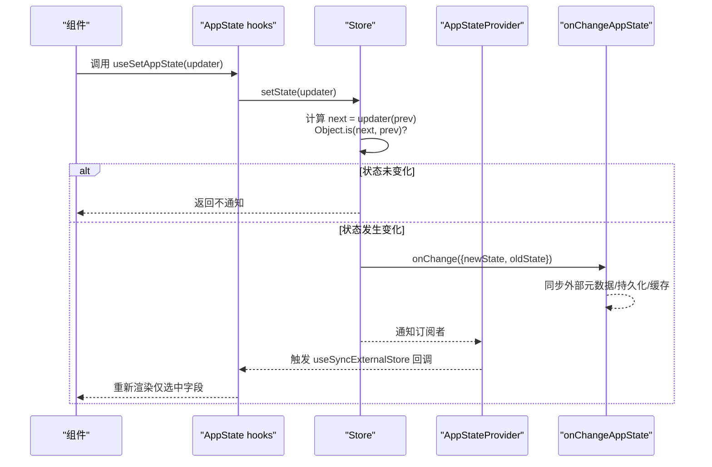
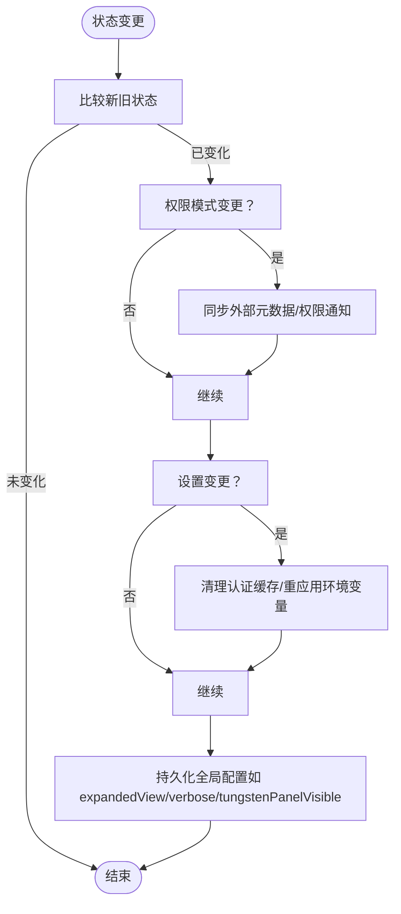
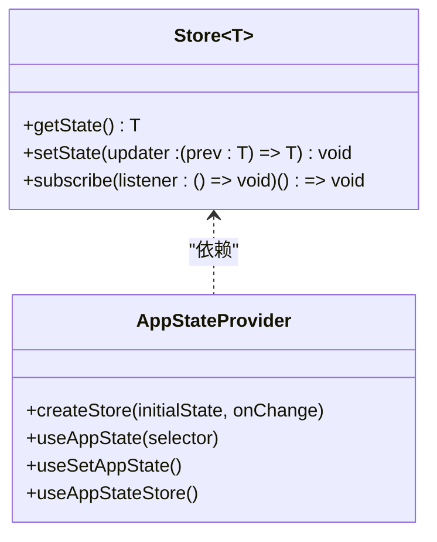
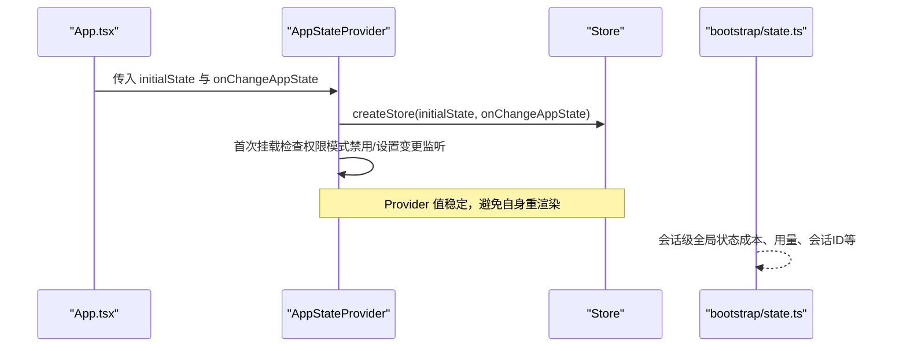
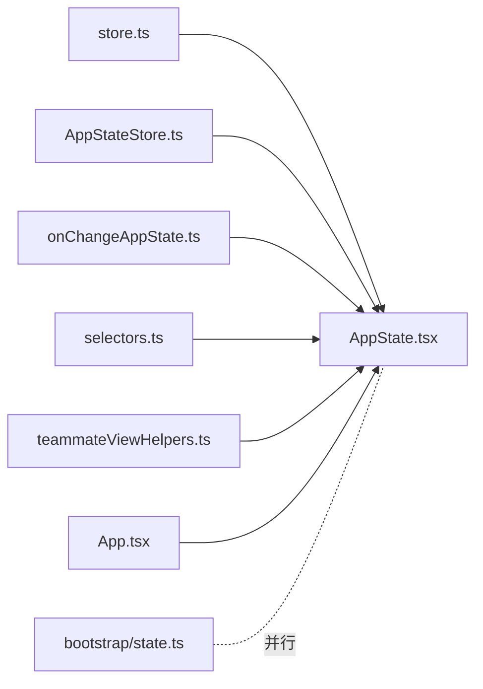

# 状态管理系统

<cite>
**本文引用的文件**
- [AppState.tsx](file://src/state/AppState.tsx)
- [AppStateStore.ts](file://src/state/AppStateStore.ts)
- [store.ts](file://src/state/store.ts)
- [selectors.ts](file://src/state/selectors.ts)
- [onChangeAppState.ts](file://src/state/onChangeAppState.ts)
- [teammateViewHelpers.ts](file://src/state/teammateViewHelpers.ts)
- [App.tsx](file://src/components/App.tsx)
- [store.test.ts](file://src/state/__tests__/store.test.ts)
- [bootstrap/state.ts](file://src/bootstrap/state.ts)
- [main.tsx](file://src/main.tsx)
</cite>

## 目录
1. [简介](#简介)
2. [项目结构](#项目结构)
3. [核心组件](#核心组件)
4. [架构总览](#架构总览)
5. [详细组件分析](#详细组件分析)
6. [依赖关系分析](#依赖关系分析)
7. [性能考量](#性能考量)
8. [故障排查指南](#故障排查指南)
9. [结论](#结论)
10. [附录](#附录)

## 简介
本文件系统性地梳理并解释状态管理系统的设计与实现，覆盖以下主题：
- AppState 的设计架构：状态结构定义、状态转换规则、持久化与外部元数据同步机制
- AppStateStore 的实现原理：状态存储策略、变更监听机制、性能优化（订阅与渲染）
- 应用启动时的状态管理：初始化流程、状态恢复与配置加载
- 状态选择器的设计模式：状态提取函数、计算属性与缓存策略
- 全局状态与局部状态的管理策略：状态隔离、状态同步与冲突解决
- 最佳实践：状态设计原则、性能考虑与调试技巧

## 项目结构
状态管理相关代码主要位于 src/state 目录，围绕“不可变状态 + 订阅式更新 + React 集成”的模式组织：
- store.ts 定义通用 Store 接口与工厂方法
- AppStateStore.ts 定义 AppState 类型与默认值
- AppState.tsx 提供 React Provider 与 hooks（useAppState/useSetAppState）
- onChangeAppState.ts 在状态变更时进行副作用处理（如持久化、外部元数据同步）
- selectors.ts 提供纯函数选择器
- teammateViewHelpers.ts 展示如何通过 setState 实现视图切换等复杂状态转换
- components/App.tsx 将 AppStateProvider 注入到应用根部
- bootstrap/state.ts 提供另一套“会话级”全局状态（与 AppState 并行存在）

图表来源
- [store.ts:1-35](file://src/state/store.ts#L1-L35)
- [AppStateStore.ts:1-570](file://src/state/AppStateStore.ts#L1-L570)
- [AppState.tsx:1-201](file://src/state/AppState.tsx#L1-L201)
- [onChangeAppState.ts:1-172](file://src/state/onChangeAppState.ts#L1-L172)
- [selectors.ts:1-77](file://src/state/selectors.ts#L1-L77)
- [teammateViewHelpers.ts:1-142](file://src/state/teammateViewHelpers.ts#L1-L142)
- [App.tsx:1-38](file://src/components/App.tsx#L1-L38)
- [bootstrap/state.ts:1-800](file://src/bootstrap/state.ts#L1-L800)

章节来源
- [store.ts:1-35](file://src/state/store.ts#L1-L35)
- [AppStateStore.ts:1-570](file://src/state/AppStateStore.ts#L1-L570)
- [AppState.tsx:1-201](file://src/state/AppState.tsx#L1-L201)
- [App.tsx:1-38](file://src/components/App.tsx#L1-L38)

## 核心组件
- Store 接口与工厂
  - 提供 getState、setState、subscribe 三件套，支持 onChange 回调与订阅者集合
  - 使用 Object.is 判断前后状态是否相等，避免无意义通知
- AppState 与 Provider
  - AppState 定义了丰富的领域状态（设置、任务、插件、通知、权限上下文、桥接状态等）
  - AppStateProvider 创建稳定 store 值，避免 Provider 自身触发重渲染
  - useAppState/useSetAppState/useAppStateStore 三个 hooks 提供订阅、更新与直接访问能力
- 变更监听与副作用
  - onChangeAppState 统一处理权限模式同步、设置持久化、全局配置同步、认证缓存清理等
- 选择器与视图辅助
  - selectors.ts 提供纯函数选择器，避免在组件中写复杂逻辑
  - teammateViewHelpers.ts 演示复杂状态转换（保留/释放任务、视图切换）的正确写法

章节来源
- [store.ts:1-35](file://src/state/store.ts#L1-L35)
- [AppStateStore.ts:89-452](file://src/state/AppStateStore.ts#L89-L452)
- [AppState.tsx:47-121](file://src/state/AppState.tsx#L47-L121)
- [onChangeAppState.ts:43-171](file://src/state/onChangeAppState.ts#L43-L171)
- [selectors.ts:1-77](file://src/state/selectors.ts#L1-L77)
- [teammateViewHelpers.ts:46-141](file://src/state/teammateViewHelpers.ts#L46-L141)

## 架构总览
AppState 采用“单向数据流 + 外部订阅”的架构：
- 初始化：App.tsx 将 AppStateProvider 注入根节点，传入初始状态与 onChange 回调
- 更新：组件通过 useSetAppState 获取 setState，以函数式更新方式提交变更
- 订阅：useAppState 通过 useSyncExternalStore 订阅 store，仅在被选中的子状态变化时重渲染
- 副作用：onChangeAppState 在每次状态变更后执行，负责外部同步（持久化、外部元数据、环境变量等）

图表来源
- [AppState.tsx:150-167](file://src/state/AppState.tsx#L150-L167)
- [store.ts:20-27](file://src/state/store.ts#L20-L27)
- [onChangeAppState.ts:43-92](file://src/state/onChangeAppState.ts#L43-L92)
- [App.tsx:25-33](file://src/components/App.tsx#L25-L33)

## 详细组件分析

### AppState 设计与持久化机制
- 状态结构
  - AppState 是一个大型领域对象，包含设置、模型、任务、插件、通知、权限上下文、桥接状态、提示建议、推测状态、遥测与诊断等
  - 部分字段为可选或按特性开关启用（如某些 MCP/桥接功能），以支持死码消除与平台差异
- 状态转换规则
  - 通过函数式 setState 提交变更，确保不可变性与可追踪性
  - onChangeAppState 在变更发生时统一处理外部同步（如权限模式对外暴露、设置持久化、全局配置同步）
- 持久化与外部元数据
  - 权限模式变更会通过 notifySessionMetadataChanged 与 notifyPermissionModeChanged 同步至外部（如 CCR/SDK）
  - 设置变更会触发认证缓存清理与环境变量重新应用
  - 全局配置（如 expandedView、verbose、tungstenPanelVisible）在变更时持久化到本地配置

图表来源
- [AppStateStore.ts:89-452](file://src/state/AppStateStore.ts#L89-L452)
- [onChangeAppState.ts:43-171](file://src/state/onChangeAppState.ts#L43-L171)

章节来源
- [AppStateStore.ts:89-452](file://src/state/AppStateStore.ts#L89-L452)
- [onChangeAppState.ts:43-171](file://src/state/onChangeAppState.ts#L43-L171)

### AppStateStore 实现原理
- 存储策略
  - 单实例 store，Provider 内部通过 useState 创建一次，保证 Provider 值稳定，避免不必要的重渲染
  - 订阅者集合使用 Set，支持多处订阅；subscribe 返回取消函数
- 变更监听机制
  - setState 在状态变化时触发 onChange 回调，并广播给所有订阅者
  - onChange 回调由 App.tsx 注入，用于处理副作用
- 性能优化
  - useAppState 使用 useSyncExternalStore，仅在被选择字段变化时重渲染
  - 严格禁止选择器返回原状态对象（Ant 环境下会抛错），防止误判导致的无效重渲染
  - 对于需要稳定引用的场景（仅更新不订阅），使用 useSetAppState 返回稳定函数引用

图表来源
- [store.ts:4-8](file://src/state/store.ts#L4-L8)
- [AppState.tsx:70-121](file://src/state/AppState.tsx#L70-L121)

章节来源
- [store.ts:1-35](file://src/state/store.ts#L1-L35)
- [AppState.tsx:70-121](file://src/state/AppState.tsx#L70-L121)

### 应用启动状态管理
- 初始化流程
  - App.tsx 将 AppStateProvider 注入根节点，传入 initialState 与 onChange 回调
  - Provider 内部创建 store，挂载上下文，同时处理首次挂载时的权限模式禁用检查与设置变更监听
- 状态恢复与配置加载
  - 默认状态由 getDefaultAppState 生成，包含设置、任务、插件、通知、权限上下文、桥接状态等
  - onChangeAppState 在设置变更时清理认证缓存并重新应用环境变量
- 与会话全局状态的关系
  - bootstrap/state.ts 提供另一套“会话级”全局状态（如成本、令牌用量、会话标识等），与 AppState 并行存在，职责互补

图表来源
- [App.tsx:25-33](file://src/components/App.tsx#L25-L33)
- [AppState.tsx:57-121](file://src/state/AppState.tsx#L57-L121)
- [bootstrap/state.ts:260-426](file://src/bootstrap/state.ts#L260-L426)

章节来源
- [App.tsx:1-38](file://src/components/App.tsx#L1-L38)
- [AppState.tsx:57-121](file://src/state/AppState.tsx#L57-L121)
- [bootstrap/state.ts:260-426](file://src/bootstrap/state.ts#L260-L426)

### 状态选择器的设计模式
- 设计原则
  - 保持纯函数与无副作用，仅做数据提取与简单组合
  - 不返回新对象（避免 Object.is 总是不同），而是返回现有引用或基础类型
- 典型用法
  - 通过 useAppState(s => s.field) 订阅单一字段
  - 对多个独立字段分别调用多次，避免合并对象导致的重渲染
- 缓存策略
  - 由于选择器是纯函数且输入为当前状态快照，通常无需额外缓存
  - 若存在昂贵计算，可在选择器内部结合 useMemo 或将结果提升到 AppState 中

章节来源
- [AppState.tsx:134-167](file://src/state/AppState.tsx#L134-L167)
- [selectors.ts:1-77](file://src/state/selectors.ts#L1-L77)

### 全局状态与局部状态的管理策略
- 状态隔离
  - AppState 作为全局状态树，通过选择器隔离到局部组件
  - 会话全局状态（bootstrap/state.ts）与 AppState 并行存在，职责边界清晰
- 状态同步
  - onChangeAppState 统一处理跨模块同步（权限模式、设置、配置）
  - teammateViewHelpers.ts 展示如何在复杂交互中安全地更新任务状态与视图状态
- 冲突解决
  - 通过函数式 setState 与 Object.is 判等，避免竞态与重复通知
  - 对于并发更新，建议在上层协调（如事件驱动）或在选择器中进行幂等处理

章节来源
- [onChangeAppState.ts:43-171](file://src/state/onChangeAppState.ts#L43-L171)
- [teammateViewHelpers.ts:46-141](file://src/state/teammateViewHelpers.ts#L46-L141)
- [bootstrap/state.ts:1-800](file://src/bootstrap/state.ts#L1-L800)

## 依赖关系分析
- 组件耦合
  - AppState.tsx 依赖 store.ts、AppStateStore.ts、onChangeAppState.ts
  - App.tsx 依赖 AppState.tsx 与 onChangeAppState.ts
  - selectors.ts 依赖 AppStateStore.ts 与任务类型
  - teammateViewHelpers.ts 依赖 AppStateStore.ts 与任务类型
- 外部依赖
  - React hooks（useState、useContext、useSyncExternalStore、useEffectEvent）
  - 与 bootstrap/state.ts 的并行关系，共同支撑会话生命周期

图表来源
- [AppState.tsx:1-201](file://src/state/AppState.tsx#L1-L201)
- [AppStateStore.ts:1-570](file://src/state/AppStateStore.ts#L1-L570)
- [store.ts:1-35](file://src/state/store.ts#L1-L35)
- [onChangeAppState.ts:1-172](file://src/state/onChangeAppState.ts#L1-L172)
- [selectors.ts:1-77](file://src/state/selectors.ts#L1-L77)
- [teammateViewHelpers.ts:1-142](file://src/state/teammateViewHelpers.ts#L1-L142)
- [App.tsx:1-38](file://src/components/App.tsx#L1-L38)
- [bootstrap/state.ts:1-800](file://src/bootstrap/state.ts#L1-L800)

章节来源
- [AppState.tsx:1-201](file://src/state/AppState.tsx#L1-L201)
- [App.tsx:1-38](file://src/components/App.tsx#L1-L38)

## 性能考量
- 渲染优化
  - 使用 useSyncExternalStore 与 Object.is 判等，仅在被选字段变化时重渲染
  - 严禁在选择器中返回新对象，避免无效重渲染
- 订阅粒度
  - 将大对象拆分为多个独立选择器调用，降低订阅范围
- 副作用最小化
  - onChangeAppState 仅在必要时触发（如权限模式、设置、配置变更）
  - 清理认证缓存与重应用环境变量仅在 settings 变更时进行
- 测试验证
  - 单元测试覆盖 Store 的核心行为：不变量、订阅、通知、回调

章节来源
- [AppState.tsx:134-167](file://src/state/AppState.tsx#L134-L167)
- [store.test.ts:1-113](file://src/state/__tests__/store.test.ts#L1-L113)
- [onChangeAppState.ts:154-170](file://src/state/onChangeAppState.ts#L154-L170)

## 故障排查指南
- 常见问题
  - 在 Ant 环境下，选择器返回原状态对象会抛错：请确保选择器返回现有引用或基础类型
  - 重复订阅同一字段导致过度重渲染：拆分为多个独立选择器调用
  - 权限模式不同步：确认 onChangeAppState 是否被调用，以及外部渠道（如 CCR/SDK）是否正确接收
- 调试技巧
  - 在 onChangeAppState 中添加日志，观察权限模式与设置变更路径
  - 使用 useSetAppState 返回的稳定引用，避免因函数引用变化导致的重渲染
  - 对于复杂状态转换，参考 teammateViewHelpers.ts 的模式，使用函数式 setState 与浅拷贝策略

章节来源
- [AppState.tsx:153-161](file://src/state/AppState.tsx#L153-L161)
- [onChangeAppState.ts:43-92](file://src/state/onChangeAppState.ts#L43-L92)
- [teammateViewHelpers.ts:46-81](file://src/state/teammateViewHelpers.ts#L46-L81)

## 结论
该状态管理系统以 Store 工厂为核心，配合 React hooks 与统一的变更监听机制，实现了高内聚、低耦合、可追踪的状态管理。通过严格的不可变更新、精确的订阅粒度与完善的副作用处理，系统在复杂交互场景（如权限模式切换、任务视图切换、桥接状态同步）中仍能保持良好的性能与可维护性。

## 附录
- 最佳实践清单
  - 使用函数式 setState 提交变更，确保不可变性
  - 选择器只返回现有引用或基础类型，避免返回新对象
  - 将复杂状态转换封装为纯函数（如 teammateViewHelpers.ts），并在组件中以 useSetAppState 调用
  - 在 onChangeAppState 中集中处理外部同步与持久化，保持变更路径单一
  - 对于昂贵计算，考虑在 AppState 中缓存结果或在选择器中进行幂等处理