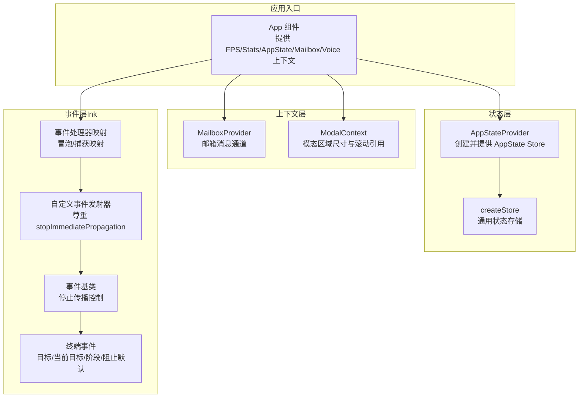
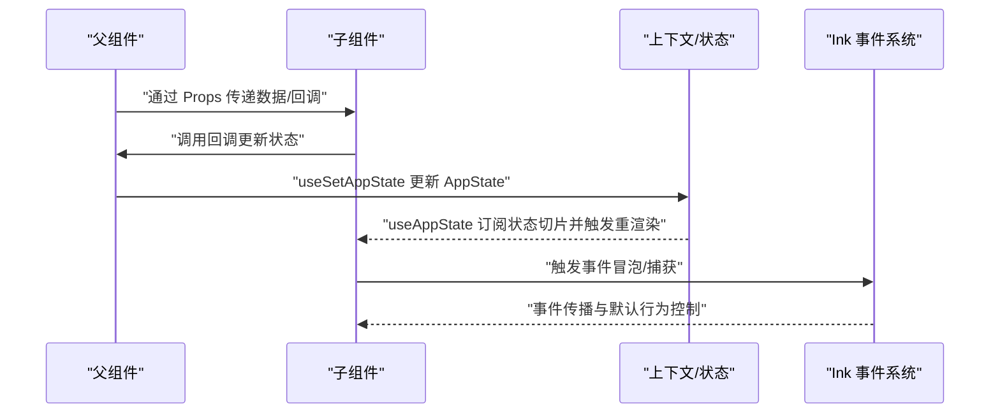
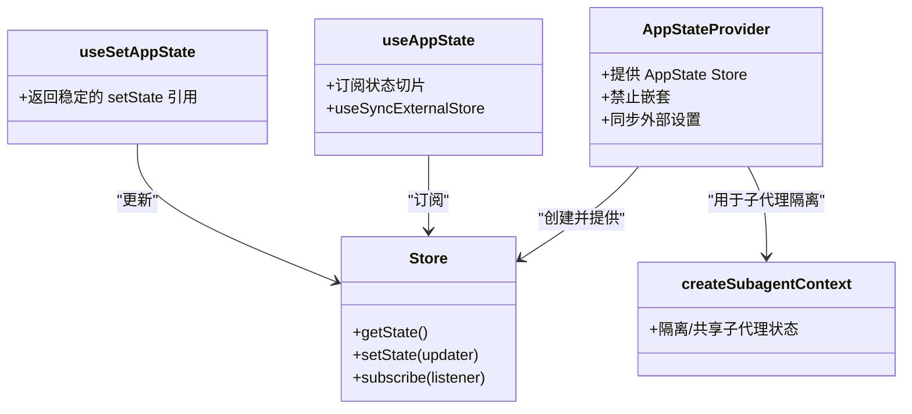
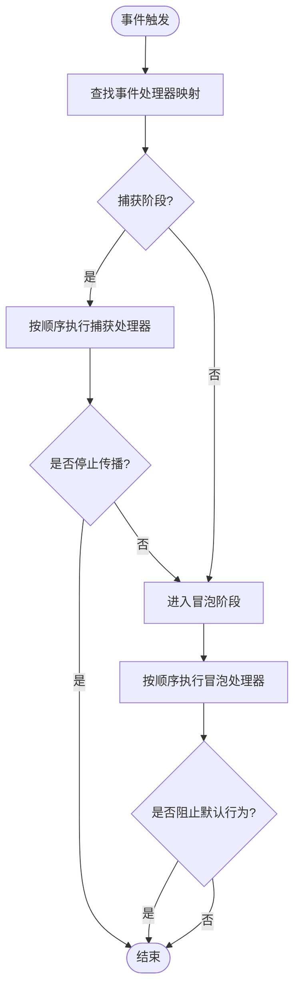
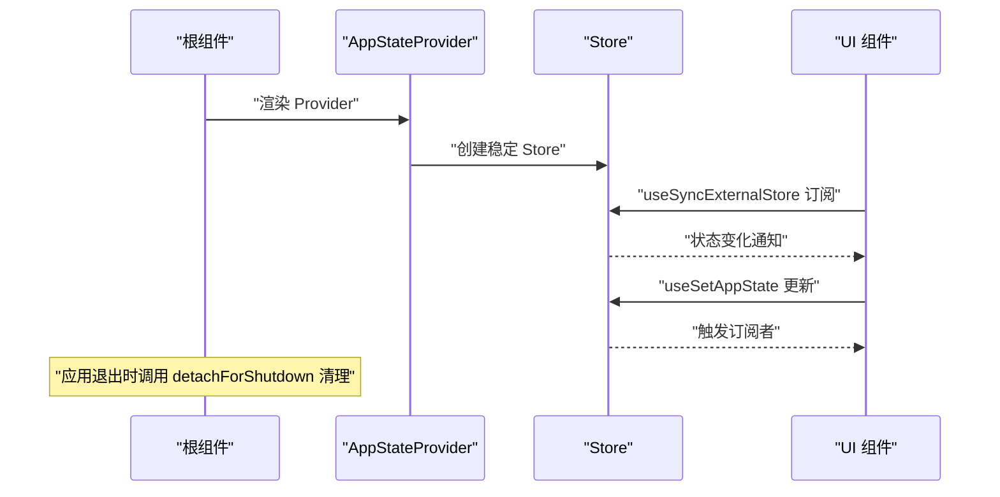
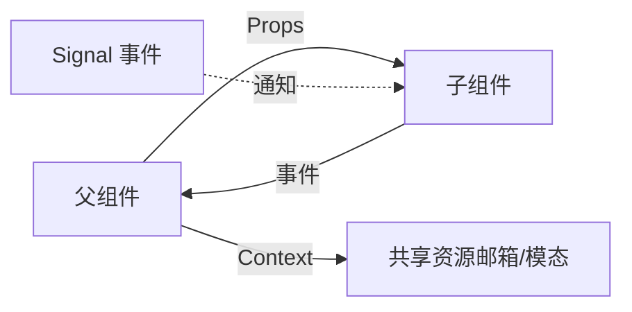
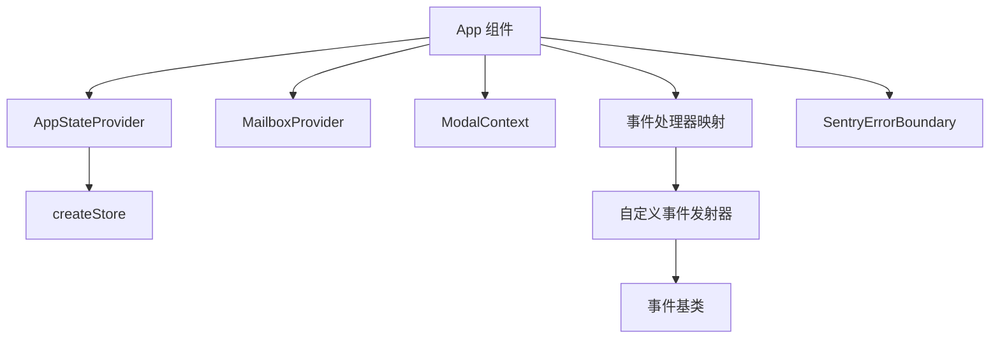

# 组件交互模式

<cite>
**本文引用的文件**
- [src/components/App.tsx](file://src/components/App.tsx)
- [src/state/AppState.tsx](file://src/state/AppState.tsx)
- [src/state/store.ts](file://src/state/store.ts)
- [src/context/mailbox.tsx](file://src/context/mailbox.tsx)
- [src/context/modalContext.tsx](file://src/context/modalContext.tsx)
- [packages/@ant/ink/src/core/events/event-handlers.ts](file://packages/@ant/ink/src/core/events/event-handlers.ts)
- [packages/@ant/ink/src/core/events/emitter.ts](file://packages/@ant/ink/src/core/events/emitter.ts)
- [packages/@ant/ink/src/core/events/event.ts](file://packages/@ant/ink/src/core/events/event.ts)
- [packages/@ant/ink/src/core/events/terminal-event.ts](file://packages/@ant/ink/src/core/events/terminal-event.ts)
- [packages/@ant/ink/src/core/focus.ts](file://packages/@ant/ink/src/core/focus.ts)
- [packages/@ant/ink/src/hooks/use-app.ts](file://packages/@ant/ink/src/hooks/use-app.ts)
- [packages/@ant/ink/src/components/AppContext.ts](file://packages/@ant/ink/src/components/AppContext.ts)
- [src/utils/signal.ts](file://src/utils/signal.ts)
- [src/hooks/useTimeout.ts](file://src/hooks/useTimeout.ts)
- [src/components/SentryErrorBoundary.ts](file://src/components/SentryErrorBoundary.ts)
- [src/utils/forkedAgent.ts](file://src/utils/forkedAgent.ts)
</cite>

## 目录
1. [简介](#简介)
2. [项目结构](#项目结构)
3. [核心组件](#核心组件)
4. [架构总览](#架构总览)
5. [详细组件分析](#详细组件分析)
6. [依赖分析](#依赖分析)
7. [性能考虑](#性能考虑)
8. [故障排查指南](#故障排查指南)
9. [结论](#结论)
10. [附录](#附录)

## 简介
本文件围绕“组件交互模式”这一主题，系统梳理代码库中的组件通信机制与状态管理模式，涵盖以下要点：
- 组件间通信：父子、兄弟、跨层级通信路径与实现方式
- 状态设计：状态提升与状态下沉的原则、共享与隔离策略
- 事件系统：事件传播（冒泡/捕获）、自定义事件与终端事件模型
- 生命周期：挂载、更新、卸载的处理流程与边界场景
- 数据传递：Props、Context、事件驱动三种模式的使用场景与最佳实践
- 性能与稳定性：性能优化、内存管理、错误处理策略

## 项目结构
该代码库采用分层与功能域结合的组织方式：
- 核心应用入口通过顶层组件提供上下文与状态容器
- 应用状态通过独立的状态存储模块统一管理，并以 React Context 暴露给子树
- 事件系统在 Ink 终端渲染框架中实现，支持事件冒泡、捕获与自定义事件
- 上下文（Context）用于在组件树中传递共享资源（如邮箱、模态尺寸等）

**图表来源**
- [src/components/App.tsx:19-37](file://src/components/App.tsx#L19-L37)
- [src/state/AppState.tsx:57-121](file://src/state/AppState.tsx#L57-L121)
- [src/state/store.ts:10-34](file://src/state/store.ts#L10-L34)
- [src/context/mailbox.tsx:10-17](file://src/context/mailbox.tsx#L10-L17)
- [src/context/modalContext.tsx:21-48](file://src/context/modalContext.tsx#L21-L48)
- [packages/@ant/ink/src/core/events/event-handlers.ts:44-54](file://packages/@ant/ink/src/core/events/event-handlers.ts#L44-L54)
- [packages/@ant/ink/src/core/events/emitter.ts:6-39](file://packages/@ant/ink/src/core/events/emitter.ts#L6-L39)
- [packages/@ant/ink/src/core/events/event.ts:1-11](file://packages/@ant/ink/src/core/events/event.ts#L1-L11)
- [packages/@ant/ink/src/core/events/terminal-event.ts:51-102](file://packages/@ant/ink/src/core/events/terminal-event.ts#L51-L102)

**章节来源**
- [src/components/App.tsx:19-37](file://src/components/App.tsx#L19-L37)
- [src/state/AppState.tsx:57-121](file://src/state/AppState.tsx#L57-L121)
- [src/context/mailbox.tsx:10-17](file://src/context/mailbox.tsx#L10-L17)
- [src/context/modalContext.tsx:21-48](file://src/context/modalContext.tsx#L21-L48)

## 核心组件
- 应用入口与上下文提供者
  - App 组件作为顶层容器，注入 FPS 指标、统计信息、应用状态与邮箱上下文
  - AppStateProvider 创建并提供全局状态 Store，确保 Provider 值稳定，避免不必要重渲染
- 状态存储与订阅
  - createStore 提供 getState、setState、subscribe 三件套；通过 Object.is 判断变更，仅在值变化时通知订阅者
  - useAppState 使用 useSyncExternalStore 订阅状态切片，遵循“选择器返回现有对象引用”的约定以避免误触发重渲染
- 上下文共享
  - MailboxProvider 提供邮箱通道，便于组件间解耦的消息传递
  - ModalContext 提供模态区域的尺寸与滚动引用，帮助子组件适配布局约束

**章节来源**
- [src/components/App.tsx:19-37](file://src/components/App.tsx#L19-L37)
- [src/state/AppState.tsx:57-121](file://src/state/AppState.tsx#L57-L121)
- [src/state/store.ts:10-34](file://src/state/store.ts#L10-L34)
- [src/context/mailbox.tsx:10-17](file://src/context/mailbox.tsx#L10-L17)
- [src/context/modalContext.tsx:21-48](file://src/context/modalContext.tsx#L21-L48)

## 架构总览
组件交互的总体路径如下：
- 父子通信：父组件通过 Props 向子组件传递数据与回调；子组件通过回调向上游更新状态或触发动作
- 兄弟通信：通过共同父组件提升状态，或通过 Context 分发共享数据
- 跨层级通信：通过 Context 或事件系统实现，避免层层传参
- 状态管理：AppStateProvider + createStore 统一管理应用状态；useAppState 选择性订阅，useSetAppState 更新状态
- 事件系统：Ink 的事件处理器映射支持冒泡/捕获；自定义事件发射器尊重 stopImmediatePropagation；终端事件模型提供目标与阶段控制

**图表来源**
- [src/state/AppState.tsx:150-167](file://src/state/AppState.tsx#L150-L167)
- [src/state/store.ts:10-34](file://src/state/store.ts#L10-L34)
- [packages/@ant/ink/src/core/events/event-handlers.ts:44-54](file://packages/@ant/ink/src/core/events/event-handlers.ts#L44-L54)
- [packages/@ant/ink/src/core/events/emitter.ts:15-38](file://packages/@ant/ink/src/core/events/emitter.ts#L15-L38)

## 详细组件分析

### 状态管理与订阅（AppStateProvider + createStore）
- 设计原则
  - 状态提升：将共享状态置于 AppStateProvider 内部，避免分散在多处
  - 状态下沉：通过 useAppState 选择性订阅，仅当所选字段变化时触发重渲染
  - 隔离策略：子代理（subagent）可按需隔离或共享状态，防止相互干扰
- 关键点
  - Provider 值稳定：store 实例在初始化后不变，降低重渲染风险
  - 变更检测：使用 Object.is 对比新旧值，未变化则不通知订阅者
  - 外部设置同步：监听外部设置变更并通过 applySettingsChange 同步到 AppState

**图表来源**
- [src/state/AppState.tsx:57-121](file://src/state/AppState.tsx#L57-L121)
- [src/state/store.ts:10-34](file://src/state/store.ts#L10-L34)
- [src/utils/forkedAgent.ts:345-374](file://src/utils/forkedAgent.ts#L345-L374)

**章节来源**
- [src/state/AppState.tsx:57-121](file://src/state/AppState.tsx#L57-L121)
- [src/state/store.ts:10-34](file://src/state/store.ts#L10-L34)
- [src/utils/forkedAgent.ts:345-374](file://src/utils/forkedAgent.ts#L345-L374)

### 事件传播与事件处理（Ink 事件系统）
- 事件模型
  - 事件处理器映射：根据事件类型快速定位冒泡/捕获处理器属性名
  - 自定义事件发射器：在 emit 时尊重 stopImmediatePropagation，确保事件链路可控
  - 终端事件：提供 target/currentTarget/eventPhase/defaultPrevented 等标准属性，支持阻止默认行为与传播
- 行为特性
  - 冒泡/捕获：通过 HANDLER_FOR_EVENT 映射区分 bubble/capture
  - 停止传播：Event.stopImmediatePropagation 控制后续监听器执行
  - 默认行为：preventDefault 仅对可取消事件生效

**图表来源**
- [packages/@ant/ink/src/core/events/event-handlers.ts:44-54](file://packages/@ant/ink/src/core/events/event-handlers.ts#L44-L54)
- [packages/@ant/ink/src/core/events/emitter.ts:15-38](file://packages/@ant/ink/src/core/events/emitter.ts#L15-L38)
- [packages/@ant/ink/src/core/events/terminal-event.ts:51-102](file://packages/@ant/ink/src/core/events/terminal-event.ts#L51-L102)

**章节来源**
- [packages/@ant/ink/src/core/events/event-handlers.ts:44-54](file://packages/@ant/ink/src/core/events/event-handlers.ts#L44-L54)
- [packages/@ant/ink/src/core/events/emitter.ts:15-38](file://packages/@ant/ink/src/core/events/emitter.ts#L15-L38)
- [packages/@ant/ink/src/core/events/event.ts:1-11](file://packages/@ant/ink/src/core/events/event.ts#L1-L11)
- [packages/@ant/ink/src/core/events/terminal-event.ts:51-102](file://packages/@ant/ink/src/core/events/terminal-event.ts#L51-L102)

### 组件生命周期管理（挂载、更新、卸载）
- 挂载
  - AppStateProvider 在首次渲染时创建稳定 Store，并注入上下文
  - 外部设置变更监听在挂载后启动，确保远程设置加载完成后同步到本地状态
- 更新
  - useAppState 基于 useSyncExternalStore 订阅，仅在选择的字段变化时触发重渲染
  - createStore 通过 Object.is 判断新旧值，避免不必要的通知
- 卸载
  - Ink 应用提供 detachForShutdown 以在退出前清理终端模式与输入模式，避免重复写入主屏幕
  - SentryErrorBoundary 捕获子树错误，上报并静默降级

**图表来源**
- [src/state/AppState.tsx:57-121](file://src/state/AppState.tsx#L57-L121)
- [src/state/store.ts:10-34](file://src/state/store.ts#L10-L34)
- [packages/@ant/ink/src/core/ink.tsx:1114-1132](file://packages/@ant/ink/src/core/ink.tsx#L1114-L1132)
- [src/components/SentryErrorBoundary.ts:14-38](file://src/components/SentryErrorBoundary.ts#L14-L38)

**章节来源**
- [src/state/AppState.tsx:57-121](file://src/state/AppState.tsx#L57-L121)
- [src/state/store.ts:10-34](file://src/state/store.ts#L10-L34)
- [packages/@ant/ink/src/core/ink.tsx:1114-1132](file://packages/@ant/ink/src/core/ink.tsx#L1114-L1132)
- [src/components/SentryErrorBoundary.ts:14-38](file://src/components/SentryErrorBoundary.ts#L14-L38)

### 组件间数据传递模式
- Props 传递
  - 父子组件通过 Props 单向传递数据与回调，子组件通过回调向上游更新状态
- Context 共享
  - MailboxProvider 提供邮箱通道，组件通过 useMailbox 获取并进行解耦通信
  - ModalContext 提供模态区域的尺寸与滚动引用，帮助子组件适配布局
- 事件驱动
  - Ink 事件系统支持事件冒泡/捕获；自定义事件发射器尊重 stopImmediatePropagation
  - 信号（Signal）用于无状态事件通知，避免引入快照与额外复杂度

**图表来源**
- [src/context/mailbox.tsx:10-17](file://src/context/mailbox.tsx#L10-L17)
- [src/context/modalContext.tsx:21-48](file://src/context/modalContext.tsx#L21-L48)
- [packages/@ant/ink/src/core/events/event-handlers.ts:44-54](file://packages/@ant/ink/src/core/events/event-handlers.ts#L44-L54)
- [src/utils/signal.ts:27-43](file://src/utils/signal.ts#L27-L43)

**章节来源**
- [src/context/mailbox.tsx:10-17](file://src/context/mailbox.tsx#L10-L17)
- [src/context/modalContext.tsx:21-48](file://src/context/modalContext.tsx#L21-L48)
- [src/utils/signal.ts:27-43](file://src/utils/signal.ts#L27-L43)

### 状态提升与状态下沉的设计原则
- 状态提升
  - 将兄弟组件或跨层级共享的状态提升至最近公共祖先，通过 Props 下沉给子组件
  - 适用于需要在多个组件之间保持一致性的场景
- 状态下沉
  - 使用 AppStateProvider + useAppState 选择性订阅，避免全量重渲染
  - 子代理隔离：通过 createSubagentContext 隔离或共享状态，防止相互影响
- 最佳实践
  - 选择器返回现有对象引用，避免 Object.is 总是判定为“已改变”
  - 外部设置变更通过 applySettingsChange 同步，减少竞态

**章节来源**
- [src/state/AppState.tsx:134-167](file://src/state/AppState.tsx#L134-L167)
- [src/utils/forkedAgent.ts:345-374](file://src/utils/forkedAgent.ts#L345-L374)

### 事件传播与事件处理机制
- 事件冒泡与捕获
  - HANDLER_FOR_EVENT 将事件类型映射到冒泡/捕获处理器属性名
  - EventEmitter 在 emit 时遍历监听器，遇到 stopImmediatePropagation 即终止
- 自定义事件系统
  - Event.stopImmediatePropagation 控制后续监听器执行
  - TerminalEvent 提供 target/currentTarget/eventPhase/defaultPrevented 等能力
- 终端焦点管理
  - focus 模块在节点移除时自动恢复焦点，保证交互连续性

**章节来源**
- [packages/@ant/ink/src/core/events/event-handlers.ts:44-54](file://packages/@ant/ink/src/core/events/event-handlers.ts#L44-L54)
- [packages/@ant/ink/src/core/events/emitter.ts:15-38](file://packages/@ant/ink/src/core/events/emitter.ts#L15-L38)
- [packages/@ant/ink/src/core/events/event.ts:1-11](file://packages/@ant/ink/src/core/events/event.ts#L1-L11)
- [packages/@ant/ink/src/core/events/terminal-event.ts:51-102](file://packages/@ant/ink/src/core/events/terminal-event.ts#L51-L102)
- [packages/@ant/ink/src/core/focus.ts:44-86](file://packages/@ant/ink/src/core/focus.ts#L44-L86)

## 依赖分析
- 组件耦合与内聚
  - App 作为顶层容器，内聚了上下文与状态提供逻辑，降低子组件对全局状态的直接依赖
  - AppStateProvider 与 createStore 解耦，便于替换与测试
- 直接与间接依赖
  - 组件通过 useAppState/useSetAppState 间接依赖 Store
  - 事件系统通过事件处理器映射与自定义发射器间接依赖 Event 基类
- 外部依赖与集成点
  - Ink 事件系统与终端交互紧密，提供事件传播与默认行为控制
  - SentryErrorBoundary 作为错误边界，集成错误上报

**图表来源**
- [src/components/App.tsx:19-37](file://src/components/App.tsx#L19-L37)
- [src/state/AppState.tsx:57-121](file://src/state/AppState.tsx#L57-L121)
- [src/state/store.ts:10-34](file://src/state/store.ts#L10-L34)
- [src/context/mailbox.tsx:10-17](file://src/context/mailbox.tsx#L10-L17)
- [src/context/modalContext.tsx:21-48](file://src/context/modalContext.tsx#L21-L48)
- [packages/@ant/ink/src/core/events/event-handlers.ts:44-54](file://packages/@ant/ink/src/core/events/event-handlers.ts#L44-L54)
- [packages/@ant/ink/src/core/events/emitter.ts:6-39](file://packages/@ant/ink/src/core/events/emitter.ts#L6-L39)
- [src/components/SentryErrorBoundary.ts:14-38](file://src/components/SentryErrorBoundary.ts#L14-L38)

**章节来源**
- [src/components/App.tsx:19-37](file://src/components/App.tsx#L19-L37)
- [src/state/AppState.tsx:57-121](file://src/state/AppState.tsx#L57-L121)
- [src/state/store.ts:10-34](file://src/state/store.ts#L10-L34)
- [src/context/mailbox.tsx:10-17](file://src/context/mailbox.tsx#L10-L17)
- [src/context/modalContext.tsx:21-48](file://src/context/modalContext.tsx#L21-L48)
- [packages/@ant/ink/src/core/events/event-handlers.ts:44-54](file://packages/@ant/ink/src/core/events/event-handlers.ts#L44-L54)
- [packages/@ant/ink/src/core/events/emitter.ts:6-39](file://packages/@ant/ink/src/core/events/emitter.ts#L6-L39)
- [src/components/SentryErrorBoundary.ts:14-38](file://src/components/SentryErrorBoundary.ts#L14-L38)

## 性能考虑
- 状态订阅优化
  - 使用 useSyncExternalStore 与 Object.is 比较，仅在选择的字段变化时触发重渲染
  - 避免在选择器中返回新对象，确保引用稳定
- 事件系统优化
  - EventEmitter 在 emit 时尊重 stopImmediatePropagation，减少无效监听器调用
  - 事件处理器映射采用常量时间查找，降低调度开销
- 生命周期优化
  - Ink 应用在退出前清理终端模式与输入模式，避免重复写入导致的闪烁与性能损耗
- 计时与节流
  - 使用 useTimeout 等钩子进行延迟与重置控制，避免频繁重渲染

**章节来源**
- [src/state/AppState.tsx:150-167](file://src/state/AppState.tsx#L150-L167)
- [src/state/store.ts:10-34](file://src/state/store.ts#L10-L34)
- [packages/@ant/ink/src/core/events/emitter.ts:15-38](file://packages/@ant/ink/src/core/events/emitter.ts#L15-L38)
- [packages/@ant/ink/src/core/ink.tsx:1114-1132](file://packages/@ant/ink/src/core/ink.tsx#L1114-L1132)
- [src/hooks/useTimeout.ts:1-14](file://src/hooks/useTimeout.ts#L1-L14)

## 故障排查指南
- 错误边界
  - SentryErrorBoundary 捕获子树错误并上报，同时在捕获后静默降级，避免整树崩溃
- 状态异常
  - useAppState 选择器若返回原始状态对象会抛错，提示应返回现有子对象引用以避免误触发重渲染
- 事件问题
  - 若事件未按预期传播，检查事件处理器映射与 stopImmediatePropagation 的使用
  - 对可取消事件，确认 preventDefault 的调用时机与条件
- 生命周期问题
  - 应用退出时若出现终端模式异常，确认是否调用了 detachForShutdown 进行清理

**章节来源**
- [src/components/SentryErrorBoundary.ts:14-38](file://src/components/SentryErrorBoundary.ts#L14-L38)
- [src/state/AppState.tsx:157-161](file://src/state/AppState.tsx#L157-L161)
- [packages/@ant/ink/src/core/events/emitter.ts:15-38](file://packages/@ant/ink/src/core/events/emitter.ts#L15-L38)
- [packages/@ant/ink/src/core/ink.tsx:1114-1132](file://packages/@ant/ink/src/core/ink.tsx#L1114-L1132)

## 结论
本代码库在组件交互方面形成了清晰的分层与职责划分：
- 通过 AppStateProvider + createStore 实现集中式状态管理与高效订阅
- 通过 Context 与事件系统支撑跨层级通信，避免 Prop 钻取
- 事件系统在 Ink 中实现了可控的冒泡/捕获与默认行为控制
- 生命周期管理在应用退出时提供了安全清理路径
建议在实际开发中遵循“状态提升/下沉”原则，合理使用 Context 与事件，配合错误边界与性能优化钩子，构建高可用、高性能的组件交互体系。

## 附录
- 最佳实践清单
  - 状态提升：在兄弟组件或跨层级共享状态时提升至公共祖先
  - 状态下沉：使用 useAppState 选择性订阅，确保选择器返回现有对象引用
  - Context 使用：仅在必要时使用 Context，避免过度共享导致耦合
  - 事件控制：在事件处理中正确使用 stopImmediatePropagation 与 preventDefault
  - 生命周期：在应用退出时调用清理方法，避免终端状态异常
  - 错误处理：为关键组件添加错误边界，确保错误被记录且不影响其他部分