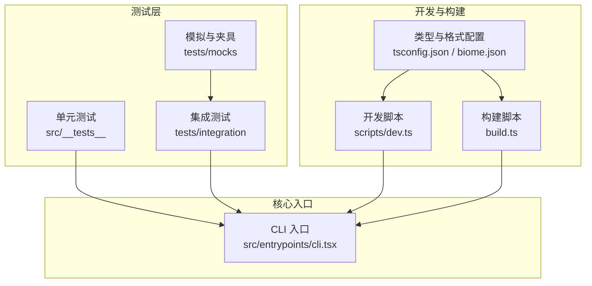
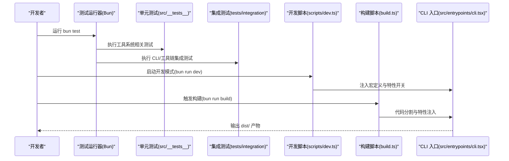
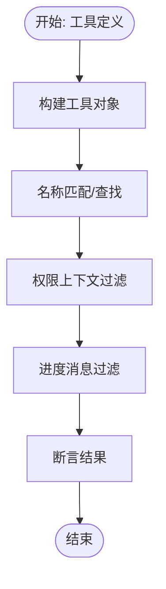
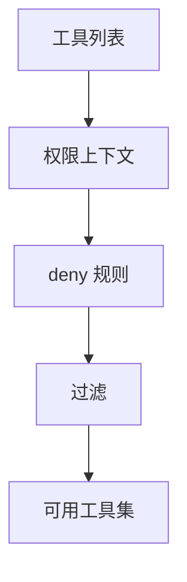
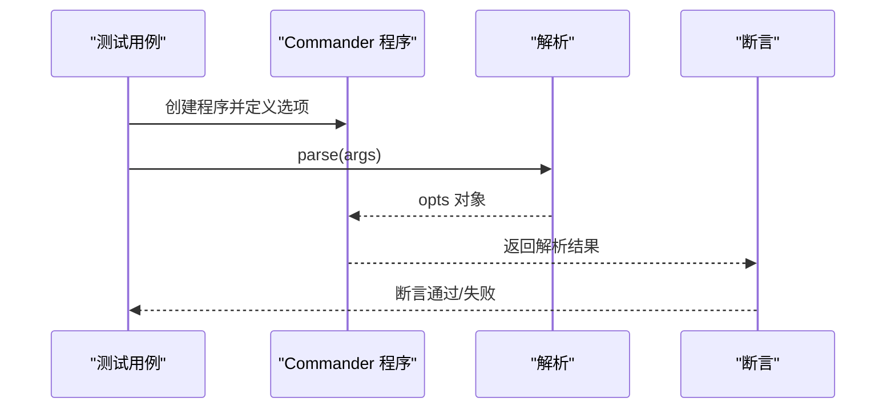
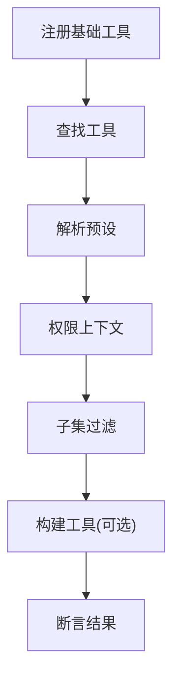
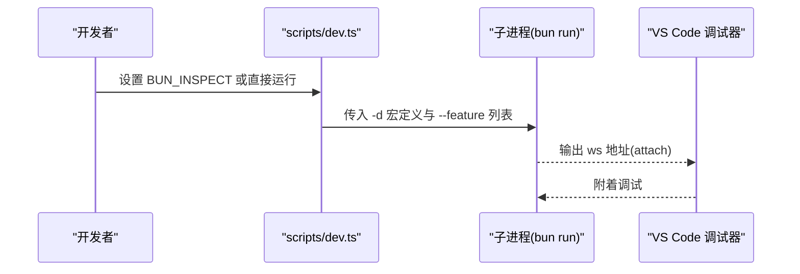
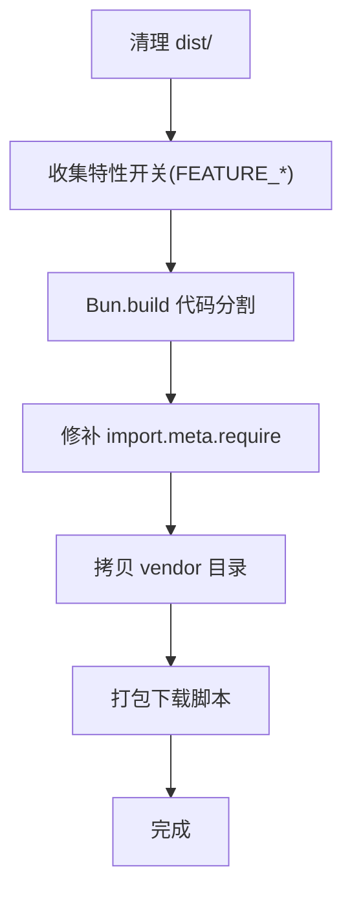
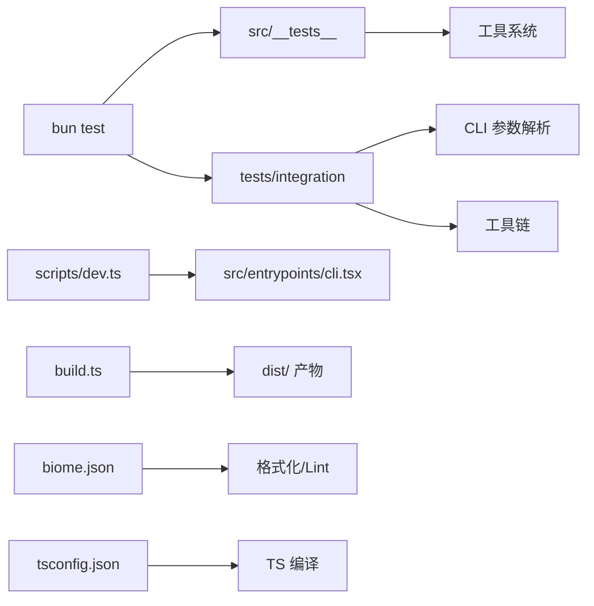

# 测试与开发指南

<cite>
**本文引用的文件**
- [README.md](file://README.md)
- [package.json](file://package.json)
- [biome.json](file://biome.json)
- [tsconfig.json](file://tsconfig.json)
- [build.ts](file://build.ts)
- [scripts/dev.ts](file://scripts/dev.ts)
- [scripts/dev-debug.ts](file://scripts/dev-debug.ts)
- [src/__tests__/Tool.test.ts](file://src/__tests__/Tool.test.ts)
- [src/__tests__/tools.test.ts](file://src/__tests__/tools.test.ts)
- [tests/integration/cli-arguments.test.ts](file://tests/integration/cli-arguments.test.ts)
- [tests/integration/tool-chain.test.ts](file://tests/integration/tool-chain.test.ts)
</cite>

## 目录
1. [简介](#简介)
2. [项目结构](#项目结构)
3. [核心组件](#核心组件)
4. [架构总览](#架构总览)
5. [详细组件分析](#详细组件分析)
6. [依赖分析](#依赖分析)
7. [性能考虑](#性能考虑)
8. [故障排查指南](#故障排查指南)
9. [结论](#结论)
10. [附录](#附录)

## 简介
本指南面向希望参与 Claude Code Best（CCB）项目的开发者，系统阐述测试与开发流程：覆盖单元测试、集成测试与端到端测试的设计理念与实施策略；提供测试环境搭建步骤（依赖安装、配置设置、测试数据准备）；总结开发流程与最佳实践（代码规范、提交规范、审查流程）；给出调试技巧与工具使用（VS Code 调试配置、日志分析、性能分析）；并介绍开发环境配置与优化（热重载、代码分割、构建优化）。最后提供贡献指南与社区参与方式。

## 项目结构
- 测试组织
  - 单元测试：位于 src/__tests__ 及各子模块的 __tests__ 目录，使用 Bun 内置测试运行器。
  - 集成测试：位于 tests/integration，覆盖 CLI 参数解析、工具链注册与权限过滤等场景。
  - 模拟与夹具：tests/mocks 提供 API 响应与文件系统模拟。
- 开发与构建
  - 开发脚本：scripts/dev.ts 注入宏定义与特性开关，支持 attach 调试。
  - 构建脚本：build.ts 使用 Bun.build 实现代码分割与特性注入。
  - 类型与格式：tsconfig.json、biome.json 分别约束 TS 编译与代码风格。
- 核心入口
  - CLI 入口：src/entrypoints/cli.tsx，作为构建与运行的统一入口。

**图表来源**
- [scripts/dev.ts:1-60](file://scripts/dev.ts#L1-L60)
- [build.ts:1-100](file://build.ts#L1-L100)
- [tsconfig.json:1-21](file://tsconfig.json#L1-L21)
- [biome.json:1-115](file://biome.json#L1-L115)
- [src/__tests__/Tool.test.ts:1-208](file://src/__tests__/Tool.test.ts#L1-L208)
- [tests/integration/tool-chain.test.ts:1-142](file://tests/integration/tool-chain.test.ts#L1-L142)

**章节来源**
- [README.md: 42-78:42-78](file://README.md#L42-L78)
- [package.json: 40-54:40-54](file://package.json#L40-L54)

## 核心组件
- 测试运行器与框架
  - 使用 Bun 内置测试运行器，命令为 bun test，覆盖 src/__tests__ 与 tests/integration。
- 单元测试关注点
  - 工具系统：工具构建、名称匹配、权限上下文、进度消息过滤。
  - 工具预设与过滤：预设解析、基于规则的工具过滤。
- 集成测试关注点
  - CLI 参数解析：Commander 选项解析、版本输出、未知参数处理。
  - 工具链：基础工具注册发现、预设解析、上下文过滤、工具构建与查找。
- 开发与调试
  - 开发模式：注入宏定义与特性开关，支持 attach 调试。
  - 构建模式：代码分割、特性注入、Node 兼容修补、原生扩展拷贝。

**章节来源**
- [src/__tests__/Tool.test.ts: 1-208:1-208](file://src/__tests__/Tool.test.ts#L1-L208)
- [src/__tests__/tools.test.ts: 1-86:1-86](file://src/__tests__/tools.test.ts#L1-L86)
- [tests/integration/cli-arguments.test.ts: 1-100:1-100](file://tests/integration/cli-arguments.test.ts#L1-L100)
- [tests/integration/tool-chain.test.ts: 1-142:1-142](file://tests/integration/tool-chain.test.ts#L1-L142)
- [scripts/dev.ts: 1-60:1-60](file://scripts/dev.ts#L1-L60)
- [build.ts: 1-100:1-100](file://build.ts#L1-L100)

## 架构总览
下图展示测试与开发的关键交互：测试驱动工具链与 CLI 行为验证，开发脚本注入特性开关，构建脚本完成代码分割与产物生成。

**图表来源**
- [scripts/dev.ts:1-60](file://scripts/dev.ts#L1-L60)
- [build.ts:1-100](file://build.ts#L1-L100)
- [src/__tests__/Tool.test.ts:1-208](file://src/__tests__/Tool.test.ts#L1-L208)
- [tests/integration/tool-chain.test.ts:1-142](file://tests/integration/tool-chain.test.ts#L1-L142)

## 详细组件分析

### 单元测试：工具系统与权限
- 测试范围
  - 工具构建：默认行为（启用、并发安全、只读、破坏性）、权限检查、用户可见名、自动分类输入、工具描述与提示。
  - 名称匹配与查找：精确匹配、别名匹配、重复名称时返回首个匹配。
  - 权限上下文：空上下文默认模式与空规则集。
  - 进度消息过滤：过滤 hook_progress，保留 tool_progress。
- 关键断言
  - 默认值断言、显式覆盖断言、边界条件（空数组、undefined/empty 别名）。
- 数据流
  - 输入工具定义 → 构建工具对象 → 名称匹配/查找 → 权限过滤 → 结果断言。

**图表来源**
- [src/__tests__/Tool.test.ts:1-208](file://src/__tests__/Tool.test.ts#L1-L208)

**章节来源**
- [src/__tests__/Tool.test.ts: 1-208:1-208](file://src/__tests__/Tool.test.ts#L1-L208)

### 单元测试：工具预设与过滤
- 测试范围
  - 预设解析：大小写不敏感、未知字符串返回空。
  - 工具过滤：基于 deny 规则移除指定工具，空工具列表与全部拒绝的边界情况。
- 关键断言
  - 预设解析正确性、过滤后集合大小与成员。
- 数据流
  - 工具列表 + 权限上下文 → 过滤规则 → 返回可用工具集。

**图表来源**
- [src/__tests__/tools.test.ts:1-86](file://src/__tests__/tools.test.ts#L1-L86)

**章节来源**
- [src/__tests__/tools.test.ts: 1-86:1-86](file://src/__tests__/tools.test.ts#L1-L86)

### 集成测试：CLI 参数解析
- 测试范围
  - 选项解析：短/长选项、组合标志、整数解析、字符串捕获。
  - 特殊行为：--version 抛出特定错误、未知选项抛错。
- 关键断言
  - 解析结果与期望一致，异常路径被正确触发。
- 数据流
  - 命令行参数 → Commander 解析 → opts 对象 → 断言。

**图表来源**
- [tests/integration/cli-arguments.test.ts:1-100](file://tests/integration/cli-arguments.test.ts#L1-L100)

**章节来源**
- [tests/integration/cli-arguments.test.ts: 1-100:1-100](file://tests/integration/cli-arguments.test.ts#L1-L100)

### 集成测试：工具链注册与发现
- 测试范围
  - 基础工具注册：非空集合、必需字段存在、唯一性。
  - 查找行为：精确匹配、大小写敏感、别名解析。
  - 预设解析：大小写不敏感、未知值为空。
  - 上下文过滤：返回子集且具备必要属性。
  - 构建与查找：自定义工具可被找到，构建默认值生效。
- 关键断言
  - 集合长度与成员、名称唯一性、大小写敏感性、默认值断言。
- 数据流
  - 工具注册 → 工具发现 → 预设解析 → 权限上下文过滤 → 结果断言。

**图表来源**
- [tests/integration/tool-chain.test.ts:1-142](file://tests/integration/tool-chain.test.ts#L1-L142)

**章节来源**
- [tests/integration/tool-chain.test.ts: 1-142:1-142](file://tests/integration/tool-chain.test.ts#L1-L142)

### 开发脚本与调试
- 功能
  - 注入宏定义与特性开关，合并默认特性与 FEATURE_* 环境变量。
  - 支持 --inspect-wait 用于 VS Code attach 调试。
- 调试流程
  - 启动 inspect 服务 → 在 VS Code 中选择 “Attach to Bun (TUI debug)” → 断点命中。

**图表来源**
- [scripts/dev.ts:1-60](file://scripts/dev.ts#L1-L60)
- [scripts/dev-debug.ts:1-3](file://scripts/dev-debug.ts#L1-L3)

**章节来源**
- [scripts/dev.ts: 1-60:1-60](file://scripts/dev.ts#L1-L60)
- [scripts/dev-debug.ts: 1-3:1-3](file://scripts/dev-debug.ts#L1-L3)
- [README.md: 109-125:109-125](file://README.md#L109-L125)

### 构建脚本与代码分割
- 功能
  - 清理输出目录、收集特性开关、Bun.build 代码分割、替换 import.meta.require 以兼容 Node。
  - 拷贝原生扩展 vendor 目录，打包 ripgrep 下载脚本。
- 产物
  - 入口 dist/cli.js 与约 450 个 chunk 文件，支持 Bun 与 Node 启动。

**图表来源**
- [build.ts:1-100](file://build.ts#L1-L100)
- [README.md: 73-75:73-75](file://README.md#L73-L75)

**章节来源**
- [build.ts: 1-100:1-100](file://build.ts#L1-L100)
- [README.md: 73-75:73-75](file://README.md#L73-L75)

## 依赖分析
- 测试与开发工具
  - 测试运行器：bun test（内置）。
  - CLI 参数解析：@commander-js/extra-typings。
  - 代码质量：@biomejs/biome（格式化与 Lint）。
  - 类型与编译：TypeScript、tsconfig.json。
- 开发脚本与构建脚本
  - scripts/dev.ts 与 build.ts 依赖项目根配置与宏定义注入。
- 依赖关系可视化

**图表来源**
- [package.json:40-54](file://package.json#L40-L54)
- [biome.json:1-115](file://biome.json#L1-L115)
- [tsconfig.json:1-21](file://tsconfig.json#L1-L21)

**章节来源**
- [package.json: 40-54:40-54](file://package.json#L40-L54)
- [biome.json: 1-L115:1-115](file://biome.json#L1-L115)
- [tsconfig.json: 1-L21:1-21](file://tsconfig.json#L1-L21)

## 性能考虑
- 测试性能
  - 使用 Bun 内置测试运行器，避免额外框架开销；将大型测试拆分为单元与集成两类，减少耦合。
- 构建性能
  - 代码分割提升冷启动与按需加载效率；特性注入减少运行时分支判断。
- 调试性能
  - 使用 attach 模式避免 TUI 无法直接调试的问题；合理设置断点，避免在热循环中频繁中断。

## 故障排查指南
- 测试失败
  - 检查测试断言是否覆盖边界条件（空数组、别名为空、未知预设）。
  - 对比工具构建默认值与预期行为，确认权限上下文与过滤规则。
- CLI 参数解析异常
  - 确认选项定义与解析逻辑，验证 --version 与未知参数的异常路径。
- 构建失败
  - 关注 Bun.build 日志，检查特性开关拼写与宏定义注入。
  - 确认 Node 兼容修补是否成功替换 import.meta.require。
- 调试问题
  - 确保 BUN_INSPECT 环境变量正确设置，attach 地址有效。
  - 在 VS Code 中选择正确的 “Attach to Bun (TUI debug)” 配置。

**章节来源**
- [tests/integration/cli-arguments.test.ts: 82-98:82-98](file://tests/integration/cli-arguments.test.ts#L82-L98)
- [build.ts: 49-55:49-55](file://build.ts#L49-L55)
- [scripts/dev.ts: 49-52:49-52](file://scripts/dev.ts#L49-L52)

## 结论
本指南提供了 CCB 项目的测试与开发全景：以单元与集成测试保障工具链与 CLI 的稳定性，以开发脚本与构建脚本实现特性注入与代码分割，辅以 VS Code 调试与 Biome/Lint 规范确保高质量交付。建议在日常开发中遵循“先单元后集成”的测试策略，并结合热重载与构建优化提升迭代效率。

## 附录

### 测试环境搭建
- 环境要求
  - 最新版本 Bun（参考 README 的环境要求与安装说明）。
- 依赖安装
  - 使用 bun install 安装项目依赖。
- 运行测试
  - 使用 bun test 运行全部测试。
- 准备测试数据
  - 集成测试依赖 tests/mocks 中的夹具；单元测试通常为自包含或依赖工具函数。

**章节来源**
- [README.md: 44-61:44-61](file://README.md#L44-L61)
- [package.json: 50](file://package.json#L50)

### 开发流程与最佳实践
- 代码规范
  - 使用 Biome 进行格式化与 Lint，遵循 biome.json 中的规则配置。
- 提交规范
  - 遵循项目 Git Hooks 与提交信息风格（可参考 githooks 配置）。
- 审查流程
  - 通过 GitHub Pull Request 提交变更，确保测试通过与代码审查通过。

**章节来源**
- [biome.json: 1-L115:1-115](file://biome.json#L1-L115)
- [package.json: 48](file://package.json#L48)

### 调试技巧与工具
- VS Code 调试
  - 使用 scripts/dev-debug.ts 启动 inspect 服务，选择 “Attach to Bun (TUI debug)”。
- 日志分析
  - 在开发脚本中设置 BUN_INSPECT 并观察 attach 输出。
- 性能分析
  - 利用 Bun 的 inspect 与 attach 模式进行热点定位，结合断点控制执行路径。

**章节来源**
- [scripts/dev-debug.ts: 1-L3:1-3](file://scripts/dev-debug.ts#L1-L3)
- [README.md: 109-125:109-125](file://README.md#L109-L125)

### 开发环境配置与优化
- 热重载
  - 使用 scripts/dev.ts 的特性注入与宏定义，便于在本地快速切换功能开关。
- 代码分割
  - 构建脚本启用 splitting，产物包含大量 chunk 文件，适合按需加载。
- 构建优化
  - 通过 FEATURE_* 环境变量裁剪特性，减少运行时与体积负担。

**章节来源**
- [scripts/dev.ts: 26-L47:26-47](file://scripts/dev.ts#L26-L47)
- [build.ts: 40-L47:40-47](file://build.ts#L40-L47)
- [README.md: 73-75:73-75](file://README.md#L73-L75)

### 贡献指南与社区参与
- 贡献方式
  - 提交 Issue 与 Pull Request，完善文档与测试。
- 社区渠道
  - 通过 README 中提供的文档站点与 Discord 群组参与讨论。

**章节来源**
- [README.md: 154-158:154-158](file://README.md#L154-L158)
- [README.md: 149-152:149-152](file://README.md#L149-L152)