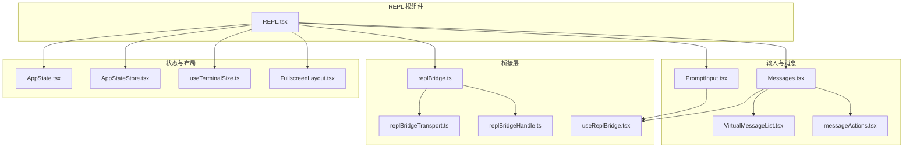
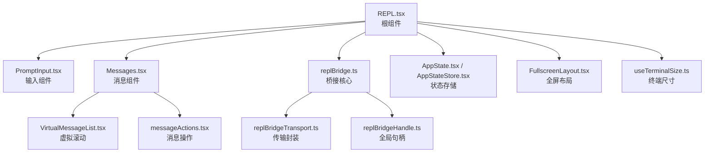
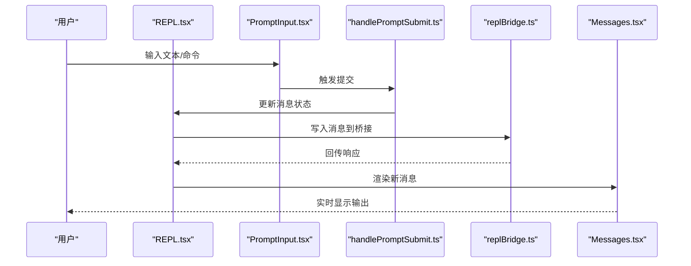
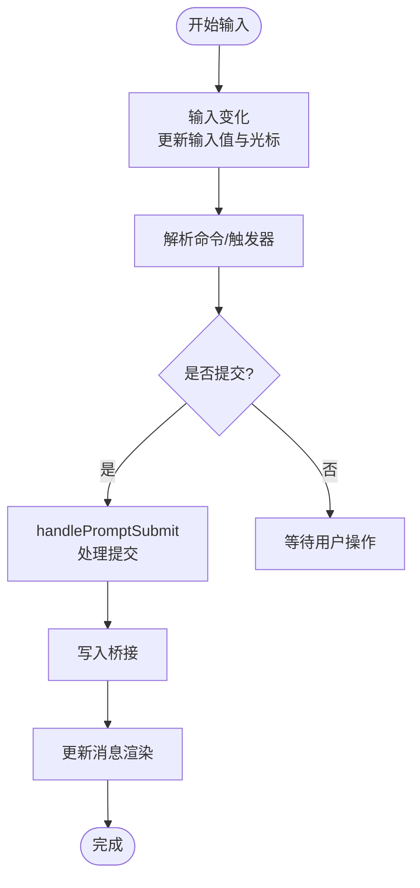
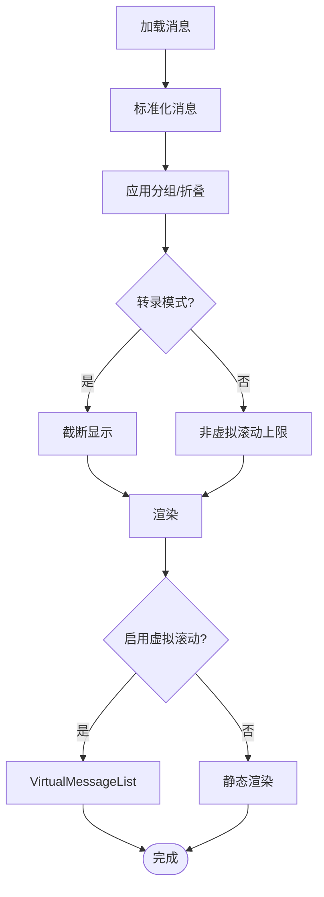
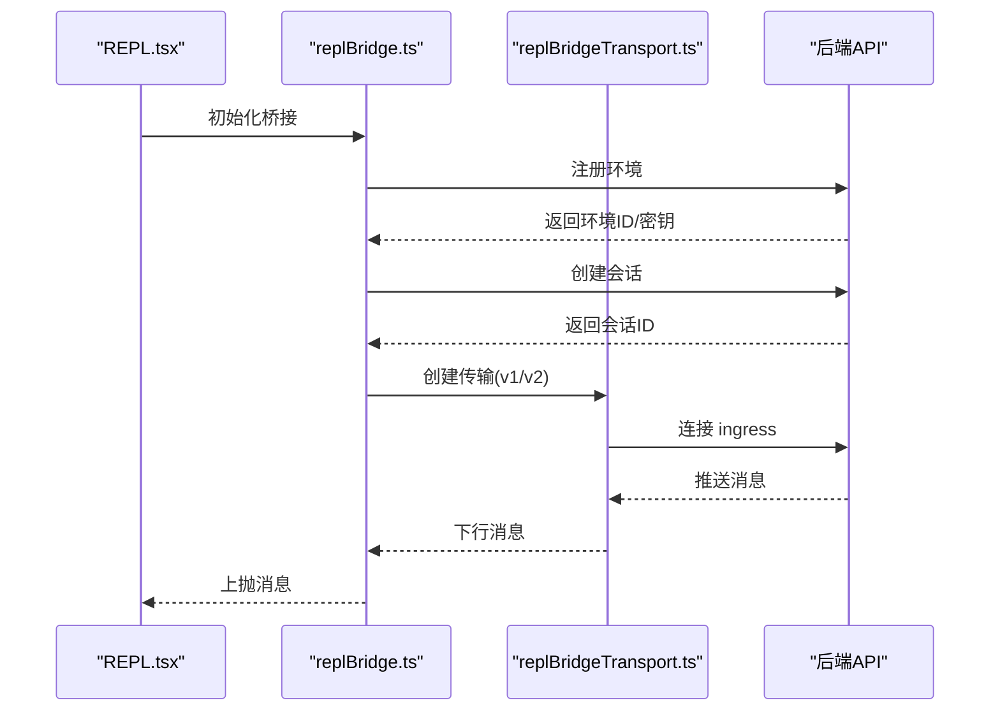
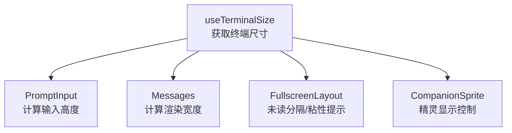
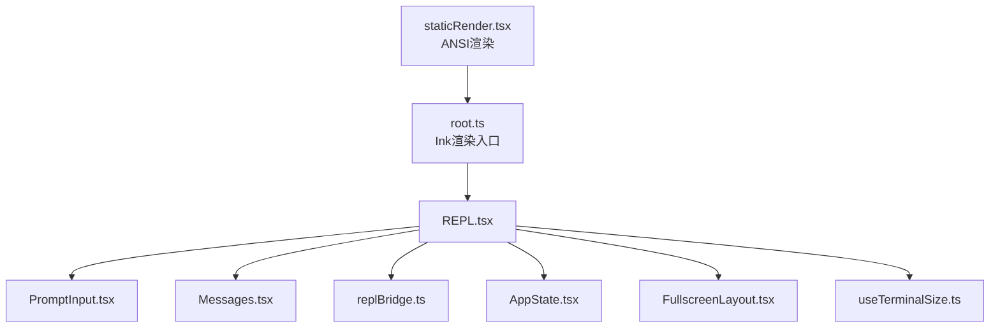

# REPL 交互界面

<cite>
**本文档引用的文件**
- [REPL.tsx](file://src/screens/REPL.tsx)
- [replBridge.ts](file://src/bridge/replBridge.ts)
- [replBridgeHandle.ts](file://src/bridge/replBridgeHandle.ts)
- [replBridgeTransport.ts](file://src/bridge/replBridgeTransport.ts)
- [PromptInput.tsx](file://src/components/PromptInput/PromptInput.tsx)
- [Messages.tsx](file://src/components/Messages.tsx)
- [useReplBridge.tsx](file://src/hooks/useReplBridge.tsx)
- [useTerminalSize.ts](file://src/hooks/useTerminalSize.ts)
- [FullscreenLayout.tsx](file://src/components/FullscreenLayout.tsx)
- [VirtualMessageList.tsx](file://src/components/VirtualMessageList.tsx)
- [messageActions.tsx](file://src/components/messageActions.tsx)
- [StatusLine.tsx](file://src/components/StatusLine.tsx)
- [BuddySprite.tsx](file://src/buddy/CompanionSprite.tsx)
- [AppState.tsx](file://src/state/AppState.tsx)
- [AppStateStore.tsx](file://src/state/AppStateStore.tsx)
- [handlePromptSubmit.ts](file://src/utils/handlePromptSubmit.ts)
- [messages.ts](file://src/utils/messages.ts)
- [history.ts](file://src/history.ts)
- [systemPrompt.ts](file://src/utils/systemPrompt.ts)
- [sessionStorage.ts](file://src/utils/sessionStorage.ts)
- [sessionRestore.ts](file://src/utils/sessionRestore.ts)
- [query.ts](file://src/query.ts)
- [root.ts](file://packages/@ant/ink/src/core/root.ts)
- [staticRender.tsx](file://src/utils/staticRender.tsx)
</cite>

## 目录
1. [简介](#简介)
2. [项目结构](#项目结构)
3. [核心组件](#核心组件)
4. [架构总览](#架构总览)
5. [详细组件分析](#详细组件分析)
6. [依赖关系分析](#依赖关系分析)
7. [性能考量](#性能考量)
8. [故障排除指南](#故障排除指南)
9. [结论](#结论)
10. [附录](#附录)

## 简介
本文件为 Claude Code Best 的 REPL（读取-求值-打印循环）交互界面提供系统化技术文档。重点围绕基于 React Ink 的终端交互架构，深入解析主屏幕组件的设计模式、状态管理与用户输入处理机制；详述 REPL 的核心功能：实时对话显示、消息历史管理、状态栏显示与会话恢复；阐述响应式布局设计以适配不同终端尺寸；解释用户交互流程（输入处理、工具调用反馈、错误处理）；并给出界面定制与扩展方法（主题切换、布局调整、功能增强）及最佳实践。

## 项目结构
REPL 屏幕位于 `src/screens/REPL.tsx`，是整个交互界面的根组件，负责整合状态、消息渲染、输入处理、桥接通信与工具权限控制等模块。桥接层位于 `src/bridge/` 目录，实现本地 REPL 与远程后端的稳定连接与消息传输。输入组件与消息渲染组件分别位于 `src/components/PromptInput/` 和 `src/components/Messages.tsx`，提供输入框、消息列表、虚拟滚动与搜索高亮等功能。终端尺寸与布局相关逻辑分布在 `src/hooks/useTerminalSize.ts`、`src/components/FullscreenLayout.tsx` 与 `src/components/VirtualMessageList.tsx` 中。

**图表来源**
- [REPL.tsx:800-1599](file://src/screens/REPL.tsx#L800-L1599)
- [PromptInput.tsx:1-800](file://src/components/PromptInput/PromptInput.tsx#L1-L800)
- [Messages.tsx:1-800](file://src/components/Messages.tsx#L1-L800)
- [replBridge.ts:1-800](file://src/bridge/replBridge.ts#L1-L800)
- [replBridgeTransport.ts:1-371](file://src/bridge/replBridgeTransport.ts#L1-L371)
- [replBridgeHandle.ts:1-37](file://src/bridge/replBridgeHandle.ts#L1-L37)
- [useReplBridge.tsx:1-200](file://src/hooks/useReplBridge.tsx#L1-L200)
- [AppState.tsx:1-200](file://src/state/AppState.tsx#L1-L200)
- [AppStateStore.tsx:1-200](file://src/state/AppStateStore.tsx#L1-L200)
- [useTerminalSize.ts:1-200](file://src/hooks/useTerminalSize.ts#L1-L200)
- [FullscreenLayout.tsx:1-200](file://src/components/FullscreenLayout.tsx#L1-L200)
- [VirtualMessageList.tsx:1-200](file://src/components/VirtualMessageList.tsx#L1-L200)
- [messageActions.tsx:1-200](file://src/components/messageActions.tsx#L1-L200)

**章节来源**
- [REPL.tsx:800-1599](file://src/screens/REPL.tsx#L800-L1599)
- [PromptInput.tsx:1-800](file://src/components/PromptInput/PromptInput.tsx#L1-L800)
- [Messages.tsx:1-800](file://src/components/Messages.tsx#L1-L800)
- [replBridge.ts:1-800](file://src/bridge/replBridge.ts#L1-L800)
- [replBridgeTransport.ts:1-371](file://src/bridge/replBridgeTransport.ts#L1-L371)
- [replBridgeHandle.ts:1-37](file://src/bridge/replBridgeHandle.ts#L1-L37)
- [useReplBridge.tsx:1-200](file://src/hooks/useReplBridge.tsx#L1-L200)
- [AppState.tsx:1-200](file://src/state/AppState.tsx#L1-L200)
- [AppStateStore.tsx:1-200](file://src/state/AppStateStore.tsx#L1-L200)
- [useTerminalSize.ts:1-200](file://src/hooks/useTerminalSize.ts#L1-L200)
- [FullscreenLayout.tsx:1-200](file://src/components/FullscreenLayout.tsx#L1-L200)
- [VirtualMessageList.tsx:1-200](file://src/components/VirtualMessageList.tsx#L1-L200)
- [messageActions.tsx:1-200](file://src/components/messageActions.tsx#L1-L200)

## 核心组件
- REPL 主屏幕组件：负责聚合状态、消息渲染、输入处理、桥接通信、工具权限与命令合并、任务与团队协作、IDE 集成、通知与提示等。通过 `useAppState` 管理全局状态，使用 `useDeferredValue` 降低大规模消息渲染的阻塞。
- PromptInput 输入组件：提供多行文本输入、命令建议、快捷键绑定、历史搜索、粘贴内容处理、语音输入集成、权限模式切换、任务与团队状态展示等。
- Messages 消息组件：负责消息分组、折叠、去重、虚拟滚动、转录模式截断、思维块隐藏、工具结果展开、进度条与终端进度指示等。
- 桥接层：replBridge 负责环境注册、会话创建、轮询工作项、建立 ingress WebSocket、断线重连与传输切换；replBridgeTransport 封装 v1/v2 传输差异；replBridgeHandle 提供全局句柄访问。
- 布局与终端尺寸：useTerminalSize 提供列宽与行高；FullscreenLayout 提供全屏布局与未读分隔；VirtualMessageList 提供高性能虚拟滚动。
- 状态与通知：AppState/AppStateStore 统一状态存储；useTerminalSize 与 useTabStatus 提供终端标题与标签状态；StatusLine 提供底部状态行。

**章节来源**
- [REPL.tsx:800-1599](file://src/screens/REPL.tsx#L800-L1599)
- [PromptInput.tsx:1-800](file://src/components/PromptInput/PromptInput.tsx#L1-L800)
- [Messages.tsx:1-800](file://src/components/Messages.tsx#L1-L800)
- [replBridge.ts:1-800](file://src/bridge/replBridge.ts#L1-L800)
- [replBridgeTransport.ts:1-371](file://src/bridge/replBridgeTransport.ts#L1-L371)
- [replBridgeHandle.ts:1-37](file://src/bridge/replBridgeHandle.ts#L1-L37)
- [useTerminalSize.ts:1-200](file://src/hooks/useTerminalSize.ts#L1-L200)
- [FullscreenLayout.tsx:1-200](file://src/components/FullscreenLayout.tsx#L1-L200)
- [VirtualMessageList.tsx:1-200](file://src/components/VirtualMessageList.tsx#L1-L200)
- [AppState.tsx:1-200](file://src/state/AppState.tsx#L1-L200)
- [AppStateStore.tsx:1-200](file://src/state/AppStateStore.tsx#L1-L200)
- [StatusLine.tsx:1-200](file://src/components/StatusLine.tsx#L1-L200)

## 架构总览
REPL 采用“根组件 + 多子组件 + 桥接层”的分层架构。根组件负责状态聚合与调度，输入组件负责用户交互与命令解析，消息组件负责渲染与虚拟化，桥接层负责与后端的稳定通信。终端尺寸与布局通过 hooks 与布局组件统一管理，确保在不同终端尺寸下保持良好显示效果。

**图表来源**
- [REPL.tsx:800-1599](file://src/screens/REPL.tsx#L800-L1599)
- [PromptInput.tsx:1-800](file://src/components/PromptInput/PromptInput.tsx#L1-L800)
- [Messages.tsx:1-800](file://src/components/Messages.tsx#L1-L800)
- [replBridge.ts:1-800](file://src/bridge/replBridge.ts#L1-L800)
- [replBridgeTransport.ts:1-371](file://src/bridge/replBridgeTransport.ts#L1-L371)
- [replBridgeHandle.ts:1-37](file://src/bridge/replBridgeHandle.ts#L1-L37)
- [AppState.tsx:1-200](file://src/state/AppState.tsx#L1-L200)
- [AppStateStore.tsx:1-200](file://src/state/AppStateStore.tsx#L1-L200)
- [FullscreenLayout.tsx:1-200](file://src/components/FullscreenLayout.tsx#L1-L200)
- [useTerminalSize.ts:1-200](file://src/hooks/useTerminalSize.ts#L1-L200)
- [VirtualMessageList.tsx:1-200](file://src/components/VirtualMessageList.tsx#L1-L200)
- [messageActions.tsx:1-200](file://src/components/messageActions.tsx#L1-L200)

## 详细组件分析

### REPL 主屏幕组件设计模式
- 设计模式：组合优于继承、状态提升、单向数据流。REPL 作为根组件，通过 props 与 hooks 向子组件传递状态与回调，避免跨层级通信。
- 状态管理：使用 `useAppState` 与 `useSetAppState` 管理全局状态，结合 `useDeferredValue` 对消息进行延迟渲染，降低大规模更新对交互的影响。
- 用户输入处理：通过 `handlePromptSubmit` 统一处理提交逻辑，支持工具调用、命令解析、权限检查与中断处理。
- 消息历史管理：维护消息数组与引用，支持追加、回滚、压缩与恢复；通过 `useDeferredHookMessages` 注入钩子消息，保证模型上下文完整性。
- 会话恢复：通过 `sessionStorage` 与 `sessionRestore` 支持会话元数据恢复、工作树状态恢复与代理任务恢复。

**图表来源**
- [REPL.tsx:800-1599](file://src/screens/REPL.tsx#L800-L1599)
- [PromptInput.tsx:1-800](file://src/components/PromptInput/PromptInput.tsx#L1-L800)
- [handlePromptSubmit.ts:1-200](file://src/utils/handlePromptSubmit.ts#L1-L200)
- [replBridge.ts:1-800](file://src/bridge/replBridge.ts#L1-L800)
- [Messages.tsx:1-800](file://src/components/Messages.tsx#L1-L800)

**章节来源**
- [REPL.tsx:800-1599](file://src/screens/REPL.tsx#L800-L1599)
- [handlePromptSubmit.ts:1-200](file://src/utils/handlePromptSubmit.ts#L1-L200)
- [messages.ts:1-200](file://src/utils/messages.ts#L1-L200)
- [history.ts:1-200](file://src/history.ts#L1-L200)
- [sessionStorage.ts:1-200](file://src/utils/sessionStorage.ts#L1-L200)
- [sessionRestore.ts:1-200](file://src/utils/sessionRestore.ts#L1-L200)

### PromptInput 输入组件
- 功能特性：多行输入、命令建议、历史搜索、快捷键导航、权限模式切换、任务与团队状态展示、语音输入集成、粘贴内容处理。
- 交互流程：输入变化通过 `onInputChange` 与 `setCursorOffset` 控制光标位置；命令解析通过 `hasCommand` 与 `findSlashCommandPositions` 完成；提交通过 `onSubmit` 触发统一处理。
- 性能优化：使用 `useMemo` 缓存触发器位置，减少不必要的重渲染；通过 `useDeferredValue` 与 `useDeferredHookMessages` 降低渲染压力。

**图表来源**
- [PromptInput.tsx:1-800](file://src/components/PromptInput/PromptInput.tsx#L1-L800)
- [handlePromptSubmit.ts:1-200](file://src/utils/handlePromptSubmit.ts#L1-L200)

**章节来源**
- [PromptInput.tsx:1-800](file://src/components/PromptInput/PromptInput.tsx#L1-L800)
- [handlePromptSubmit.ts:1-200](file://src/utils/handlePromptSubmit.ts#L1-L200)

### Messages 消息组件与虚拟滚动
- 渲染策略：非虚拟滚动路径设置消息上限并通过切片锚点维持稳定性；虚拟滚动路径通过 VirtualMessageList 提供高性能渲染。
- 消息处理：消息分组、折叠、去重、思维块隐藏、工具结果展开、进度条与终端进度指示。
- 转录模式：支持截断显示最近 N 条消息，并提供“展开/收起”切换。

**图表来源**
- [Messages.tsx:1-800](file://src/components/Messages.tsx#L1-L800)
- [VirtualMessageList.tsx:1-200](file://src/components/VirtualMessageList.tsx#L1-L200)

**章节来源**
- [Messages.tsx:1-800](file://src/components/Messages.tsx#L1-L800)
- [VirtualMessageList.tsx:1-200](file://src/components/VirtualMessageList.tsx#L1-L200)

### 桥接层与传输抽象
- 环境注册与会话创建：通过 `initBridgeCore` 完成环境注册、会话创建与崩溃恢复指针写入。
- 轮询与连接：轮询工作项获取 ingress 令牌，建立 ingress WebSocket；支持断线重连与传输切换。
- v1/v2 传输：v1 使用 HybridTransport，v2 使用 SSETransport + CCRClient；通过 `createV2ReplTransport` 统一封装。
- 全局句柄：通过 `replBridgeHandle` 提供全局句柄访问，便于工具与命令调用。

**图表来源**
- [replBridge.ts:1-800](file://src/bridge/replBridge.ts#L1-L800)
- [replBridgeTransport.ts:1-371](file://src/bridge/replBridgeTransport.ts#L1-L371)
- [replBridgeHandle.ts:1-37](file://src/bridge/replBridgeHandle.ts#L1-L37)

**章节来源**
- [replBridge.ts:1-800](file://src/bridge/replBridge.ts#L1-L800)
- [replBridgeTransport.ts:1-371](file://src/bridge/replBridgeTransport.ts#L1-L371)
- [replBridgeHandle.ts:1-37](file://src/bridge/replBridgeHandle.ts#L1-L37)

### 响应式布局与终端尺寸适配
- 终端尺寸：通过 `useTerminalSize` 获取列宽与行高，驱动输入框高度、消息渲染宽度与虚拟滚动窗口大小。
- 全屏布局：FullscreenLayout 提供全屏模式下的未读分隔、粘性提示与滚动控制。
- Buddy 精灵：根据终端宽度动态显示或隐藏伙伴精灵，避免遮挡消息区域。

**图表来源**
- [useTerminalSize.ts:1-200](file://src/hooks/useTerminalSize.ts#L1-L200)
- [FullscreenLayout.tsx:1-200](file://src/components/FullscreenLayout.tsx#L1-L200)
- [BuddySprite.tsx:1-200](file://src/buddy/CompanionSprite.tsx#L1-L200)

**章节来源**
- [useTerminalSize.ts:1-200](file://src/hooks/useTerminalSize.ts#L1-L200)
- [FullscreenLayout.tsx:1-200](file://src/components/FullscreenLayout.tsx#L1-L200)
- [BuddySprite.tsx:1-200](file://src/buddy/CompanionSprite.tsx#L1-L200)

### 状态栏与通知
- 状态栏：通过 `useTabStatus` 与 `useTerminalTitle` 设置终端标签状态与标题动画，结合 `StatusLine.tsx` 提供底部状态行。
- 通知：通过 `useNotifications` 管理横幅通知，结合 `useTerminalNotification` 提供终端进度指示。
- 模型切换提示：Ant-only 模型切换提示通过 `AntModelSwitchCallout` 与 `UndercoverAutoCallout` 提供。

**章节来源**
- [StatusLine.tsx:1-200](file://src/components/StatusLine.tsx#L1-L200)
- [AppState.tsx:1-200](file://src/state/AppState.tsx#L1-L200)
- [AppStateStore.tsx:1-200](file://src/state/AppStateStore.tsx#L1-L200)

## 依赖关系分析
- 组件耦合：REPL 作为根组件，与输入、消息、桥接、状态、布局组件存在强耦合；通过 hooks 与 props 解耦具体实现细节。
- 外部依赖：@anthropic/ink 提供终端渲染能力；React Ink 的 root.ts 与 staticRender.tsx 提供渲染与 ANSI 输出支持。
- 数据流：自上而下的 props 传递与自下而上的回调处理，配合全局状态 store，形成清晰的数据流。

**图表来源**
- [root.ts:1-125](file://packages/@ant/ink/src/core/root.ts#L1-L125)
- [staticRender.tsx:1-100](file://src/utils/staticRender.tsx#L1-L100)
- [REPL.tsx:800-1599](file://src/screens/REPL.tsx#L800-L1599)
- [PromptInput.tsx:1-800](file://src/components/PromptInput/PromptInput.tsx#L1-L800)
- [Messages.tsx:1-800](file://src/components/Messages.tsx#L1-L800)
- [replBridge.ts:1-800](file://src/bridge/replBridge.ts#L1-L800)
- [AppState.tsx:1-200](file://src/state/AppState.tsx#L1-L200)
- [FullscreenLayout.tsx:1-200](file://src/components/FullscreenLayout.tsx#L1-L200)
- [useTerminalSize.ts:1-200](file://src/hooks/useTerminalSize.ts#L1-L200)

**章节来源**
- [root.ts:1-125](file://packages/@ant/ink/src/core/root.ts#L1-L125)
- [staticRender.tsx:1-100](file://src/utils/staticRender.tsx#L1-L100)
- [REPL.tsx:800-1599](file://src/screens/REPL.tsx#L800-L1599)

## 性能考量
- 渲染优化：使用 `useDeferredValue` 对消息进行延迟渲染，避免大规模更新阻塞交互；虚拟滚动减少 DOM 节点数量。
- 消息上限：非虚拟滚动路径设置消息上限并通过切片锚点维持稳定性，防止内存膨胀与 GC 压力。
- 传输优化：v2 传输通过序列号携带与批量上传减少重复历史重放与网络开销。
- 终端渲染：Ink 的首次帧提取与同步更新标记减少不必要的重绘。

[本节提供通用指导，无需特定文件分析]

## 故障排除指南
- 桥接连接失败：检查 `replBridge.ts` 中的环境注册与会话创建日志，确认网络与认证配置；利用 `reconnectEnvironmentWithSession` 处理环境丢失与重连。
- 消息不显示：检查 `Messages.tsx` 中的消息过滤与截断逻辑，确认转录模式与虚拟滚动开关；验证 `useDeferredValue` 是否导致渲染延迟。
- 输入无响应：检查 `PromptInput.tsx` 中的键盘事件绑定与命令解析，确认权限模式与工具限制；验证 `handlePromptSubmit` 的提交回调链路。
- 终端标题异常：检查 `useTerminalTitle` 与 `AnimatedTerminalTitle` 的禁用标志与焦点状态，确认动画帧更新频率。

**章节来源**
- [replBridge.ts:1-800](file://src/bridge/replBridge.ts#L1-L800)
- [Messages.tsx:1-800](file://src/components/Messages.tsx#L1-L800)
- [PromptInput.tsx:1-800](file://src/components/PromptInput/PromptInput.tsx#L1-L800)
- [AppState.tsx:1-200](file://src/state/AppState.tsx#L1-L200)

## 结论
REPL 交互界面通过 React Ink 实现高性能的终端渲染，结合桥接层与状态管理，提供了稳定的实时对话体验。其设计强调状态提升、单向数据流与组件解耦，配合虚拟滚动与延迟渲染优化，确保在大型会话中仍能保持流畅交互。通过合理的布局与终端尺寸适配，REPL 在不同终端环境下均能提供一致的用户体验。

[本节为总结性内容，无需特定文件分析]

## 附录
- 最佳实践
  - 使用 `useDeferredValue` 与虚拟滚动处理大规模消息。
  - 通过 `AppState` 集中管理全局状态，避免跨层级状态共享。
  - 在桥接层中使用断线重连与传输切换，提升连接稳定性。
  - 利用 `useTerminalSize` 与布局组件适配不同终端尺寸。
  - 通过 `useNotifications` 与 `useTerminalNotification` 提供及时反馈。
- 扩展建议
  - 主题切换：通过 `useTheme` 与样式变量实现主题切换。
  - 布局调整：通过 `FullscreenLayout` 与 `useTerminalSize` 动态调整布局参数。
  - 功能增强：在 `PromptInput` 中添加新的命令与触发器，在 `Messages` 中扩展消息渲染类型。

[本节为通用建议，无需特定文件分析]