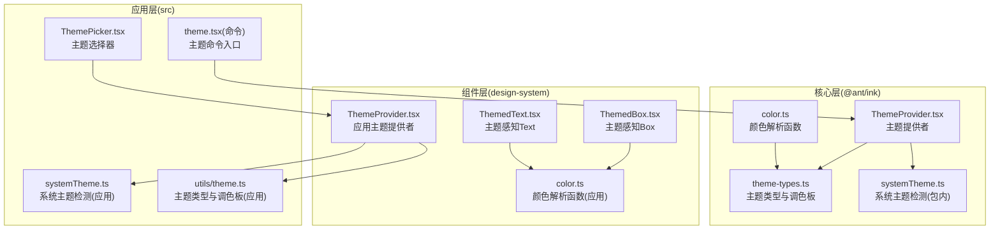
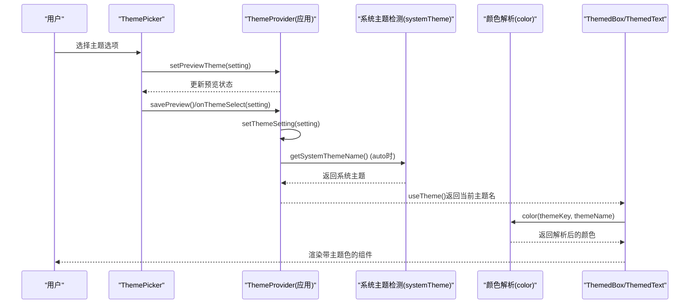
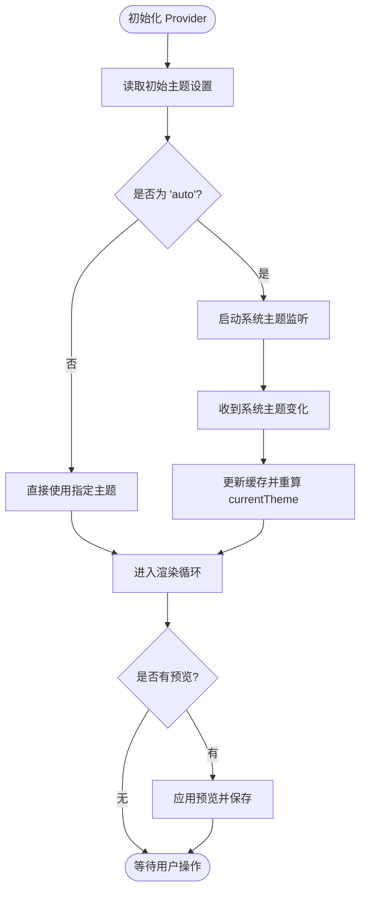
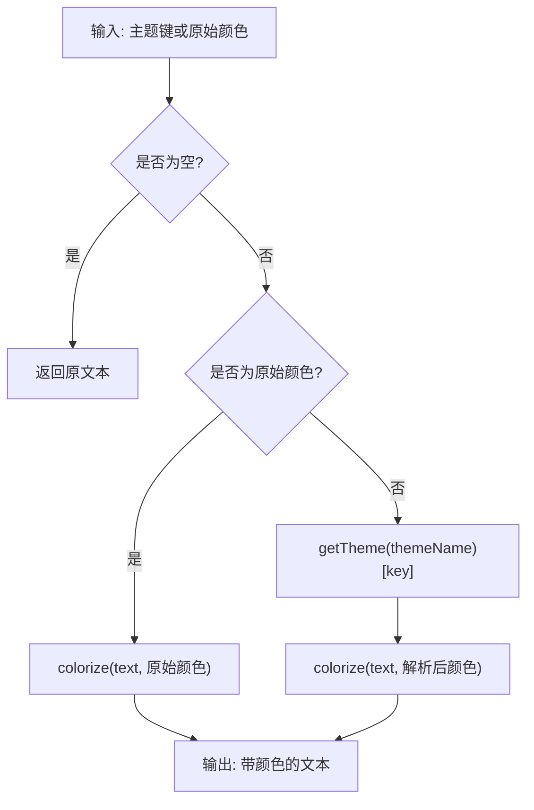
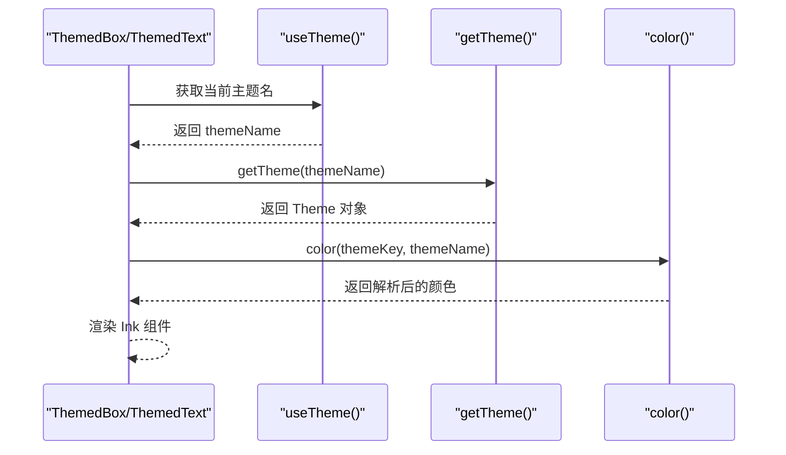
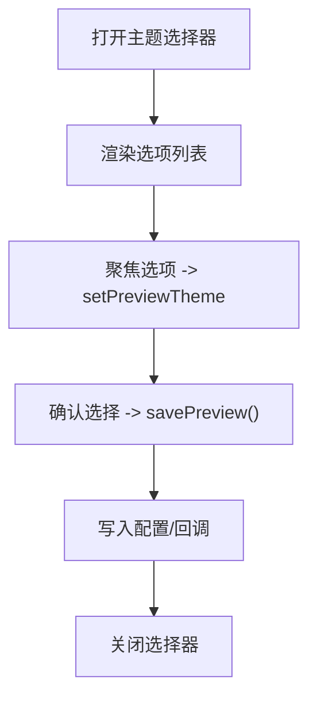
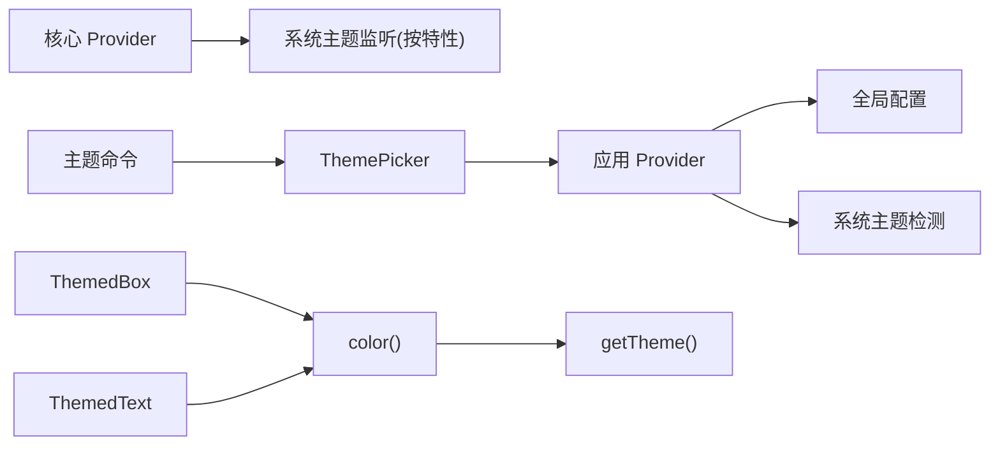

# 主题系统

<cite>
**本文档引用的文件**
- [packages/@ant/ink/src/theme/ThemeProvider.tsx](file://packages/@ant/ink/src/theme/ThemeProvider.tsx)
- [src/components/design-system/ThemeProvider.tsx](file://src/components/design-system/ThemeProvider.tsx)
- [packages/@ant/ink/src/theme/color.ts](file://packages/@ant/ink/src/theme/color.ts)
- [src/components/design-system/color.ts](file://src/components/design-system/color.ts)
- [packages/@ant/ink/src/theme/theme-types.ts](file://packages/@ant/ink/src/theme/theme-types.ts)
- [src/utils/theme.ts](file://src/utils/theme.ts)
- [src/utils/systemTheme.ts](file://src/utils/systemTheme.ts)
- [src/components/ThemePicker.tsx](file://src/components/ThemePicker.tsx)
- [src/components/design-system/ThemedBox.tsx](file://src/components/design-system/ThemedBox.tsx)
- [src/components/design-system/ThemedText.tsx](file://src/components/design-system/ThemedText.tsx)
- [src/commands/theme/theme.tsx](file://src/commands/theme/theme.tsx)
- [packages/@ant/ink/src/theme/systemTheme.ts](file://packages/@ant/ink/src/theme/systemTheme.ts)
</cite>

## 目录
1. [简介](#简介)
2. [项目结构](#项目结构)
3. [核心组件](#核心组件)
4. [架构总览](#架构总览)
5. [详细组件分析](#详细组件分析)
6. [依赖关系分析](#依赖关系分析)
7. [性能考量](#性能考量)
8. [故障排查指南](#故障排查指南)
9. [结论](#结论)
10. [附录](#附录)

## 简介
本文件系统性阐述 Claude Code Best 基于 React Ink 的主题系统，涵盖颜色系统、主题提供者与样式管理机制。文档重点说明以下方面：
- 深色/浅色主题切换与系统主题适配（自动跟随终端背景）
- 自定义颜色方案与设计系统组件（ThemedBox、ThemedText）
- 动态切换机制（实时更新与状态持久化）
- 主题定制方法（颜色变量修改、组件样式覆盖、品牌定制）
- 实现示例与最佳实践，帮助开发者构建一致且美观的终端 UI

## 项目结构
主题系统由三层组成：
- 核心层（@ant/ink）：提供基础主题类型、颜色解析与系统主题检测
- 组件层（design-system）：封装 Ink 组件，提供主题感知的 Box/Text
- 应用层（src）：主题提供者、主题选择器、命令入口与配置持久化



图表来源
- [packages/@ant/ink/src/theme/ThemeProvider.tsx:66-149](file://packages/@ant/ink/src/theme/ThemeProvider.tsx#L66-L149)
- [src/components/design-system/ThemeProvider.tsx:54-137](file://src/components/design-system/ThemeProvider.tsx#L54-L137)
- [packages/@ant/ink/src/theme/color.ts:9-30](file://packages/@ant/ink/src/theme/color.ts#L9-L30)
- [src/components/design-system/color.ts:8-29](file://src/components/design-system/color.ts#L8-L29)
- [packages/@ant/ink/src/theme/theme-types.ts:598-613](file://packages/@ant/ink/src/theme/theme-types.ts#L598-L613)
- [src/utils/theme.ts:598-613](file://src/utils/theme.ts#L598-L613)
- [src/utils/systemTheme.ts:24-47](file://src/utils/systemTheme.ts#L24-L47)
- [src/components/ThemePicker.tsx:33-105](file://src/components/ThemePicker.tsx#L33-L105)
- [src/commands/theme/theme.tsx:15-31](file://src/commands/theme/theme.tsx#L15-L31)

章节来源
- [packages/@ant/ink/src/theme/ThemeProvider.tsx:66-149](file://packages/@ant/ink/src/theme/ThemeProvider.tsx#L66-L149)
- [src/components/design-system/ThemeProvider.tsx:54-137](file://src/components/design-system/ThemeProvider.tsx#L54-L137)

## 核心组件
- 主题提供者（ThemeProvider）
  - 负责主题设置的存储与读取、预览模式、系统主题监听与解析
  - 提供 useTheme/useThemeSetting/usePreviewTheme 等钩子
- 颜色解析函数（color）
  - 将主题键或原始颜色值解析为 Ink 可用的颜色
- 主题类型与调色板（theme-types.ts / utils/theme.ts）
  - 定义主题键、名称集合与各主题的完整颜色映射
- 设计系统组件（ThemedBox、ThemedText）
  - 在 Ink Box/Text 基础上注入主题解析能力
- 主题选择器（ThemePicker）
  - 提供交互式主题切换与预览，支持自动模式与 ANSI 降级

章节来源
- [packages/@ant/ink/src/theme/ThemeProvider.tsx:155-166](file://packages/@ant/ink/src/theme/ThemeProvider.tsx#L155-L166)
- [src/components/design-system/ThemeProvider.tsx:143-154](file://src/components/design-system/ThemeProvider.tsx#L143-L154)
- [packages/@ant/ink/src/theme/color.ts:9-30](file://packages/@ant/ink/src/theme/color.ts#L9-L30)
- [src/components/design-system/color.ts:8-29](file://src/components/design-system/color.ts#L8-L29)
- [packages/@ant/ink/src/theme/theme-types.ts:4-89](file://packages/@ant/ink/src/theme/theme-types.ts#L4-L89)
- [src/utils/theme.ts:4-89](file://src/utils/theme.ts#L4-L89)
- [src/components/design-system/ThemedBox.tsx:69-105](file://src/components/design-system/ThemedBox.tsx#L69-L105)
- [src/components/design-system/ThemedText.tsx:91-132](file://src/components/design-system/ThemedText.tsx#L91-L132)
- [src/components/ThemePicker.tsx:33-105](file://src/components/ThemePicker.tsx#L33-L105)

## 架构总览
主题系统采用“提供者 + 解析器 + 组件”的分层架构：
- 提供者层：统一管理主题设置、系统主题与预览状态
- 解析层：将主题键映射到具体颜色值，兼容 RGB/ANSI
- 组件层：在 Ink 原生组件之上增加主题感知能力
- 命令层：通过命令入口触发主题选择器，完成用户交互与持久化



图表来源
- [src/components/ThemePicker.tsx:123-146](file://src/components/ThemePicker.tsx#L123-L146)
- [src/components/design-system/ThemeProvider.tsx:102-132](file://src/components/design-system/ThemeProvider.tsx#L102-L132)
- [src/utils/systemTheme.ts:24-47](file://src/utils/systemTheme.ts#L24-L47)
- [src/components/design-system/color.ts:8-29](file://src/components/design-system/color.ts#L8-L29)
- [src/components/design-system/ThemedBox.tsx:79-104](file://src/components/design-system/ThemedBox.tsx#L79-L104)
- [src/components/design-system/ThemedText.tsx:102-131](file://src/components/design-system/ThemedText.tsx#L102-L131)

## 详细组件分析

### 主题提供者（应用层）
- 状态管理
  - themeSetting：保存用户偏好（可为 'auto'）
  - previewTheme：主题选择器预览状态
  - currentTheme：最终渲染使用的具体主题名
- 生命周期与监听
  - 初始化从全局配置读取主题设置
  - 当启用 'auto' 时，通过系统主题监听器动态更新
- 回调注入
  - 支持注入持久化回调（setThemeConfigCallbacks），用于保存主题设置



图表来源
- [src/components/design-system/ThemeProvider.tsx:58-134](file://src/components/design-system/ThemeProvider.tsx#L58-L134)

章节来源
- [src/components/design-system/ThemeProvider.tsx:54-137](file://src/components/design-system/ThemeProvider.tsx#L54-L137)

### 颜色解析器（color）
- 输入支持
  - 主题键（如 'text'、'background'）
  - 原始颜色字符串（rgb(...)、#...、ansi256(...)、ansi:...）
- 处理流程
  - 若为空则原样返回
  - 若为原始颜色，直接交给 Ink 渲染器
  - 否则先查主题表，再交给渲染器



图表来源
- [packages/@ant/ink/src/theme/color.ts:9-30](file://packages/@ant/ink/src/theme/color.ts#L9-L30)
- [src/components/design-system/color.ts:8-29](file://src/components/design-system/color.ts#L8-L29)

章节来源
- [packages/@ant/ink/src/theme/color.ts:9-30](file://packages/@ant/ink/src/theme/color.ts#L9-L30)
- [src/components/design-system/color.ts:8-29](file://src/components/design-system/color.ts#L8-L29)

### 主题类型与调色板
- 主题键
  - 包含语义色（success/error/warning）、差异色（diffAdded/diffRemoved）、文本与背景、闪烁效果等
- 主题名称
  - 'dark'、'light'、'dark-daltonized'、'light-daltonized'、'dark-ansi'、'light-ansi'
- 调色板
  - 每个主题提供完整的 RGB/ANSI 映射，确保在不同终端下的一致性

```mermaid
classDiagram
class Theme {
+autoAccept : string
+bashBorder : string
+claude : string
+permission : string
+planMode : string
+ide : string
+promptBorder : string
+text : string
+inverseText : string
+inactive : string
+subtle : string
+suggestion : string
+remember : string
+background : string
+success : string
+error : string
+warning : string
+merged : string
+diffAdded : string
+diffRemoved : string
+diffAddedDimmed : string
+diffRemovedDimmed : string
+diffAddedWord : string
+diffRemovedWord : string
+professionalBlue : string
+chromeYellow : string
+clawd_body : string
+clawd_background : string
+userMessageBackground : string
+userMessageBackgroundHover : string
+messageActionsBackground : string
+selectionBg : string
+bashMessageBackgroundColor : string
+memoryBackgroundColor : string
+rate_limit_fill : string
+rate_limit_empty : string
+fastMode : string
+fastModeShimmer : string
+briefLabelYou : string
+briefLabelClaude : string
+rainbow_* : string
}
class ThemeName {
<<enumeration>>
"dark"
"light"
"light-daltonized"
"dark-daltonized"
"light-ansi"
"dark-ansi"
}
class ThemeSetting {
<<enumeration>>
"'auto'"
"ThemeName"
}
ThemeName --> Theme : "getTheme()"
ThemeSetting --> ThemeName : "resolve"
```

图表来源
- [packages/@ant/ink/src/theme/theme-types.ts:4-89](file://packages/@ant/ink/src/theme/theme-types.ts#L4-L89)
- [src/utils/theme.ts:4-89](file://src/utils/theme.ts#L4-L89)
- [packages/@ant/ink/src/theme/theme-types.ts:91-109](file://packages/@ant/ink/src/theme/theme-types.ts#L91-L109)
- [src/utils/theme.ts:91-109](file://src/utils/theme.ts#L91-L109)

章节来源
- [packages/@ant/ink/src/theme/theme-types.ts:598-613](file://packages/@ant/ink/src/theme/theme-types.ts#L598-L613)
- [src/utils/theme.ts:598-613](file://src/utils/theme.ts#L598-L613)

### 设计系统组件（ThemedBox / ThemedText）
- ThemedBox
  - 接受边框与背景色主题键，解析后传给 Ink Box
- ThemedText
  - 支持 color、backgroundColor、dimColor、bold、italic、underline、strikethrough、inverse、wrap 等属性
  - 内置悬停颜色上下文，便于在子树中统一风格



图表来源
- [src/components/design-system/ThemedBox.tsx:69-105](file://src/components/design-system/ThemedBox.tsx#L69-L105)
- [src/components/design-system/ThemedText.tsx:91-132](file://src/components/design-system/ThemedText.tsx#L91-L132)
- [src/components/design-system/color.ts:8-29](file://src/components/design-system/color.ts#L8-L29)
- [src/utils/theme.ts:598-613](file://src/utils/theme.ts#L598-L613)

章节来源
- [src/components/design-system/ThemedBox.tsx:69-105](file://src/components/design-system/ThemedBox.tsx#L69-L105)
- [src/components/design-system/ThemedText.tsx:91-132](file://src/components/design-system/ThemedText.tsx#L91-L132)

### 主题选择器（ThemePicker）
- 功能
  - 展示多种主题选项（含自动、色弱友好、仅 ANSI）
  - 支持预览与确认保存
  - 集成语法高亮开关与快捷提示
- 交互
  - 使用 Select 组件展示选项
  - 通过 usePreviewTheme 控制预览与保存



图表来源
- [src/components/ThemePicker.tsx:123-146](file://src/components/ThemePicker.tsx#L123-L146)

章节来源
- [src/components/ThemePicker.tsx:33-105](file://src/components/ThemePicker.tsx#L33-L105)

### 命令入口（主题命令）
- 通过命令入口触发 ThemePicker，并在选中后调用 setTheme 写回主题设置

章节来源
- [src/commands/theme/theme.tsx:15-31](file://src/commands/theme/theme.tsx#L15-L31)

## 依赖关系分析
- 提供者依赖
  - 应用层 Provider 依赖全局配置与系统主题检测
  - 核心层 Provider 依赖系统主题监听模块（按特性开关引入）
- 组件依赖
  - ThemedBox/ThemedText 依赖 color 与 getTheme
- 命令依赖
  - 命令入口依赖 ThemePicker 与 useTheme



图表来源
- [src/components/design-system/ThemeProvider.tsx:58-134](file://src/components/design-system/ThemeProvider.tsx#L58-L134)
- [packages/@ant/ink/src/theme/ThemeProvider.tsx:88-106](file://packages/@ant/ink/src/theme/ThemeProvider.tsx#L88-L106)
- [src/components/design-system/ThemedBox.tsx:79-104](file://src/components/design-system/ThemedBox.tsx#L79-L104)
- [src/components/design-system/ThemedText.tsx:102-131](file://src/components/design-system/ThemedText.tsx#L102-L131)
- [src/components/ThemePicker.tsx:42-105](file://src/components/ThemePicker.tsx#L42-L105)
- [src/commands/theme/theme.tsx:15-31](file://src/commands/theme/theme.tsx#L15-L31)

章节来源
- [src/components/design-system/ThemeProvider.tsx:58-134](file://src/components/design-system/ThemeProvider.tsx#L58-L134)
- [packages/@ant/ink/src/theme/ThemeProvider.tsx:88-106](file://packages/@ant/ink/src/theme/ThemeProvider.tsx#L88-L106)

## 性能考量
- 颜色解析
  - 主题键解析为常量时间，避免重复计算
  - 原始颜色直接透传，减少分支判断
- 系统主题监听
  - 仅在启用 'auto' 时启动监听，降低开销
  - 首次通过环境变量快速猜测，随后异步更新缓存
- 组件渲染
  - ThemedBox/ThemedText 在渲染前完成颜色解析，避免运行时重复解析

[本节为通用指导，无需特定文件引用]

## 故障排查指南
- 主题未生效
  - 检查 Provider 是否正确注入，以及是否处于 'auto' 模式
  - 确认系统主题监听已启动（特性开关）
- 颜色异常
  - 确认传入的是合法主题键或原始颜色字符串
  - 检查 ANSI 终端是否仅支持有限颜色集
- 预览无法保存
  - 确认使用了 setPreviewTheme/savePreview 流程
  - 检查持久化回调是否正确注入

章节来源
- [src/components/design-system/ThemeProvider.tsx:113-132](file://src/components/design-system/ThemeProvider.tsx#L113-L132)
- [src/components/ThemePicker.tsx:123-146](file://src/components/ThemePicker.tsx#L123-L146)

## 结论
该主题系统以 React Ink 为基础，通过提供者、解析器与组件三层解耦设计，实现了：
- 深色/浅色主题切换与系统主题自动适配
- 丰富的颜色体系与 ANSI 降级支持
- 实时预览与持久化的交互体验
- 易扩展的颜色键与组件封装，便于品牌定制与一致性保障

[本节为总结，无需特定文件引用]

## 附录

### 主题定制最佳实践
- 修改颜色键
  - 在主题类型文件中新增/调整键值，确保所有使用点同步更新
  - 保持键名语义清晰，避免与现有键冲突
- 自定义调色板
  - 为新主题添加完整映射，优先使用 RGB 保证跨终端一致性
  - 为 ANSI 主题提供等价映射，确保在旧终端可用
- 组件样式覆盖
  - 通过 ThemedBox/ThemedText 的主题键属性进行统一替换
  - 如需特殊处理，可在业务组件中组合使用 color 函数
- 品牌定制
  - 将品牌色作为主题键的一部分，避免硬编码颜色值
  - 提供品牌色的明暗两版，满足不同主题需求

章节来源
- [packages/@ant/ink/src/theme/theme-types.ts:598-613](file://packages/@ant/ink/src/theme/theme-types.ts#L598-L613)
- [src/utils/theme.ts:598-613](file://src/utils/theme.ts#L598-L613)
- [src/components/design-system/ThemedBox.tsx:69-105](file://src/components/design-system/ThemedBox.tsx#L69-L105)
- [src/components/design-system/ThemedText.tsx:91-132](file://src/components/design-system/ThemedText.tsx#L91-L132)