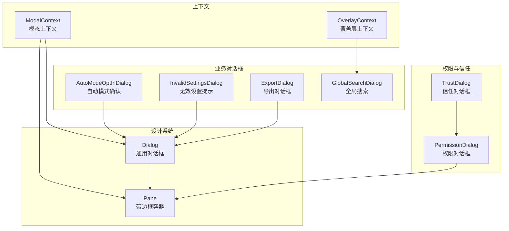
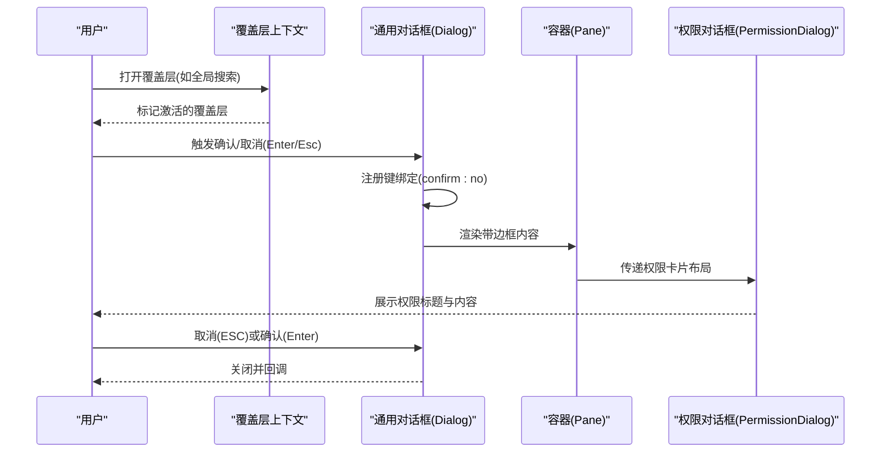
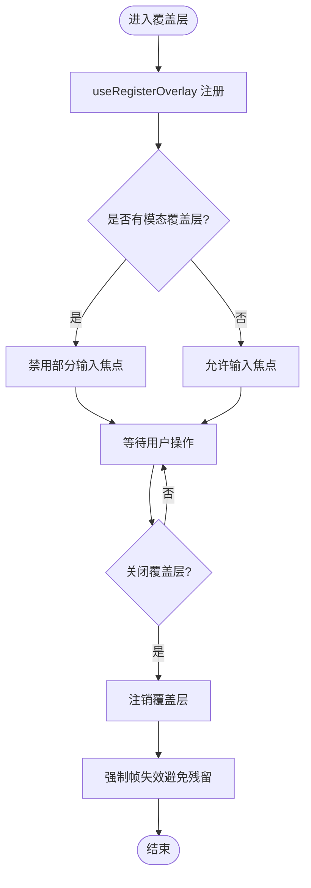
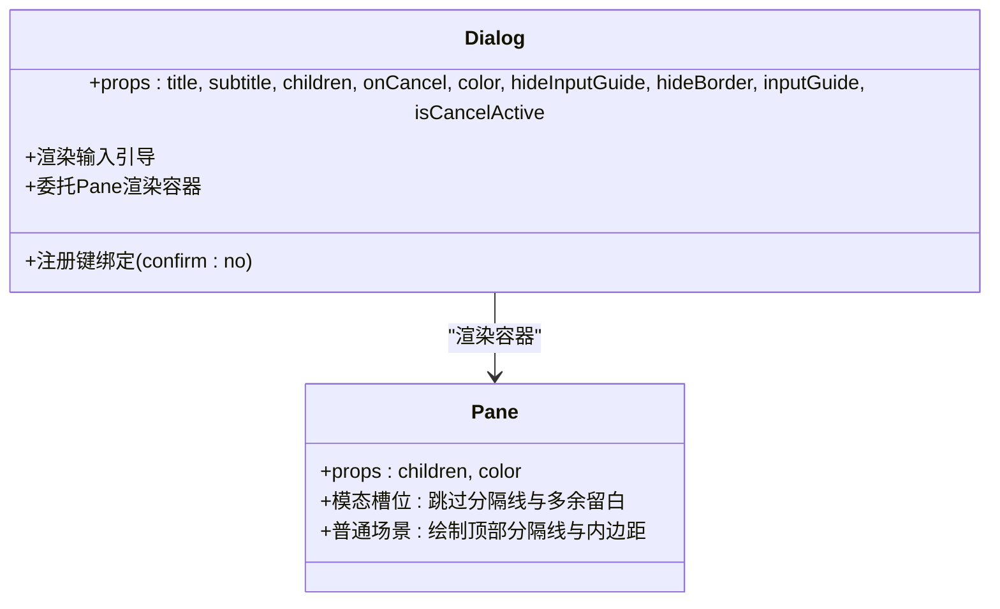
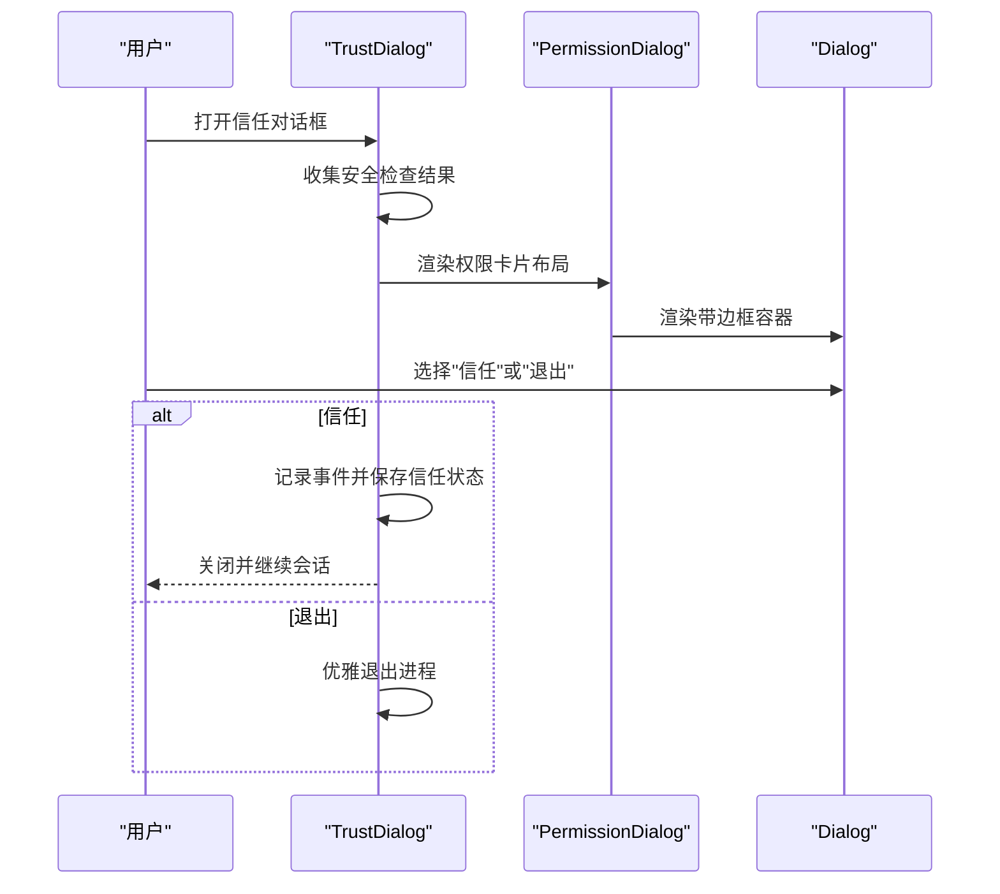
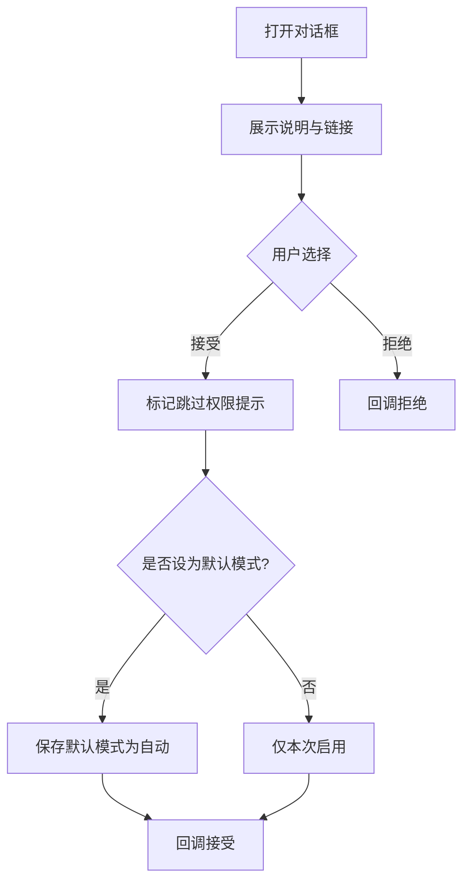
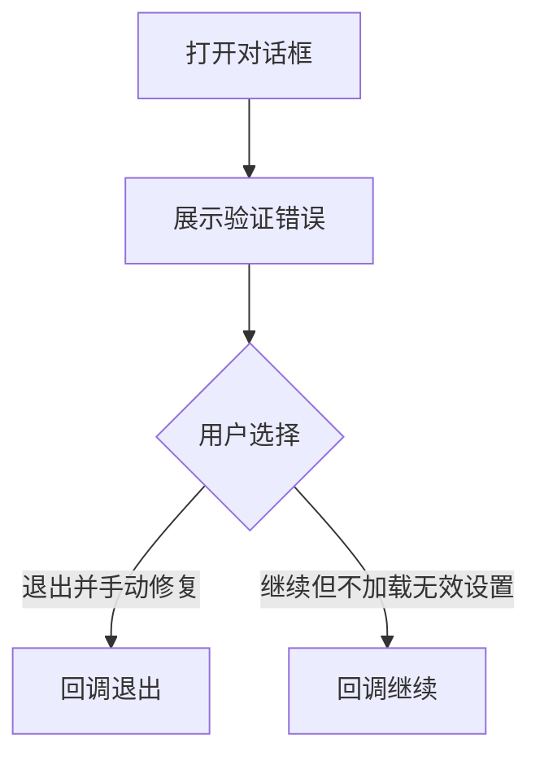
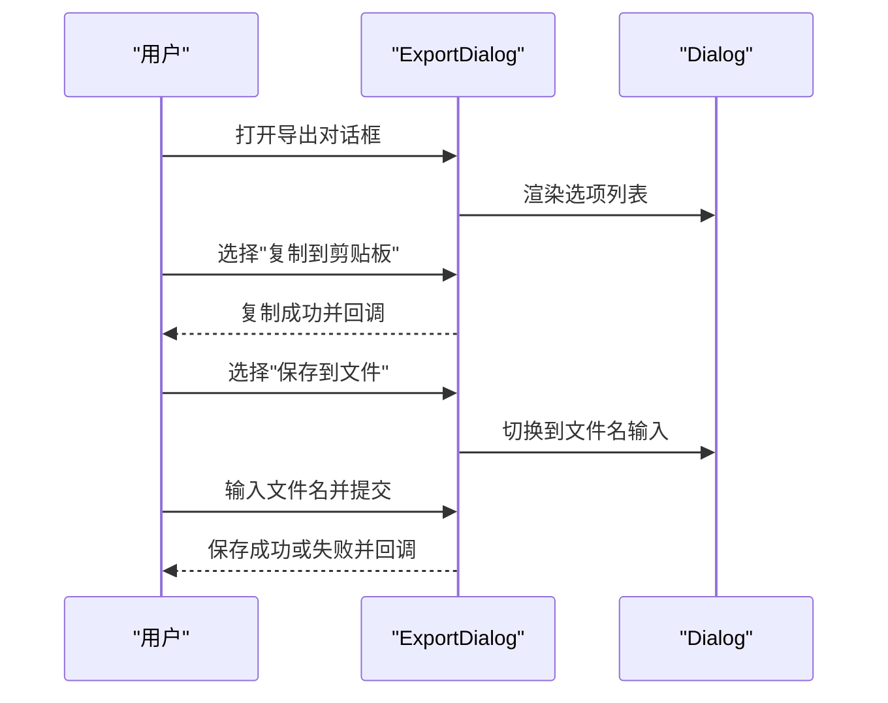
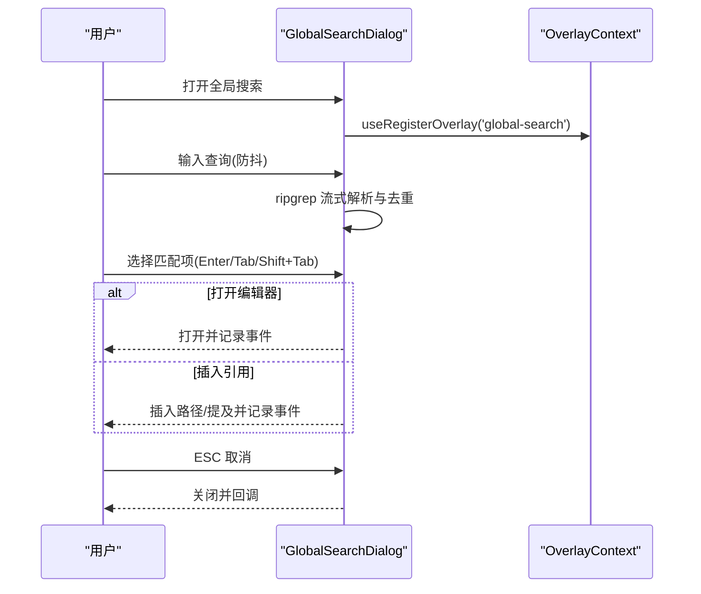
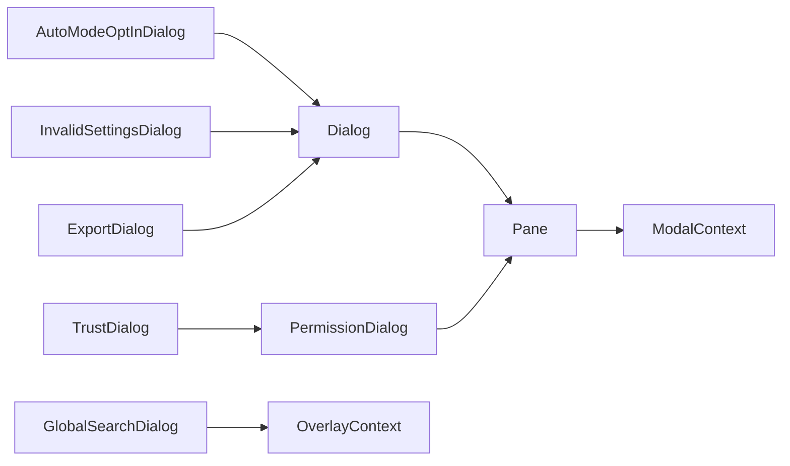

# 对话框组件

<cite>
**本文引用的文件**
- [src/context/modalContext.tsx](file://src/context/modalContext.tsx)
- [packages/@ant/ink/src/theme/modalContext.ts](file://packages/@ant/ink/src/theme/modalContext.ts)
- [src/context/overlayContext.tsx](file://src/context/overlayContext.tsx)
- [src/components/design-system/Dialog.tsx](file://src/components/design-system/Dialog.tsx)
- [packages/@ant/ink/src/theme/Dialog.tsx](file://packages/@ant/ink/src/theme/Dialog.tsx)
- [src/components/design-system/Pane.tsx](file://src/components/design-system/Pane.tsx)
- [packages/@ant/ink/src/theme/Pane.tsx](file://packages/@ant/ink/src/theme/Pane.tsx)
- [src/components/permissions/PermissionDialog.tsx](file://src/components/permissions/PermissionDialog.tsx)
- [src/components/TrustDialog/TrustDialog.tsx](file://src/components/TrustDialog/TrustDialog.tsx)
- [src/components/AutoModeOptInDialog.tsx](file://src/components/AutoModeOptInDialog.tsx)
- [src/components/InvalidSettingsDialog.tsx](file://src/components/InvalidSettingsDialog.tsx)
- [src/components/ExportDialog.tsx](file://src/components/ExportDialog.tsx)
- [src/components/GlobalSearchDialog.tsx](file://src/components/GlobalSearchDialog.tsx)
</cite>

## 目录
1. [简介](#简介)
2. [项目结构](#项目结构)
3. [核心组件](#核心组件)
4. [架构总览](#架构总览)
5. [详细组件分析](#详细组件分析)
6. [依赖关系分析](#依赖关系分析)
7. [性能考量](#性能考量)
8. [故障排查指南](#故障排查指南)
9. [结论](#结论)
10. [附录](#附录)

## 简介
本文件系统性梳理 Claude Code Best 的对话框组件体系，重点覆盖模态对话框的设计架构、对话框管理与生命周期、内容渲染与交互处理、以及典型对话框组件（设置对话框、代理详情、权限请求、反馈调查等）的功能特性与实现要点。文档同时给出可定制化方案（样式、内容、行为）、使用示例与无障碍设计建议，帮助开发者构建一致、易用且可访问的终端内交互体验。

## 项目结构
对话框相关代码主要分布在以下区域：
- 上下文与状态：模态上下文、覆盖层上下文
- 设计系统对话框与容器：通用 Dialog、Pane
- 权限与信任对话框：PermissionDialog、TrustDialog
- 典型业务对话框：AutoModeOptInDialog、InvalidSettingsDialog、ExportDialog、GlobalSearchDialog

图表来源
- [src/context/modalContext.tsx:1-49](file://src/context/modalContext.tsx#L1-L49)
- [src/context/overlayContext.tsx:1-110](file://src/context/overlayContext.tsx#L1-L110)
- [src/components/design-system/Dialog.tsx:1-101](file://src/components/design-system/Dialog.tsx#L1-L101)
- [src/components/design-system/Pane.tsx:1-58](file://src/components/design-system/Pane.tsx#L1-L58)
- [src/components/permissions/PermissionDialog.tsx:1-55](file://src/components/permissions/PermissionDialog.tsx#L1-L55)
- [src/components/TrustDialog/TrustDialog.tsx:1-231](file://src/components/TrustDialog/TrustDialog.tsx#L1-L231)
- [src/components/AutoModeOptInDialog.tsx:1-86](file://src/components/AutoModeOptInDialog.tsx#L1-L86)
- [src/components/InvalidSettingsDialog.tsx:1-49](file://src/components/InvalidSettingsDialog.tsx#L1-L49)
- [src/components/ExportDialog.tsx:1-170](file://src/components/ExportDialog.tsx#L1-L170)
- [src/components/GlobalSearchDialog.tsx:1-322](file://src/components/GlobalSearchDialog.tsx#L1-L322)

章节来源
- [src/context/modalContext.tsx:1-49](file://src/context/modalContext.tsx#L1-L49)
- [src/context/overlayContext.tsx:1-110](file://src/context/overlayContext.tsx#L1-L110)
- [src/components/design-system/Dialog.tsx:1-101](file://src/components/design-system/Dialog.tsx#L1-L101)
- [src/components/design-system/Pane.tsx:1-58](file://src/components/design-system/Pane.tsx#L1-L58)
- [src/components/permissions/PermissionDialog.tsx:1-55](file://src/components/permissions/PermissionDialog.tsx#L1-L55)
- [src/components/TrustDialog/TrustDialog.tsx:1-231](file://src/components/TrustDialog/TrustDialog.tsx#L1-L231)
- [src/components/AutoModeOptInDialog.tsx:1-86](file://src/components/AutoModeOptInDialog.tsx#L1-L86)
- [src/components/InvalidSettingsDialog.tsx:1-49](file://src/components/InvalidSettingsDialog.tsx#L1-L49)
- [src/components/ExportDialog.tsx:1-170](file://src/components/ExportDialog.tsx#L1-L170)
- [src/components/GlobalSearchDialog.tsx:1-322](file://src/components/GlobalSearchDialog.tsx#L1-L322)

## 核心组件
- 模态上下文（ModalContext）
  - 提供“是否处于模态槽位”“可用行列尺寸”“滚动引用”等能力，用于在 FullscreenLayout 的 modal 插槽中渲染时调整布局与尺寸。
- 覆盖层上下文（OverlayContext）
  - 统一追踪激活中的覆盖层，区分“模态覆盖层”与“非模态覆盖层”，并协调 Escape 键行为与输入焦点。
- 通用对话框（Dialog）
  - 注册确认/取消键绑定（Enter/ESC），提供输入引导（快捷键提示），支持隐藏边框与自定义输入引导内容。
- 容器（Pane）
  - 在模态槽位内跳过重复分隔线与多余留白；在普通场景绘制顶部彩色分隔线与内边距。
- 权限对话框（PermissionDialog）
  - 围绕权限请求标题与右侧徽标/操作区，提供圆角边框卡片式布局，作为权限相关对话框的基础容器。
- 信任对话框（TrustDialog）
  - 基于 PermissionDialog，整合安全检查与用户选择（信任或退出），并记录分析事件。
- 自动模式确认（AutoModeOptInDialog）
  - 基于 Dialog，提供启用自动模式的选项与默认化设置。
- 无效设置（InvalidSettingsDialog）
  - 基于 Dialog，展示验证错误并允许继续或退出。
- 导出（ExportDialog）
  - 基于 Dialog，支持复制到剪贴板或保存到文件，包含子屏幕与输入焦点管理。
- 全局搜索（GlobalSearchDialog）
  - 使用 FuzzyPicker 实现搜索与预览，注册为模态覆盖层，支持键盘导航与插入/打开操作。

章节来源
- [src/context/modalContext.tsx:1-49](file://src/context/modalContext.tsx#L1-L49)
- [src/context/overlayContext.tsx:1-110](file://src/context/overlayContext.tsx#L1-L110)
- [src/components/design-system/Dialog.tsx:1-101](file://src/components/design-system/Dialog.tsx#L1-L101)
- [src/components/design-system/Pane.tsx:1-58](file://src/components/design-system/Pane.tsx#L1-L58)
- [src/components/permissions/PermissionDialog.tsx:1-55](file://src/components/permissions/PermissionDialog.tsx#L1-L55)
- [src/components/TrustDialog/TrustDialog.tsx:1-231](file://src/components/TrustDialog/TrustDialog.tsx#L1-L231)
- [src/components/AutoModeOptInDialog.tsx:1-86](file://src/components/AutoModeOptInDialog.tsx#L1-L86)
- [src/components/InvalidSettingsDialog.tsx:1-49](file://src/components/InvalidSettingsDialog.tsx#L1-L49)
- [src/components/ExportDialog.tsx:1-170](file://src/components/ExportDialog.tsx#L1-L170)
- [src/components/GlobalSearchDialog.tsx:1-322](file://src/components/GlobalSearchDialog.tsx#L1-L322)

## 架构总览
对话框系统围绕“上下文—容器—对话框—业务对话框”的层次展开：
- 上下文层：提供渲染环境信息（模态槽位）与覆盖层状态（Escape 协调）。
- 容器层：Pane/Dialog 提供统一的边框、输入引导与键绑定注册。
- 业务层：各具体对话框复用容器能力，组合表单、列表、确认等交互元素。

图表来源
- [src/context/overlayContext.tsx:1-110](file://src/context/overlayContext.tsx#L1-L110)
- [src/components/design-system/Dialog.tsx:1-101](file://src/components/design-system/Dialog.tsx#L1-L101)
- [src/components/design-system/Pane.tsx:1-58](file://src/components/design-system/Pane.tsx#L1-L58)
- [src/components/permissions/PermissionDialog.tsx:1-55](file://src/components/permissions/PermissionDialog.tsx#L1-L55)

## 详细组件分析

### 模态上下文与覆盖层上下文
- 模态上下文（ModalContext）
  - 提供“是否在模态槽位”“可用行列尺寸”“滚动引用”，用于 Select 分页尺寸适配、滚动重置等。
- 覆盖层上下文（OverlayContext）
  - 统一注册/注销覆盖层，区分模态与非模态覆盖层，避免与输入焦点冲突；在覆盖层关闭时强制全量重绘以避免幽灵残留。

图表来源
- [src/context/overlayContext.tsx:37-72](file://src/context/overlayContext.tsx#L37-L72)
- [src/context/overlayContext.tsx:102-109](file://src/context/overlayContext.tsx#L102-L109)

章节来源
- [src/context/modalContext.tsx:1-49](file://src/context/modalContext.tsx#L1-L49)
- [src/context/overlayContext.tsx:1-110](file://src/context/overlayContext.tsx#L1-L110)

### 通用对话框（Dialog）与容器（Pane）
- Dialog
  - 注册 ESC 取消键绑定，支持自定义输入引导与隐藏边框；内部通过 Pane 渲染带色边框的容器。
- Pane
  - 在模态槽位内跳过分隔线与多余留白；在普通场景绘制顶部分隔线与内边距。

图表来源
- [src/components/design-system/Dialog.tsx:14-100](file://src/components/design-system/Dialog.tsx#L14-L100)
- [src/components/design-system/Pane.tsx:15-57](file://src/components/design-system/Pane.tsx#L15-L57)

章节来源
- [src/components/design-system/Dialog.tsx:1-101](file://src/components/design-system/Dialog.tsx#L1-L101)
- [src/components/design-system/Pane.tsx:1-58](file://src/components/design-system/Pane.tsx#L1-L58)

### 权限对话框（PermissionDialog）与信任对话框（TrustDialog）
- PermissionDialog
  - 围绕权限请求标题与右侧徽标/操作区，提供圆角边框卡片式布局，作为权限相关对话框的基础容器。
- TrustDialog
  - 基于 PermissionDialog，整合安全检查（MCP、hooks、bash、危险环境变量等）与用户选择（信任/退出），记录分析事件，支持直接退出进程。

图表来源
- [src/components/TrustDialog/TrustDialog.tsx:35-231](file://src/components/TrustDialog/TrustDialog.tsx#L35-L231)
- [src/components/permissions/PermissionDialog.tsx:18-55](file://src/components/permissions/PermissionDialog.tsx#L18-L55)
- [src/components/design-system/Dialog.tsx:34-100](file://src/components/design-system/Dialog.tsx#L34-L100)

章节来源
- [src/components/permissions/PermissionDialog.tsx:1-55](file://src/components/permissions/PermissionDialog.tsx#L1-L55)
- [src/components/TrustDialog/TrustDialog.tsx:1-231](file://src/components/TrustDialog/TrustDialog.tsx#L1-L231)

### 自动模式确认（AutoModeOptInDialog）
- 基于 Dialog，提供启用自动模式的选项与默认化设置，记录分析事件并更新设置源。

图表来源
- [src/components/AutoModeOptInDialog.tsx:18-86](file://src/components/AutoModeOptInDialog.tsx#L18-L86)

章节来源
- [src/components/AutoModeOptInDialog.tsx:1-86](file://src/components/AutoModeOptInDialog.tsx#L1-L86)

### 无效设置（InvalidSettingsDialog）
- 基于 Dialog，展示验证错误列表，允许用户选择继续（跳过无效文件）或退出修复。

图表来源
- [src/components/InvalidSettingsDialog.tsx:17-49](file://src/components/InvalidSettingsDialog.tsx#L17-L49)

章节来源
- [src/components/InvalidSettingsDialog.tsx:1-49](file://src/components/InvalidSettingsDialog.tsx#L1-L49)

### 导出（ExportDialog）
- 基于 Dialog，支持复制到剪贴板或保存到文件；在文件输入子屏时禁用 ESC 取消键绑定，改为“返回选项列表”。

图表来源
- [src/components/ExportDialog.tsx:21-170](file://src/components/ExportDialog.tsx#L21-L170)
- [src/components/design-system/Dialog.tsx:34-100](file://src/components/design-system/Dialog.tsx#L34-L100)

章节来源
- [src/components/ExportDialog.tsx:1-170](file://src/components/ExportDialog.tsx#L1-L170)

### 全局搜索（GlobalSearchDialog）
- 使用 FuzzyPicker 实现搜索与预览，注册为模态覆盖层，支持键盘导航、插入引用、打开编辑器与 Escape 取消。

图表来源
- [src/components/GlobalSearchDialog.tsx:39-322](file://src/components/GlobalSearchDialog.tsx#L39-L322)
- [src/context/overlayContext.tsx:37-72](file://src/context/overlayContext.tsx#L37-L72)

章节来源
- [src/components/GlobalSearchDialog.tsx:1-322](file://src/components/GlobalSearchDialog.tsx#L1-L322)
- [src/context/overlayContext.tsx:1-110](file://src/context/overlayContext.tsx#L1-L110)

## 依赖关系分析
- 组件耦合
  - Dialog 依赖键绑定与退出控制钩子，依赖 Pane 提供容器外观。
  - Pane 依赖 ModalContext 决定是否跳过分隔线与留白。
  - PermissionDialog 依赖 Dialog/Pane 的外观与交互约定。
  - 业务对话框（TrustDialog、AutoModeOptInDialog、InvalidSettingsDialog、ExportDialog）均复用 Dialog/Pane。
  - GlobalSearchDialog 通过 OverlayContext 协调覆盖层状态。
- 外部依赖
  - @anthropic/ink 的 Box、Text、FuzzyPicker 等组件。
  - 键盘绑定系统与退出控制钩子。

图表来源
- [src/components/design-system/Dialog.tsx:1-101](file://src/components/design-system/Dialog.tsx#L1-L101)
- [src/components/design-system/Pane.tsx:1-58](file://src/components/design-system/Pane.tsx#L1-L58)
- [src/context/modalContext.tsx:1-49](file://src/context/modalContext.tsx#L1-L49)
- [src/components/permissions/PermissionDialog.tsx:1-55](file://src/components/permissions/PermissionDialog.tsx#L1-L55)
- [src/components/TrustDialog/TrustDialog.tsx:1-231](file://src/components/TrustDialog/TrustDialog.tsx#L1-L231)
- [src/components/AutoModeOptInDialog.tsx:1-86](file://src/components/AutoModeOptInDialog.tsx#L1-L86)
- [src/components/InvalidSettingsDialog.tsx:1-49](file://src/components/InvalidSettingsDialog.tsx#L1-L49)
- [src/components/ExportDialog.tsx:1-170](file://src/components/ExportDialog.tsx#L1-L170)
- [src/components/GlobalSearchDialog.tsx:1-322](file://src/components/GlobalSearchDialog.tsx#L1-L322)
- [src/context/overlayContext.tsx:1-110](file://src/context/overlayContext.tsx#L1-L110)

章节来源
- [src/components/design-system/Dialog.tsx:1-101](file://src/components/design-system/Dialog.tsx#L1-L101)
- [src/components/design-system/Pane.tsx:1-58](file://src/components/design-system/Pane.tsx#L1-L58)
- [src/context/modalContext.tsx:1-49](file://src/context/modalContext.tsx#L1-L49)
- [src/context/overlayContext.tsx:1-110](file://src/context/overlayContext.tsx#L1-L110)

## 性能考量
- 搜索与预览
  - 全局搜索采用防抖与流式解析，限制每文件最大匹配数与总匹配数，避免内存膨胀与闪烁。
- 滚动与渲染
  - 模态上下文提供滚动引用，便于切换标签页时重置滚动位置，减少滚动定位复杂度。
- 覆盖层渲染
  - 覆盖层关闭时强制全量重绘，避免幽灵残留，但需注意对大覆盖层的性能影响。

章节来源
- [src/components/GlobalSearchDialog.tsx:106-210](file://src/components/GlobalSearchDialog.tsx#L106-L210)
- [src/context/modalContext.tsx:19-48](file://src/context/modalContext.tsx#L19-L48)
- [src/context/overlayContext.tsx:68-71](file://src/context/overlayContext.tsx#L68-L71)

## 故障排查指南
- ESC 无法取消
  - 检查 isCancelActive 是否被临时设为 false（例如在嵌入的 TextInput 编辑时）。
- 输入焦点异常
  - 确认覆盖层是否为模态覆盖层；非模态覆盖层（如自动完成）不应阻止输入焦点。
- 幽灵残留
  - 关闭覆盖层后强制全量重绘；若仍有残留，检查覆盖层注册/注销逻辑。
- 模态槽位渲染问题
  - 确认 ModalContext 提供的行列尺寸与滚动引用正确传入子组件。

章节来源
- [src/components/design-system/Dialog.tsx:24-32](file://src/components/design-system/Dialog.tsx#L24-L32)
- [src/context/overlayContext.tsx:19-20](file://src/context/overlayContext.tsx#L19-L20)
- [src/context/overlayContext.tsx:68-71](file://src/context/overlayContext.tsx#L68-L71)
- [src/context/modalContext.tsx:19-48](file://src/context/modalContext.tsx#L19-L48)

## 结论
该对话框系统通过上下文抽象与设计系统容器实现了高内聚、低耦合的交互基座，业务对话框在此基础上快速复用统一的键绑定、输入引导与外观风格。结合覆盖层与模态上下文，系统在复杂交互（如全局搜索）中保持一致的用户体验与可访问性。建议在新增对话框时优先复用 Dialog/Pane，并遵循覆盖层注册与 Escape 协调的最佳实践。

## 附录
- 使用示例（路径指引）
  - 打开信任对话框：[src/components/TrustDialog/TrustDialog.tsx:35-231](file://src/components/TrustDialog/TrustDialog.tsx#L35-L231)
  - 显示自动模式确认：[src/components/AutoModeOptInDialog.tsx:18-86](file://src/components/AutoModeOptInDialog.tsx#L18-L86)
  - 处理无效设置：[src/components/InvalidSettingsDialog.tsx:17-49](file://src/components/InvalidSettingsDialog.tsx#L17-L49)
  - 导出对话框：[src/components/ExportDialog.tsx:21-170](file://src/components/ExportDialog.tsx#L21-L170)
  - 全局搜索对话框：[src/components/GlobalSearchDialog.tsx:39-322](file://src/components/GlobalSearchDialog.tsx#L39-L322)
- 无障碍设计建议
  - 为所有可交互元素提供清晰的焦点指示与键盘导航路径。
  - 为输入字段提供即时反馈与错误提示，避免用户误操作。
  - 在模态对话框中明确“确认/取消”含义与快捷键，确保可发现性。