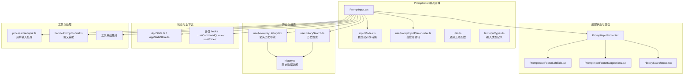
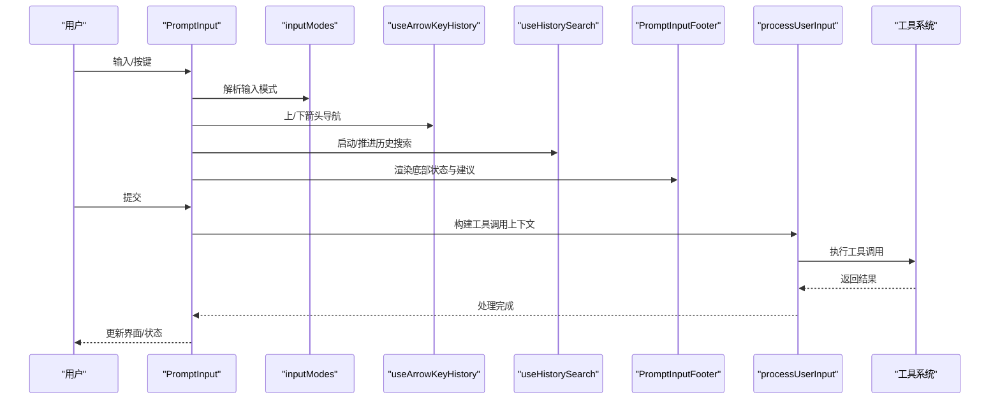
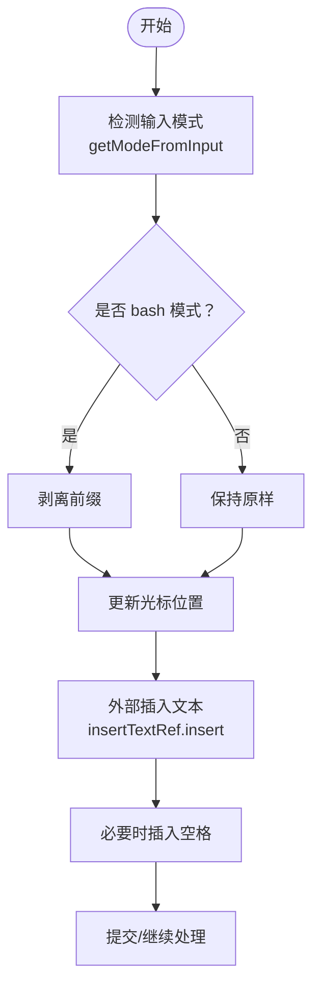
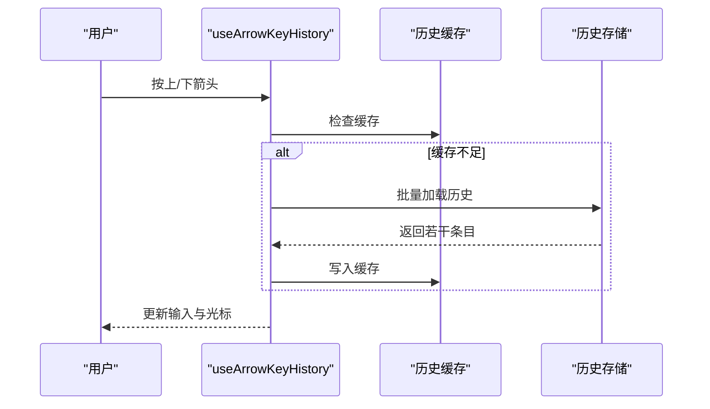
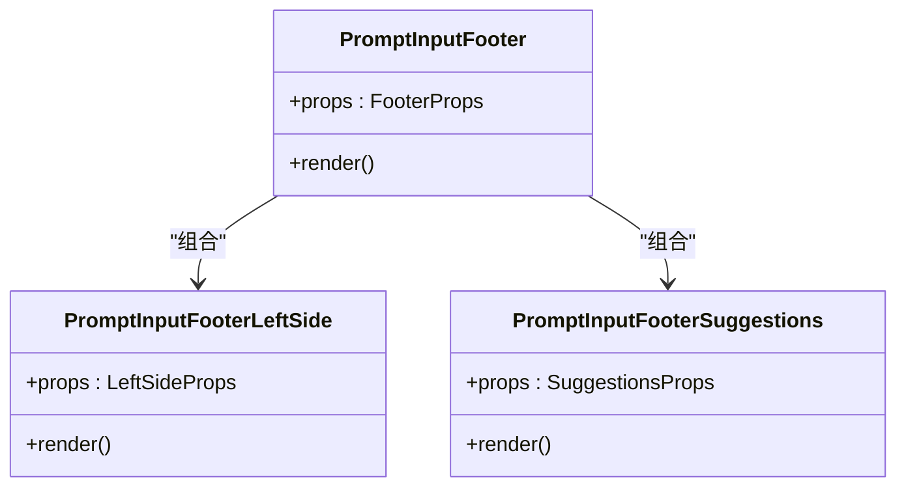
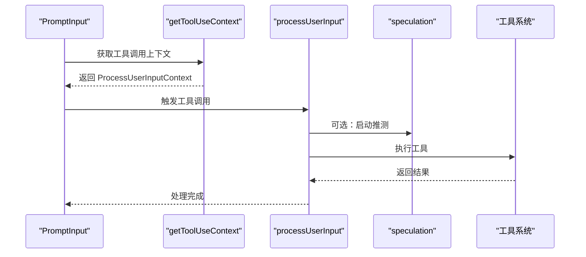
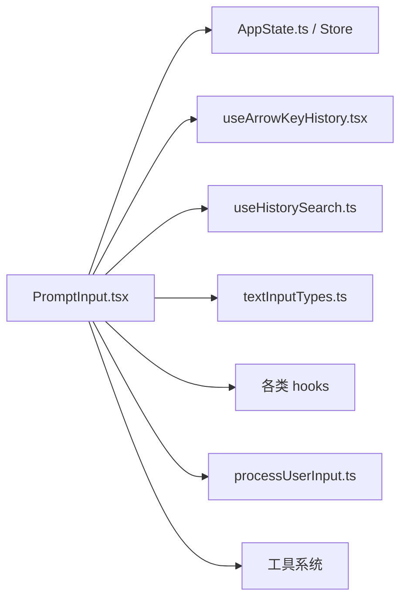

# 提示输入组件

<cite>
**本文档引用的文件**
- [PromptInput.tsx](file://src/components/PromptInput/PromptInput.tsx)
- [inputModes.ts](file://src/components/PromptInput/inputModes.ts)
- [usePromptInputPlaceholder.ts](file://src/components/PromptInput/usePromptInputPlaceholder.ts)
- [PromptInputFooter.tsx](file://src/components/PromptInput/PromptInputFooter.tsx)
- [PromptInputFooterLeftSide.tsx](file://src/components/PromptInput/PromptInputFooterLeftSide.tsx)
- [PromptInputFooterSuggestions.tsx](file://src/components/PromptInput/PromptInputFooterSuggestions.tsx)
- [HistorySearchInput.tsx](file://src/components/PromptInput/HistorySearchInput.tsx)
- [utils.ts](file://src/components/PromptInput/utils.ts)
- [textInputTypes.ts](file://src/types/textInputTypes.ts)
- [useArrowKeyHistory.tsx](file://src/hooks/useArrowKeyHistory.tsx)
- [useHistorySearch.ts](file://src/hooks/useHistorySearch.ts)
- [usePromptSuggestion.ts](file://src/hooks/usePromptSuggestion.ts)
- [useTypeahead.tsx](file://src/hooks/useTypeahead.tsx)
- [useCommandQueue.ts](file://src/hooks/useCommandQueue.ts)
- [AppState.ts](file://src/state/AppState.ts)
- [AppStateStore.ts](file://src/state/AppStateStore.ts)
- [processUserInput.ts](file://src/utils/processUserInput/processUserInput.ts)
- [handlePromptSubmit.ts](file://src/utils/handlePromptSubmit.ts)
- [history.ts](file://src/history.ts)
- [TextInput.tsx](file://src/components/TextInput.tsx)
- [VimTextInput.tsx](file://src/components/VimTextInput.tsx)
- [useVoice.ts](file://src/hooks/useVoice.ts)
- [useVoiceEnabled.ts](file://src/hooks/useVoiceEnabled.ts)
- [useVoiceIntegration.tsx](file://src/hooks/useVoiceIntegration.tsx)
- [useTextInput.ts](file://src/hooks/useTextInput.ts)
- [useMainLoopModel.ts](file://src/hooks/useMainLoopModel.ts)
- [usePromptSuggestion.ts](file://src/services/PromptSuggestion/promptSuggestion.ts)
- [speculation.ts](file://src/services/PromptSuggestion/speculation.ts)
- [useClaudeInChrome.tsx](file://src/hooks/useClaudeInChrome.tsx)
- [usePromptsFromClaudeInChrome.tsx](file://src/hooks/usePromptsFromClaudeInChrome.tsx)
- [useSearchInput.ts](file://src/hooks/useSearchInput.ts)
- [useCommandKeybindings.tsx](file://src/hooks/useCommandKeybindings.tsx)
- [useKeybinding.ts](file://src/hooks/useKeybinding.ts)
- [useKeybindingContext.ts](file://src/hooks/useKeybindingContext.ts)
- [shortcutFormat.ts](file://src/keybindings/shortcutFormat.ts)
- [KeybindingContext.tsx](file://src/keybindings/KeybindingContext.tsx)
- [useCommandQueue.ts](file://src/hooks/useCommandQueue.ts)
- [useIdeSelection.ts](file://src/hooks/useIdeSelection.ts)
- [useIdeAtMentioned.ts](file://src/hooks/useIdeAtMentioned.ts)
- [useBuddyNotification.ts](file://src/hooks/useBuddyNotification.ts)
- [useSwarmBanner.ts](file://src/hooks/useSwarmBanner.ts)
- [useShowFastIconHint.ts](file://src/hooks/useShowFastIconHint.ts)
- [useMaybeTruncateInput.ts](file://src/hooks/useMaybeTruncateInput.ts)
- [useTerminalSize.ts](file://src/hooks/useTerminalSize.ts)
- [useSettings.ts](file://src/hooks/useSettings.ts)
- [useNotifications.ts](file://src/hooks/useNotifications.ts)
- [useApiKeyVerification.ts](file://src/hooks/useApiKeyVerification.ts)
- [useMainLoopModel.ts](file://src/hooks/useMainLoopModel.ts)
- [usePromptSuggestion.ts](file://src/hooks/usePromptSuggestion.ts)
- [useTypeahead.tsx](file://src/hooks/useTypeahead.tsx)
- [useArrowKeyHistory.tsx](file://src/hooks/useArrowKeyHistory.tsx)
- [useHistorySearch.ts](file://src/hooks/useHistorySearch.ts)
- [useSearchInput.ts](file://src/hooks/useSearchInput.ts)
- [useCommandKeybindings.tsx](file://src/hooks/useCommandKeybindings.tsx)
- [useKeybinding.ts](file://src/hooks/useKeybinding.ts)
- [useKeybindingContext.ts](file://src/hooks/useKeybindingContext.ts)
- [shortcutFormat.ts](file://src/keybindings/shortcutFormat.ts)
- [KeybindingContext.tsx](file://src/keybindings/KeybindingContext.tsx)
- [useCommandQueue.ts](file://src/hooks/useCommandQueue.ts)
- [useIdeSelection.ts](file://src/hooks/useIdeSelection.ts)
- [useIdeAtMentioned.ts](file://src/hooks/useIdeAtMentioned.ts)
- [useBuddyNotification.ts](file://src/hooks/useBuddyNotification.ts)
- [useSwarmBanner.ts](file://src/hooks/useSwarmBanner.ts)
- [useShowFastIconHint.ts](file://src/hooks/useShowFastIconHint.ts)
- [useMaybeTruncateInput.ts](file://src/hooks/useMaybeTruncateInput.ts)
- [useTerminalSize.ts](file://src/hooks/useTerminalSize.ts)
- [useSettings.ts](file://src/hooks/useSettings.ts)
- [useNotifications.ts](file://src/hooks/useNotifications.ts)
- [useApiKeyVerification.ts](file://src/hooks/useApiKeyVerification.ts)
- [useMainLoopModel.ts](file://src/hooks/useMainLoopModel.ts)
- [usePromptSuggestion.ts](file://src/hooks/usePromptSuggestion.ts)
- [useTypeahead.tsx](file://src/hooks/useTypeahead.tsx)
- [useArrowKeyHistory.tsx](file://src/hooks/useArrowKeyHistory.tsx)
- [useHistorySearch.ts](file://src/hooks/useHistorySearch.ts)
- [useSearchInput.ts](file://src/hooks/useSearchInput.ts)
- [useCommandKeybindings.tsx](file://src/hooks/useCommandKeybindings.tsx)
- [useKeybinding.ts](file://src/hooks/useKeybinding.ts)
- [useKeybindingContext.ts](file://src/hooks/useKeybindingContext.ts)
- [shortcutFormat.ts](file://src/keybindings/shortcutFormat.ts)
- [KeybindingContext.tsx](file://src/keybindings/KeybindingContext.tsx)
</cite>

## 目录
1. [简介](#简介)
2. [项目结构](#项目结构)
3. [核心组件](#核心组件)
4. [架构总览](#架构总览)
5. [详细组件分析](#详细组件分析)
6. [依赖关系分析](#依赖关系分析)
7. [性能考量](#性能考量)
8. [故障排除指南](#故障排除指南)
9. [结论](#结论)
10. [附录](#附录)

## 简介
本文件面向 Claude Code Best 的提示输入组件 PromptInput，系统性阐述其设计架构与实现细节，覆盖输入模式管理、历史搜索、占位符提示、多模式输入（文本、语音、快捷命令）、历史记录管理与智能提示、输入验证与格式化、与工具系统的集成、以及可定制化方案与使用示例。目标是帮助开发者在不深入源码的前提下，理解并高效优化用户输入体验。

## 项目结构
PromptInput 位于组件层，围绕输入区域组织多个子模块：输入模式解析、占位符生成、底部状态栏与建议面板、历史搜索与箭头导航、键盘绑定与快捷键提示、语音输入集成、以及与全局状态（AppState）和工具系统（Tools）的交互。

**图表来源**
- [PromptInput.tsx:1-800](file://src/components/PromptInput/PromptInput.tsx#L1-L800)
- [inputModes.ts:1-34](file://src/components/PromptInput/inputModes.ts#L1-L34)
- [usePromptInputPlaceholder.ts:1-77](file://src/components/PromptInput/usePromptInputPlaceholder.ts#L1-L77)
- [PromptInputFooter.tsx:1-280](file://src/components/PromptInput/PromptInputFooter.tsx#L1-L280)
- [PromptInputFooterLeftSide.tsx:1-703](file://src/components/PromptInput/PromptInputFooterLeftSide.tsx#L1-L703)
- [PromptInputFooterSuggestions.tsx:1-252](file://src/components/PromptInput/PromptInputFooterSuggestions.tsx#L1-L252)
- [HistorySearchInput.tsx:1-38](file://src/components/PromptInput/HistorySearchInput.tsx#L1-L38)
- [useArrowKeyHistory.tsx:1-289](file://src/hooks/useArrowKeyHistory.tsx#L1-L289)
- [useHistorySearch.ts:1-303](file://src/hooks/useHistorySearch.ts#L1-L303)
- [history.ts:1-200](file://src/history.ts#L1-L200)
- [AppState.ts:1-200](file://src/state/AppState.ts#L1-L200)
- [AppStateStore.ts:1-200](file://src/state/AppStateStore.ts#L1-L200)
- [processUserInput.ts:1-200](file://src/utils/processUserInput/processUserInput.ts#L1-L200)
- [handlePromptSubmit.ts:1-200](file://src/utils/handlePromptSubmit.ts#L1-L200)

**章节来源**
- [PromptInput.tsx:1-800](file://src/components/PromptInput/PromptInput.tsx#L1-L800)
- [inputModes.ts:1-34](file://src/components/PromptInput/inputModes.ts#L1-L34)
- [usePromptInputPlaceholder.ts:1-77](file://src/components/PromptInput/usePromptInputPlaceholder.ts#L1-L77)
- [PromptInputFooter.tsx:1-280](file://src/components/PromptInput/PromptInputFooter.tsx#L1-L280)
- [PromptInputFooterLeftSide.tsx:1-703](file://src/components/PromptInput/PromptInputFooterLeftSide.tsx#L1-L703)
- [PromptInputFooterSuggestions.tsx:1-252](file://src/components/PromptInput/PromptInputFooterSuggestions.tsx#L1-L252)
- [HistorySearchInput.tsx:1-38](file://src/components/PromptInput/HistorySearchInput.tsx#L1-L38)
- [useArrowKeyHistory.tsx:1-289](file://src/hooks/useArrowKeyHistory.tsx#L1-L289)
- [useHistorySearch.ts:1-303](file://src/hooks/useHistorySearch.ts#L1-L303)
- [history.ts:1-200](file://src/history.ts#L1-L200)
- [AppState.ts:1-200](file://src/state/AppState.ts#L1-L200)
- [AppStateStore.ts:1-200](file://src/state/AppStateStore.ts#L1-L200)
- [processUserInput.ts:1-200](file://src/utils/processUserInput/processUserInput.ts#L1-L200)
- [handlePromptSubmit.ts:1-200](file://src/utils/handlePromptSubmit.ts#L1-L200)

## 核心组件
- PromptInput 主容器：负责输入值与光标位置跟踪、模式切换、历史搜索、占位符、底部状态栏与建议展示、语音/快捷命令等集成。
- inputModes：统一处理输入模式识别与转换（如 bash 模式前缀）。
- usePromptInputPlaceholder：根据会话状态动态生成占位符提示。
- PromptInputFooter 及其子组件：渲染底部状态栏、任务/团队/桥接等入口、快捷键提示、历史搜索输入框。
- 历史与搜索 hooks：useArrowKeyHistory 与 useHistorySearch，分别提供箭头导航与全文检索。
- 类型系统：textInputTypes 定义了输入模式、粘贴内容、队列优先级等关键类型。
- 工具系统集成：通过 getToolUseContext 与 processUserInput 驱动工具调用与参数传递。

**章节来源**
- [PromptInput.tsx:313-800](file://src/components/PromptInput/PromptInput.tsx#L313-L800)
- [inputModes.ts:1-34](file://src/components/PromptInput/inputModes.ts#L1-L34)
- [usePromptInputPlaceholder.ts:1-77](file://src/components/PromptInput/usePromptInputPlaceholder.ts#L1-L77)
- [PromptInputFooter.tsx:1-280](file://src/components/PromptInput/PromptInputFooter.tsx#L1-L280)
- [useArrowKeyHistory.tsx:1-289](file://src/hooks/useArrowKeyHistory.tsx#L1-L289)
- [useHistorySearch.ts:1-303](file://src/hooks/useHistorySearch.ts#L1-L303)
- [textInputTypes.ts:265-388](file://src/types/textInputTypes.ts#L265-L388)

## 架构总览
PromptInput 将“输入区域 + 底部状态栏 + 建议面板 + 历史与搜索”整合为一个统一的交互单元。其核心控制流如下：

**图表来源**
- [PromptInput.tsx:356-800](file://src/components/PromptInput/PromptInput.tsx#L356-L800)
- [inputModes.ts:16-33](file://src/components/PromptInput/inputModes.ts#L16-L33)
- [useArrowKeyHistory.tsx:74-289](file://src/hooks/useArrowKeyHistory.tsx#L74-L289)
- [useHistorySearch.ts:14-303](file://src/hooks/useHistorySearch.ts#L14-L303)
- [PromptInputFooter.tsx:75-232](file://src/components/PromptInput/PromptInputFooter.tsx#L75-L232)
- [processUserInput.ts:1-200](file://src/utils/processUserInput/processUserInput.ts#L1-L200)

## 详细组件分析

### 输入模式管理（文本/语音/快捷命令）
- 模式识别与转换
  - 通过 inputModes 提供 getModeFromInput、getValueFromInput、prependModeCharacterToInput 等方法，统一处理 prompt/bash 等模式。
  - bash 模式以特定字符作为前缀，进入时自动剥离前缀，退出时恢复显示。
- 光标与插入
  - PromptInput 跟踪 cursorOffset，并暴露 insertTextRef.insert 与 setInputWithCursor，允许外部（如语音转写）在当前光标处拼接文本，自动处理空格分隔。
- 快捷命令与 IDE 提及
  - 通过命令队列与 IDE 提及钩子，识别并高亮斜杠命令与 @ 成员提及，支持快速导航与高亮颜色映射。

**图表来源**
- [inputModes.ts:16-33](file://src/components/PromptInput/inputModes.ts#L16-L33)
- [PromptInput.tsx:389-410](file://src/components/PromptInput/PromptInput.tsx#L389-L410)

**章节来源**
- [inputModes.ts:1-34](file://src/components/PromptInput/inputModes.ts#L1-L34)
- [PromptInput.tsx:389-410](file://src/components/PromptInput/PromptInput.tsx#L389-L410)
- [useIdeAtMentioned.ts:1-200](file://src/hooks/useIdeAtMentioned.ts#L1-L200)

### 历史搜索与箭头导航
- 箭头历史导航
  - useArrowKeyHistory 实现上/下箭头浏览历史，支持按模式过滤（prompt/bash），并缓存批量加载以降低磁盘 IO。
  - 支持草稿保存与恢复，避免在浏览过程中丢失当前输入。
- 历史搜索
  - useHistorySearch 提供实时全文检索，逐条匹配历史记录，支持取消、接受、执行等操作；当查询为空时回滚到原始输入。
  - 通过 makeHistoryReader 异步迭代历史，避免阻塞 UI。

**图表来源**
- [useArrowKeyHistory.tsx:22-72](file://src/hooks/useArrowKeyHistory.tsx#L22-L72)
- [useArrowKeyHistory.tsx:166-234](file://src/hooks/useArrowKeyHistory.tsx#L166-L234)

**章节来源**
- [useArrowKeyHistory.tsx:1-289](file://src/hooks/useArrowKeyHistory.tsx#L1-L289)
- [useHistorySearch.ts:1-303](file://src/hooks/useHistorySearch.ts#L1-L303)
- [history.ts:1-200](file://src/history.ts#L1-L200)

### 占位符提示系统
- 动态占位符
  - usePromptInputPlaceholder 在输入为空时，根据会话状态返回不同提示：正在查看的同伴名称、未查看过的队列命令提示、首次提交时的示例命令等。
- 主题与特性开关
  - 通过全局配置与特性开关（如 PROACTIVE/KAIROS）控制占位符显示策略，避免干扰模型驱动的对话流程。

**章节来源**
- [usePromptInputPlaceholder.ts:1-77](file://src/components/PromptInput/usePromptInputPlaceholder.ts#L1-L77)

### 底部状态栏与智能提示
- 底部状态栏
  - PromptInputFooter 根据终端尺寸与状态显示状态行、通知、桥接状态等；在全屏模式下将建议面板挂载到覆盖层。
- 智能提示
  - PromptInputFooterSuggestions 渲染命令/文件/MCP 资源/代理等建议项，支持图标、标签与描述，自动计算宽度与截断策略。
  - PromptInputFooterLeftSide 提供权限模式、任务/团队/桥接入口、快捷键提示、语音/选择提示等。

**图表来源**
- [PromptInputFooter.tsx:75-232](file://src/components/PromptInput/PromptInputFooter.tsx#L75-L232)
- [PromptInputFooterLeftSide.tsx:127-189](file://src/components/PromptInput/PromptInputFooterLeftSide.tsx#L127-L189)
- [PromptInputFooterSuggestions.tsx:192-252](file://src/components/PromptInput/PromptInputFooterSuggestions.tsx#L192-L252)

**章节来源**
- [PromptInputFooter.tsx:1-280](file://src/components/PromptInput/PromptInputFooter.tsx#L1-L280)
- [PromptInputFooterLeftSide.tsx:1-703](file://src/components/PromptInput/PromptInputFooterLeftSide.tsx#L1-L703)
- [PromptInputFooterSuggestions.tsx:1-252](file://src/components/PromptInput/PromptInputFooterSuggestions.tsx#L1-L252)

### 输入验证与格式化
- 输入过滤
  - isNonSpacePrintable 用于判断是否为“非空白可打印字符”，在图片粘贴后自动插入空格，避免与后续字符连写。
- 模式校验
  - getModeFromInput 与 getValueFromInput 保证模式与值的一致性，防止错误前缀导致的显示/提交异常。
- 文本截断
  - useMaybeTruncateInput 在长输入场景中进行截断，结合终端宽度与布局约束，避免溢出。

**章节来源**
- [utils.ts:39-61](file://src/components/PromptInput/utils.ts#L39-L61)
- [inputModes.ts:16-33](file://src/components/PromptInput/inputModes.ts#L16-L33)
- [useMaybeTruncateInput.ts:1-200](file://src/hooks/useMaybeTruncateInput.ts#L1-L200)

### 与工具系统的集成
- 工具调用上下文
  - getToolUseContext 与 processUserInput 驱动工具调用，支持消息队列、权限模式、模型选择等上下文信息。
- 参数传递
  - 通过 QueuedCommand 与 PastContent 结构传递粘贴内容与模式信息，确保工具执行时具备完整上下文。
- 提交辅助
  - handlePromptSubmit 提供提交过程中的状态管理与推测（speculation）控制，支持时间节省统计与中断。

**图表来源**
- [PromptInput.tsx:343-348](file://src/components/PromptInput/PromptInput.tsx#L343-L348)
- [processUserInput.ts:1-200](file://src/utils/processUserInput/processUserInput.ts#L1-L200)
- [speculation.ts:1-200](file://src/services/PromptSuggestion/speculation.ts#L1-L200)

**章节来源**
- [PromptInput.tsx:343-348](file://src/components/PromptInput/PromptInput.tsx#L343-L348)
- [processUserInput.ts:1-200](file://src/utils/processUserInput/processUserInput.ts#L1-L200)
- [speculation.ts:1-200](file://src/services/PromptSuggestion/speculation.ts#L1-L200)

### 语音输入与快捷命令
- 语音输入
  - 通过 useVoice、useVoiceEnabled、useVoiceIntegration 集成语音状态与热键，支持“按住说话”与暖场提示。
- 快捷命令
  - 通过 useCommandKeybindings 与 KeybindingContext 提供可配置快捷键，支持上下文感知与动态提示。

**章节来源**
- [useVoice.ts:1-200](file://src/hooks/useVoice.ts#L1-L200)
- [useVoiceEnabled.ts:1-200](file://src/hooks/useVoiceEnabled.ts#L1-L200)
- [useVoiceIntegration.tsx:1-200](file://src/hooks/useVoiceIntegration.tsx#L1-L200)
- [useCommandKeybindings.tsx:1-200](file://src/hooks/useCommandKeybindings.tsx#L1-L200)
- [KeybindingContext.tsx:1-200](file://src/hooks/KeybindingContext.tsx#L1-L200)

### 多模式输入支持（文本、语音、快捷命令）
- 文本输入
  - TextInput/VimTextInput 提供基础文本编辑能力，支持多行、光标移动、粘贴与图像引用。
- 语音输入
  - 与语音钩子联动，支持热键触发与状态反馈，自动处理粘贴后的空格插入。
- 快捷命令
  - 通过斜杠命令与 IDE 提及，提供命令补全与高亮，支持权限模式与工具调用。

**章节来源**
- [TextInput.tsx:1-200](file://src/components/TextInput.tsx#L1-L200)
- [VimTextInput.tsx:1-200](file://src/components/VimTextInput.tsx#L1-L200)
- [useVoice.ts:1-200](file://src/hooks/useVoice.ts#L1-L200)
- [useIdeAtMentioned.ts:1-200](file://src/hooks/useIdeAtMentioned.ts#L1-L200)

## 依赖关系分析
PromptInput 的耦合点主要集中在：
- 状态层：AppState/AppStateStore 提供全局状态读取与变更。
- 历史层：history.ts 提供历史读取接口，useArrowKeyHistory 与 useHistorySearch 依赖之。
- 键盘绑定：useKeybinding/useKeybindings 与 KeybindingContext 提供上下文感知的快捷键。
- 工具系统：processUserInput 与工具类型定义（QueuedCommand、PastedContent）。

**图表来源**
- [PromptInput.tsx:1-800](file://src/components/PromptInput/PromptInput.tsx#L1-L800)
- [AppState.ts:1-200](file://src/state/AppState.ts#L1-L200)
- [AppStateStore.ts:1-200](file://src/state/AppStateStore.ts#L1-L200)
- [useArrowKeyHistory.tsx:1-289](file://src/hooks/useArrowKeyHistory.tsx#L1-L289)
- [useHistorySearch.ts:1-303](file://src/hooks/useHistorySearch.ts#L1-L303)
- [textInputTypes.ts:265-388](file://src/types/textInputTypes.ts#L265-L388)
- [processUserInput.ts:1-200](file://src/utils/processUserInput/processUserInput.ts#L1-L200)

**章节来源**
- [PromptInput.tsx:1-800](file://src/components/PromptInput/PromptInput.tsx#L1-L800)
- [AppState.ts:1-200](file://src/state/AppState.ts#L1-L200)
- [AppStateStore.ts:1-200](file://src/state/AppStateStore.ts#L1-L200)
- [useArrowKeyHistory.tsx:1-289](file://src/hooks/useArrowKeyHistory.tsx#L1-L289)
- [useHistorySearch.ts:1-303](file://src/hooks/useHistorySearch.ts#L1-L303)
- [textInputTypes.ts:265-388](file://src/types/textInputTypes.ts#L265-L388)
- [processUserInput.ts:1-200](file://src/utils/processUserInput/processUserInput.ts#L1-L200)

## 性能考量
- 历史加载批量化：useArrowKeyHistory 使用 HISTORY_CHUNK_SIZE 与 pendingLoad 共享机制，减少频繁磁盘读取。
- 异步搜索：useHistorySearch 通过 makeHistoryReader 与 AbortController 控制搜索生命周期，避免重复扫描。
- 建议面板虚拟化：PromptInputFooterSuggestions 计算可见范围与最大显示数量，避免一次性渲染过多项。
- 状态订阅最小化：通过 useSyncExternalStore 与 useMemo 降低不必要的重渲染。

[本节为通用指导，无需具体文件来源]

## 故障排除指南
- 历史搜索无结果
  - 检查 useHistorySearch 的失败标记与原始输入恢复逻辑，确认查询是否为空或已取消。
- 粘贴内容未正确插入
  - 确认 isNonSpacePrintable 判定与 pendingSpaceAfterPillRef 的状态，确保在图片粘贴后插入空格。
- 底部状态栏闪烁或布局错位
  - 检查 PromptInputFooter 的全屏模式分支与高度固定策略，确保稳定高度。
- 语音提示未出现
  - 确认 useVoiceEnabled 与 useVoiceIntegration 的状态同步，检查提示计数上限。

**章节来源**
- [useHistorySearch.ts:72-147](file://src/hooks/useHistorySearch.ts#L72-L147)
- [utils.ts:39-61](file://src/components/PromptInput/utils.ts#L39-L61)
- [PromptInputFooter.tsx:138-145](file://src/components/PromptInput/PromptInputFooter.tsx#L138-L145)
- [useVoice.ts:1-200](file://src/hooks/useVoice.ts#L1-L200)

## 结论
PromptInput 通过清晰的模块划分与强类型约束，实现了多模式输入、历史搜索、智能提示与工具系统集成的统一体验。其设计在性能（批量化历史加载、异步搜索、建议面板虚拟化）与可用性（占位符提示、底部状态栏、语音/快捷命令）之间取得良好平衡。开发者可在不破坏整体架构的前提下，通过定制样式、行为与扩展功能，进一步优化用户输入体验。

## 附录
- 使用示例与集成指南
  - 自定义占位符：在 usePromptInputPlaceholder 中添加业务场景提示，注意与特性开关协同。
  - 扩展输入模式：在 inputModes 中新增模式识别规则，并在 PromptInput 中接入相应 UI。
  - 历史搜索增强：在 useHistorySearch 中增加字段过滤或排序策略，提升检索效率。
  - 工具调用扩展：通过 getToolUseContext 注入自定义上下文，配合 processUserInput 完成参数传递。
  - 语音与快捷命令：利用 useVoice 与 useCommandKeybindings 提升无障碍与效率。

[本节为概念性总结，无需具体文件来源]