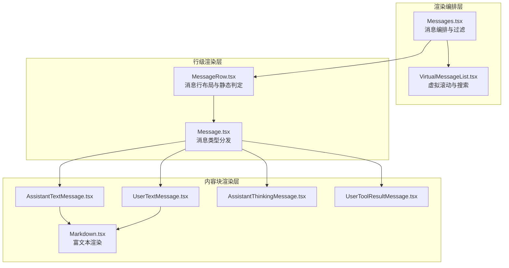
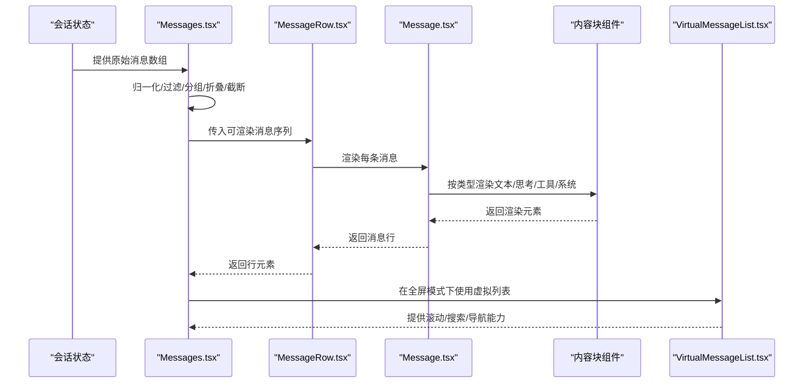
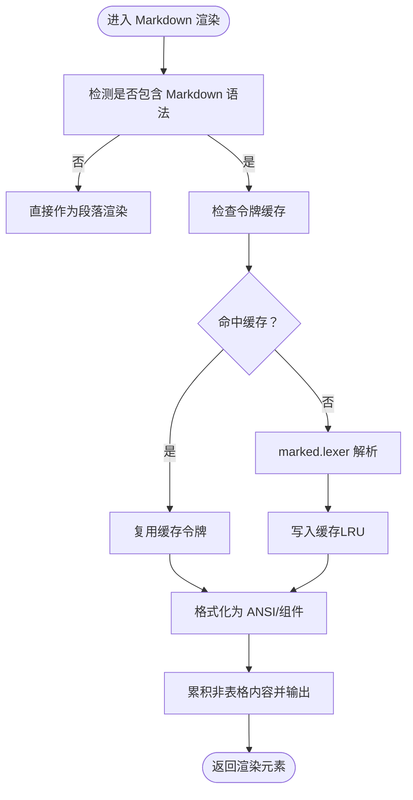
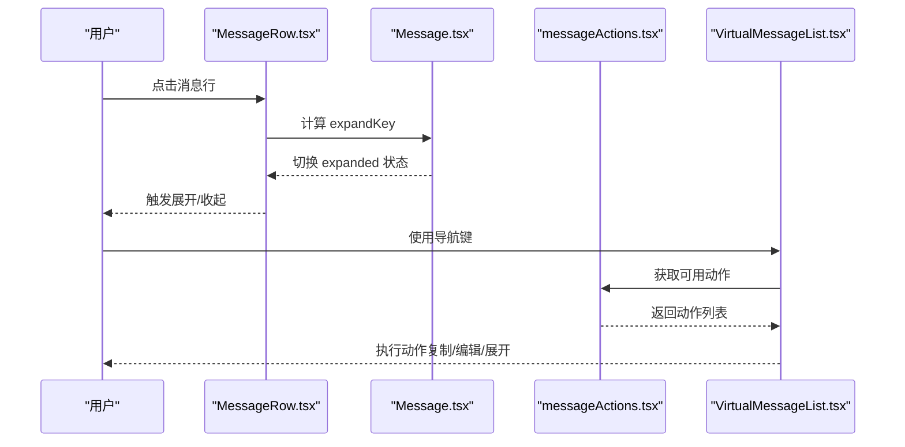
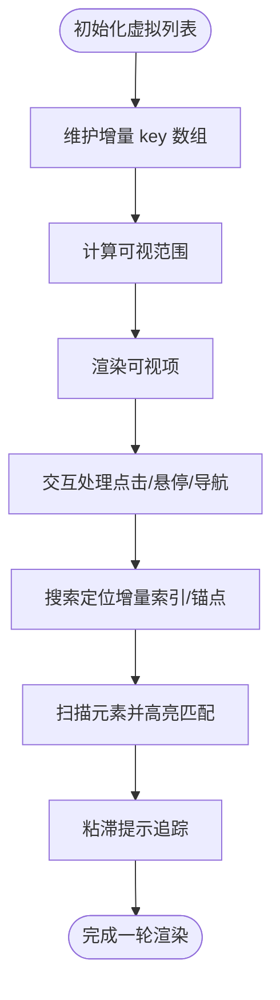
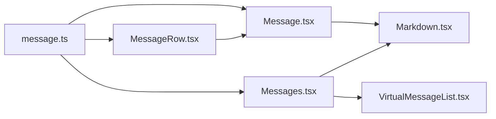

# 消息显示系统

<cite>
**本文档引用的文件**
- [Messages.tsx](file://src/components/Messages.tsx)
- [Message.tsx](file://src/components/Message.tsx)
- [MessageRow.tsx](file://src/components/MessageRow.tsx)
- [Markdown.tsx](file://src/components/Markdown.tsx)
- [VirtualMessageList.tsx](file://src/components/VirtualMessageList.tsx)
- [messageActions.tsx](file://src/components/messageActions.tsx)
- [message.ts](file://src/types/message.ts)
- [AssistantTextMessage.tsx](file://src/components/messages/AssistantTextMessage.tsx)
- [UserTextMessage.tsx](file://src/components/messages/UserTextMessage.tsx)
- [AssistantThinkingMessage.tsx](file://src/components/messages/AssistantThinkingMessage.tsx)
- [UserToolResultMessage.tsx](file://src/components/messages/UserToolResultMessage/UserToolResultMessage.tsx)
</cite>

## 目录
1. [简介](#简介)
2. [项目结构](#项目结构)
3. [核心组件](#核心组件)
4. [架构总览](#架构总览)
5. [详细组件分析](#详细组件分析)
6. [依赖关系分析](#依赖关系分析)
7. [性能考量](#性能考量)
8. [故障排查指南](#故障排查指南)
9. [结论](#结论)
10. [附录](#附录)

## 简介
本文件面向 Claude Code Best 的消息显示系统，系统性阐述消息组件的架构设计、消息类型分类、渲染策略、交互处理机制与历史管理能力。重点覆盖以下方面：
- 消息类型与内容块的分类与渲染路径
- 富文本渲染（Markdown、代码高亮、表格、链接等）
- 历史管理（虚拟滚动、滚动控制、搜索定位、上下文关联）
- 定制化（样式主题、显示选项、交互行为）
- 性能优化与实现建议

## 项目结构
消息显示系统围绕三大层次展开：
- 渲染编排层：负责消息归一化、分组折叠、截断与可见性控制
- 行级渲染层：负责单条消息行的布局、元数据展示与静态判定
- 内容块渲染层：负责具体消息类型的渲染（用户文本、助手文本、思考、工具调用/结果、系统通知等）

图表来源
- [Messages.tsx:395-800](file://src/components/Messages.tsx#L395-L800)
- [MessageRow.tsx:118-250](file://src/components/MessageRow.tsx#L118-L250)
- [Message.tsx:82-282](file://src/components/Message.tsx#L82-L282)
- [Markdown.tsx:80-147](file://src/components/Markdown.tsx#L80-L147)
- [VirtualMessageList.tsx:256-360](file://src/components/VirtualMessageList.tsx#L256-L360)

章节来源
- [Messages.tsx:395-800](file://src/components/Messages.tsx#L395-L800)
- [MessageRow.tsx:118-250](file://src/components/MessageRow.tsx#L118-L250)
- [Message.tsx:82-282](file://src/components/Message.tsx#L82-L282)
- [Markdown.tsx:80-147](file://src/components/Markdown.tsx#L80-L147)
- [VirtualMessageList.tsx:256-360](file://src/components/VirtualMessageList.tsx#L256-L360)

## 核心组件
- Messages.tsx：消息编排与渲染入口，负责消息归一化、分组折叠、截断、Brief 模式过滤、思维块可见性控制、虚拟滚动门控与安全上限。
- MessageRow.tsx：单行消息渲染器，负责静态判定、动画开关、元数据（时间戳、模型名）展示、内容块渲染。
- Message.tsx：消息类型分发器，按类型路由到具体内容块组件，并处理思维块、顾问块、可点击区域等。
- Markdown.tsx：富文本渲染引擎，支持语法高亮、表格、ANSI 输出、流式增量渲染。
- VirtualMessageList.tsx：全屏模式下的虚拟滚动列表，提供滚动控制、搜索定位、粘滞提示追踪、消息导航。

章节来源
- [Messages.tsx:249-428](file://src/components/Messages.tsx#L249-L428)
- [MessageRow.tsx:26-49](file://src/components/MessageRow.tsx#L26-L49)
- [Message.tsx:49-80](file://src/components/Message.tsx#L49-L80)
- [Markdown.tsx:14-18](file://src/components/Markdown.tsx#L14-L18)
- [VirtualMessageList.tsx:80-126](file://src/components/VirtualMessageList.tsx#L80-L126)

## 架构总览
消息从“输入/流式生成”到“终端渲染”的关键流程如下：

图表来源
- [Messages.tsx:568-688](file://src/components/Messages.tsx#L568-L688)
- [MessageRow.tsx:118-250](file://src/components/MessageRow.tsx#L118-L250)
- [Message.tsx:82-282](file://src/components/Message.tsx#L82-L282)
- [VirtualMessageList.tsx:256-360](file://src/components/VirtualMessageList.tsx#L256-L360)

## 详细组件分析

### 消息类型与内容块
- 用户消息（user）：支持文本、图片、工具结果；文本可能携带计划内容、中断信息、命令标签、GitHub/Webhook 等特殊标记。
- 助手消息（assistant）：支持文本、思考、红acted_thinking、工具调用、服务器工具结果（advisor）等。
- 系统消息（system）：用于边界标记、本地命令、权限/速率限制提示、内存节省统计等。
- 附件消息（attachment）：用于队列命令、诊断、钩子错误等。
- 工具聚合消息（grouped_tool_use）与折叠读取搜索组（collapsed_read_search）：对多工具/多结果进行合并与折叠展示。

章节来源
- [message.ts:19-164](file://src/types/message.ts#L19-L164)
- [Message.tsx:103-281](file://src/components/Message.tsx#L103-L281)
- [UserTextMessage.tsx:40-198](file://src/components/messages/UserTextMessage.tsx#L40-L198)
- [AssistantTextMessage.tsx:65-223](file://src/components/messages/AssistantTextMessage.tsx#L65-L223)
- [AssistantThinkingMessage.tsx:23-67](file://src/components/messages/AssistantThinkingMessage.tsx#L23-L67)
- [UserToolResultMessage.tsx:32-102](file://src/components/messages/UserToolResultMessage/UserToolResultMessage.tsx#L32-L102)

### 渲染策略与富文本
- 文本渲染：统一通过 Markdown 组件进行解析与渲染，支持表格、代码块、列表、强调等。
- 代码高亮：在设置启用时，使用异步加载的 CLI 高亮模块，首帧以降级方式呈现，随后切换至高亮版本。
- 流式渲染：StreamingMarkdown 通过稳定前缀跟踪，仅重新解析新增部分，避免整段重算。
- 链接与表格：Markdown 组件将表格单独渲染为 React 组件，其他内容以 ANSI 字符串输出，保证终端兼容性。

图表来源
- [Markdown.tsx:41-73](file://src/components/Markdown.tsx#L41-L73)
- [Markdown.tsx:107-140](file://src/components/Markdown.tsx#L107-L140)
- [Markdown.tsx:163-215](file://src/components/Markdown.tsx#L163-L215)

章节来源
- [Markdown.tsx:80-147](file://src/components/Markdown.tsx#L80-L147)
- [Markdown.tsx:163-215](file://src/components/Markdown.tsx#L163-L215)

### 交互处理机制
- 消息行点击：在可点击区域（如折叠组、顾问块、被截断的工具结果）触发“展开/收起”，持久化展开键集合。
- 消息动作：支持复制、编辑、展开/折叠、复制工具主输入等；动作根据当前选中消息类型动态可用。
- 全屏导航：通过 VirtualMessageList 提供键盘导航、跳转到索引、搜索定位、粘滞提示追踪等功能。

图表来源
- [MessageRow.tsx:716-730](file://src/components/MessageRow.tsx#L716-L730)
- [Message.tsx:499-527](file://src/components/Message.tsx#L499-L527)
- [messageActions.tsx:140-179](file://src/components/messageActions.tsx#L140-L179)
- [VirtualMessageList.tsx:319-360](file://src/components/VirtualMessageList.tsx#L319-L360)

章节来源
- [MessageRow.tsx:716-730](file://src/components/MessageRow.tsx#L716-L730)
- [Message.tsx:499-527](file://src/components/Message.tsx#L499-L527)
- [messageActions.tsx:140-179](file://src/components/messageActions.tsx#L140-L179)
- [VirtualMessageList.tsx:319-360](file://src/components/VirtualMessageList.tsx#L319-L360)

### 历史管理机制
- 虚拟滚动：在全屏模式下启用，基于 useVirtualScroll 实现，仅渲染可视区域，显著降低内存占用与重绘成本。
- 安全上限：在非虚拟滚动路径下，采用基于 UUID 锚点的切片策略，避免计数切片导致的滚动回退与全屏重置。
- 搜索定位：提供增量搜索索引预热、锚点记忆、匹配计数与当前序号计算、位置扫描与高亮。
- 上下文关联：粘滞提示追踪（sticky prompt）支持从头部点击或滚动追踪，保持提示文本与滚动位置的稳定关联。

图表来源
- [VirtualMessageList.tsx:274-360](file://src/components/VirtualMessageList.tsx#L274-L360)
- [VirtualMessageList.tsx:441-497](file://src/components/VirtualMessageList.tsx#L441-L497)
- [VirtualMessageList.tsx:647-769](file://src/components/VirtualMessageList.tsx#L647-L769)

章节来源
- [VirtualMessageList.tsx:274-360](file://src/components/VirtualMessageList.tsx#L274-L360)
- [VirtualMessageList.tsx:441-497](file://src/components/VirtualMessageList.tsx#L441-L497)
- [VirtualMessageList.tsx:647-769](file://src/components/VirtualMessageList.tsx#L647-L769)

### 消息显示特性详解
- 用户消息（UserTextMessage）：识别并渲染中断、命令、计划、bash 输出、本地命令输出、GitHub webhook、MCP 资源更新、跨会话消息、通道消息等。
- 助手回复（AssistantTextMessage）：处理速率限制、API 错误、无效密钥、余额不足、超时、关闭开关等系统提示；其余文本通过 Markdown 渲染。
- 思考过程（AssistantThinkingMessage）：在非 transcript 模式且未 verbose 时仅显示“展开提示”，否则完整渲染思考内容。
- 工具输出（UserToolResultMessage）：区分成功、取消、拒绝、错误等不同结果，分别渲染对应 UI。
- 系统通知：根据 subtype 渲染边界、微边界、本地命令、内存节省、代理终止等信息。

章节来源
- [UserTextMessage.tsx:40-198](file://src/components/messages/UserTextMessage.tsx#L40-L198)
- [AssistantTextMessage.tsx:65-223](file://src/components/messages/AssistantTextMessage.tsx#L65-L223)
- [AssistantThinkingMessage.tsx:23-67](file://src/components/messages/AssistantThinkingMessage.tsx#L23-L67)
- [UserToolResultMessage.tsx:32-102](file://src/components/messages/UserToolResultMessage/UserToolResultMessage.tsx#L32-L102)

### 消息编排与过滤
- 归一化与过滤：去除空消息、进度消息、无渲染附件等；按屏幕模式与 verbose 控制可见性。
- 分组与折叠：对工具调用进行分组与去重，折叠后台 bash 通知、钩子摘要、团队成员关闭、读取/搜索组等。
- 截断与 Brief 模式：在 transcript 模式默认截断最近若干条；Brief 模式仅保留 Brief 工具调用与结果，必要时去除重复文本。
- 思维块可见性：在 transcript 模式隐藏历史思考块，仅保留最新一个或在流式时短暂保留。

章节来源
- [Messages.tsx:568-688](file://src/components/Messages.tsx#L568-L688)
- [Messages.tsx:125-247](file://src/components/Messages.tsx#L125-L247)
- [Messages.tsx:441-481](file://src/components/Messages.tsx#L441-L481)

## 依赖关系分析
- 类型与工具：消息类型定义位于 types/message.ts；消息工具函数（查找、重组、分组、折叠）在 utils/messages.js 中。
- 组件间耦合：Messages.tsx 与 MessageRow.tsx 通过 RenderableMessage 接口耦合；Message.tsx 通过内容块组件解耦。
- 外部依赖：@anthropic/ink 提供终端渲染能力；marked 用于 Markdown 解析；cli-highlight 提供代码高亮。

图表来源
- [message.ts:19-164](file://src/types/message.ts#L19-L164)
- [Message.tsx:82-282](file://src/components/Message.tsx#L82-L282)
- [MessageRow.tsx:118-250](file://src/components/MessageRow.tsx#L118-L250)
- [Messages.tsx:568-688](file://src/components/Messages.tsx#L568-L688)
- [VirtualMessageList.tsx:256-360](file://src/components/VirtualMessageList.tsx#L256-L360)
- [Markdown.tsx:80-147](file://src/components/Markdown.tsx#L80-L147)

章节来源
- [message.ts:19-164](file://src/types/message.ts#L19-L164)
- [Message.tsx:82-282](file://src/components/Message.tsx#L82-L282)
- [MessageRow.tsx:118-250](file://src/components/MessageRow.tsx#L118-L250)
- [Messages.tsx:568-688](file://src/components/Messages.tsx#L568-L688)
- [VirtualMessageList.tsx:256-360](file://src/components/VirtualMessageList.tsx#L256-L360)
- [Markdown.tsx:80-147](file://src/components/Markdown.tsx#L80-L147)

## 性能考量
- 虚拟滚动优先：在全屏模式下强制启用虚拟滚动，避免一次性挂载大量 Fiber 树导致内存与 GC 压力。
- 安全上限与锚点切片：在非虚拟滚动路径下，使用基于 UUID 的锚点切片，避免计数切片带来的滚动回退与全屏重置。
- Markdown 缓存：令牌缓存（LRU）与语法检测短路，减少重复解析成本。
- 流式增量渲染：StreamingMarkdown 仅重算新增块，配合稳定前缀跟踪，显著降低滚动重渲染成本。
- 静态判定与冻结：MessageRow 对静态消息进行 memo 化，并在外层使用 OffscreenFreeze 防止滚动回退时的全量重绘。

章节来源
- [Messages.tsx:323-393](file://src/components/Messages.tsx#L323-L393)
- [Markdown.tsx:20-73](file://src/components/Markdown.tsx#L20-L73)
- [Markdown.tsx:163-215](file://src/components/Markdown.tsx#L163-L215)
- [MessageRow.tsx:307-355](file://src/components/MessageRow.tsx#L307-L355)

## 故障排查指南
- 思维块不显示或闪烁：检查 transcript 模式下的隐藏逻辑与流式思维可见性判断。
- 工具结果未展开：确认 isItemClickable 条件与工具截断判定，确保点击区域有效。
- 搜索无结果或高亮错位：检查 extractSearchText 缓存与 scanElement 返回的位置是否稳定。
- 性能异常：确认是否启用了虚拟滚动；检查 Markdown 令牌缓存命中率与流式增量渲染是否生效。

章节来源
- [Messages.tsx:441-481](file://src/components/Messages.tsx#L441-L481)
- [MessageRow.tsx:739-762](file://src/components/MessageRow.tsx#L739-L762)
- [VirtualMessageList.tsx:647-769](file://src/components/VirtualMessageList.tsx#L647-L769)

## 结论
该消息显示系统通过清晰的三层架构实现了高性能、可扩展的终端消息渲染。其关键优势包括：
- 严谨的消息类型与内容块划分，便于扩展新消息类型
- 强大的富文本渲染与代码高亮能力
- 全屏虚拟滚动与搜索定位，保障长历史会话的流畅体验
- 可定制的显示选项与交互行为，满足不同场景需求

## 附录
- 定制化建议
  - 主题与样式：通过 Markdown 与 Ink 主题系统调整颜色与布局
  - 显示选项：利用 verbose、hidePastThinking、isBriefOnly 等参数控制显示密度
  - 交互行为：通过 messageActions 自定义动作与快捷键绑定
- 实现示例路径
  - 消息编排与过滤：[Messages.tsx:568-688](file://src/components/Messages.tsx#L568-L688)
  - 行级渲染与静态判定：[MessageRow.tsx:118-250](file://src/components/MessageRow.tsx#L118-L250)
  - 内容块渲染（文本/思考/工具）：[Message.tsx:82-282](file://src/components/Message.tsx#L82-L282)
  - 富文本渲染与高亮：[Markdown.tsx:80-147](file://src/components/Markdown.tsx#L80-L147)
  - 虚拟滚动与搜索：[VirtualMessageList.tsx:256-360](file://src/components/VirtualMessageList.tsx#L256-L360)