# 用户界面系统

<cite>
**本文引用的文件**
- [REPL.tsx](file://src/screens/REPL.tsx)
- [PromptInput.tsx](file://src/components/PromptInput/PromptInput.tsx)
- [Messages.tsx](file://src/components/Messages.tsx)
- [Spinner.tsx](file://src/components/Spinner.tsx)
- [ContextVisualization.tsx](file://src/components/ContextVisualization.tsx)
- [GlobalSearchDialog.tsx](file://src/components/GlobalSearchDialog.tsx)
- [ExportDialog.tsx](file://src/components/ExportDialog.tsx)
- [HistorySearchDialog.tsx](file://src/components/HistorySearchDialog.tsx)
- [ContextSuggestions.tsx](file://src/components/ContextSuggestions.tsx)
- [FuzzyPicker.tsx](file://src/components/design-system/FuzzyPicker.tsx)
- [SearchBox.tsx](file://src/components/SearchBox.tsx)
- [index.ts](file://packages/@ant/ink/src/index.ts)
- [root.ts](file://packages/@ant/ink/src/core/root.ts)
- [StdinContext.ts](file://packages/@ant/ink/src/components/StdinContext.ts)
- [useTerminalSize.ts](file://packages/@ant/ink/src/hooks/useTerminalSize.ts)
- [color.ts](file://src/components/design-system/color.ts)
- [staticRender.tsx](file://src/utils/staticRender.tsx)
- [logoV2Utils.ts](file://src/utils/logoV2Utils.ts)
</cite>

## 更新摘要
**所做更改**
- 新增了多个UI组件的中文本地化支持改进章节
- 更新了对话框组件的中文界面元素说明
- 增强了搜索和过滤功能的中文支持
- 完善了视觉反馈和用户界面元素的中文本地化

## 目录
1. [简介](#简介)
2. [项目结构](#项目结构)
3. [核心组件](#核心组件)
4. [架构总览](#架构总览)
5. [组件详解](#组件详解)
6. [中文本地化增强](#中文本地化增强)
7. [依赖关系分析](#依赖关系分析)
8. [性能考量](#性能考量)
9. [故障排查指南](#故障排查指南)
10. [结论](#结论)
11. [附录](#附录)

## 简介
本文件面向 Claude Code 的用户界面系统，聚焦于基于 React Ink 的终端 UI 架构与组件体系。内容涵盖组件层次结构、状态管理与事件处理机制，重点解析 REPL 界面、提示输入框、消息显示与进度指示器等核心组件，并说明主题系统的设计与定制方法、响应式布局与交互设计原则，以及 UI 组件的使用与扩展指南。

**更新** 本版本特别关注了多个UI组件的中文本地化支持改进，包括上下文可视化、全局搜索对话框、导出对话框和历史搜索对话框等组件的中文界面元素增强。

## 项目结构
- UI 层采用 React Ink 作为终端渲染框架，提供 Box、Text、ScrollBox 等基础组件与主题化封装（ThemedBox、ThemedText）。
- 应用入口通过 wrappedRender 将 React 组件树渲染至终端屏幕缓冲区，支持同步渲染与实例生命周期管理。
- 主屏 REPL.tsx 作为交互中枢，组合 Messages、PromptInput、Spinner 等子组件，承载对话、输入、状态与通知。
- 设计系统层提供主题感知的颜色函数，统一颜色应用策略。
- 对话框组件采用 FuzzyPicker 基础组件，支持中文搜索和过滤功能。

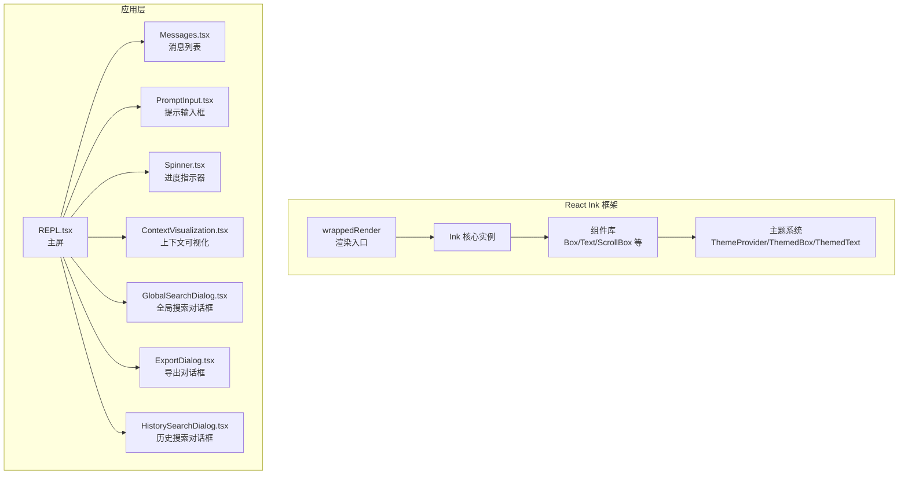

**图表来源**
- [index.ts:1-127](file://packages/@ant/ink/src/index.ts#L1-L127)
- [root.ts:89-125](file://packages/@ant/ink/src/core/root.ts#L89-L125)
- [REPL.tsx:1-120](file://src/screens/REPL.tsx#L1-L120)
- [ContextVisualization.tsx:116-582](file://src/components/ContextVisualization.tsx#L116-L582)
- [GlobalSearchDialog.tsx:39-333](file://src/components/GlobalSearchDialog.tsx#L39-L333)
- [ExportDialog.tsx:21-174](file://src/components/ExportDialog.tsx#L21-L174)
- [HistorySearchDialog.tsx:32-169](file://src/components/HistorySearchDialog.tsx#L32-L169)

**章节来源**
- [index.ts:1-127](file://packages/@ant/ink/src/index.ts#L1-L127)
- [root.ts:89-125](file://packages/@ant/ink/src/core/root.ts#L89-L125)
- [REPL.tsx:1-120](file://src/screens/REPL.tsx#L1-L120)

## 核心组件
- REPL.tsx：交互中枢，负责状态聚合、查询执行、转录模式、搜索与导航、快捷键绑定、消息渲染与输入处理。
- Messages.tsx：消息列表渲染器，支持虚拟滚动、分组折叠、截断与展开、全屏模式下的可见性追踪。
- PromptInput.tsx：输入框与底部栏，集成命令历史、类型补全、快捷菜单、权限模式切换、桥接状态、任务与伙伴提示等。
- Spinner.tsx：进度指示器，支持"详细"与"简要"两种模式，动态提示、令牌预算、思维状态与团队任务树展示。
- ContextVisualization.tsx：上下文使用情况可视化，提供令牌使用统计、分类分布和延迟加载工具的中文显示。
- GlobalSearchDialog.tsx：全局搜索对话框，支持中文搜索、预览和插入功能。
- ExportDialog.tsx：导出对话框，提供剪贴板复制和文件保存的中文界面。
- HistorySearchDialog.tsx：历史搜索对话框，支持中文历史记录搜索和预览。

**章节来源**
- [REPL.tsx:787-800](file://src/screens/REPL.tsx#L787-L800)
- [Messages.tsx:249-321](file://src/components/Messages.tsx#L249-L321)
- [PromptInput.tsx:225-307](file://src/components/PromptInput/PromptInput.tsx#L225-L307)
- [Spinner.tsx:59-74](file://src/components/Spinner.tsx#L59-L74)
- [ContextVisualization.tsx:116-582](file://src/components/ContextVisualization.tsx#L116-L582)
- [GlobalSearchDialog.tsx:39-333](file://src/components/GlobalSearchDialog.tsx#L39-L333)
- [ExportDialog.tsx:21-174](file://src/components/ExportDialog.tsx#L21-L174)
- [HistorySearchDialog.tsx:32-169](file://src/components/HistorySearchDialog.tsx#L32-L169)

## 架构总览
React Ink 以"核心引擎 + 组件层 + 主题层"的三层架构实现终端 UI 渲染。应用通过 wrappedRender 创建根实例并挂载组件树；StdinContext 提供输入流与原始模式控制；useTerminalSize 获取终端尺寸；主题系统通过 ThemeProvider 与 ThemedBox/ThemedText 实现颜色与样式的主题化。

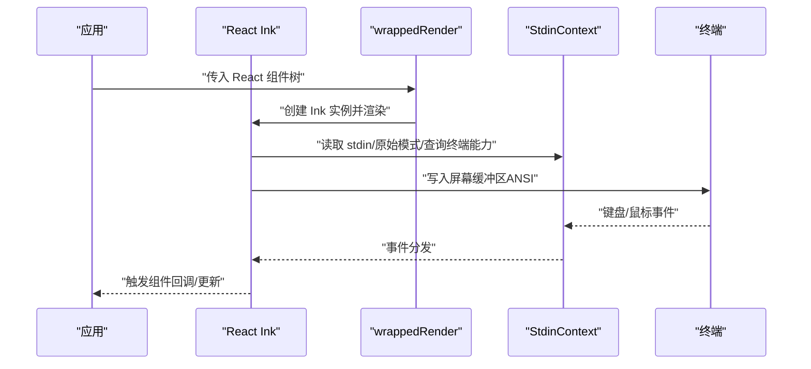

**图表来源**
- [index.ts:10-127](file://packages/@ant/ink/src/index.ts#L10-L127)
- [root.ts:106-125](file://packages/@ant/ink/src/core/root.ts#L106-L125)
- [StdinContext.ts:1-49](file://packages/@ant/ink/src/components/StdinContext.ts#L1-L49)

**章节来源**
- [index.ts:1-127](file://packages/@ant/ink/src/index.ts#L1-L127)
- [root.ts:89-125](file://packages/@ant/ink/src/core/root.ts#L89-L125)
- [StdinContext.ts:1-49](file://packages/@ant/ink/src/components/StdinContext.ts#L1-L49)

## 组件详解

### REPL.tsx（交互中枢）
- 职责：聚合全局状态、处理用户输入、执行查询、管理转录/搜索、快捷键与对话历史、远程/直连会话、IDE 集成与 MCP 对接。
- 关键点：
  - 大型函数组件，包含大量状态声明与副作用，通过 AppState 与 hooks 管理复杂交互。
  - 支持转录模式与搜索栏，提供最小化/最大化视图切换。
  - 集成 PromptInput、Messages、Spinner、ContextVisualization 等子组件，形成完整的对话界面。
  - 通过 useTerminalSize 获取列宽，驱动布局与虚拟滚动策略。

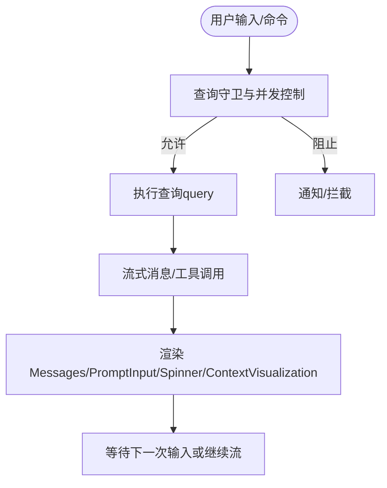

**图表来源**
- [REPL.tsx:2750-2860](file://src/screens/REPL.tsx#L2750-L2860)
- [REPL.tsx:2860-3030](file://src/screens/REPL.tsx#L2860-L3030)

**章节来源**
- [REPL.tsx:1-120](file://src/screens/REPL.tsx#L1-L120)
- [REPL.tsx:2750-3030](file://src/screens/REPL.tsx#L2750-L3030)

### PromptInput.tsx（提示输入框）
- 职责：提供输入区域、底部状态栏、快捷菜单、权限模式、桥接状态、任务与伙伴提示、命令历史与类型补全。
- 关键点：
  - 支持多行输入、光标定位、粘贴与图像引用插入。
  - 底部栏包含任务、tmux、bagel、团队、桥接、伙伴等"药丸"导航项，支持键盘导航。
  - 集成自动建议、推测输入、历史搜索与快速打开菜单。
  - 与 AppState 同步状态，如快速模式、思考模式、努力值等。

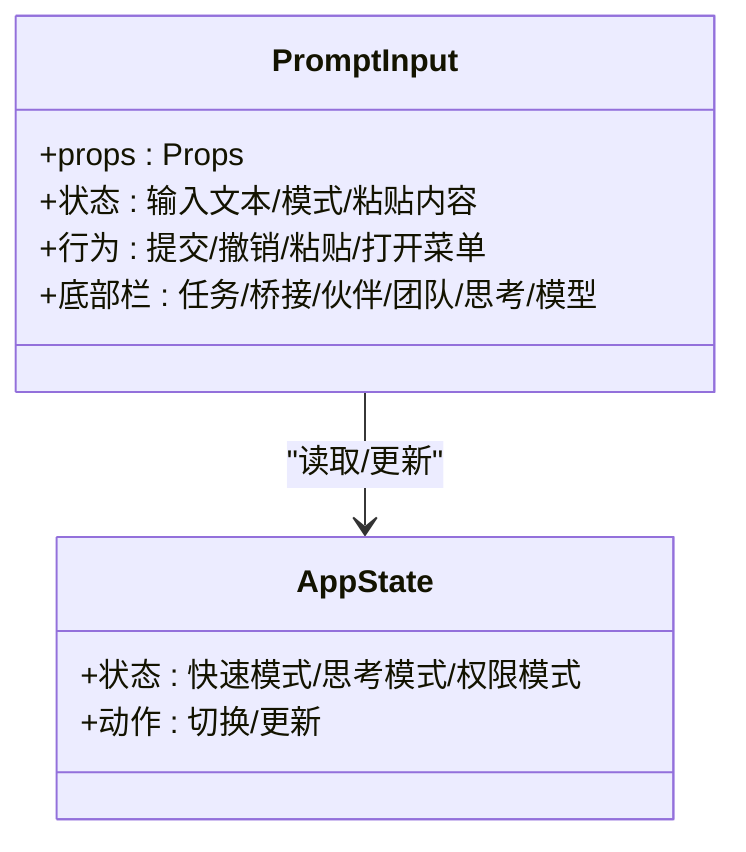

**图表来源**
- [PromptInput.tsx:225-307](file://src/components/PromptInput/PromptInput.tsx#L225-L307)
- [PromptInput.tsx:636-654](file://src/components/PromptInput/PromptInput.tsx#L636-L654)

**章节来源**
- [PromptInput.tsx:313-356](file://src/components/PromptInput/PromptInput.tsx#L313-L356)
- [PromptInput.tsx:636-654](file://src/components/PromptInput/PromptInput.tsx#L636-L654)

### Messages.tsx（消息显示）
- 职责：渲染对话消息，支持虚拟滚动、分组折叠、截断与展开、全屏模式下的可见性追踪。
- 关键点：
  - 非虚拟化路径有消息数量上限，避免内存与 GC 压力。
  - 支持 Brief 模式过滤与去冗余，仅展示必要信息。
  - 提供"未见"分隔线与搜索高亮，支持转录模式下的最小化/最大化。
  - 与 VirtualMessageList 协作，实现高性能滚动。

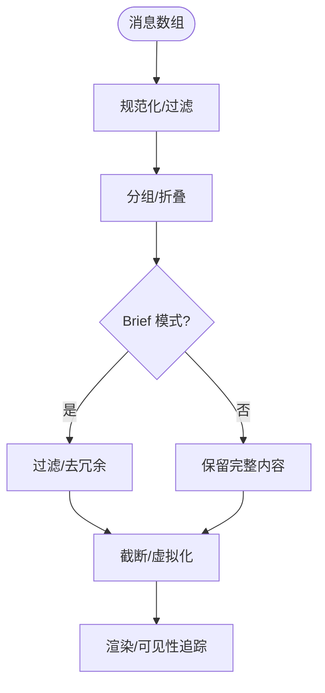

**图表来源**
- [Messages.tsx:568-668](file://src/components/Messages.tsx#L568-L668)
- [Messages.tsx:670-688](file://src/components/Messages.tsx#L670-L688)

**章节来源**
- [Messages.tsx:249-321](file://src/components/Messages.tsx#L249-L321)
- [Messages.tsx:395-428](file://src/components/Messages.tsx#L395-L428)

### Spinner.tsx（进度指示器）
- 职责：显示加载/思考/工具运行状态，提供动态提示、令牌预算、团队任务树与简要模式静态状态。
- 关键点：
  - "详细"模式：动画帧、思维状态、下一项任务、预算提示、团队树。
  - "简要"模式：单行静态/闪烁点，右对齐背景任务数，保证与输入栏间距一致。
  - 与 AppState 同步连接状态、任务计数与思维状态。

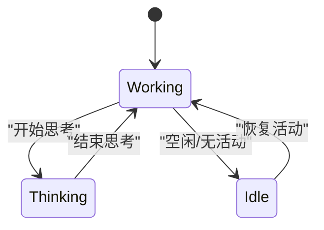

**图表来源**
- [Spinner.tsx:151-194](file://src/components/Spinner.tsx#L151-L194)
- [Spinner.tsx:438-469](file://src/components/Spinner.tsx#L438-L469)

**章节来源**
- [Spinner.tsx:59-74](file://src/components/Spinner.tsx#L59-L74)
- [Spinner.tsx:113-127](file://src/components/Spinner.tsx#L113-L127)

### ContextVisualization.tsx（上下文可视化）
- 职责：可视化显示上下文使用情况，包括令牌使用统计、分类分布、延迟加载工具等。
- 关键点：
  - 提供网格状的上下文使用可视化，支持中文显示各类别名称。
  - 显示 MCP 工具、系统工具、代理、内存文件和技能的中文标签。
  - 包含上下文建议组件，提供中文的使用建议和节省提示。
  - 支持自动压缩缓冲区和延迟加载工具的中文状态显示。

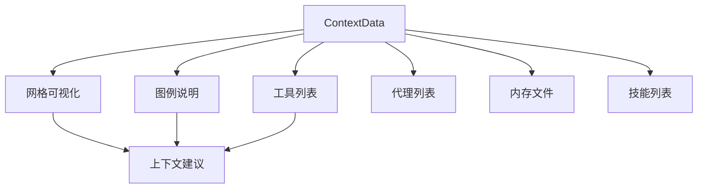

**图表来源**
- [ContextVisualization.tsx:116-582](file://src/components/ContextVisualization.tsx#L116-L582)
- [ContextSuggestions.tsx:11-38](file://src/components/ContextSuggestions.tsx#L11-L38)

**章节来源**
- [ContextVisualization.tsx:116-582](file://src/components/ContextVisualization.tsx#L116-L582)
- [ContextSuggestions.tsx:11-38](file://src/components/ContextSuggestions.tsx#L11-L38)

### GlobalSearchDialog.tsx（全局搜索对话框）
- 职责：提供工作区范围的全文搜索功能，支持中文搜索和预览。
- 关键点：
  - 基于 FuzzyPicker 组件，提供中文搜索界面和提示。
  - 支持实时搜索、结果预览和多种插入方式（提及、路径、纯文本）。
  - 提供中文的搜索状态显示，如"正在搜索…"、"无匹配结果"等。
  - 支持中文的文件路径显示和行号标注。

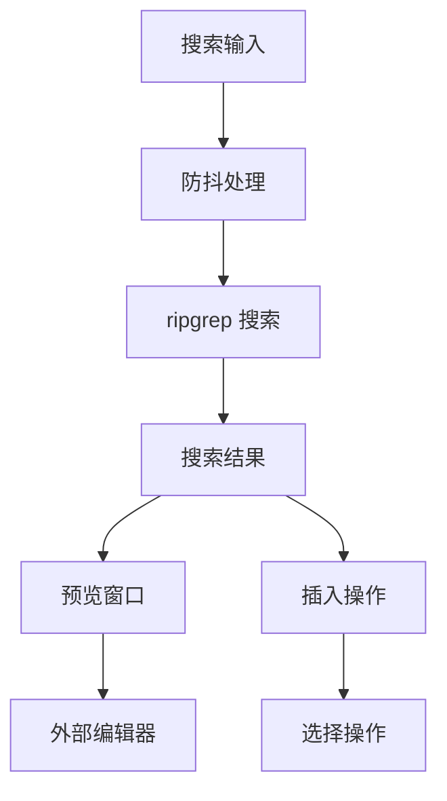

**图表来源**
- [GlobalSearchDialog.tsx:106-214](file://src/components/GlobalSearchDialog.tsx#L106-L214)
- [FuzzyPicker.tsx:69-283](file://src/components/design-system/FuzzyPicker.tsx#L69-L283)

**章节来源**
- [GlobalSearchDialog.tsx:39-333](file://src/components/GlobalSearchDialog.tsx#L39-L333)
- [FuzzyPicker.tsx:69-283](file://src/components/design-system/FuzzyPicker.tsx#L69-L283)

### ExportDialog.tsx（导出对话框）
- 职责：提供对话内容导出功能，支持剪贴板复制和文件保存。
- 关键点：
  - 提供中文的导出选项界面，包括"复制到剪贴板"和"保存到文件"。
  - 支持中文的文件名输入和验证。
  - 提供中文的操作反馈和错误提示。
  - 支持中文的快捷键提示和操作指南。

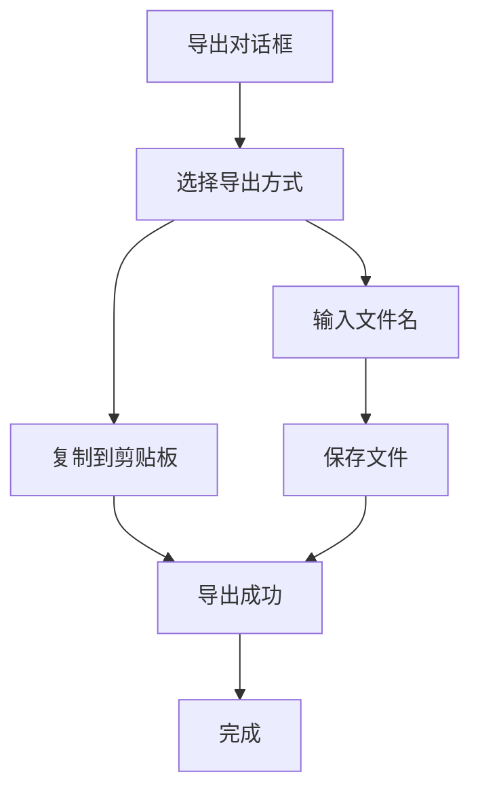

**图表来源**
- [ExportDialog.tsx:21-174](file://src/components/ExportDialog.tsx#L21-L174)

**章节来源**
- [ExportDialog.tsx:21-174](file://src/components/ExportDialog.tsx#L21-L174)

### HistorySearchDialog.tsx（历史搜索对话框）
- 职责：提供历史记录搜索功能，支持中文历史记录的模糊匹配。
- 关键点：
  - 基于 FuzzyPicker 组件，提供中文历史搜索界面。
  - 支持精确匹配和子序列匹配的混合搜索算法。
  - 提供中文的历史记录预览，显示时间戳和内容摘要。
  - 支持中文的搜索状态显示和空结果提示。

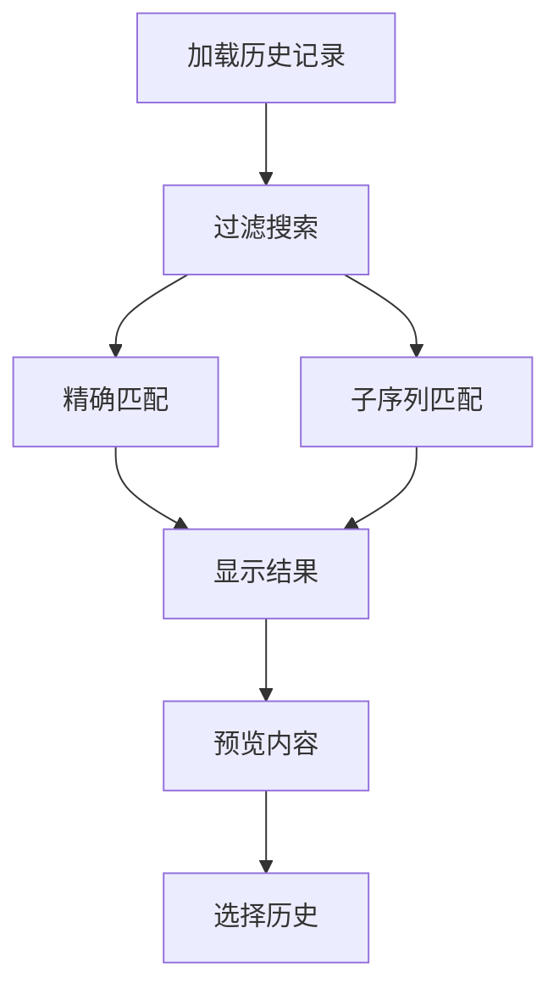

**图表来源**
- [HistorySearchDialog.tsx:43-85](file://src/components/HistorySearchDialog.tsx#L43-L85)
- [FuzzyPicker.tsx:69-283](file://src/components/design-system/FuzzyPicker.tsx#L69-L283)

**章节来源**
- [HistorySearchDialog.tsx:32-169](file://src/components/HistorySearchDialog.tsx#L32-L169)
- [FuzzyPicker.tsx:69-283](file://src/components/design-system/FuzzyPicker.tsx#L69-L283)

## 中文本地化增强

### 上下文可视化组件的中文支持
ContextVisualization.tsx 组件显著增强了中文本地化支持：
- 类别名称的中文显示，包括"MCP 工具"、"[ANT-ONLY] 系统工具"、"自定义代理"、"内存文件"、"技能"等。
- 上下文建议的中文提示，如"建议"、"节省"等词汇的本地化。
- 自动压缩缓冲区和延迟加载工具的中文状态显示。
- 支持中文的令牌使用统计和百分比显示格式。

### 全局搜索对话框的中文增强
GlobalSearchDialog.tsx 提供了完整的中文本地化：
- 标题"Global Search"显示为"全局搜索"。
- 占位符文本"Type to search…"本地化为"输入以搜索…"。
- 状态消息"Searching…"本地化为"正在搜索…"。
- 空结果提示"Type to search…"本地化为"输入以搜索…"。
- 文件路径和行号的中文显示格式。

### 导出对话框的中文界面
ExportDialog.tsx 实现了全面的中文本地化：
- 标题"Export Conversation"本地化为"导出对话"。
- 选项标签"Copy to clipboard"和"Save to file"的中文翻译。
- 描述文本的中文本地化，如"将对话复制到系统剪贴板"。
- 成功和失败消息的中文提示，包括"对话已复制到剪贴板"和"导出失败"等。

### 历史搜索对话框的中文支持
HistorySearchDialog.tsx 提供了中文历史记录搜索：
- 标题"Search prompts"本地化为"搜索提示词"。
- 占位符"Filter history…"本地化为"过滤历史…"。
- 空结果提示"Loading…"、"No matching prompts"、"No history yet"的中文翻译。
- 历史记录预览的内容中文显示和时间格式化。

### FuzzyPicker 组件的中文适配
FuzzyPicker.tsx 作为基础组件，为所有对话框提供中文支持：
- 默认占位符"Type to search…"本地化为"输入以搜索…"。
- 空结果消息"No results"本地化为"无结果"。
- 键盘快捷键提示的中文本地化。
- 搜索状态标签的中文显示格式。

### 搜索框组件的中文本地化
SearchBox.tsx 提供了中文搜索界面的基础支持：
- 占位符文本"Search…"本地化为"搜索…"。
- 前缀符号的中文显示适配。
- 输入状态的中文反馈。

**章节来源**
- [ContextVisualization.tsx:116-582](file://src/components/ContextVisualization.tsx#L116-L582)
- [GlobalSearchDialog.tsx:254-311](file://src/components/GlobalSearchDialog.tsx#L254-L311)
- [ExportDialog.tsx:139-171](file://src/components/ExportDialog.tsx#L139-L171)
- [HistorySearchDialog.tsx:96-159](file://src/components/HistorySearchDialog.tsx#L96-L159)
- [FuzzyPicker.tsx:70-88](file://src/components/design-system/FuzzyPicker.tsx#L70-L88)
- [SearchBox.tsx:15-71](file://src/components/SearchBox.tsx#L15-L71)

## 依赖关系分析
- 组件间依赖：
  - REPL 依赖 Messages、PromptInput、Spinner、ContextVisualization 等子组件。
  - Messages 依赖 VirtualMessageList、MessageRow、LogoV2 等。
  - PromptInput 依赖 AppState、快捷键上下文、命令队列、IDE/桥接状态。
  - Spinner 依赖 AppState、主题与动画钩子。
  - ContextVisualization 依赖 ContextSuggestions 和各种工具数据。
  - 对话框组件依赖 FuzzyPicker 基础组件。
- 框架依赖：
  - React Ink 提供渲染、事件、主题与终端能力接口。
  - StdinContext 提供输入流与原始模式控制。
  - useTerminalSize 提供列宽，驱动布局与虚拟滚动。

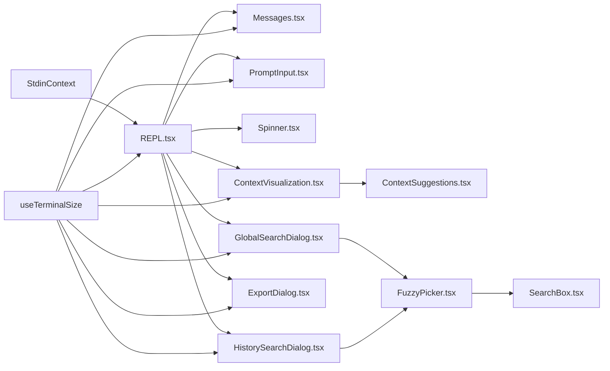

**图表来源**
- [REPL.tsx:1-120](file://src/screens/REPL.tsx#L1-L120)
- [Messages.tsx:117-118](file://src/components/Messages.tsx#L117-L118)
- [PromptInput.tsx:411-413](file://src/components/PromptInput/PromptInput.tsx#L411-L413)
- [Spinner.tsx:128-139](file://src/components/Spinner.tsx#L128-L139)
- [ContextVisualization.tsx:13-13](file://src/components/ContextVisualization.tsx#L13-L13)
- [ContextSuggestions.tsx:11-38](file://src/components/ContextSuggestions.tsx#L11-L38)
- [GlobalSearchDialog.tsx:15-15](file://src/components/GlobalSearchDialog.tsx#L15-L15)
- [ExportDialog.tsx:10-11](file://src/components/ExportDialog.tsx#L10-L11)
- [HistorySearchDialog.tsx:13-13](file://src/components/HistorySearchDialog.tsx#L13-L13)
- [FuzzyPicker.tsx:5-10](file://src/components/design-system/FuzzyPicker.tsx#L5-L10)
- [SearchBox.tsx:2-3](file://src/components/SearchBox.tsx#L2-L3)
- [StdinContext.ts:1-49](file://packages/@ant/ink/src/components/StdinContext.ts#L1-L49)
- [useTerminalSize.ts:1-15](file://packages/@ant/ink/src/hooks/useTerminalSize.ts#L1-L15)

**章节来源**
- [REPL.tsx:1-120](file://src/screens/REPL.tsx#L1-L120)
- [Messages.tsx:117-118](file://src/components/Messages.tsx#L117-L118)
- [PromptInput.tsx:411-413](file://src/components/PromptInput/PromptInput.tsx#L411-L413)
- [Spinner.tsx:128-139](file://src/components/Spinner.tsx#L128-L139)
- [StdinContext.ts:1-49](file://packages/@ant/ink/src/components/StdinContext.ts#L1-L49)
- [useTerminalSize.ts:1-15](file://packages/@ant/ink/src/hooks/useTerminalSize.ts#L1-L15)

## 性能考量
- 虚拟滚动与截断：
  - Messages 在非虚拟化路径设置最大消息数，避免内存与 GC 压力。
  - Brief 模式下进一步减少冗余输出，降低渲染负担。
- 动画与刷新：
  - Spinner 使用 useAnimationFrame 控制动画节拍，减少不必要重渲染。
  - REPL 中对高频状态更新进行防抖与合并，避免过度重绘。
- 终端写入优化：
  - staticRender 提供一次性帧提取与 ANSI 输出，减少重复写入。
  - wrappedRender 保留微任务边界，确保首帧稳定与后续更新追加而非覆盖。
- 搜索性能优化：
  - GlobalSearchDialog 使用防抖机制和流式处理，避免阻塞界面。
  - 历史搜索对话框支持异步加载和内存限制，防止大规模历史记录影响性能。

**章节来源**
- [Messages.tsx:325-355](file://src/components/Messages.tsx#L325-L355)
- [Messages.tsx:395-428](file://src/components/Messages.tsx#L395-L428)
- [Spinner.tsx:580-599](file://src/components/Spinner.tsx#L580-L599)
- [staticRender.tsx:38-74](file://src/utils/staticRender.tsx#L38-L74)
- [root.ts:110-122](file://packages/@ant/ink/src/core/root.ts#L110-L122)
- [GlobalSearchDialog.tsx:137-214](file://src/components/GlobalSearchDialog.tsx#L137-L214)
- [HistorySearchDialog.tsx:43-69](file://src/components/HistorySearchDialog.tsx#L43-L69)

## 故障排查指南
- 输入无响应或按键冲突：
  - 检查 StdinContext 的原始模式与 setRawMode 设置，确认 stdin 流可用。
  - 核对快捷键绑定是否被 Modal Overlay 或命令队列占用。
- 进度条不显示或异常：
  - 确认终端支持 OSC 9；检查是否处于远程模式或 Proactive 模式。
- 布局错位或闪烁：
  - 确认列宽变化时 useTerminalSize 是否正确更新。
  - 检查 FullscreenLayout 的分割线与 Sticky Prompt 跟踪逻辑。
- 颜色/主题异常：
  - 确认 ThemeProvider 已包裹应用根节点，颜色函数使用正确的主题键。
- 中文显示问题：
  - 检查终端字符编码设置，确保支持 UTF-8。
  - 验证字体是否包含中文字符集。
  - 确认路径分隔符在不同操作系统下的正确处理。

**章节来源**
- [StdinContext.ts:1-49](file://packages/@ant/ink/src/components/StdinContext.ts#L1-L49)
- [Messages.tsx:770-790](file://src/components/Messages.tsx#L770-L790)
- [logoV2Utils.ts:43-75](file://src/utils/logoV2Utils.ts#L43-L75)
- [color.ts:8-29](file://src/components/design-system/color.ts#L8-L29)

## 结论
该 UI 系统以 React Ink 为核心，围绕 REPL 中枢构建消息、输入与状态三大支柱组件，结合主题系统与响应式布局，在保证高性能的同时提供了丰富的交互能力。通过明确的状态管理与事件处理机制，系统能够在不同终端环境下提供一致且高效的用户体验。

**更新** 最新的中文本地化增强显著提升了多语言用户的使用体验，特别是在上下文可视化、搜索功能和对话框界面方面。这些改进确保了中文用户能够获得直观、流畅的交互体验，同时保持了系统的性能和稳定性。

## 附录

### 主题系统与定制
- 主题提供与使用：
  - 通过 ThemeProvider 注入主题，ThemedBox/ThemedText 自动解析主题键。
  - color 函数支持主题键与原生颜色值，统一颜色应用策略。
- 定制建议：
  - 新增颜色键时，同时更新主题类型与默认主题映射。
  - 使用 color 函数替代硬编码颜色，便于主题切换与无障碍适配。

**章节来源**
- [index.ts:102-127](file://packages/@ant/ink/src/index.ts#L102-L127)
- [color.ts:8-29](file://src/components/design-system/color.ts#L8-L29)

### 响应式布局与交互设计
- 列宽驱动：
  - useTerminalSize 提供列宽，用于计算布局与虚拟滚动阈值。
  - LogoV2 布局根据列宽与模式动态计算左右宽度与总宽度。
- 交互一致性：
  - 底部栏"药丸"导航支持键盘方向键与回车选择，保持焦点与状态同步。
  - 转录模式与搜索栏提供一致的键盘快捷键体验。
- 对话框响应式设计：
  - FuzzyPicker 组件根据终端宽度自动调整布局和提示信息。
  - 预览窗口在宽屏和窄屏下提供最佳的视觉效果。

**章节来源**
- [useTerminalSize.ts:1-15](file://packages/@ant/ink/src/hooks/useTerminalSize.ts#L1-L15)
- [logoV2Utils.ts:43-75](file://src/utils/logoV2Utils.ts#L43-L75)
- [PromptInput.tsx:636-654](file://src/components/PromptInput/PromptInput.tsx#L636-L654)
- [FuzzyPicker.tsx:92-105](file://src/components/design-system/FuzzyPicker.tsx#L92-L105)

### 使用与扩展指南
- 扩展新组件：
  - 建议复用 ThemedBox/ThemedText 与主题键，保持视觉一致性。
  - 使用 useTerminalSize 适配不同列宽，避免固定宽度导致的布局问题。
  - 为新组件提供中文本地化支持，确保国际化兼容性。
- 自定义样式：
  - 通过 ThemeProvider 注入自定义主题，或在 color 函数中添加条件分支。
  - 对动画组件使用 useAnimationFrame 控制刷新频率，避免卡顿。
- 对话框组件开发：
  - 基于 FuzzyPicker 组件开发新的搜索对话框，提供中文支持。
  - 实现适当的防抖机制和内存限制，确保搜索性能。
  - 提供清晰的中文状态反馈和错误提示。

**章节来源**
- [index.ts:102-127](file://packages/@ant/ink/src/index.ts#L102-L127)
- [Spinner.tsx:580-599](file://src/components/Spinner.tsx#L580-L599)
- [color.ts:8-29](file://src/components/design-system/color.ts#L8-L29)
- [FuzzyPicker.tsx:69-283](file://src/components/design-system/FuzzyPicker.tsx#L69-L283)
- [GlobalSearchDialog.tsx:106-214](file://src/components/GlobalSearchDialog.tsx#L106-L214)
- [ExportDialog.tsx:40-76](file://src/components/ExportDialog.tsx#L40-L76)
- [HistorySearchDialog.tsx:71-85](file://src/components/HistorySearchDialog.tsx#L71-L85)