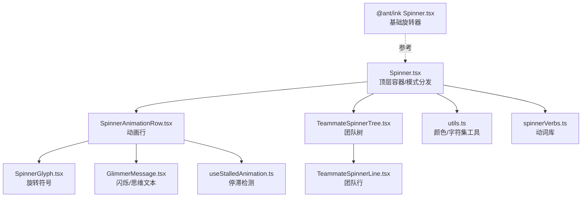
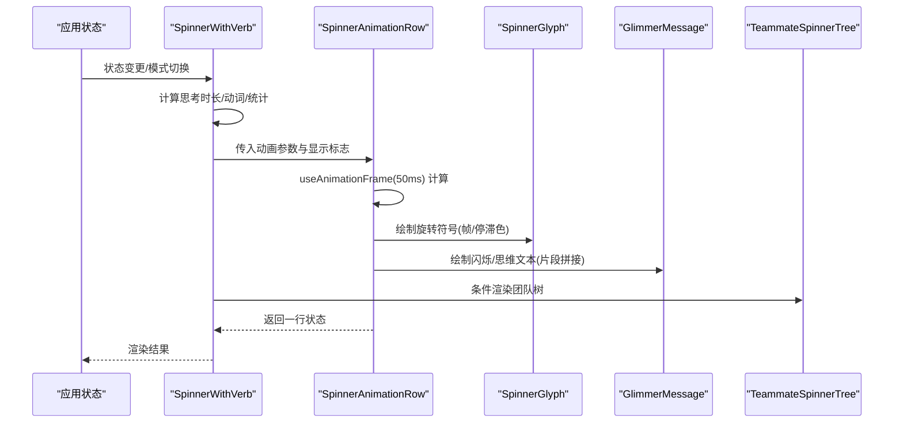
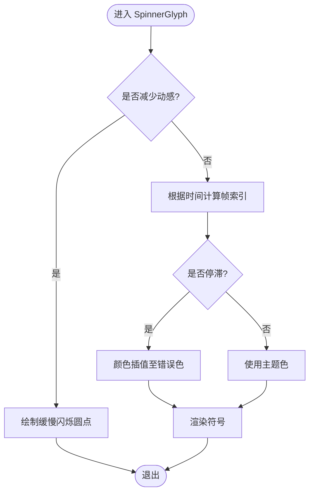
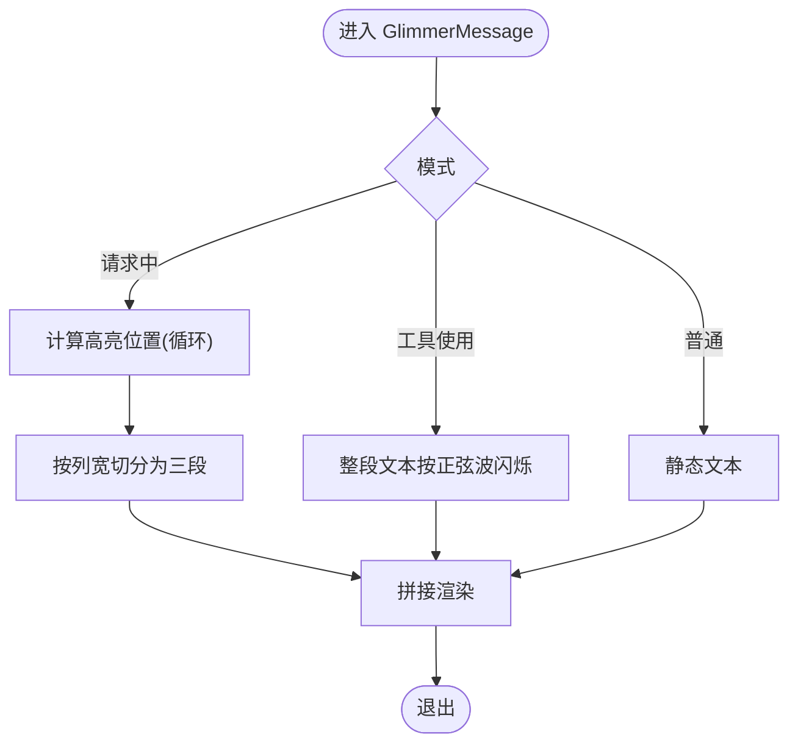
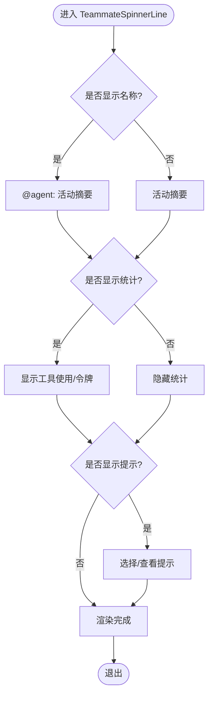
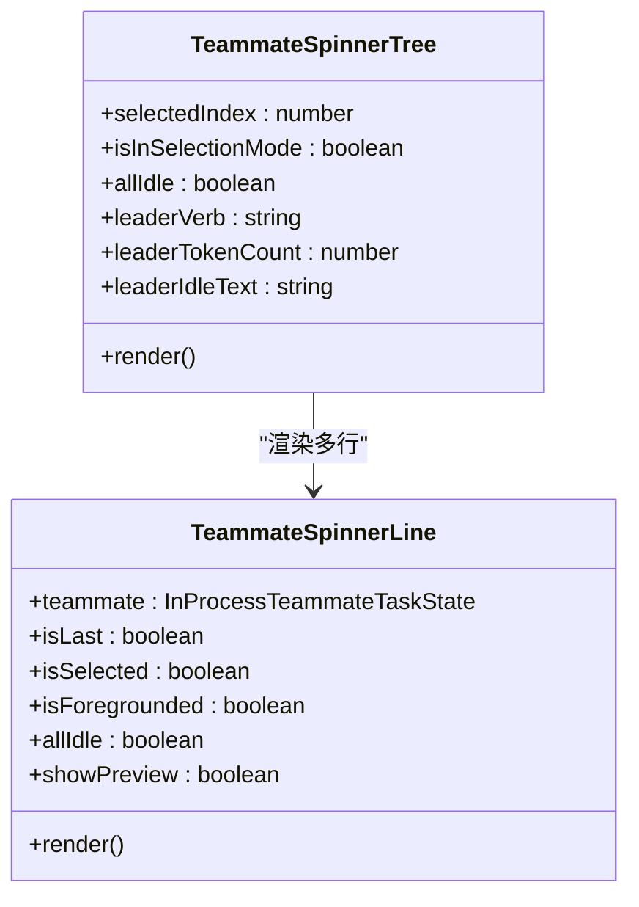
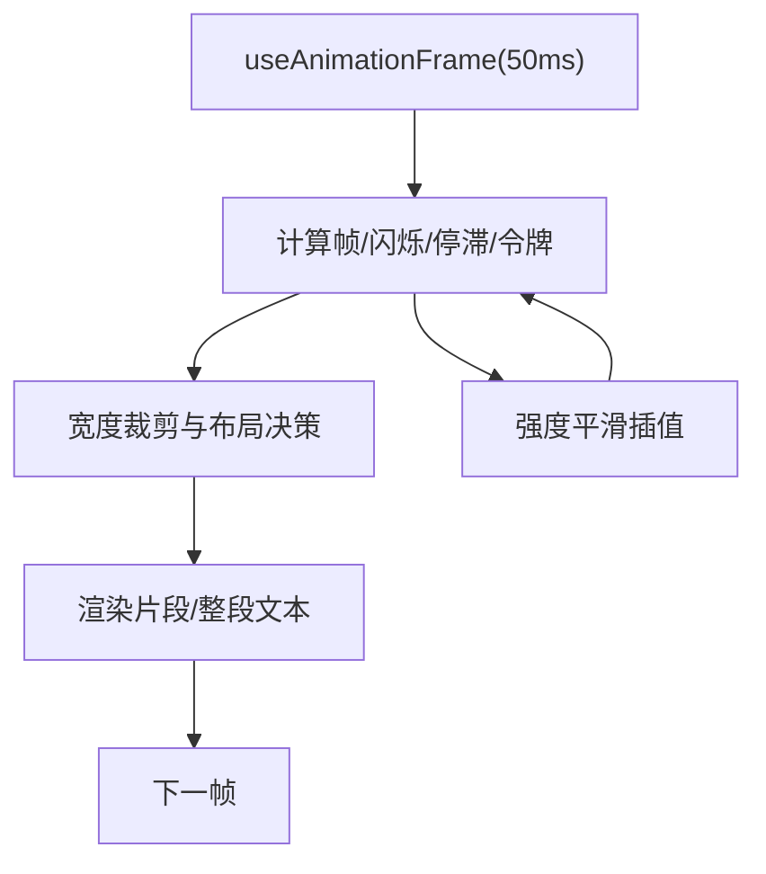
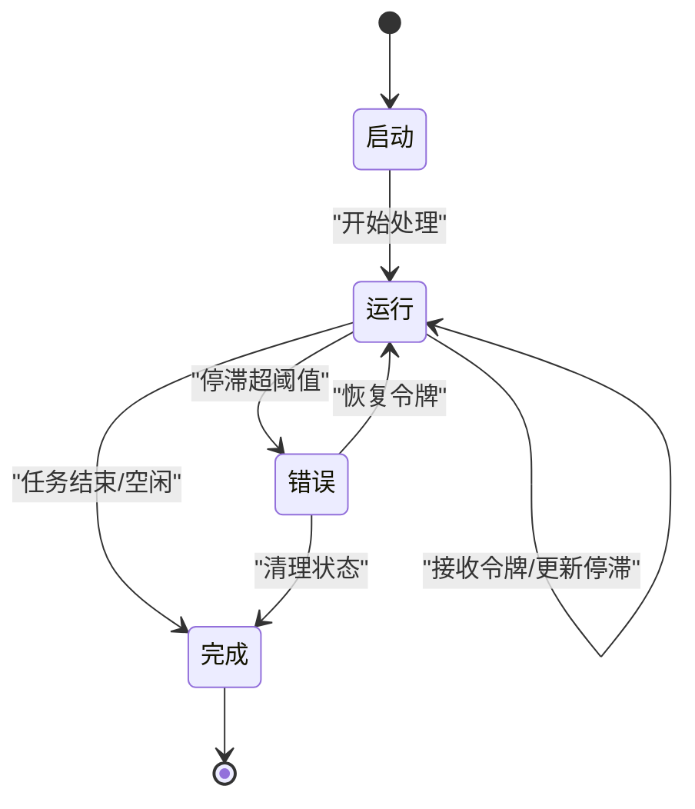
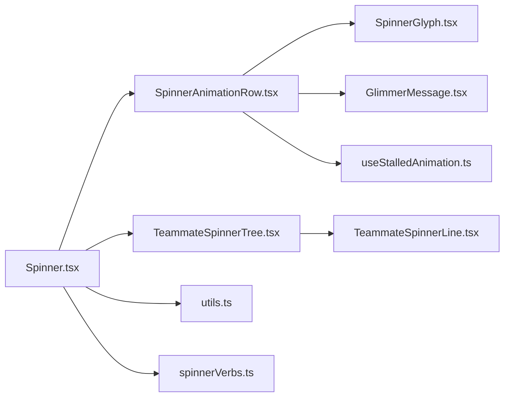

# 进度指示器

<cite>
**本文引用的文件**
- [src/components/Spinner.tsx](file://src/components/Spinner.tsx)
- [src/components/Spinner/SpinnerAnimationRow.tsx](file://src/components/Spinner/SpinnerAnimationRow.tsx)
- [src/components/Spinner/SpinnerGlyph.tsx](file://src/components/Spinner/SpinnerGlyph.tsx)
- [src/components/Spinner/GlimmerMessage.tsx](file://src/components/Spinner/GlimmerMessage.tsx)
- [src/components/Spinner/TeammateSpinnerLine.tsx](file://src/components/Spinner/TeammateSpinnerLine.tsx)
- [src/components/Spinner/TeammateSpinnerTree.tsx](file://src/components/Spinner/TeammateSpinnerTree.tsx)
- [src/components/Spinner/useStalledAnimation.ts](file://src/components/Spinner/useStalledAnimation.ts)
- [src/components/Spinner/utils.ts](file://src/components/Spinner/utils.ts)
- [src/constants/spinnerVerbs.ts](file://src/constants/spinnerVerbs.ts)
- [packages/@ant/ink/src/theme/Spinner.tsx](file://packages/@ant/ink/src/theme/Spinner.tsx)
</cite>

## 目录
1. [简介](#简介)
2. [项目结构](#项目结构)
3. [核心组件](#核心组件)
4. [架构总览](#架构总览)
5. [组件详解](#组件详解)
6. [依赖关系分析](#依赖关系分析)
7. [性能考量](#性能考量)
8. [故障排查指南](#故障排查指南)
9. [结论](#结论)
10. [附录](#附录)

## 简介
本文件系统性阐述 Claude Code Best 的进度指示器体系，覆盖基于动画的旋转指示器、闪烁与“思维”光晕效果、团队成员状态树形展示等能力。文档从架构、数据流、处理逻辑、集成点、错误处理与性能优化等维度进行深入解析，并提供定制化建议与使用示例，帮助开发者在不同场景下选择合适的进度反馈方案。

## 项目结构
进度指示器主要由以下层次构成：
- 外层容器与模式分发：负责根据应用状态与模式选择渲染路径（含简版模式）。
- 动画行组件：承载每帧动画计算与子组件组合，降低外层重渲染频率。
- 基础图形组件：旋转符号、闪烁文本、停滞检测与颜色插值。
- 团队成员视图：以树形结构展示多个并行任务的实时状态与统计。
- 辅助工具：字符集适配、颜色插值、停顿检测钩子等。

图表来源
- [src/components/Spinner.tsx:1-618](file://src/components/Spinner.tsx#L1-L618)
- [src/components/Spinner/SpinnerAnimationRow.tsx:1-373](file://src/components/Spinner/SpinnerAnimationRow.tsx#L1-L373)
- [src/components/Spinner/SpinnerGlyph.tsx:1-87](file://src/components/Spinner/SpinnerGlyph.tsx#L1-L87)
- [src/components/Spinner/GlimmerMessage.tsx:1-142](file://src/components/Spinner/GlimmerMessage.tsx#L1-L142)
- [src/components/Spinner/TeammateSpinnerTree.tsx:1-131](file://src/components/Spinner/TeammateSpinnerTree.tsx#L1-L131)
- [src/components/Spinner/TeammateSpinnerLine.tsx:1-300](file://src/components/Spinner/TeammateSpinnerLine.tsx#L1-L300)
- [src/components/Spinner/useStalledAnimation.ts:1-76](file://src/components/Spinner/useStalledAnimation.ts#L1-L76)
- [src/components/Spinner/utils.ts:1-85](file://src/components/Spinner/utils.ts#L1-L85)
- [src/constants/spinnerVerbs.ts:1-205](file://src/constants/spinnerVerbs.ts#L1-L205)
- [packages/@ant/ink/src/theme/Spinner.tsx:1-21](file://packages/@ant/ink/src/theme/Spinner.tsx#L1-L21)

章节来源
- [src/components/Spinner.tsx:1-618](file://src/components/Spinner.tsx#L1-L618)
- [src/components/Spinner/SpinnerAnimationRow.tsx:1-373](file://src/components/Spinner/SpinnerAnimationRow.tsx#L1-L373)

## 核心组件
- SpinnerWithVerb：顶层容器，负责模式判定、简版模式分支、思考时长展示、团队聚合统计、提示与预算信息、以及树形视图的条件渲染。
- SpinnerAnimationRow：每帧动画驱动的核心，统一使用 50ms 时钟，计算帧、闪烁、停滞强度、令牌计数平滑、时间与令牌显示宽度策略等。
- SpinnerGlyph：绘制旋转符号，支持减少动感模式与停滞时的颜色插值过渡。
- GlimmerMessage：绘制带“闪烁/思维”效果的消息文本，支持按字符粒度的高亮片段拼接。
- TeammateSpinnerTree/TeammateSpinnerLine：团队成员树形视图，逐行展示活动摘要、统计与交互提示。
- useStalledAnimation：基于动画时钟的停滞检测与强度平滑插值。
- utils：颜色插值、RGB 解析、默认字符集选择等。
- spinnerVerbs：动词库，用于生成“正在做…”类消息。

章节来源
- [src/components/Spinner.tsx:79-436](file://src/components/Spinner.tsx#L79-L436)
- [src/components/Spinner/SpinnerAnimationRow.tsx:75-352](file://src/components/Spinner/SpinnerAnimationRow.tsx#L75-L352)
- [src/components/Spinner/SpinnerGlyph.tsx:30-86](file://src/components/Spinner/SpinnerGlyph.tsx#L30-L86)
- [src/components/Spinner/GlimmerMessage.tsx:20-141](file://src/components/Spinner/GlimmerMessage.tsx#L20-L141)
- [src/components/Spinner/TeammateSpinnerTree.tsx:22-113](file://src/components/Spinner/TeammateSpinnerTree.tsx#L22-L113)
- [src/components/Spinner/TeammateSpinnerLine.tsx:95-299](file://src/components/Spinner/TeammateSpinnerLine.tsx#L95-L299)
- [src/components/Spinner/useStalledAnimation.ts:6-75](file://src/components/Spinner/useStalledAnimation.ts#L6-L75)
- [src/components/Spinner/utils.ts:4-84](file://src/components/Spinner/utils.ts#L4-L84)
- [src/constants/spinnerVerbs.ts:3-13](file://src/constants/spinnerVerbs.ts#L3-L13)

## 架构总览
整体采用“外层低频渲染 + 内层高频动画”的分层设计：
- 外层（SpinnerWithVerb）仅在 props 或应用状态变化时重渲染，避免动画热路径受干扰。
- 内层（SpinnerAnimationRow）使用统一的 50ms 动画时钟，集中计算帧、闪烁、停滞、令牌计数与布局裁剪。
- 团队视图独立于主动画，按需渲染，避免影响主动画性能。

图表来源
- [src/components/Spinner.tsx:113-436](file://src/components/Spinner.tsx#L113-L436)
- [src/components/Spinner/SpinnerAnimationRow.tsx:75-352](file://src/components/Spinner/SpinnerAnimationRow.tsx#L75-L352)
- [src/components/Spinner/TeammateSpinnerTree.tsx:22-113](file://src/components/Spinner/TeammateSpinnerTree.tsx#L22-L113)

## 组件详解

### 基础 Spinner（旋转指示器）
- 功能特性
  - 支持减少动感模式：以缓慢闪烁圆点替代旋转动画。
  - 停滞检测：当长时间无新令牌时，符号颜色从主题色平滑过渡到错误色。
  - 主题色与字符集适配：根据终端类型与主题动态选择字符序列。
- 关键实现要点
  - 使用统一动画时钟派生帧索引；减少动感模式下使用固定点。
  - 停滞强度通过钩子随帧平滑插值，避免突变。
  - 字符集根据平台与终端类型选择，保证在不同环境下一致可读。

图表来源
- [src/components/Spinner/SpinnerGlyph.tsx:30-86](file://src/components/Spinner/SpinnerGlyph.tsx#L30-L86)
- [src/components/Spinner/useStalledAnimation.ts:6-75](file://src/components/Spinner/useStalledAnimation.ts#L6-L75)
- [src/components/Spinner/utils.ts:14-29](file://src/components/Spinner/utils.ts#L14-L29)

章节来源
- [src/components/Spinner/SpinnerGlyph.tsx:30-86](file://src/components/Spinner/SpinnerGlyph.tsx#L30-L86)
- [src/components/Spinner/useStalledAnimation.ts:6-75](file://src/components/Spinner/useStalledAnimation.ts#L6-L75)
- [src/components/Spinner/utils.ts:4-30](file://src/components/Spinner/utils.ts#L4-L30)

### 闪烁与“思维”效果（GlimmerMessage）
- 功能特性
  - 模式区分：请求中（向上箭头）与工具使用（闪烁）两种不同的高亮策略。
  - 字符级高亮：仅对高亮区域进行颜色拼接，避免逐字符渲染开销。
  - 思维闪烁：在“思考”状态下使用正弦波透明度生成柔和呼吸感。
- 关键实现要点
  - 预计算文本图元与宽度，减少每帧昂贵的宽度测量。
  - 工具使用模式下整段文本统一闪烁，避免拆分带来的复杂度。
  - 停滞时整体文本平滑转红，保持一致性。

图表来源
- [src/components/Spinner/GlimmerMessage.tsx:20-141](file://src/components/Spinner/GlimmerMessage.tsx#L20-L141)
- [src/components/Spinner/SpinnerAnimationRow.tsx:133-153](file://src/components/Spinner/SpinnerAnimationRow.tsx#L133-L153)

章节来源
- [src/components/Spinner/GlimmerMessage.tsx:20-141](file://src/components/Spinner/GlimmerMessage.tsx#L20-L141)
- [src/components/Spinner/SpinnerAnimationRow.tsx:133-153](file://src/components/Spinner/SpinnerAnimationRow.tsx#L133-L153)

### 团队成员进度条（TeammateSpinnerLine）
- 功能特性
  - 活动摘要滚动：根据最近消息汇总工具使用与文本内容，形成简洁活动描述。
  - 状态展示：支持“等待批准”、“停止中”、“空闲”、“工作中”等状态文本。
  - 统计信息：工具使用次数、令牌消耗量等。
  - 响应式布局：根据终端宽度动态隐藏/显示名称、统计与提示。
- 关键实现要点
  - 使用终端宽度与图元宽度计算可用空间，按优先级裁剪。
  - 空闲时冻结工作时长，便于“全部空闲”场景下稳定展示。
  - 预览行支持消息片段展示，增强上下文可见性。

图表来源
- [src/components/Spinner/TeammateSpinnerLine.tsx:95-299](file://src/components/Spinner/TeammateSpinnerLine.tsx#L95-L299)

章节来源
- [src/components/Spinner/TeammateSpinnerLine.tsx:95-299](file://src/components/Spinner/TeammateSpinnerLine.tsx#L95-L299)

### 树形结构进度（TeammateSpinnerTree）
- 功能特性
  - 展示团队成员的树形层级，支持选中/聚焦态高亮。
  - 领导者行始终可见，可显示“正在做…”或空闲提示。
  - 选择模式下提供“隐藏”行，便于快速折叠。
- 关键实现要点
  - 依据应用状态决定是否渲染，避免空树造成额外开销。
  - 与团队行共享相同的响应式布局与提示逻辑。

图表来源
- [src/components/Spinner/TeammateSpinnerTree.tsx:22-113](file://src/components/Spinner/TeammateSpinnerTree.tsx#L22-L113)
- [src/components/Spinner/TeammateSpinnerLine.tsx:95-299](file://src/components/Spinner/TeammateSpinnerLine.tsx#L95-L299)

章节来源
- [src/components/Spinner/TeammateSpinnerTree.tsx:22-113](file://src/components/Spinner/TeammateSpinnerTree.tsx#L22-L113)
- [src/components/Spinner/TeammateSpinnerLine.tsx:95-299](file://src/components/Spinner/TeammateSpinnerLine.tsx#L95-L299)

### 动画系统设计
- 帧率控制
  - 外层容器不参与高频渲染，仅在状态变化时更新。
  - 动画行使用 50ms 时钟，兼顾流畅度与性能。
  - 减少动感模式下进一步降频，确保可读性。
- 视觉效果
  - 闪烁与思维效果均基于统一时钟，避免额外订阅。
  - 颜色插值使用 RGB 线性插值，保证过渡自然。
- 性能优化
  - 文本宽度与图元分割预计算，避免每帧重复计算。
  - 停滞强度平滑插值，步进与时间步长自适应。
  - 宽度裁剪策略减少不必要的渲染节点。

图表来源
- [src/components/Spinner/SpinnerAnimationRow.tsx:97-176](file://src/components/Spinner/SpinnerAnimationRow.tsx#L97-L176)
- [src/components/Spinner/GlimmerMessage.tsx:35-41](file://src/components/Spinner/GlimmerMessage.tsx#L35-L41)
- [src/components/Spinner/useStalledAnimation.ts:48-67](file://src/components/Spinner/useStalledAnimation.ts#L48-L67)

章节来源
- [src/components/Spinner/SpinnerAnimationRow.tsx:97-176](file://src/components/Spinner/SpinnerAnimationRow.tsx#L97-L176)
- [src/components/Spinner/GlimmerMessage.tsx:35-41](file://src/components/Spinner/GlimmerMessage.tsx#L35-L41)
- [src/components/Spinner/useStalledAnimation.ts:48-67](file://src/components/Spinner/useStalledAnimation.ts#L48-L67)

### 状态管理与处理流程
- 启动/运行/完成/错误
  - 启动：根据模式与任务状态初始化动词、令牌计数与时间锚点。
  - 运行：持续接收令牌增量，平滑计数；根据时间与令牌变化更新停滞强度。
  - 完成：思考时长达到最小显示时间后清理，或在团队空闲时显示“已工作 X 时间”。
  - 错误：停滞超过阈值时，符号与文本平滑转为错误色。
- 提示与预算
  - 根据运行时长与配置显示“清屏/顺带问题”提示。
  - 在特定特性开启时显示令牌目标与剩余时间估计。

图表来源
- [src/components/Spinner.tsx:158-194](file://src/components/Spinner.tsx#L158-L194)
- [src/components/Spinner/SpinnerAnimationRow.tsx:126-131](file://src/components/Spinner/SpinnerAnimationRow.tsx#L126-L131)
- [src/components/Spinner/useStalledAnimation.ts:42-45](file://src/components/Spinner/useStalledAnimation.ts#L42-L45)

章节来源
- [src/components/Spinner.tsx:158-194](file://src/components/Spinner.tsx#L158-L194)
- [src/components/Spinner/SpinnerAnimationRow.tsx:126-131](file://src/components/Spinner/SpinnerAnimationRow.tsx#L126-L131)
- [src/components/Spinner/useStalledAnimation.ts:42-45](file://src/components/Spinner/useStalledAnimation.ts#L42-L45)

### 定制方法
- 动画样式
  - 减少动感：通过设置减少动感偏好，将使用静态点而非旋转。
  - 闪烁速度：请求中与工具使用模式的闪烁周期不同，分别对应不同的高亮策略。
- 颜色主题
  - 主题色与闪烁色可通过主题键覆盖；停滞时自动插值至错误色。
  - 字符集适配：根据平台与终端类型自动选择字符，保证可读性。
- 显示时机
  - 简版模式：在特定特性开启且满足条件时，使用单行简版指示器。
  - 团队视图：当存在运行中的团队成员时，自动展开树形视图。
  - 提示与预算：根据运行时长与配置开关控制提示与预算信息的显示。

章节来源
- [src/components/Spinner.tsx:87-111](file://src/components/Spinner.tsx#L87-L111)
- [src/components/Spinner/SpinnerGlyph.tsx:40-50](file://src/components/Spinner/SpinnerGlyph.tsx#L40-L50)
- [src/components/Spinner/utils.ts:4-11](file://src/components/Spinner/utils.ts#L4-L11)
- [src/constants/spinnerVerbs.ts:3-13](file://src/constants/spinnerVerbs.ts#L3-L13)

### 使用示例
- 基础旋转指示器
  - 适用于简单加载场景，无需复杂状态展示。
  - 参考：[packages/@ant/ink/src/theme/Spinner.tsx:9-20](file://packages/@ant/ink/src/theme/Spinner.tsx#L9-L20)
- 顶层进度指示器
  - 在对话循环中作为消息行的一部分，自动适配思考、请求、工具使用、响应等模式。
  - 参考：[src/components/Spinner.tsx:113-436](file://src/components/Spinner.tsx#L113-L436)
- 团队视图
  - 当存在并行任务时，自动展开树形视图，展示每个成员的活动摘要与统计。
  - 参考：[src/components/Spinner/TeammateSpinnerTree.tsx:22-113](file://src/components/Spinner/TeammateSpinnerTree.tsx#L22-L113)

章节来源
- [packages/@ant/ink/src/theme/Spinner.tsx:9-20](file://packages/@ant/ink/src/theme/Spinner.tsx#L9-L20)
- [src/components/Spinner.tsx:113-436](file://src/components/Spinner.tsx#L113-L436)
- [src/components/Spinner/TeammateSpinnerTree.tsx:22-113](file://src/components/Spinner/TeammateSpinnerTree.tsx#L22-L113)

## 依赖关系分析
- 组件耦合
  - SpinnerWithVerb 与 SpinnerAnimationRow 通过 props 传递动画参数，降低耦合。
  - TeammateSpinnerTree 与 TeammateSpinnerLine 通过状态选择器获取任务列表，解耦数据源。
- 外部依赖
  - @anthropic/ink 的 useAnimationFrame、Box、Text 等提供渲染与动画基础设施。
  - Intl 图元分段器与字符串宽度计算用于精确布局。
- 循环依赖
  - 未发现直接循环依赖；动画钩子与工具函数均为纯函数或轻量钩子。

图表来源
- [src/components/Spinner.tsx:1-618](file://src/components/Spinner.tsx#L1-L618)
- [src/components/Spinner/SpinnerAnimationRow.tsx:1-373](file://src/components/Spinner/SpinnerAnimationRow.tsx#L1-L373)
- [src/components/Spinner/TeammateSpinnerTree.tsx:1-131](file://src/components/Spinner/TeammateSpinnerTree.tsx#L1-L131)
- [src/components/Spinner/TeammateSpinnerLine.tsx:1-300](file://src/components/Spinner/TeammateSpinnerLine.tsx#L1-L300)
- [src/components/Spinner/utils.ts:1-85](file://src/components/Spinner/utils.ts#L1-L85)
- [src/constants/spinnerVerbs.ts:1-205](file://src/constants/spinnerVerbs.ts#L1-L205)

## 性能考量
- 帧率与重渲染
  - 外层容器避免在动画期间频繁重渲染，仅在状态变化时更新。
  - 动画行使用 50ms 时钟，兼顾流畅度与 CPU 占用。
- 计算优化
  - 文本宽度与图元分割缓存，避免每帧重复计算。
  - 停滞强度平滑插值，步进与时间步长自适应，减少抖动。
- 布局裁剪
  - 基于可用宽度的渐进式裁剪策略，优先保留关键信息。
- 减少动感
  - 在减少动感模式下进一步降频，确保在弱设备上仍可读。

[本节为通用性能指导，无需具体文件分析]

## 故障排查指南
- 闪烁异常或颜色不正确
  - 检查主题键与颜色插值逻辑，确认 RGB 解析缓存命中。
  - 参考：[src/components/Spinner/utils.ts:68-84](file://src/components/Spinner/utils.ts#L68-L84)
- 停滞检测不生效
  - 确认动画时钟与令牌增量更新路径一致，检查 hasActiveTools 标志。
  - 参考：[src/components/Spinner/useStalledAnimation.ts:21-27](file://src/components/Spinner/useStalledAnimation.ts#L21-L27)
- 团队视图不显示
  - 检查是否存在运行中的团队成员，确认排序与选择状态。
  - 参考：[src/components/Spinner/TeammateSpinnerTree.tsx:36-41](file://src/components/Spinner/TeammateSpinnerTree.tsx#L36-L41)
- 简版模式未触发
  - 检查特性开关与用户偏好，确认 isBriefOnly 与查看者模式。
  - 参考：[src/components/Spinner.tsx:87-111](file://src/components/Spinner.tsx#L87-L111)

章节来源
- [src/components/Spinner/utils.ts:68-84](file://src/components/Spinner/utils.ts#L68-L84)
- [src/components/Spinner/useStalledAnimation.ts:21-27](file://src/components/Spinner/useStalledAnimation.ts#L21-L27)
- [src/components/Spinner/TeammateSpinnerTree.tsx:36-41](file://src/components/Spinner/TeammateSpinnerTree.tsx#L36-L41)
- [src/components/Spinner.tsx:87-111](file://src/components/Spinner.tsx#L87-L111)

## 结论
该进度指示器系统通过“外层低频渲染 + 内层高频动画”的分层设计，在保证视觉流畅的同时显著降低了渲染成本。其内置的停滞检测、闪烁与“思维”效果、团队树形视图与响应式布局裁剪，共同构成了一个可扩展、可定制且高性能的进度反馈方案。开发者可根据场景选择基础旋转器或完整 SpinnerWithVerb，并结合主题与布局策略实现最佳用户体验。

[本节为总结性内容，无需具体文件分析]

## 附录
- 相关参考文件
  - 基础旋转器（@ant/ink）：[packages/@ant/ink/src/theme/Spinner.tsx:9-20](file://packages/@ant/ink/src/theme/Spinner.tsx#L9-L20)
  - 动词库：[src/constants/spinnerVerbs.ts:3-13](file://src/constants/spinnerVerbs.ts#L3-L13)

[本节为补充信息，无需具体文件分析]