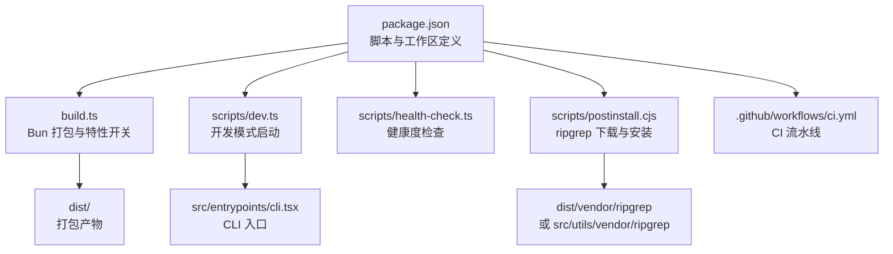
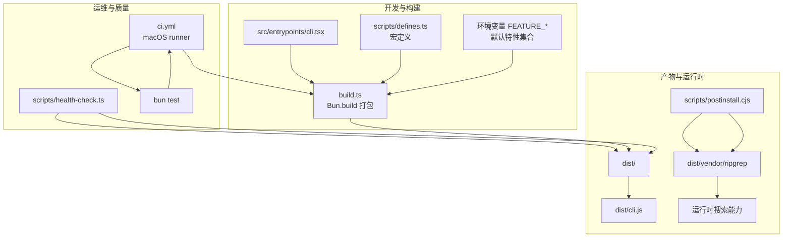
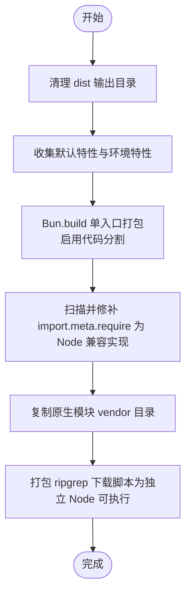
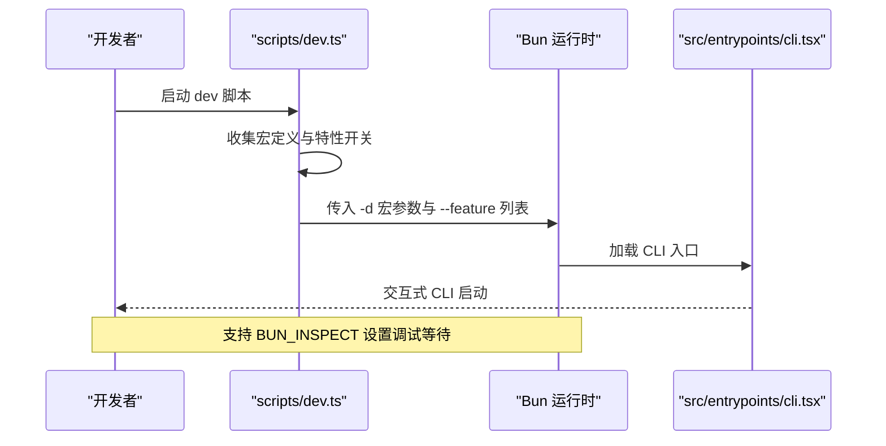
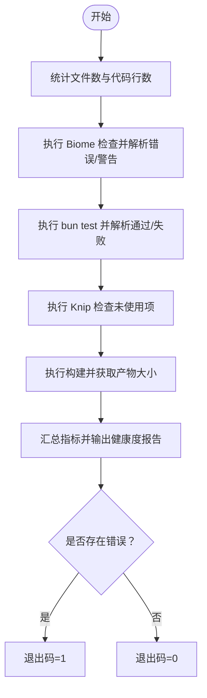
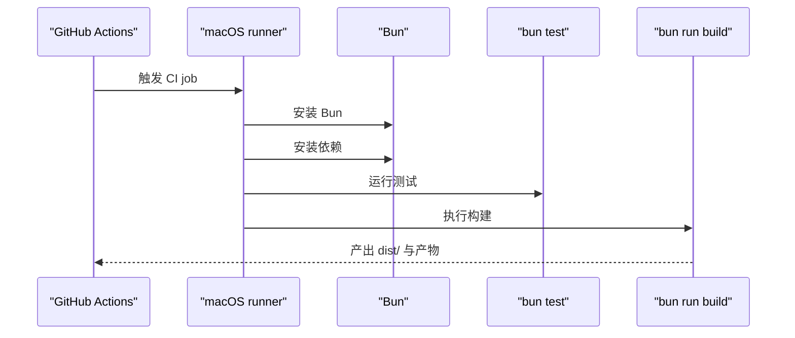
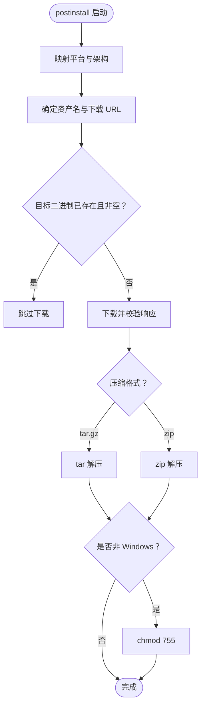
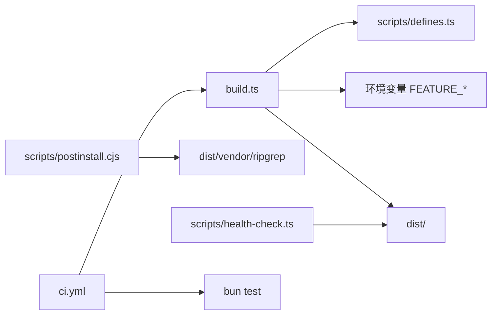

# 部署与运维

<cite>
**本文引用的文件**
- [package.json](file://package.json)
- [build.ts](file://build.ts)
- [scripts/dev.ts](file://scripts/dev.ts)
- [scripts/health-check.ts](file://scripts/health-check.ts)
- [.github/workflows/ci.yml](file://.github/workflows/ci.yml)
- [scripts/postinstall.cjs](file://scripts/postinstall.cjs)
- [scripts/defines.ts](file://scripts/defines.ts)
- [bunfig.toml](file://bunfig.toml)
- [tsconfig.json](file://tsconfig.json)
- [biome.json](file://biome.json)
- [SECURITY.md](file://SECURITY.md)
</cite>

## 目录
1. [简介](#简介)
2. [项目结构](#项目结构)
3. [核心组件](#核心组件)
4. [架构总览](#架构总览)
5. [详细组件分析](#详细组件分析)
6. [依赖关系分析](#依赖关系分析)
7. [性能考量](#性能考量)
8. [故障排查指南](#故障排查指南)
9. [结论](#结论)
10. [附录](#附录)

## 简介
本文件面向 Claude Code Best 的部署与运维团队，系统化阐述构建与打包流程、产物优化与多平台兼容策略、部署与 CI/CD 最佳实践、监控与日志配置、运维工具与脚本使用、自动化运维与容量规划，以及安全运维要点。内容基于仓库内现有脚本与配置文件进行归纳总结，并提供可操作的流程图与时序图帮助落地。

## 项目结构
本项目采用 Bun 生态与工作区组织方式，核心入口为 CLI 入口点，构建产物输出至 dist 目录；同时通过 postinstall 自动下载 ripgrep 二进制以满足搜索能力；健康检查脚本用于快速评估代码质量与构建状态；GitHub Actions 提供基础 CI 能力。

图表来源
- [package.json:40-54](file://package.json#L40-L54)
- [build.ts:1-100](file://build.ts#L1-L100)
- [scripts/dev.ts:1-60](file://scripts/dev.ts#L1-L60)
- [scripts/health-check.ts:1-164](file://scripts/health-check.ts#L1-L164)
- [scripts/postinstall.cjs:1-320](file://scripts/postinstall.cjs#L1-L320)
- [.github/workflows/ci.yml:1-28](file://.github/workflows/ci.yml#L1-L28)

章节来源
- [package.json:1-175](file://package.json#L1-L175)
- [build.ts:1-100](file://build.ts#L1-L100)
- [scripts/dev.ts:1-60](file://scripts/dev.ts#L1-L60)
- [scripts/health-check.ts:1-164](file://scripts/health-check.ts#L1-L164)
- [scripts/postinstall.cjs:1-320](file://scripts/postinstall.cjs#L1-L320)
- [.github/workflows/ci.yml:1-28](file://.github/workflows/ci.yml#L1-L28)

## 核心组件
- 构建与打包：基于 Bun.build 的单入口打包，启用代码分割与特性宏替换，产物包含 Node 兼容补丁与原生模块目录。
- 开发模式：动态注入宏定义与特性开关，支持调试等待与环境特性扩展。
- 健康检查：聚合代码规模、Lint、测试、冗余代码与构建状态，统一输出健康度报告并按错误计数退出。
- CI/CD：在 macOS runner 上安装 Bun、安装依赖、运行测试与构建。
- 运行时依赖：postinstall 自动下载 ripgrep 二进制，适配多平台与代理环境。
- 配置与规范：Bun 测试配置、TypeScript 编译配置、Biome Lint 规则与格式化策略。

章节来源
- [build.ts:39-78](file://build.ts#L39-L78)
- [scripts/dev.ts:17-57](file://scripts/dev.ts#L17-L57)
- [scripts/health-check.ts:23-125](file://scripts/health-check.ts#L23-L125)
- [.github/workflows/ci.yml:9-27](file://.github/workflows/ci.yml#L9-L27)
- [scripts/postinstall.cjs:28-95](file://scripts/postinstall.cjs#L28-L95)
- [bunfig.toml:1-4](file://bunfig.toml#L1-L4)
- [tsconfig.json:1-21](file://tsconfig.json#L1-L21)
- [biome.json:1-115](file://biome.json#L1-L115)

## 架构总览
下图展示从源码到可执行产物的关键路径，以及运行时依赖注入与健康检查的集成位置。

图表来源
- [build.ts:39-78](file://build.ts#L39-L78)
- [scripts/defines.ts:8-18](file://scripts/defines.ts#L8-L18)
- [scripts/postinstall.cjs:262-307](file://scripts/postinstall.cjs#L262-L307)
- [scripts/health-check.ts:109-125](file://scripts/health-check.ts#L109-L125)
- [.github/workflows/ci.yml:20-27](file://.github/workflows/ci.yml#L20-L27)

## 详细组件分析

### 构建与打包流程
- 单入口打包：以 CLI 入口为唯一入口，启用代码分割，提升冷启动与按需加载效率。
- 特性开关：默认特性集合与环境变量 FEATURE_* 组合，实现按需编译与功能裁剪。
- 宏替换：在打包阶段注入版本、构建时间等常量，便于运行时识别与上报。
- Node 兼容补丁：扫描产物中的 import.meta.require 使用，替换为 Node 兼容实现，保证在不同运行时可用。
- 原生模块：复制原生 .node 插件目录到 vendor，确保运行时加载。
- 独立脚本：将 ripgrep 下载脚本单独打包为 Node 目标，便于 postinstall 执行。

图表来源
- [build.ts:7-100](file://build.ts#L7-L100)

章节来源
- [build.ts:7-100](file://build.ts#L7-L100)

### 开发模式与特性开关
- 动态注入宏定义：通过命令行 -d 参数将宏值注入运行时，覆盖静态配置。
- 特性开关：默认开启一组特性，支持通过 FEATURE_* 环境变量扩展。
- 调试支持：当设置 BUN_INSPECT 时，子进程进入 --inspect-wait 模式，便于远程调试。
- 子进程管理：以同步方式调用 Bun 并继承标准输入输出，保持交互体验一致。

图表来源
- [scripts/dev.ts:17-57](file://scripts/dev.ts#L17-L57)

章节来源
- [scripts/dev.ts:17-57](file://scripts/dev.ts#L17-L57)

### 健康检查脚本
- 指标采集：统计 TypeScript 文件数量、代码行数、Biome 错误/警告、测试通过/失败、未使用文件/导出/依赖、构建状态与产物大小。
- 状态判定：根据阈值将指标标记为 ok/warn/error/info，最终以错误计数决定退出码。
- 输出格式：统一分隔线与图标，便于人工审阅与自动化解析。

图表来源
- [scripts/health-check.ts:45-125](file://scripts/health-check.ts#L45-L125)

章节来源
- [scripts/health-check.ts:23-164](file://scripts/health-check.ts#L23-L164)

### CI/CD 集成
- Runner：使用 macOS-latest，确保与本地一致的开发体验。
- 步骤：检出代码、安装 Bun、安装依赖、运行测试、执行构建。
- 可扩展：可在后续增加构建产物上传、发布、安全扫描等步骤。

图表来源
- [.github/workflows/ci.yml:9-27](file://.github/workflows/ci.yml#L9-L27)

章节来源
- [.github/workflows/ci.yml:1-28](file://.github/workflows/ci.yml#L1-L28)

### 运行时依赖与多平台兼容
- ripgrep 下载：根据平台与架构选择预编译包，支持 tar.gz 与 zip，自动处理代理与回退方案。
- 路径策略：开发模式与发布模式分别写入不同 vendor 目录，保证一致性。
- 权限处理：非 Windows 平台设置可执行权限，避免运行时权限问题。
- 失败容忍：postinstall 不中断安装流程，提示手动安装指引。

图表来源
- [scripts/postinstall.cjs:39-95](file://scripts/postinstall.cjs#L39-L95)
- [scripts/postinstall.cjs:262-307](file://scripts/postinstall.cjs#L262-L307)

章节来源
- [scripts/postinstall.cjs:1-320](file://scripts/postinstall.cjs#L1-L320)

### 配置与规范
- 测试配置：根目录与超时控制，便于本地与 CI 一致。
- TypeScript：bundler 模块解析、JSX、严格性与类型路径别名。
- Biome：启用 VCS、文件包含规则、格式化与 Lint 规则覆盖，针对不同文件类型定制策略。

章节来源
- [bunfig.toml:1-4](file://bunfig.toml#L1-L4)
- [tsconfig.json:1-21](file://tsconfig.json#L1-L21)
- [biome.json:1-115](file://biome.json#L1-L115)

## 依赖关系分析
- 构建期依赖：Bun.build、宏定义生成器、特性开关收集器。
- 运行期依赖：ripgrep 二进制、原生模块、Node 兼容补丁。
- 质量依赖：Biome、Knip、Bun test。
- CI 依赖：GitHub Actions、oven-sh/setup-bun。

图表来源
- [build.ts:33-47](file://build.ts#L33-L47)
- [scripts/defines.ts:8-18](file://scripts/defines.ts#L8-L18)
- [scripts/postinstall.cjs:262-307](file://scripts/postinstall.cjs#L262-L307)
- [scripts/health-check.ts:109-125](file://scripts/health-check.ts#L109-L125)
- [.github/workflows/ci.yml:20-27](file://.github/workflows/ci.yml#L20-L27)

章节来源
- [build.ts:33-47](file://build.ts#L33-L47)
- [scripts/defines.ts:8-18](file://scripts/defines.ts#L8-L18)
- [scripts/postinstall.cjs:262-307](file://scripts/postinstall.cjs#L262-L307)
- [scripts/health-check.ts:109-125](file://scripts/health-check.ts#L109-L125)
- [.github/workflows/ci.yml:20-27](file://.github/workflows/ci.yml#L20-L27)

## 性能考量
- 代码分割：启用 splitting 降低首包体积，配合特性开关减少无关代码进入产物。
- 宏替换：在编译期注入常量，避免运行时计算开销。
- Node 兼容补丁：仅对特定语法做最小化替换，避免引入额外运行时分支。
- 产物大小：健康检查脚本会记录 dist/cli.js 大小，建议结合特性开关与第三方依赖精简策略持续优化。
- 平台差异：ripgrep 预编译包直接下载，避免运行时编译成本。

章节来源
- [build.ts:40-47](file://build.ts#L40-L47)
- [scripts/defines.ts:8-18](file://scripts/defines.ts#L8-L18)
- [scripts/health-check.ts:114-118](file://scripts/health-check.ts#L114-L118)
- [scripts/postinstall.cjs:262-307](file://scripts/postinstall.cjs#L262-L307)

## 故障排查指南
- 构建失败
  - 现象：build.ts 返回非零退出码并打印日志。
  - 排查：查看 dist 输出数量与 Node 兼容补丁替换数量，确认宏定义与特性开关拼写。
- 健康检查异常
  - 现象：健康度报告出现 error/warn 计数。
  - 排查：逐项核对 Lint、测试、未使用依赖与构建状态；关注产物大小变化。
- ripgrep 下载失败
  - 现象：postinstall 报错但不中断安装。
  - 排查：检查网络与代理、设置 RIPGREP_DOWNLOAD_BASE 指向镜像源、必要时手动安装。
- CI 失败
  - 现象：macOS runner 中测试或构建失败。
  - 排查：确认 Bun 版本、依赖安装顺序、平台差异导致的二进制兼容性。

章节来源
- [build.ts:49-55](file://build.ts#L49-L55)
- [scripts/health-check.ts:148-163](file://scripts/health-check.ts#L148-L163)
- [scripts/postinstall.cjs:313-319](file://scripts/postinstall.cjs#L313-L319)
- [.github/workflows/ci.yml:20-27](file://.github/workflows/ci.yml#L20-L27)

## 结论
本项目以 Bun 为核心构建与运行时，通过特性开关与宏替换实现灵活的功能裁剪与版本信息注入；借助 postinstall 自动化处理运行时依赖；健康检查脚本提供统一的质量观测入口；CI 在 macOS runner 上保障跨平台一致性。建议在现有基础上补充产物缓存、安全扫描与发布流程，以进一步完善端到端交付链路。

## 附录
- 安全政策：参考项目安全策略文件，明确受支持版本与漏洞上报流程。
  
章节来源
- [SECURITY.md:1-22](file://SECURITY.md#L1-L22)