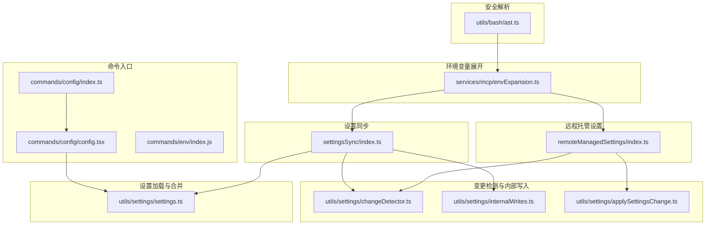
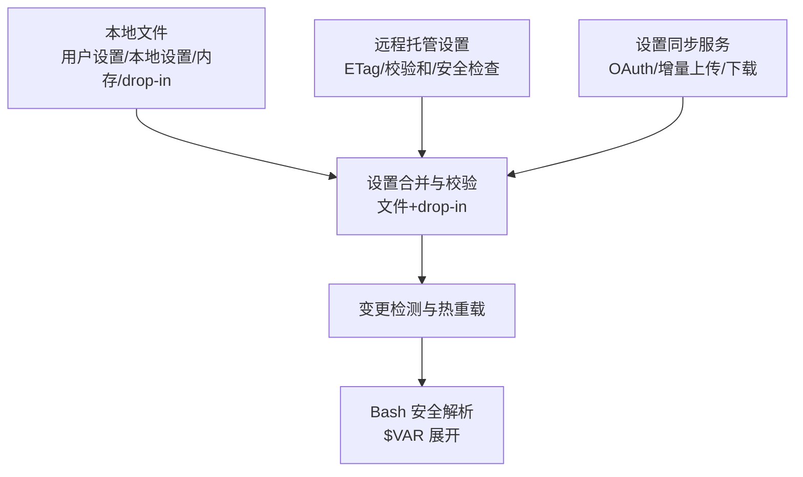
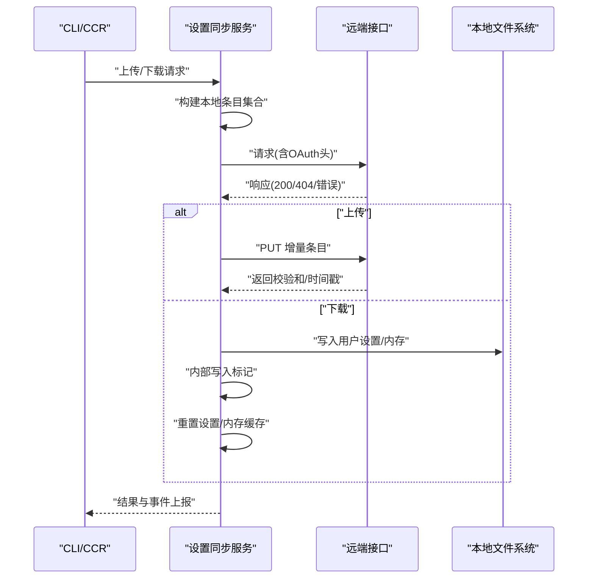
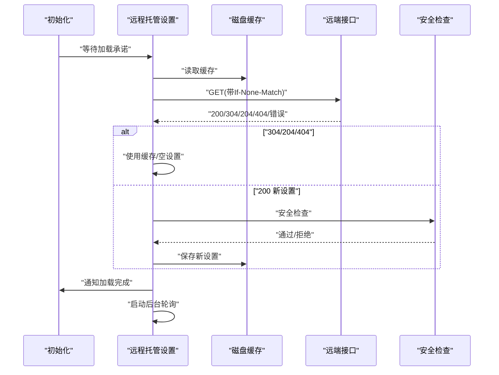
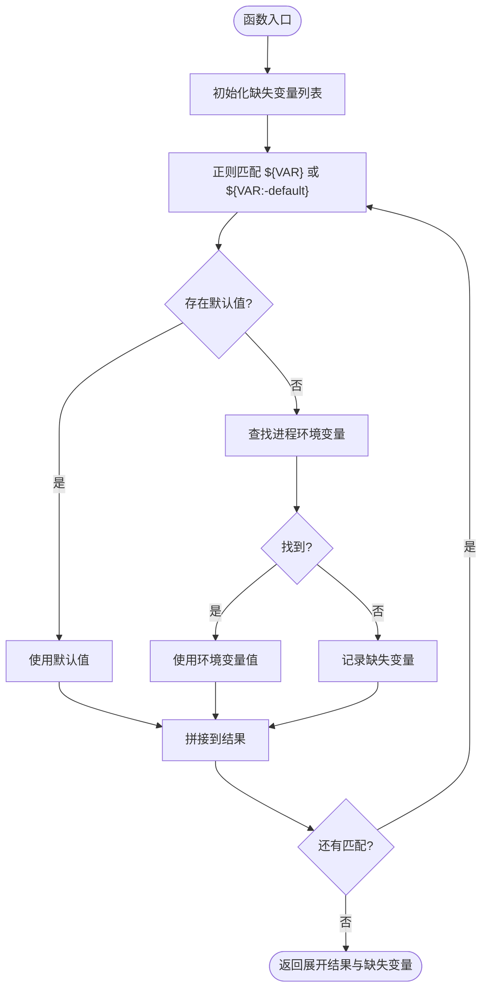
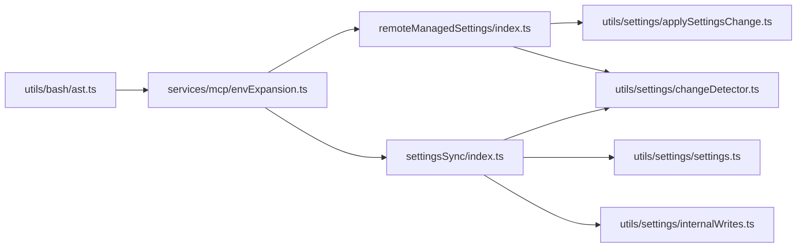

# 配置与环境管理

<cite>
**本文引用的文件**
- [src/services/settingsSync/index.ts](file://src/services/settingsSync/index.ts)
- [src/services/remoteManagedSettings/index.ts](file://src/services/remoteManagedSettings/index.ts)
- [src/services/mcp/envExpansion.ts](file://src/services/mcp/envExpansion.ts)
- [src/utils/settings/settings.ts](file://src/utils/settings/settings.ts)
- [src/utils/settings/changeDetector.ts](file://src/utils/settings/changeDetector.ts)
- [src/utils/settings/internalWrites.ts](file://src/utils/settings/internalWrites.ts)
- [src/utils/settings/applySettingsChange.ts](file://src/utils/settings/applySettingsChange.ts)
- [src/utils/bash/ast.ts](file://src/utils/bash/ast.ts)
- [src/commands/config/index.ts](file://src/commands/config/index.ts)
- [src/commands/config/config.tsx](file://src/commands/config/config.tsx)
- [src/commands/env/index.js](file://src/commands/env/index.js)
- [src/services/mcp/__tests__/envExpansion.test.ts](file://src/services/mcp/__tests__/envExpansion.test.ts)
</cite>

## 目录
1. [引言](#引言)
2. [项目结构](#项目结构)
3. [核心组件](#核心组件)
4. [架构总览](#架构总览)
5. [详细组件分析](#详细组件分析)
6. [依赖分析](#依赖分析)
7. [性能考虑](#性能考虑)
8. [故障排除指南](#故障排除指南)
9. [结论](#结论)
10. [附录](#附录)

## 引言
本文件面向 Claude Code Best 的配置与环境管理系统，系统性阐述配置层次、优先级与继承关系；环境变量的管理机制（默认值、校验与动态更新）；设置系统的实现原理（持久化、同步与版本/校验）；不同环境（开发/测试/生产）的配置策略；以及配置优化、安全与故障排除的最佳实践与示例。

## 项目结构
配置与环境管理涉及以下关键模块：
- 设置同步服务：跨环境同步用户设置与记忆文件，支持增量上传与拉取。
- 远程托管设置服务：企业场景下从远端获取托管设置，带缓存、校验与热重载。
- 环境变量展开工具：在 MCP 等配置中解析 ${VAR} 与 ${VAR:-default} 语法。
- 设置加载与合并：从文件与 drop-in 目录合并配置，支持错误收集与优先级判定。
- 设置变更检测与内部写入标记：避免同步回写触发误检测，确保热重载一致性。
- 命令入口：打开设置面板与环境命令占位。
- 安全解析：Bash AST 对环境变量展开进行安全判定，限制注入风险。

**图表来源**
- [src/services/settingsSync/index.ts:1-582](file://src/services/settingsSync/index.ts#L1-L582)
- [src/services/remoteManagedSettings/index.ts:1-639](file://src/services/remoteManagedSettings/index.ts#L1-L639)
- [src/services/mcp/envExpansion.ts:1-38](file://src/services/mcp/envExpansion.ts#L1-L38)
- [src/utils/settings/settings.ts:91-132](file://src/utils/settings/settings.ts#L91-L132)
- [src/utils/settings/changeDetector.ts](file://src/utils/settings/changeDetector.ts)
- [src/utils/settings/internalWrites.ts](file://src/utils/settings/internalWrites.ts)
- [src/utils/settings/applySettingsChange.ts](file://src/utils/settings/applySettingsChange.ts)
- [src/utils/bash/ast.ts:117-1958](file://src/utils/bash/ast.ts#L117-L1958)
- [src/commands/config/index.ts:1-12](file://src/commands/config/index.ts#L1-L12)
- [src/commands/config/config.tsx:1-8](file://src/commands/config/config.tsx#L1-L8)
- [src/commands/env/index.js:1-2](file://src/commands/env/index.js#L1-L2)

**章节来源**
- [src/services/settingsSync/index.ts:1-582](file://src/services/settingsSync/index.ts#L1-L582)
- [src/services/remoteManagedSettings/index.ts:1-639](file://src/services/remoteManagedSettings/index.ts#L1-L639)
- [src/services/mcp/envExpansion.ts:1-38](file://src/services/mcp/envExpansion.ts#L1-L38)
- [src/utils/settings/settings.ts:91-132](file://src/utils/settings/settings.ts#L91-L132)
- [src/utils/settings/changeDetector.ts](file://src/utils/settings/changeDetector.ts)
- [src/utils/settings/internalWrites.ts](file://src/utils/settings/internalWrites.ts)
- [src/utils/settings/applySettingsChange.ts](file://src/utils/settings/applySettingsChange.ts)
- [src/utils/bash/ast.ts:117-1958](file://src/utils/bash/ast.ts#L117-L1958)
- [src/commands/config/index.ts:1-12](file://src/commands/config/index.ts#L1-L12)
- [src/commands/config/config.tsx:1-8](file://src/commands/config/config.tsx#L1-L8)
- [src/commands/env/index.js:1-2](file://src/commands/env/index.js#L1-L2)

## 核心组件
- 设置同步服务（Settings Sync）
  - 职责：在交互式 CLI 中将本地设置增量上传到远端，在 CCR 模式下下载远端设置到本地；支持超时、重试、大小限制与失败开路。
  - 关键点：基于 OAuth 认证；按项目维度区分全局与本地设置；应用时使用内部写入标记抑制误检测；完成后清理缓存。
- 远程托管设置服务（Remote Managed Settings）
  - 职责：企业场景下拉取托管设置，支持 ETag 缓存、校验和计算、安全检查与后台轮询；失败开路，保证启动不阻塞。
  - 关键点：初始化加载承诺、后台轮询、安全检查拦截危险变更、文件保存权限控制。
- 环境变量展开（MCP 配置）
  - 职责：解析字符串中的 ${VAR} 与 ${VAR:-default}，记录缺失变量，支持多变量与默认值。
  - 关键点：正则匹配与分隔逻辑；默认值优先级；缺失变量追踪。
- 设置加载与合并（文件与 drop-in）
  - 职责：从主设置文件与 drop-in 目录合并配置，错误聚合，返回最终设置或空。
  - 关键点：过滤隐藏与非 JSON 文件；排序处理；合并自定义策略。
- 变更检测与内部写入
  - 职责：通知设置变更以触发热重载；内部写入标记避免同步回写引发的误检测。
  - 关键点：变更检测器；内部写入标记；应用变更回调。
- 命令入口
  - 职责：注册“config/settings”命令打开设置面板；“env”命令占位。
- 安全解析（Bash AST）
  - 职责：对 $VAR 展开展开进行安全判定，仅允许已知安全变量与受控上下文，防止注入。

**章节来源**
- [src/services/settingsSync/index.ts:50-202](file://src/services/settingsSync/index.ts#L50-L202)
- [src/services/remoteManagedSettings/index.ts:514-555](file://src/services/remoteManagedSettings/index.ts#L514-L555)
- [src/services/mcp/envExpansion.ts:10-38](file://src/services/mcp/envExpansion.ts#L10-L38)
- [src/utils/settings/settings.ts:91-132](file://src/utils/settings/settings.ts#L91-L132)
- [src/utils/settings/changeDetector.ts](file://src/utils/settings/changeDetector.ts)
- [src/utils/settings/internalWrites.ts](file://src/utils/settings/internalWrites.ts)
- [src/utils/settings/applySettingsChange.ts](file://src/utils/settings/applySettingsChange.ts)
- [src/commands/config/index.ts:3-9](file://src/commands/config/index.ts#L3-L9)
- [src/commands/config/config.tsx:5-7](file://src/commands/config/config.tsx#L5-L7)
- [src/commands/env/index.js:1-2](file://src/commands/env/index.js#L1-L2)
- [src/utils/bash/ast.ts:117-1958](file://src/utils/bash/ast.ts#L117-L1958)

## 架构总览
整体架构分为三层：
- 配置来源层：本地文件（用户设置/本地设置）、内存文件、drop-in 目录、远端托管设置。
- 同步与合并层：设置同步服务负责跨环境同步；设置加载器负责合并与错误聚合。
- 应用与热重载层：变更检测器触发热重载，安全解析保障环境变量展开的安全性。

**图表来源**
- [src/services/settingsSync/index.ts:418-459](file://src/services/settingsSync/index.ts#L418-L459)
- [src/services/remoteManagedSettings/index.ts:414-503](file://src/services/remoteManagedSettings/index.ts#L414-L503)
- [src/utils/settings/settings.ts:91-132](file://src/utils/settings/settings.ts#L91-L132)
- [src/utils/settings/changeDetector.ts](file://src/utils/settings/changeDetector.ts)
- [src/utils/bash/ast.ts:117-1958](file://src/utils/bash/ast.ts#L117-L1958)

## 详细组件分析

### 组件A：设置同步服务（Settings Sync）
- 功能要点
  - 上传：交互式 CLI 下将本地设置增量上传至远端，基于 OAuth 与特性开关；失败开路，不影响启动。
  - 下载：CCR 模式下首次运行或显式触发时从远端拉取设置并应用，支持重试与失败开路。
  - 合并与应用：构建本地条目集合，对比远端差异，按键名应用到本地文件；使用内部写入标记抑制误检测；完成后重置缓存。
  - 安全与认证：要求 first-party Anthropic 基础地址与 inference scope 的 OAuth 令牌；上传需交互模式。
- 复杂度与性能
  - 时间复杂度：O(N) 构建条目与差异比较；I/O 受文件大小与网络延迟影响。
  - 限流与重试：固定超时与最大重试次数；失败开路策略降低阻塞风险。
- 错误处理
  - 404 视为空设置；格式错误与网络/超时错误分类处理；跳过可重试错误类型。
- 最佳实践
  - 在插件安装前先拉取远端设置，确保策略一致；对大文件进行预检，避免超出限制。

**图表来源**
- [src/services/settingsSync/index.ts:60-111](file://src/services/settingsSync/index.ts#L60-L111)
- [src/services/settingsSync/index.ts:129-202](file://src/services/settingsSync/index.ts#L129-L202)
- [src/services/settingsSync/index.ts:347-392](file://src/services/settingsSync/index.ts#L347-L392)
- [src/services/settingsSync/index.ts:488-581](file://src/services/settingsSync/index.ts#L488-L581)

**章节来源**
- [src/services/settingsSync/index.ts:50-202](file://src/services/settingsSync/index.ts#L50-L202)
- [src/services/settingsSync/index.ts:247-345](file://src/services/settingsSync/index.ts#L247-L345)
- [src/services/settingsSync/index.ts:418-459](file://src/services/settingsSync/index.ts#L418-L459)
- [src/services/settingsSync/index.ts:488-581](file://src/services/settingsSync/index.ts#L488-L581)

### 组件B：远程托管设置服务（Remote Managed Settings）
- 功能要点
  - 初始化与加载：早期初始化加载承诺，若存在磁盘缓存则立即解封等待者；随后异步拉取并应用。
  - 缓存与校验：基于 ETag 的 HTTP 缓存；设置对象深度排序后计算 SHA256 校验和；304/204/404 分支处理。
  - 安全检查：应用新设置前执行安全检查，用户拒绝则回退到缓存或空设置。
  - 后台轮询：每小时轮询一次，检测变化后触发热重载。
  - 失败开路：任何异常均回退到缓存或空设置，保证系统可用性。
- 复杂度与性能
  - 时间复杂度：单次拉取 O(1) 校验和计算与 JSON 解析；轮询周期为常数间隔。
  - I/O：磁盘读写与网络请求，受带宽与服务器响应影响。
- 错误处理
  - 401/403 等鉴权错误不重试；超时/网络错误按重试策略处理；404 清理缓存文件。
- 最佳实践
  - 在企业环境中启用托管设置，结合安全检查与轮询，确保策略一致性与安全性。

**图表来源**
- [src/services/remoteManagedSettings/index.ts:514-555](file://src/services/remoteManagedSettings/index.ts#L514-L555)
- [src/services/remoteManagedSettings/index.ts:414-503](file://src/services/remoteManagedSettings/index.ts#L414-L503)
- [src/services/remoteManagedSettings/index.ts:584-606](file://src/services/remoteManagedSettings/index.ts#L584-L606)

**章节来源**
- [src/services/remoteManagedSettings/index.ts:514-555](file://src/services/remoteManagedSettings/index.ts#L514-L555)
- [src/services/remoteManagedSettings/index.ts:248-361](file://src/services/remoteManagedSettings/index.ts#L248-L361)
- [src/services/remoteManagedSettings/index.ts:414-503](file://src/services/remoteManagedSettings/index.ts#L414-L503)
- [src/services/remoteManagedSettings/index.ts:584-606](file://src/services/remoteManagedSettings/index.ts#L584-L606)

### 组件C：环境变量展开（MCP 配置）
- 功能要点
  - 支持 ${VAR} 与 ${VAR:-default} 语法；默认值优先级高于变量本身；记录缺失变量用于错误报告。
  - 正则匹配与 split(':-', 2) 保证默认值分割正确；不支持嵌套语法（如 ${${VAR}}）。
- 测试覆盖
  - 包含多变量展开、默认值、混合存在/缺失、空输入、不含花括号的 $VAR 等边界场景。
- 最佳实践
  - 在 MCP 服务器配置中统一使用该工具进行变量展开；对缺失变量进行告警与降级处理。

**图表来源**
- [src/services/mcp/envExpansion.ts:10-38](file://src/services/mcp/envExpansion.ts#L10-L38)
- [src/services/mcp/__tests__/envExpansion.test.ts:48-139](file://src/services/mcp/__tests__/envExpansion.test.ts#L48-L139)

**章节来源**
- [src/services/mcp/envExpansion.ts:10-38](file://src/services/mcp/envExpansion.ts#L10-L38)
- [src/services/mcp/__tests__/envExpansion.test.ts:48-139](file://src/services/mcp/__tests__/envExpansion.test.ts#L48-L139)

### 组件D：设置加载与合并（文件与 drop-in）
- 功能要点
  - 从主设置文件与 drop-in 目录读取 JSON，过滤隐藏与非 JSON 文件，按名称排序依次合并。
  - 使用自定义合并策略，聚合错误信息；若无有效内容则返回空。
- 最佳实践
  - 将可变配置拆分到 drop-in 文件，便于按环境/项目层次叠加；保持文件命名有序，避免覆盖。

**章节来源**
- [src/utils/settings/settings.ts:91-132](file://src/utils/settings/settings.ts#L91-L132)

### 组件E：变更检测与内部写入
- 功能要点
  - 内部写入标记：在同步应用等场景标记“内部写入”，避免被变更检测器误判为外部修改。
  - 变更检测器：在设置应用后触发通知，驱动热重载（如环境变量、遥测、权限等）。
  - 应用变更回调：集中处理策略更新后的副作用。
- 最佳实践
  - 所有通过同步服务写入的文件均应使用内部写入标记；在需要感知变更的模块中订阅变更检测器。

**章节来源**
- [src/utils/settings/changeDetector.ts](file://src/utils/settings/changeDetector.ts)
- [src/utils/settings/internalWrites.ts](file://src/utils/settings/internalWrites.ts)
- [src/utils/settings/applySettingsChange.ts](file://src/utils/settings/applySettingsChange.ts)

### 组件F：命令入口（设置面板与环境命令）
- 功能要点
  - 注册“config/settings”命令，打开设置面板并默认定位到“配置”标签页。
  - “env”命令当前为占位，返回禁用状态。
- 最佳实践
  - 通过命令别名与默认标签页提升用户体验；占位命令保留扩展空间。

**章节来源**
- [src/commands/config/index.ts:3-9](file://src/commands/config/index.ts#L3-L9)
- [src/commands/config/config.tsx:5-7](file://src/commands/config/config.tsx#L5-L7)
- [src/commands/env/index.js:1-2](file://src/commands/env/index.js#L1-L2)

### 组件G：安全解析（Bash AST）
- 功能要点
  - 定义已知安全环境变量集合；在字符串上下文中允许安全变量展开；对未知变量与特殊变量进行严格判定。
  - 阻止 $IFS 等经典注入风险；对裸参数位置的变量展开进行限制。
- 最佳实践
  - 在执行外部命令前，使用安全解析工具评估变量展开是否安全；避免直接拼接不受控输入。

**章节来源**
- [src/utils/bash/ast.ts:117-1958](file://src/utils/bash/ast.ts#L117-L1958)

## 依赖分析
- 组件耦合
  - 设置同步服务依赖设置加载器与变更检测器；远程托管设置服务依赖变更检测器与安全检查模块。
  - 环境变量展开工具被 MCP 与同步服务复用，形成跨模块共享能力。
- 外部依赖
  - HTTP 客户端（axios）用于远端接口访问；文件系统（fs/promises）用于本地读写。
- 循环依赖规避
  - 远程托管设置服务通过本地认证头构造器避免与设置读取循环依赖；变更检测器作为通知中枢，避免双向耦合。

**图表来源**
- [src/services/settingsSync/index.ts:1-50](file://src/services/settingsSync/index.ts#L1-L50)
- [src/services/remoteManagedSettings/index.ts:15-49](file://src/services/remoteManagedSettings/index.ts#L15-L49)
- [src/services/mcp/envExpansion.ts:1-38](file://src/services/mcp/envExpansion.ts#L1-L38)
- [src/utils/settings/settings.ts:91-132](file://src/utils/settings/settings.ts#L91-L132)
- [src/utils/settings/changeDetector.ts](file://src/utils/settings/changeDetector.ts)
- [src/utils/settings/internalWrites.ts](file://src/utils/settings/internalWrites.ts)
- [src/utils/settings/applySettingsChange.ts](file://src/utils/settings/applySettingsChange.ts)
- [src/utils/bash/ast.ts:117-1958](file://src/utils/bash/ast.ts#L117-L1958)

**章节来源**
- [src/services/settingsSync/index.ts:1-50](file://src/services/settingsSync/index.ts#L1-L50)
- [src/services/remoteManagedSettings/index.ts:15-49](file://src/services/remoteManagedSettings/index.ts#L15-L49)
- [src/services/mcp/envExpansion.ts:1-38](file://src/services/mcp/envExpansion.ts#L1-L38)
- [src/utils/settings/settings.ts:91-132](file://src/utils/settings/settings.ts#L91-L132)
- [src/utils/settings/changeDetector.ts](file://src/utils/settings/changeDetector.ts)
- [src/utils/settings/internalWrites.ts](file://src/utils/settings/internalWrites.ts)
- [src/utils/settings/applySettingsChange.ts](file://src/utils/settings/applySettingsChange.ts)
- [src/utils/bash/ast.ts:117-1958](file://src/utils/bash/ast.ts#L117-L1958)

## 性能考虑
- 同步与拉取
  - 控制请求超时与重试次数，避免长时间阻塞；对大文件进行大小限制与预检。
  - 下载采用一次性拉取与缓存命中策略，减少重复网络往返。
- 远程托管设置
  - 使用 ETag 缓存与 304 响应避免不必要的传输；轮询间隔较长，降低服务器压力。
- 合并与解析
  - drop-in 文件按序合并，建议控制文件数量与体积；合并策略避免深层嵌套导致的性能问题。
- 安全解析
  - 对 $VAR 展开进行静态判定，避免运行时注入风险；在复杂脚本中谨慎使用未知变量。

[本节为通用指导，无需列出具体文件来源]

## 故障排除指南
- 设置同步失败
  - 检查 OAuth 令牌与作用域；确认交互式 CLI 与特性开关开启；查看网络/超时错误分类；必要时重试或降级使用。
- 远程托管设置未生效
  - 确认用户具备托管设置资格；检查鉴权头与 401/403 错误；观察安全检查是否拒绝变更；确认轮询是否启动。
- 环境变量展开异常
  - 检查变量名拼写与默认值语法；关注缺失变量列表；避免嵌套语法与裸参数位置的变量展开。
- 变更检测误触发
  - 确认写入路径是否使用内部写入标记；检查同步流程是否正确抑制检测；核对变更检测器订阅情况。
- 命令不可用
  - “env”命令当前为占位；“config/settings”命令打开设置面板；如无响应，检查命令注册与 UI 加载状态。

**章节来源**
- [src/services/settingsSync/index.ts:296-313](file://src/services/settingsSync/index.ts#L296-L313)
- [src/services/remoteManagedSettings/index.ts:339-361](file://src/services/remoteManagedSettings/index.ts#L339-L361)
- [src/services/mcp/envExpansion.ts:10-38](file://src/services/mcp/envExpansion.ts#L10-L38)
- [src/utils/settings/changeDetector.ts](file://src/utils/settings/changeDetector.ts)
- [src/utils/settings/internalWrites.ts](file://src/utils/settings/internalWrites.ts)
- [src/commands/env/index.js:1-2](file://src/commands/env/index.js#L1-L2)

## 结论
本系统通过“文件/远端托管/同步”的多源配置模型，结合变更检测与安全解析，实现了高可用、可扩展且安全的配置与环境管理。设置同步服务与远程托管设置服务分别满足跨环境一致性与企业策略管控需求；环境变量展开与安全解析保障了配置注入风险的可控性。建议在实际部署中遵循本文的配置策略与最佳实践，以获得稳定与高性能的配置体验。

[本节为总结性内容，无需列出具体文件来源]

## 附录

### 不同环境下的配置策略
- 开发环境
  - 使用本地设置与 drop-in 目录快速迭代；关闭或简化远程托管设置；启用详细日志与诊断输出。
- 测试环境
  - 通过设置同步服务进行最小化配置验证；对安全检查与轮询进行降级或禁用；使用测试专用认证头。
- 生产环境
  - 启用远程托管设置与安全检查；严格控制变更流程与轮询频率；监控同步与拉取成功率。

[本节为概念性内容，无需列出具体文件来源]

### 配置示例与最佳实践（路径指引）
- 设置同步上传/下载流程
  - [上传用户设置（后台）:60-111](file://src/services/settingsSync/index.ts#L60-L111)
  - [下载用户设置（CCR）:129-202](file://src/services/settingsSync/index.ts#L129-L202)
  - [构建本地条目集合:418-459](file://src/services/settingsSync/index.ts#L418-L459)
  - [应用远端条目到本地:488-581](file://src/services/settingsSync/index.ts#L488-L581)
- 远程托管设置加载与轮询
  - [初始化加载承诺:514-555](file://src/services/remoteManagedSettings/index.ts#L514-L555)
  - [拉取与应用新设置:414-503](file://src/services/remoteManagedSettings/index.ts#L414-L503)
  - [后台轮询与变更检测:584-606](file://src/services/remoteManagedSettings/index.ts#L584-L606)
- 环境变量展开
  - [展开工具实现:10-38](file://src/services/mcp/envExpansion.ts#L10-L38)
  - [单元测试覆盖:48-139](file://src/services/mcp/__tests__/envExpansion.test.ts#L48-L139)
- 设置加载与合并
  - [合并文件与 drop-in:91-132](file://src/utils/settings/settings.ts#L91-L132)
- 变更检测与内部写入
  - [变更检测器](file://src/utils/settings/changeDetector.ts)
  - [内部写入标记](file://src/utils/settings/internalWrites.ts)
  - [应用变更回调](file://src/utils/settings/applySettingsChange.ts)
- 命令入口
  - [注册 config/settings 命令:3-9](file://src/commands/config/index.ts#L3-L9)
  - [打开设置面板:5-7](file://src/commands/config/config.tsx#L5-L7)
  - [env 命令占位:1-2](file://src/commands/env/index.js#L1-L2)

[本节为索引性内容，已在各处标注具体文件与行号]