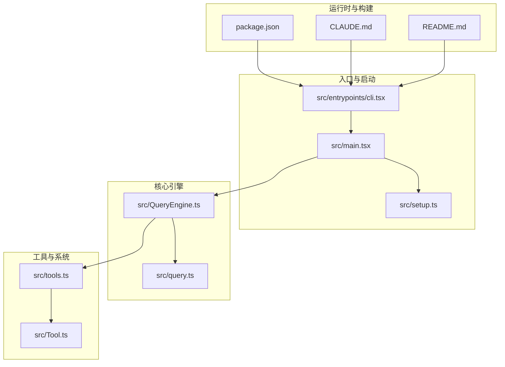
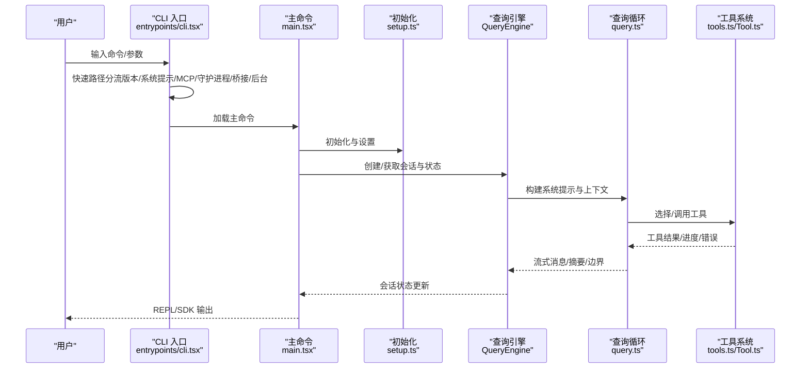
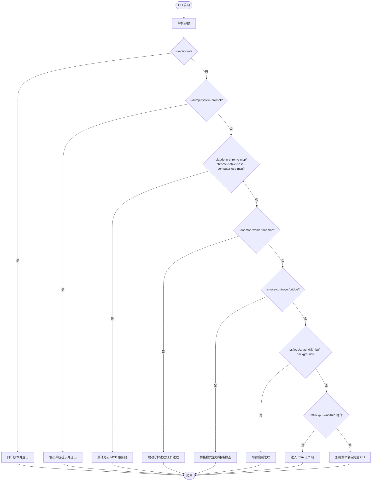
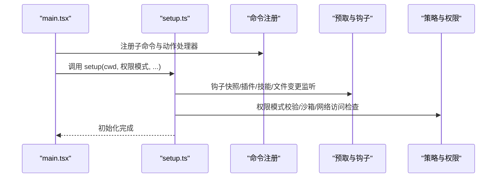
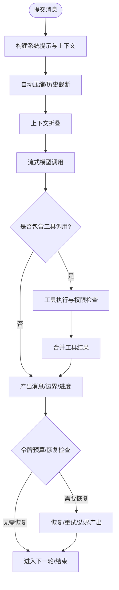
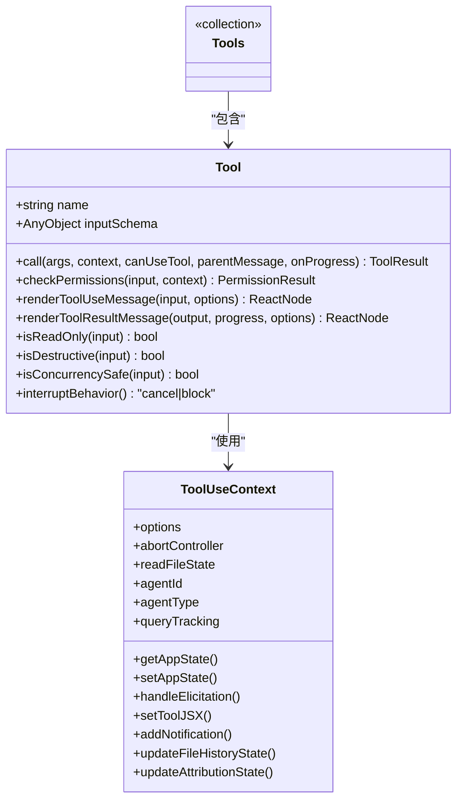
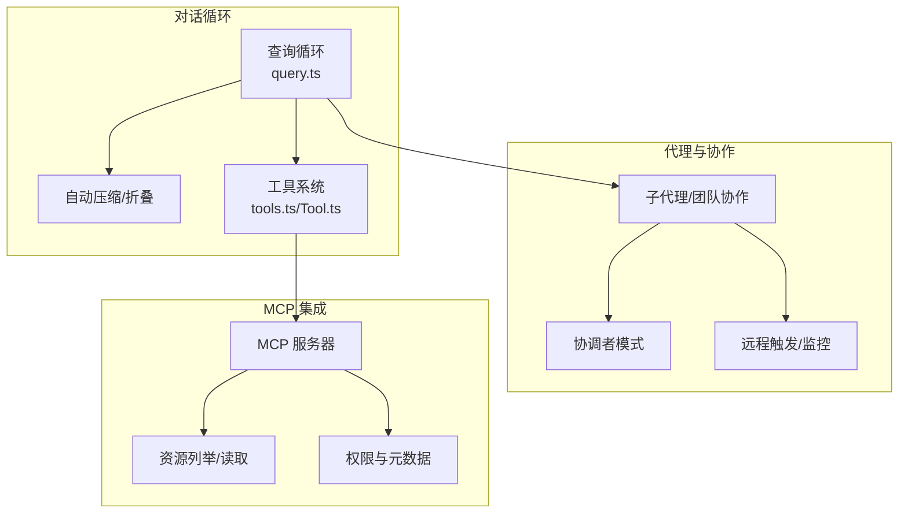
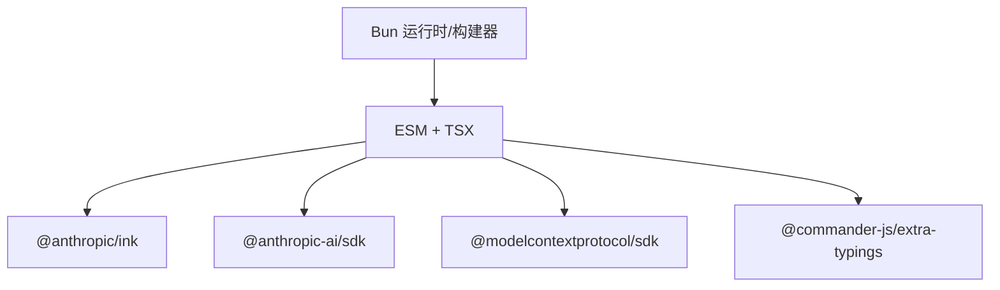

# 项目概述

<cite>
**本文引用的文件**
- [README.md](file://README.md)
- [CLAUDE.md](file://CLAUDE.md)
- [package.json](file://package.json)
- [src/entrypoints/cli.tsx](file://src/entrypoints/cli.tsx)
- [src/main.tsx](file://src/main.tsx)
- [src/setup.ts](file://src/setup.ts)
- [src/query.ts](file://src/query.ts)
- [src/QueryEngine.ts](file://src/QueryEngine.ts)
- [src/tools.ts](file://src/tools.ts)
- [src/Tool.ts](file://src/Tool.ts)
</cite>

## 目录
1. [简介](#简介)
2. [项目结构](#项目结构)
3. [核心组件](#核心组件)
4. [架构总览](#架构总览)
5. [详细组件分析](#详细组件分析)
6. [依赖关系分析](#依赖关系分析)
7. [性能考量](#性能考量)
8. [故障排查指南](#故障排查指南)
9. [结论](#结论)
10. [附录](#附录)

## 简介
Claude Code Best（简称 CCB）是一个基于 Bun 的终端 AI 编程助手，定位为 Anthropic Claude Code CLI 的源码反编译/逆向还原项目。其目标是在保留 Claude Code 大部分核心功能与工程化能力的同时，提供开源、可自托管、可扩展的替代方案。项目采用 Bun 运行时、React Ink 终端 UI、TypeScript/JavaScript 技术栈，支持 MCP 协议、工具系统、代理协作、对话循环、上下文压缩与记忆、插件与技能生态等能力。

CCB 的核心价值主张：
- 开源替代：在不依赖官方闭源实现的前提下，复刻主要功能，便于社区贡献与二次开发。
- 高性能运行：以 Bun 为运行时，结合代码分割与按需动态导入，显著降低冷启动与模块加载开销。
- 终端原生体验：基于 React Ink 提供 TUI 交互，适合开发者在终端中进行高效编程与协作。
- 可扩展工具链：内置 60+ 工具与 MCP 协议集成，支持文件操作、搜索导航、浏览器访问、任务管理、远程触发等。
- 代理与协作：支持子代理、团队协作、协调者模式、桥接模式等高级能力，满足复杂工程场景。
- 多模型兼容：除 Anthropic API 外，还支持 OpenAI、Gemini 等兼容服务，便于在不同基础设施间切换。

## 项目结构
项目采用 Monorepo 结构，核心代码集中在 src 目录，入口文件位于 src/entrypoints，命令与 UI 组件分布在 commands、components、screens 等目录，工具系统与服务层分别在 tools、services、utils 等目录。构建与运行通过 Bun 的构建 API 与脚本完成，产物输出至 dist 目录，支持 Node 兼容运行。

**图表来源**
- [src/entrypoints/cli.tsx:1-323](file://src/entrypoints/cli.tsx#L1-L323)
- [src/main.tsx:1-800](file://src/main.tsx#L1-L800)
- [src/setup.ts:1-478](file://src/setup.ts#L1-L478)
- [src/query.ts:1-800](file://src/query.ts#L1-L800)
- [src/QueryEngine.ts:1-800](file://src/QueryEngine.ts#L1-L800)
- [src/tools.ts:1-388](file://src/tools.ts#L1-L388)
- [src/Tool.ts:1-793](file://src/Tool.ts#L1-L793)
- [package.json:1-175](file://package.json#L1-L175)
- [CLAUDE.md:1-243](file://CLAUDE.md#L1-L243)
- [README.md:1-173](file://README.md#L1-L173)

**章节来源**
- [README.md:1-173](file://README.md#L1-L173)
- [CLAUDE.md:1-243](file://CLAUDE.md#L1-L243)
- [package.json:1-175](file://package.json#L1-L175)

## 核心组件
- CLI 入口与快速路径：src/entrypoints/cli.tsx 提供版本查询、系统提示导出、MCP 服务器、守护进程、桥接模式、后台会话管理等快速路径，避免不必要的模块加载。
- 主命令与启动流程：src/main.tsx 注册大量子命令，处理权限、MCP、会话恢复、REPL/Headless 模式分发，并在启动阶段执行初始化与预取。
- 初始化与设置：src/setup.ts 负责工作树/会话设置、消息服务、钩子快照、插件与技能预取、权限校验等。
- 查询引擎与对话循环：src/query.ts 实现主查询循环，处理自动压缩、上下文折叠、工具调用、流式响应、令牌预算与恢复逻辑。
- 查询引擎封装：src/QueryEngine.ts 将查询生命周期与会话状态抽象为类，支持 SDK/Headless 与 REPL 使用。
- 工具系统：src/tools.ts 与 src/Tool.ts 定义工具接口、工具注册、权限检查、并发安全、结果渲染与 UI 展示等。

**章节来源**
- [src/entrypoints/cli.tsx:1-323](file://src/entrypoints/cli.tsx#L1-L323)
- [src/main.tsx:1-800](file://src/main.tsx#L1-L800)
- [src/setup.ts:1-478](file://src/setup.ts#L1-L478)
- [src/query.ts:1-800](file://src/query.ts#L1-L800)
- [src/QueryEngine.ts:1-800](file://src/QueryEngine.ts#L1-L800)
- [src/tools.ts:1-388](file://src/tools.ts#L1-L388)
- [src/Tool.ts:1-793](file://src/Tool.ts#L1-L793)

## 架构总览
CCB 的整体架构围绕“入口快速路径 → 主命令与初始化 → 查询引擎 → 工具系统”的主干展开。CLI 入口根据参数分流到不同功能路径；主命令负责权限与会话管理；查询引擎统一处理消息构建、上下文压缩、工具调度与流式输出；工具系统提供可扩展的能力边界。

**图表来源**
- [src/entrypoints/cli.tsx:58-323](file://src/entrypoints/cli.tsx#L58-L323)
- [src/main.tsx:1-800](file://src/main.tsx#L1-L800)
- [src/setup.ts:1-478](file://src/setup.ts#L1-L478)
- [src/QueryEngine.ts:1-800](file://src/QueryEngine.ts#L1-L800)
- [src/query.ts:1-800](file://src/query.ts#L1-L800)
- [src/tools.ts:1-388](file://src/tools.ts#L1-L388)
- [src/Tool.ts:1-793](file://src/Tool.ts#L1-L793)

## 详细组件分析

### CLI 入口与快速路径
- 版本查询：零模块加载，直接输出版本信息。
- 系统提示导出：在特定条件下输出渲染后的系统提示，用于敏感性评估。
- MCP 服务器：支持 Claude-in-Chrome 与 Computer Use MCP 服务器启动。
- 守护进程：内部 supervisor 模式，按 worker 种类启动。
- 桥接模式：远程控制/桥接模式，进行认证与策略限制检查。
- 后台会话：会话管理（ps/logs/attach/kill/--bg/--background）。
- 工作树与 tmux：在特定组合下进入 tmux 工作树。
- 其他模板作业、BYOC/self-hosted runner、环境运行器等快速路径。

**图表来源**
- [src/entrypoints/cli.tsx:58-323](file://src/entrypoints/cli.tsx#L58-L323)

**章节来源**
- [src/entrypoints/cli.tsx:1-323](file://src/entrypoints/cli.tsx#L1-L323)

### 主命令与初始化
- 命令注册：通过 Commander 定义大量子命令（mcp/server/ssh/open/auth/plugin/agents/auto-mode/doctor/update 等）。
- 权限与策略：在 action 处理器中进行权限、MCP、会话恢复、REPL/Headless 分发。
- 初始化：telemetry、配置、信任对话框、一次性初始化。
- 设置：工作树/会话创建、tmux 会话、钩子快照、插件与技能预取、权限校验等。

**图表来源**
- [src/main.tsx:1-800](file://src/main.tsx#L1-L800)
- [src/setup.ts:1-478](file://src/setup.ts#L1-L478)

**章节来源**
- [src/main.tsx:1-800](file://src/main.tsx#L1-L800)
- [src/setup.ts:1-478](file://src/setup.ts#L1-L478)

### 查询引擎与对话循环
- 查询配置：构建系统提示、用户/系统上下文、思考配置、工具集合、代理定义等。
- 自动压缩与上下文折叠：在每次迭代前进行微压缩、历史截断、上下文折叠，确保上下文窗口可控。
- 流式模型调用：支持流式事件、工具调用、权限提示、停止钩子、令牌预算与恢复。
- 工具执行：工具选择、权限检查、并发安全、结果聚合与 UI 渲染。
- 会话持久化：消息写入、紧凑边界、进度消息、错误日志水印、使用统计等。

**图表来源**
- [src/query.ts:1-800](file://src/query.ts#L1-L800)
- [src/QueryEngine.ts:1-800](file://src/QueryEngine.ts#L1-L800)

**章节来源**
- [src/query.ts:1-800](file://src/query.ts#L1-L800)
- [src/QueryEngine.ts:1-800](file://src/QueryEngine.ts#L1-L800)

### 工具系统与接口
- 工具接口：Tool.ts 定义工具的输入/输出模式、权限检查、并发安全、渲染与 UI、活动描述、摘要生成、错误/拒绝 UI 等。
- 工具注册：tools.ts 汇总内置工具，按权限规则过滤，支持 REPL 模式隐藏原始工具、MCP 工具合并、去重与排序。
- 权限与安全：工具级别的验证、权限匹配、透明包装器、破坏性操作标记、中断行为等。
- MCP 集成：支持 MCP 工具资源列举、读取、权限与元数据传递。

**图表来源**
- [src/Tool.ts:1-793](file://src/Tool.ts#L1-L793)
- [src/tools.ts:1-388](file://src/tools.ts#L1-L388)

**章节来源**
- [src/Tool.ts:1-793](file://src/Tool.ts#L1-L793)
- [src/tools.ts:1-388](file://src/tools.ts#L1-L388)

### 概念总览
- 智能对话循环：通过查询引擎与工具系统实现的持续交互，支持自动压缩、上下文折叠、令牌预算与恢复。
- 工具系统：统一的工具接口与注册机制，支持内置工具与 MCP 工具的合并与去重。
- 代理协作：子代理、团队协作、协调者模式、远程触发与监控工具等。
- MCP 协议集成：支持 MCP 服务器连接、资源列举与读取、权限与元数据传递。
- 安全与权限：工具级权限检查、自动模式分类器、沙箱与网络访问限制、权限提示与拒绝 UI。

[此图为概念性总览，不直接映射具体源码文件，故无图表来源]

## 依赖关系分析
- 运行时与构建：Bun 作为运行时与构建器，使用 Bun.build 的代码分割与 define 注入，产物可在 Node 环境运行。
- 模块系统：ESM + TSX，React Compiler 运行时注入，Biome 作为 Lint/格式化工具。
- 外部依赖：@anthropic-ai/sdk、@modelcontextprotocol/sdk、@commander-js/extra-typings、@anthropic/ink 等。
- Monorepo：packages/@ant 下的计算机使用与 Chrome 控制相关包，以及各类 N-API 封装包。

**图表来源**
- [package.json:1-175](file://package.json#L1-L175)
- [CLAUDE.md:49-60](file://CLAUDE.md#L49-L60)

**章节来源**
- [package.json:1-175](file://package.json#L1-L175)
- [CLAUDE.md:49-60](file://CLAUDE.md#L49-L60)

## 性能考量
- 按需加载与死代码消除：CLI 快速路径与 feature() 门禁减少模块加载与执行开销。
- 代码分割：构建时启用 splitting，产物 dist/cli.js + 多 chunk 文件，降低首屏体积。
- 启动优化：启动剖析、早期输入捕获、预取与钩子快照、延迟后台任务。
- 上下文压缩：自动压缩、历史截断、上下文折叠，控制令牌占用与响应时间。
- 流式工具执行：支持流式工具执行与结果聚合，提升交互流畅度。

[本节提供通用指导，不直接分析具体文件，故无章节来源]

## 故障排查指南
- 登录与认证：首次运行后使用 /login 命令进入登录配置界面，选择 Anthropic 兼容服务（无需 Anthropic 官方账号），填写 Base URL、API Key、模型 ID 等字段。
- 功能开关：通过 FEATURE_<FLAG_NAME>=1 环境变量启用功能，如 Buddy、Daemon、Bridge Mode、Computer Use、Voice Mode 等。
- 调试模式：TUI（REPL）模式需真实终端，使用 attach 模式调试，终端启动 inspect 服务后在 VS Code 中附加调试器。
- 网络问题：国内网络较差时设置 DEFAULT_RELEASE_BASE 环境变量以加速 ripgrep 下载。
- 会话与后台：使用 ps/logs/attach/kill/--bg/--background 管理会话，必要时检查策略限制与权限。

**章节来源**
- [README.md:79-124](file://README.md#L79-L124)
- [README.md:109-124](file://README.md#L109-L124)
- [README.md:36-41](file://README.md#L36-L41)

## 结论
CCB 以 Bun 为运行时，结合 React Ink 与 TypeScript/JavaScript，构建了高性能、可扩展、可自托管的终端 AI 编程助手。其核心在于：
- 通过 CLI 快速路径与按需加载，显著降低启动与模块加载成本；
- 以查询引擎为核心，统一处理对话循环、上下文压缩、工具调度与流式输出；
- 以工具系统与 MCP 集成为基础，提供丰富的工程化能力；
- 通过权限与安全机制保障在复杂场景下的可控性与安全性。

对于初学者，建议从 /login 配置与 REPL 交互入手；对于有经验的开发者，可通过功能开关、MCP 集成与工具扩展深入定制与二次开发。

[本节为总结性内容，不直接分析具体文件，故无章节来源]

## 附录
- 在线文档与贡献：文档源码位于 docs/ 目录，欢迎投稿 PR；贡献者与 Star 历史可在 README 中查看。
- 许可与免责声明：仅供学习研究用途，Claude Code 的所有权利归 Anthropic 所有。

**章节来源**
- [README.md:149-173](file://README.md#L149-L173)